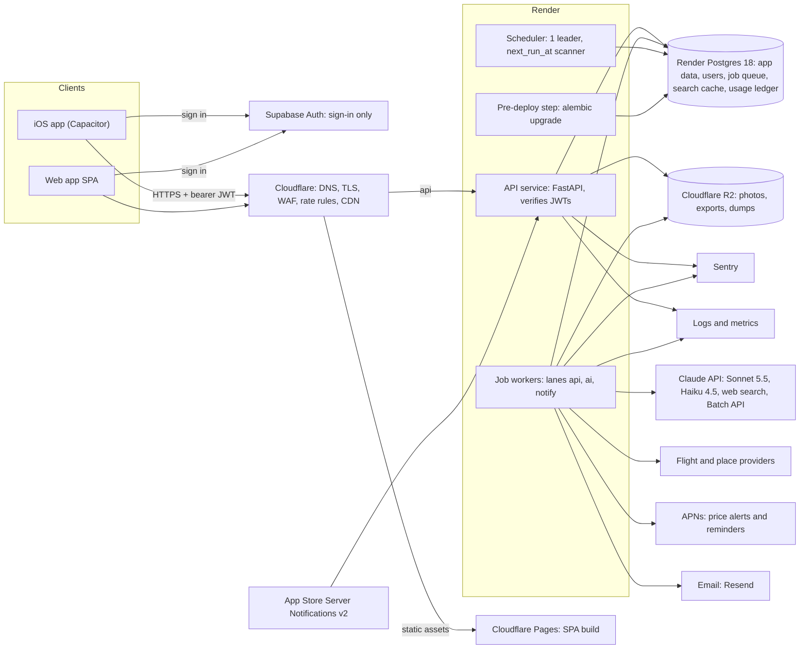

# Infrastructure and operations

Part of the [business plan](README.md). The decisions of record in the README override anything here.

Written 2026-09-30.

This file covers what it takes to run Trip Planner as a hosted, multi-tenant service behind a web beta and then an iOS app, at 1k, 10k and 100k monthly active users (MAU). Costs are infrastructure only. Claude API spend and flight-data spend (SerpApi, Travelpayouts) are called out where they change the design and are costed in [03-ai-features-and-costs.md](03-ai-features-and-costs.md) and [06-database-and-data-integrations.md](06-database-and-data-integrations.md). Prices are rough list prices as of 2026-09-30 and will drift; re-check before committing.

## 1. Current runtime and what must change

### 1.1 How it runs today

```
Windows sign-in Task Scheduler task (scripts/autostart-install.ps1, run-hidden.ps1)
  -> `trip-planner serve` (supervisor.py)
       1. prepare_database(): wait for Postgres, pg_dump backup, alembic upgrade
       2. spawn `web`    (uvicorn, main.py: FastAPI + SPA catch-all from frontend/dist via spa.py)
       3. spawn `worker` (worker/main.py: 2 s loop)
            - heartbeat row every 30 s; catch_up() every 5 min (PC asleep or off)
            - APScheduler: one in-memory job per enabled Routine, rebuilt every 15 s
            - dispatch(): claim_next() with FOR UPDATE SKIP LOCKED from the `runs` table,
              two thread-pool lanes: api (2 threads) and agent (1 thread)
            - nightly pg_dump at 03:30 local time, keep 14
            - agent runs = Claude Code CLI subprocess, talking back through agent_bridge
              (an MCP stdio module) to a local-only ingest API
  Postgres 18 on the same PC, Tailscale for outside access (scripts/share-tailscale.ps1)
```

Good news for the port: the `runs` table is already a Postgres-backed queue with `SKIP LOCKED`, the worker is already a separate process from the web server, migrations already run through Alembic, secrets come only from environment variables, and `ApiCall` already records cost units per provider call. Those are the seams to build on.

### 1.2 Windows and local-only assumptions to remove

| File | Assumption | Change |
|---|---|---|
| `supervisor.py`, `process.py` | A parent process supervises web and worker, runs migrations and a backup at startup, and a PID watchdog exists because Windows does not kill children | Delete both (keep `RedactSecrets`, switch `configure_logging` to JSON). The platform restarts containers. Migrations move to a pre-deploy step (section 5.5) |
| `backend/tripplanner/worker/main.py` | Single worker, singleton heartbeat row (`id=1`), backup scheduling in the worker loop | One heartbeat row per instance; backups leave the app entirely |
| `backend/tripplanner/worker/scheduler.py` | In-process APScheduler, one job per routine, per-process thread pools, `catch_up` for a sleeping PC, `kill_orphan(pid)` | Replace with a durable queue and a `next_run_at` scanner (section 4). Two instances of this code would double-fire every routine |
| `worker/agents/runner.py`, `services/claude_cli.py`, `agent_bridge/` | Shells out to the Claude Code CLI (`find_claude`, `NO_WINDOW`, CLI sign-in state), MCP bridge started with `sys.executable`, PID tracking | Cannot be multi-tenant (one CLI login, one machine). Rebuild the agent loop on the Claude Messages API with tool use, inside a normal job. The loopback-only ingest API and `AGENT_INGEST_API_KEY` go away. `submit_flight_quotes`, `add_note` and `finish_run` become in-process client tools; the evidence rules and blocked domains (Airbnb, Vrbo, Booking) stay |
| `backend/tripplanner/services/backups.py` | `pg_dump.exe`, `PROGRAMFILES\PostgreSQL`, local backup folder, 03:30 local time, keep 14 | Managed Postgres backups plus point-in-time recovery (PITR). Keep a logical `pg_dump` job only as an off-provider copy in object storage |
| `backend/tripplanner/services/system_status.py` | Reports Claude CLI path, version and sign-in; worker status from the singleton heartbeat | Readiness checks: database, queue depth and oldest age, Anthropic reachability, provider budgets |
| `backend/tripplanner/paths.py` | `%LOCALAPPDATA%`, repo-relative `data/`, `.env` at repo root, `frontend/dist` beside the backend | Container paths via env vars. No writable local state: logs to stdout, files to object storage |
| `backend/tripplanner/config.py` | `HOST=127.0.0.1`, `ALLOWED_HOSTS`, `APP_PASSCODE`, `CLAUDE_PATH`, `AGENT_RUNS_DIR`, `BACKUP_DIR`, `PG_BIN_DIR`, `.env` loading | Drop the local-only settings. Add `ENVIRONMENT`, `ANTHROPIC_API_KEY`, `SUPABASE_URL` (JWKS for JWT verification), `SENTRY_DSN`, `APNS_*`, `R2_*`, `EMAIL_*`, and `REDIS_URL` once Redis arrives. Document each in `.env.example` per the repo rule |
| `backend/tripplanner/security.py` | Loopback requests trusted, otherwise one shared passcode cookie; CSRF via `X-Trip-Planner` plus same-origin `Origin`; in-memory `LoginLimiter` | Supabase Auth issues the tokens (section 7); FastAPI verifies the JWT and authorizes every query. Trusted-proxy handling for the platform load balancer. Rate limits in Postgres first, Redis later |
| `backend/tripplanner/main.py`, `spa.py` | The API serves the SPA from disk; no CORS; docs open at `/api/docs` | API serves JSON only. The web build goes to Cloudflare Pages. Docs disabled or gated in production |
| `backend/tripplanner/db.py` | Default SQLAlchemy pool, no timeouts, connects to localhost | Explicit pool size per process, statement and lock timeouts, TLS to the database, pooler-compatible settings |
| `services/serpapi_budget.py`, `services/app_settings.py`, `AppSetting` | One global monthly cap sized to the free 250 searches; global key-value settings | Per-account credit and provider-spend ceilings plus one global provider budget (section 4.5). Per-user settings table |
| `setup_db.py`, `scripts/*.ps1`, `package.json` (`autostart:*`, `share`, `backup`, `restore`) | Superuser-prompt database setup, Windows Task Scheduler, Tailscale, Windows Firewall | Keep for the personal install only. Production databases come from `render.yaml`; Docker and CI scripts sit beside these |
| Data model | Single household: no ownership or membership on trips, routines, runs, places, settings | Trip-scoped membership (`trip_members`), UUID public ids, `owner_user_id` and `linked_user_id` on `people`, row-level security as a second layer. Schema detail is in [06-database-and-data-integrations.md](06-database-and-data-integrations.md) |
| `README.md` (repo root) | Windows 11 requirements, autostart, Tailscale, `pg_dump.exe` backups | Split into a personal-install doc and an operations runbook |

## 2. Target architecture



Redis is not in the diagram on purpose: it joins at roughly 10k MAU (section 2 table).

| Component | Choice | Notes |
|---|---|---|
| Identity | Supabase Auth for sign-in only (Sign in with Apple, Google, email code) | Supabase holds credentials and issues JWTs. FastAPI verifies them against the Supabase JWKS. Our own `users` table lives in our own database. See [04-users-and-accounts.md](04-users-and-accounts.md) |
| API service | The existing FastAPI app in a container, 2 or more instances behind the platform load balancer | Stateless. Sync SQLAlchemy is fine; size the pool per instance (for example 10 plus 5 overflow) |
| Job workers | Same image, different command | Lanes: `api` (fast provider calls), `ai` (Claude calls, minutes long), `notify` (APNs, email). Scale each lane independently |
| Scheduler | Same image, command `scheduler` | One leader elected by a Postgres advisory lock. Only enqueues, never executes. Runs in the worker process at first |
| Queue | Procrastinate on Postgres | No new infrastructure (section 4) |
| Database | Render managed Postgres 18 with PITR, one primary, a read replica only near 100k MAU | One multi-tenant database. Not Supabase Postgres (see the closing section) |
| Redis | Added at roughly 10k MAU, not before | Rate limiting, hot cache, short locks |
| Object storage | Cloudflare R2 (no egress fees) | Photos, data exports, weekly logical dumps. Signed upload and download URLs so bytes never pass through the API |
| CDN and web app | Cloudflare in front of everything; SPA build on Cloudflare Pages | The hosted web beta ships before iOS. The iOS app bundles the same build inside Capacitor, so it does not load from the CDN |
| Push | Direct APNs with a token-based `.p8` key over HTTP/2 | Free. Handle 410 responses by deleting dead device tokens. Collapse ids so a price drop replaces the previous alert |
| Email | Resend to start, SES at scale | Transactional only: account deletion confirmation, weekly digest, and Supabase Auth email codes through the same custom SMTP. Set SPF, DKIM, DMARC |
| App Store webhooks | Public route for App Store Server Notifications v2 | Entitlements come from RevenueCat and are stored on our server ([07-local-to-app-store.md](07-local-to-app-store.md)). Infra only needs the route and retries |

## 3. Hosting options

Assumptions for the cost figures: the API is light (clients cache heavily), background jobs dominate wait time (mostly waiting on providers and Claude), and the database is under 5 GB at 1k, 50 GB at 10k, 500 GB at 100k (mostly run events, price history, cached research). Claude and flight-data spend are excluded.

| Option | Strengths | Weaknesses | Approx. monthly at 1k / 10k / 100k MAU |
|---|---|---|---|
| Render (web service, background workers, cron, managed Postgres with PITR) | Closest to "git push and it runs". Native background workers and pre-deploy commands. Flat pricing. Private networking | No VPC peering to other clouds on lower tiers, fewer regions, Postgres tops out sooner than RDS, slower autoscaling | $130 / $650 / not the right home |
| Fly.io | Cheap, multi-region, per-second billing | More to operate; self-managed Fly Postgres has caused many outages, so only managed | $90 / $500 / $3,500 |
| AWS ECS Fargate + RDS + ElastiCache + S3 + CloudFront | Mature, compliance-ready, best Postgres, every knob exists | Highest operational load: VPC, IAM, NAT, ALB, Terraform. Easy to overspend | $350 (minimum realistic) / $1,200 / $5,500 |
| Google Cloud Run + Cloud SQL | Scale to zero, Cloud Run Jobs for batch, simpler than AWS | Long-running workers fit Jobs and min-instances, not request-scoped Services; Cloud SQL costs about the same as RDS | $120 / $700 / $4,500 |
| Supabase as the data layer (Postgres, Storage, RLS) | Fast start, built-in Auth | It wants clients to reach the database through its API and RLS. This app has a real backend with SQLAlchemy, Alembic and jobs, so most of it would sit unused. We do use its Auth product (section 2) | $25 to $60 for the database alone / $300 / $1,500 |
| Neon (serverless Postgres) | Per-PR branching, scale to zero | Cold starts, connection limits without the pooler, long worker connections cost compute hours | $20 / $250 / $1,200 for the database alone |

### Recommendation for a solo founder

Start on Render plus Cloudflare, with the Postgres-backed queue:

1. Render: one web service (API), one background worker service (jobs plus the scheduler leader in the same process at first), one managed Postgres 18 on a paid plan with PITR, and one pre-deploy command for migrations. Preview environments per pull request give staging almost for free.
2. Cloudflare: DNS, TLS, free managed WAF rules, rate-limiting rules, R2 for photos and exports, Pages for the web build.
3. Supabase Auth for sign-in, Sentry, Better Stack (logs and uptime), Resend, and APNs direct.

Why this over AWS or Google Cloud now: at 1k to 10k MAU the infrastructure bill is small next to Claude and flight-data spend, so the scarce resource is founder hours. Render removes VPCs, IAM, load balancers, NAT gateways and Terraform from the critical path. Everything ships as one Docker image with state in Postgres and object storage, so the later move is a redeploy, not a rewrite.

### When to graduate

Move to AWS ECS Fargate + RDS (or Cloud Run + Cloud SQL) at around 50k MAU or $1,500 a month on Render, or sooner if any of these is true.


- Database: primary above 60 percent CPU sustained, larger than the provider's biggest plan, or a read replica and cross-region failover are needed.
- Cost: Render bill above about $1,500 a month with clear savings from reserved AWS capacity.
- Contracts: partner deals needing a VPC, private link, SOC 2 evidence or an EU region.
- Scale: queue wait p95 above 5 minutes despite adding workers, or about 50k MAU.
- Team: you hire someone who has run AWS before.

Migration path: build the Terraform and a second environment while still on Render, restore a PITR snapshot into RDS, use logical replication for a near-zero-downtime cutover, then flip Cloudflare DNS. Supabase Auth and Cloudflare are unaffected by the move.

## 4. Job system

### 4.1 What is wrong with the current design at scale

- One in-memory APScheduler job per routine, rebuilt by scanning all routines every 15 seconds: a full-table scan per worker, and a second worker fires everything twice.
- Fixed thread pools in one process, and `claim_next` takes the oldest queued run, so one user with many routines can starve everyone else.
- `enqueue` dedups only "same routine already queued". Ten users watching JFK to LIS on the same dates each pay for their own search.
- No budget check before enqueue; `serpapi_budget` is one global monthly cap.
- `recover_interrupted` marks every running run interrupted on start: correct for one worker, wrong with many.
- Daily schedules land on the same minute for every user in a time zone: a thundering herd.

### 4.2 Queue: Procrastinate on Postgres

The queue is Procrastinate (Python, psycopg3, LISTEN/NOTIFY wakeups, priorities, queueing locks, periodic tasks, retry strategies). It runs in the same database and transaction as the app, so a job is enqueued in the same transaction that debits the budget. There is no Redis to run, and throughput (thousands of jobs per second) is far above need.

The alternatives were weaker for a solo founder: Redis with arq or Dramatiq adds a second stateful system and a non-atomic enqueue, Celery is heavy and a poor fit for long LLM calls, and SQS or Cloud Tasks tie us to a cloud and still need a database for fairness and dedup.

Keep the `runs` table as the user-visible record (status, run events, summary, cancel request) and let Procrastinate carry only the job envelope. That preserves the existing UI, tests and `RunLog` and allows a staged migration.

### 4.3 Scheduling and fairness

What the scheduler runs is fixed by the decisions of record. Scheduled agents are off for everyone until Premium (a feature flag, default off). Until then the scheduler enqueues only two kinds of job: API price checks (provider calls with little or no LLM work) and batch scans (Batch API jobs for shared-cache warming, nightly digests and scheduled fare scans). Live-tracked routes are checked daily within 120 days of departure: 3 routes on Plus, 2 per Trip Pass, 6 on Premium later. Free alerts read cached Travelpayouts fares and make no live provider call. Tier limits are in [02-pricing-tiers.md](02-pricing-tiers.md).

1. **Scanner instead of per-routine jobs.** Add `routines.next_run_at` (indexed, partial on `enabled`). One scheduler leader (advisory lock) runs every 30 to 60 seconds: `SELECT ... WHERE enabled AND next_run_at <= now() ORDER BY next_run_at LIMIT 500 FOR UPDATE SKIP LOCKED`, enqueues, then advances `next_run_at` to the next cron slot. No catch-up path is needed: overdue routines simply have an old `next_run_at`. A misfire window means a day-long outage fires one check, not twelve.
2. **Jitter.** Spread each routine by a stable per-routine offset (hash of routine id) inside a 30 to 60 minute window, so checks do not all fire at the same minute.
3. **Fair claim.** Claim by least-recently-served user, not oldest job: order by (priority, that user's running jobs, queued_at). Cap concurrent jobs per account (for example 2 on Free, 4 on Plus and Trip Pass, 8 on Premium) and per lane. Agent runs are capped separately at one at a time per account (a partial unique index on running agent runs).
4. **Lanes.** `api`: many small provider calls, 20 to 50 concurrent per worker instance. `ai`: 4 to 10 per instance, long-running. `notify`: high concurrency, tiny jobs. Scale by adding instances on queue depth and oldest-job age.
5. **Priority and shutdown.** Premium gets the priority queue when it launches, with aging so other jobs are never starved. Workers checkpoint on SIGTERM, heartbeat per job, and a reaper requeues jobs with a stale heartbeat.

### 4.4 Dedup of identical searches across users

Most travelers search the same popular routes, so every provider call is normalized into a canonical key and shared.

- `search_key = sha256(provider, endpoint, normalized_params, time_bucket)`. Normalize airports to IATA, dates to the requested window, cabin, passengers, and cache in one currency. The time bucket is the freshness window (for example 6 hours for flight prices, 24 hours for hotels and places, 7 days for destination research).
- Table `search_cache(search_key PK, payload, fetched_at, expires_at, hits, cost_units)` plus an in-flight marker. A Procrastinate `queueing_lock` (or unique partial index) collapses concurrent identical jobs into one; the others wait on the cache row.
- Fan-out: each user's job reads the shared result and writes that user's own price rows, alerts and notes. The expensive call is paid once.
- AI research uses the same idea, keyed by (destination, month, interests bucket, model, prompt version) with a longer TTL. A research question served from this cache costs 1 credit instead of 8. Cache hit rate is the most important cost metric; target above 60 percent at 10k MAU.
- Report hit rate from the existing `ApiCall.cached` flag. The shared cache stores only public facts (prices, places, web research), never user notes or itineraries.

### 4.5 Per-account budget checks before enqueue

Every account has two limits, both checked before a job is created. The credit balance is what the user sees ([02-pricing-tiers.md](02-pricing-tiers.md)). The provider-spend ceiling is the hard cost backstop. One credit is a budget of up to $0.02 of provider spend (Claude, SerpApi, Geoapify), so the two agree by design, and the ceiling catches drift between estimates and real cost.

| Tier | Monthly provider-spend ceiling | Daily ceiling |
|---|---|---|
| Free | $0.25 | $0.05 |
| Plus | $1.75 | $0.40 |
| Trip Pass | $1.80 per pass | $0.40 |
| Premium (later) | $5.50 | $1.25 |

A ceiling stops new paid work only. Cached data, cached-fare alerts and everything already saved keep working when a ceiling is hit. Credits are charged to the person who starts the action, so an invitee spends their own account's limits, not the owner's. Trip Pass limits attach to the pass, not the calendar month.

Use reserve-then-settle inside one transaction:

```
BEGIN;
  -- estimate is in credits; estimate_usd = credits * 0.02
  UPDATE credit_balances SET reserved = reserved + :credits
   WHERE account_id = :a AND (balance - reserved) >= :credits;  -- zero rows => reject
  UPDATE spend_ledger SET reserved_usd = reserved_usd + :estimate_usd
   WHERE account_id = :a AND period IN (:month, :day)
     AND used_usd + reserved_usd + :estimate_usd <= ceiling_usd;  -- must touch both rows
  INSERT INTO runs (...);              -- user-visible record
  SELECT procrastinate_defer(...);     -- job in the same transaction
COMMIT;
-- worker, on completion: release the reservation, add actual provider spend and settle credits
```

Rules:
- Prices are fixed in credits: Haiku explain 1, live flight or rental search 1, itinerary day 1, whole-trip draft 4, research question 8 (1 from the shared cache), deep agent run 40. Purchased credits last 12 months and are spent last.
- Per-run hard stops are enforced in code by the run itself, not only by the ledger. Agent run: 20 turns, 10 web searches, 10 page fetches, effort `medium`, stop at $0.80. Research question: 5 searches, 8 fetches, stop at $0.16.
- A run that hits its hard stop finishes with what it has and settles real spend; it never continues past the cap.
- Free accounts get a hard stop plus an upsell prompt. Paid accounts get a notification at 80 percent of the monthly ceiling and a hard stop at 100 percent, with the option to buy a credit pack.
- A global circuit breaker (daily Claude spend, per-provider quota) pauses non-urgent lanes and pages the founder. Estimates come from per-feature averages in `ai_usage`, and settling with real usage corrects drift.

### 4.6 Retries and idempotency

- Retry policy by error class: transient (429, 5xx, timeouts) uses exponential backoff with jitter, max 5 attempts, honoring `Retry-After`. Permanent errors (400, validation, budget exhausted) fail immediately. Claude `overloaded` and rate-limit responses back off the whole `ai` lane, and exhausted jobs go to a visible dead-letter state.
- Idempotency keys: scheduled runs are unique on `(routine_id, slot_at)`; user-initiated runs carry an `Idempotency-Key` header with a unique index per user; provider writes use `INSERT ... ON CONFLICT DO NOTHING` on (user, trip, flight signature, checked_at bucket); notifications are unique on `(user_id, alert_id, channel)` so a retry never sends a second push.
- Jobs must be safe to re-run: write results in one transaction at the end, or checkpoint at defined points (the existing `RunLog` events are a good base).
- Batch API: a nightly job submits a batch (50 percent cheaper, up to 24 hours), stores the `batch_id`, and a poller job collects results. Batch is only for offline work: shared-cache warming, nightly digests and scheduled fare scans. Never for multi-turn agents or anything a user is waiting on.

## 5. Containers, CI/CD, environments, secrets, migrations

### 5.1 Docker

Docker is for the hosted service and CI only. The personal Windows workflow (`npm start`, `npm run dev`) stays untouched.

- One multi-stage `Dockerfile`: `node:22` builds `frontend/dist`; `python:3.13-slim` installs with `uv sync --frozen --no-dev` and runs as a non-root user. Pin base images by digest and scan with Trivy in CI.
- One image, several commands: `api`, `worker --lanes api,ai,notify`, `scheduler`, `migrate`.
- Health checks on `/api/health/live` (process up) and `/api/health/ready` (database reachable, migrations at head).
- An optional `docker-compose.yml` for local parity (Postgres 18, Mailpit). Native dev still works.

### 5.2 CI/CD with GitHub Actions

| Workflow | Trigger | Steps |
|---|---|---|
| `ci.yml` | Pull request | `npm run lint`, `npm test` with a `postgres:18` service container, OpenAPI drift check (`npm run gen:api` then `git diff --exit-code` on `frontend/src/lib/api/schema.d.ts`), migration test (from empty, and from the previous release), build image |
| `e2e.yml` | Pull request, nightly | Playwright smoke test against the built image (the repo's e2e seed applies) |
| `deploy-staging.yml` | Merge to `main` | Build and push image tagged with commit SHA, deploy staging (pre-deploy migration runs), smoke test |
| `deploy-prod.yml` | Manual approval or tag | Promote the same image digest (never rebuild), pre-deploy migration, deploy, post-deploy smoke test, auto-rollback on failed health check |
| `security.yml` | Weekly and on PR | `pip-audit`, `npm audit`, `gitleaks`, CodeQL, Trivy |
| `dependabot.yml` | Continuous | Grouped weekly updates |

iOS builds run separately (a Mac mini or Xcode Cloud, since iOS builds need macOS) and are covered in [07-local-to-app-store.md](07-local-to-app-store.md).

### 5.3 Environments

| Environment | Purpose | Data | Third parties |
|---|---|---|---|
| Local and CI | Development and tests | Local or ephemeral Postgres, seed data | Providers mocked; Claude on a low-limit dev key |
| Preview (per PR) | Review | Small instance with seed data | Sandbox keys, APNs sandbox, a separate Supabase project |
| Staging | Release rehearsal | Synthetic or anonymized data | Separate Anthropic workspace with a low spend limit, App Store sandbox, APNs sandbox |
| Production | Users | Real | Separate Anthropic workspace and separate keys per environment |

Keep the repo's test-database discipline: tests and e2e never touch a shared or production database, enforced by refusing to run when `ENVIRONMENT=production`.

### 5.4 Secrets

- Today: `.env` only, gitignored, documented in `.env.example`. Keep that rule for local use.
- Hosted: platform environment groups per environment (Render env groups, or Doppler). Never bake secrets into images and never log them; extend `RedactSecrets` to cover `Authorization` headers and `x-api-key`.
- Separate keys per environment and per service where the provider allows. Rotate quarterly and on any laptop change. A rotation runbook lists every key: Anthropic, SerpApi, Travelpayouts, Geoapify, APNs `.p8`, database, Supabase service key, RevenueCat, Sentry, email.
- JWT verification uses Supabase's published signing keys (JWKS, with `kid`), so rotation on their side does not sign anyone out and we hold no signing secret.
- GitHub: OIDC for deploys (no long-lived cloud keys), environment protection on production, secret scanning and push protection on.
- Anthropic: one workspace per environment with a monthly spend limit as a hard backstop.

### 5.5 Migrations on deploy

Today `supervisor.prepare_database()` backs up, then runs Alembic before starting anything. That is right for one PC and wrong for many instances.

- Migrations are Alembic, run as a pre-deploy step (Render pre-deploy command, later an ECS one-off task), never at server start. New instances take traffic only after `alembic upgrade head` succeeds. Guard it with a Postgres advisory lock so two deploys cannot race.
- Expand and contract only: add nullable columns and new tables first, deploy code that writes both, backfill in a job, and drop old columns in a later release. Old and new code must both run against the schema during a rolling deploy.
- Set `lock_timeout` (for example 5 s) and `statement_timeout`. Use `CREATE INDEX CONCURRENTLY`. Big backfills run as batched jobs, not inside Alembic.
- The safety net is PITR plus a snapshot before a risky migration. Rollback means rolling forward with a fix or restoring from PITR; downgrade scripts are for development only.
- CI runs the chain from empty and from the last released revision, and fails on multiple Alembic heads.
- Read `.claude/rules/database-migrations.md` before touching models, and add the expand and contract policy there when this work starts.

## 6. Observability

### 6.1 Logging

- Structured JSON to stdout, one line per event: timestamp, level, `service`, `env`, `request_id`, `job_id`, `run_id`, `user_id` (opaque, never email), route, latency, status. Propagate `request_id` into jobs.
- Never log prompts, itineraries or notes at INFO; log sizes and hashes instead. Ship to Better Stack and retain 14 to 30 days hot.

### 6.2 Errors

- Sentry in the API, the worker and the iOS app (source maps and dSYMs uploaded from CI), tagged with environment, release, job kind and tier. Scrub PII in `before_send`.
- New production issues go to a chat channel; regressions and spikes page the founder.

### 6.3 Metrics

| Area | Metrics |
|---|---|
| API | Request rate, p50/p95/p99 latency by route, 5xx rate, auth failures, rate-limit hits |
| Queue | Depth per lane, oldest job age, jobs per minute, retry rate, dead-letter count, worker heartbeats |
| Routines | Scheduled versus executed on time, misfire count, dedup hit rate, unique searches per day |
| Database | CPU, connections versus limit, longest transaction, bloat, disk growth |
| Providers | Success rate, latency, 429 rate, remaining quota (SerpApi account API, already polled) |
| Push, email, business | Delivery and bounce rates; signups, MAU, paid conversion, cost per user by tier |

Use the platform's built-in metrics plus Sentry until 10k MAU, then Prometheus-style metrics into Grafana Cloud.

### 6.4 AI spend dashboards and alerts

Build this before launch; a runaway agent loop is the most likely way to lose money.

- `ai_usage` table: one row per Claude call with `account_id`, `feature`, `job_id`, `model`, input, output, cache read and cache write tokens, `web_searches`, `batch` flag, `cost_micro_usd` (from a versioned price table), `cache_hit` for the shared research cache, latency and outcome.
- Dashboard (Grafana or Metabase): spend per day, model, feature and tier, cost per active user, p95 and p99 user cost, top 20 spenders, cache hit rate, batch share, cost of failed or retried calls, and gross margin per tier (revenue after Apple's 15% fee, minus AI, minus infra).
- Alerts: daily global spend above 1.5 times the trailing 7-day average, plus an absolute daily cap; any account above its daily ceiling by a margin (a bug signal, since the ledger should prevent it); any job passing its turn or dollar cap; cache hit rate down more than 20 points; Anthropic 429 or overloaded rate above 5 percent for 10 minutes.
- Measure real cost per agent run from day one. Premium launches only when it is $0.60 or less per run over 200 runs, or when more than 15 percent of Plus payers buy agent-run credits ([03-ai-features-and-costs.md](03-ai-features-and-costs.md)).
- Kill switches (database feature flags): pause the `ai` lane, force Haiku for a feature, disable web search or free-tier AI, keep scheduled agents off. Practice them. Anthropic workspace spend limits are the backstop outside our code.

### 6.5 Uptime and health

- External probes (Better Stack or UptimeRobot) on `/api/health/ready` from two regions, plus a synthetic check that signs in with a test account and loads a trip. Public status page.
- Heartbeat monitors for the scheduler (scan ran in the last 3 minutes), nightly jobs, and the queue (oldest job under 10 minutes). Targets: API availability 99.9 percent, price-alert delivery within 30 minutes of a scheduled check.
- The founder is on call: keep alerts few, and phone only for outage, data-loss risk and spend runaway. A Supabase Auth outage blocks new sign-ins but not requests with a valid JWT; list it in the runbooks.

## 7. Security and resilience

| Area | Plan |
|---|---|
| HTTPS | TLS 1.2 and up at Cloudflare and the platform; HSTS with preload once stable; iOS App Transport Security stays on |
| Authentication | Supabase Auth for sign-in only: Sign in with Apple (required if other social sign-in is offered), Google, and email code. Supabase issues short-lived JWT access tokens and manages refresh tokens (stored in the iOS Keychain). FastAPI verifies each JWT (signature, issuer, audience, expiry) and maps `sub` to our own `users` row. Retire the shared passcode and loopback trust in `security.py` |
| CORS | Capacitor loads the bundled app from its own origin (`capacitor://localhost` on iOS), so CORS applies to iOS as well as web. Allow an explicit origin list (production and staging web origins plus the Capacitor origins), no wildcard, only needed methods and headers. Use bearer tokens, not cookies. The current same-origin `Origin` check and `X-Trip-Planner` CSRF header are for cookie auth; scope them to cookie-authenticated requests, which the hosted API will not have |
| Rate limiting | Cloudflare rules per IP on auth and public routes; an app-level token bucket per account and route class (Postgres at first, Redis from about 10k MAU) replacing the in-memory `LoginLimiter`; stricter limits on endpoints that enqueue AI work. Return 429 with `Retry-After` |
| Abuse of free AI | Apple App Attest or DeviceCheck to tie the free credits to a real device, per-device and per-IP signup limits, `originalTransactionId` linkage for paid tiers, disposable-email blocking. Free is only 8 credits and $0.25 a month, so abuse is capped, but the limits stop signup farming |
| WAF | Cloudflare managed and OWASP rulesets, bot fight mode. Origin locked to Cloudflare (authenticated origin pulls or IP allowlist) |
| Multi-tenancy | Every query goes through one data-access layer that checks `trip_members` or ownership; tenancy tests try to read another account's trip, run, place and budget; Postgres row-level security as a second lock behind the app checks. See [04-users-and-accounts.md](04-users-and-accounts.md) |
| AI-specific | Web search results and user text are untrusted input to the model: no tool can write outside the calling account's scope, no shared credentials in prompts, output validated against schemas before it is written, per-run turn and dollar caps, and the blocked domains (Airbnb, Vrbo, Booking) enforced in the fetch tool |
| Secrets and keys | See 5.4. Least-privilege database roles: `app` (DML only), `migrator` (DDL), `readonly` (analytics) |
| Data protection | Encryption at rest (provider default), TLS to the database, field-level encryption only for the truly sensitive (never store passport numbers). Dependabot, `pip-audit` and pinned lockfiles cover dependencies |
| Privacy and App Store | In-app account deletion that really deletes (Guideline 5.1.1(v), including the Supabase Auth user), data export job, privacy manifest and nutrition labels, retention limits on run logs, a data processing agreement with each processor (Anthropic, Cloudflare, Supabase, Render, Sentry, email) |

### Backups, PITR and disaster recovery

| Item | Plan |
|---|---|
| Primary protection | Render Postgres with continuous WAL archiving and PITR, 7 days at launch, longer at scale |
| Snapshots | Daily automated snapshots plus a manual snapshot before every risky migration |
| Off-provider copy | Weekly `pg_dump` in a scheduled job to R2 or S3 in a different account, encrypted, 90-day lifecycle. The existing `backups.py` `run_backup` and `restore` logic can be reused once rewritten for Linux and object storage, with no local folder or `NO_WINDOW` |
| Targets | RPO 5 minutes (PITR); RTO 1 hour at 1k and 10k, 30 minutes at 100k with a warm replica |
| Drills | Restore to a scratch database quarterly and run the smoke test against it (the repo's `restore --test-db` habit, scheduled). An untested backup does not count |
| Infrastructure as code | `render.yaml` now, Terraform after graduating, so the environment can be rebuilt in a new account from the repo |
| Runbooks | Provider outage (Claude, SerpApi, Supabase Auth, APNs): degrade gracefully, queue and retry, show stale-data banners; bad deploy rollback; leaked key rotation; runaway AI spend; restore from backup |
| Region | US primary at launch. Add an EU region only when users or partners require data residency |

## 8. Infrastructure cost table

Monthly USD, rough, infrastructure only (no Claude, no flight or place data, no Apple fees). The columns follow the recommended path: Render plus Cloudflare through 10k MAU, and the graduated AWS path at 100k.

| Line item | 1k MAU (Render + Cloudflare) | 10k MAU (Render, larger) | 100k MAU (AWS ECS + RDS) |
|---|---|---|---|
| API compute | $25 (1 instance) | $50 to $170 (2 x 2 GB, or 2 x 4 GB) | $300 to $600 (6 to 10 Fargate tasks) |
| Job workers and scheduler | $25 | $50 to $170 (2 to 3 workers) | $400 to $900 (8 to 16 tasks across lanes) |
| Managed Postgres with PITR | $30 to $50 (2 to 4 GB RAM) | $200 to $400 (HA, 8 to 16 GB) | $1,200 to $2,200 (Multi-AZ, plus one replica) |
| Load balancer, NAT, networking | included | included | $150 to $400 |
| Redis | $0 (not yet) | $30 (small) | $200 to $400 (ElastiCache) |
| Auth (Supabase) | $0 (free plan) | $25 (Pro) | $25 to $100 |
| Object storage and egress | $1 to $5 | $5 to $30 | $100 to $300 (S3 plus CloudFront) |
| CDN, DNS, WAF | $0 (Cloudflare free) | $25 (Cloudflare Pro) | $200 to $500 (Cloudflare Business or AWS WAF) |
| Email | $0 to $20 | $20 to $35 | $100 to $250 |
| Error tracking (Sentry) | $0 to $26 | $26 to $80 | $80 to $300 |
| Logs, metrics, APM | $0 to $25 | $30 to $100 | $500 to $1,500 |
| CI, uptime, status page, secrets, misc (APNs is free) | $0 to $35 | $35 to $80 | $100 to $310 |
| Apple Developer Program | about $8 ($99 a year) | about $8 | about $8 |
| **Total (approx.)** | **$90 to $220** | **$500 to $1,150** | **$3,400 to $7,800** |
| Infra cost per MAU | $0.09 to $0.22 | $0.05 to $0.115 | $0.034 to $0.078 |

Reading the table:
- Infrastructure is small next to Claude and flight-data spend, so design effort goes into caching, dedup, ceilings and alerts, not into shaving compute.
- Flight data scales with unique searches, not users. Rough sizing at 100k MAU: 10 percent with live-tracked routes, up to 3 each, checked once a day is about 30k checks a day. With cross-user dedup, expect several times fewer provider calls. That saving is worth more than any hosting choice.

## 9. Phased rollout

Phases and effort match the roadmap in the [README](README.md); the mobile and store work is in [07-local-to-app-store.md](07-local-to-app-store.md).

| Phase | Infrastructure work | Exit criteria |
|---|---|---|
| M0: validate (2 to 4 weeks) | None. Keep running on the Windows PC | Waitlist and interviews show demand |
| 0: foundations (3 to 4 weeks) | Docker image, CI, Claude API agent loop with metering (`ai_usage`), remove supervisor and Windows paths | Agents run on the Claude API with metering; deploy from `main` in under 10 minutes |
| 1: hosted web beta (6 to 8 weeks) | Render staging and production, Render Postgres with PITR, Supabase Auth, tenancy and `trip_members`, credit and spend ledger, `next_run_at` scheduler plus Procrastinate, Sentry, uptime checks, JSON logs, Cloudflare Pages, rate limits | Restore drill passed; spend alerts fire in a drill; 1k users load-tested (synthetic 5k routines); 4-week retention measured |
| 2: iOS TestFlight (5 to 7 weeks) | APNs, email, App Store Server Notifications route, account deletion (including the Supabase Auth user), Capacitor origins in the CORS list | Purchases and push work end to end in TestFlight |
| 3: public launch (3 to 4 weeks) | Support and monitoring in place, runbooks written, on-call alert routing tested | App Review passed |
| 4: growth (ongoing) | At about 10k MAU: shared search and research caches at full scale, Redis for rate limits, worker autoscaling on queue age, read-only replica or analytics export, more Batch API jobs. At about 50k MAU: Terraform and the AWS move. Premium (scheduled agent routines, priority queue) once its cost gate is met | Cache hit rate above 60 percent, queue wait p95 under 5 minutes; cost forecast signed off before any cloud move |

## Where this plan changed the initial idea

1. **Redis from day one.** The initial idea listed Redis as a core component. It is not needed at launch: the queue, search cache, usage ledger and rate limits live in Postgres, and the queue benefits from being transactional with the budget debit. Final decision: no Redis until about 10k MAU, then for rate limiting and hot cache. Fewer stateful systems means fewer 3 a.m. pages.
2. **Keeping the Claude Code CLI path.** The CLI has one local sign-in, cannot be metered per user, cannot be parallelized safely, and needs a process per run. Final decision: replace it fully with Messages API calls with tool use, run in our own worker. This is a rewrite of `worker/agents/runner.py`, `services/claude_cli.py`, `agent_bridge/` and the ingest API. Managed Agents was considered and deferred.
3. **Batch API for scheduled work.** The draft argued Batch suits overnight refresh but not twice-daily price checks. Final decision: the scheduler runs API price checks (provider calls, mostly no LLM) plus batch scans, and Batch is used only for offline jobs (cache warming, nightly digests, scheduled fare scans). It is never used for multi-turn agents or anything a user waits on. Scheduled agents are off for everyone until Premium.
4. **Supabase as a default.** The draft rejected Supabase because this app has a real backend and clients would not use its database API or RLS. That reasoning holds for its database, storage and API, but not for Auth. Final decision: Supabase is used for Auth only (sign-in, with JWTs verified by FastAPI), and the database is Render Postgres. Neon was considered for branching and not chosen.
5. **Scale-to-zero platforms (Cloud Run, Fly) as the first home.** The workload is mostly long-running background work, which favors always-on workers. Final decision: Render first; AWS or Google Cloud at about 50k MAU or $1,500 a month.
6. **CDN for the SPA as a headline component.** The draft treated the web app as a bonus. The roadmap ships a hosted web beta before iOS, so the web build lives on Cloudflare Pages from Phase 1. WAF and rate rules in front of the API still matter more than edge caching.
7. **Over-building for 100k MAU.** No Kubernetes, microservices, multi-region or per-tenant databases. One Postgres primary, a queue and stateless containers carry the product to roughly 50k MAU; the saved time goes to dedup, caching and budget enforcement, which decide margin.
8. **Nightly `pg_dump` as the backup story.** Final decision: PITR is the primary protection, a weekly off-provider dump is the secondary, and a restore drill matters more than either.
