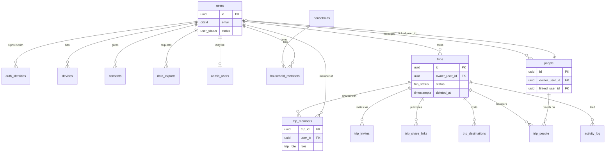
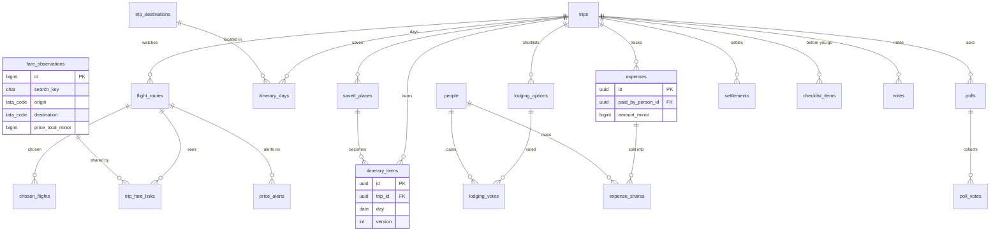
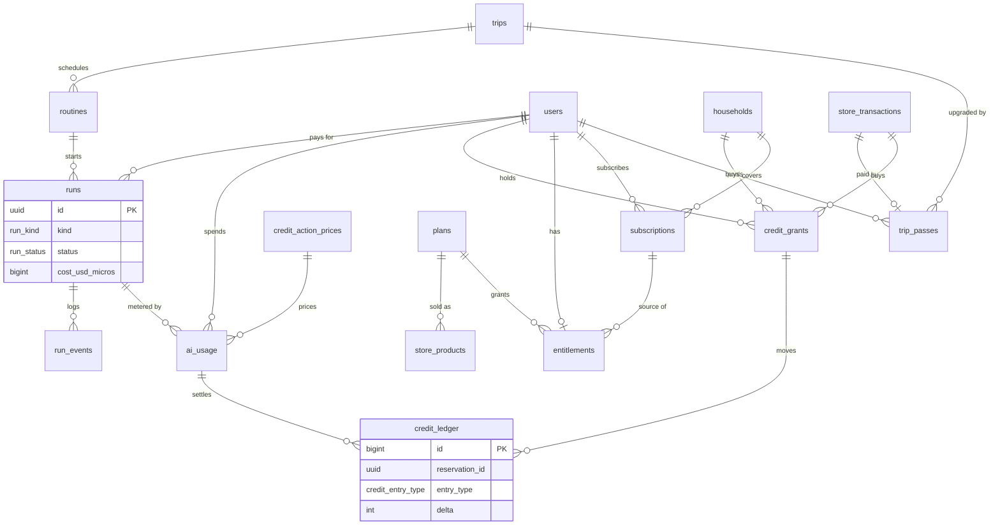
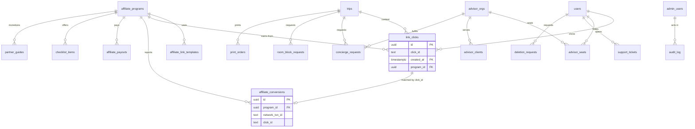

# 03. Database schema

Part of the [Wayfold build specification](README.md). The shared decisions in the README override anything here. Table names are the canonical list from the README; the API spec ([04-api-spec.md](04-api-spec.md)) and UI spec ([05-ui-ux-spec.md](05-ui-ux-spec.md)) use these names and column names exactly.

Target: PostgreSQL 18 (native `uuidv7()`), SQLAlchemy 2 models, Alembic migrations, Render managed Postgres with point-in-time recovery. Every statement below is written to run as-is on a fresh database, in the order given in section 10.

## 1. Scope and how to read this file

- Section 2 sets the conventions every table follows. Section 3 is the shared setup (extensions, domains, roles, helper functions).
- Section 4 is the entity-relationship overview in four diagrams. Section 5 is the complete DDL, grouped by domain.
- Sections 6 to 12 cover row-level security, key queries, retention, partitioning, the Alembic order, seed data and the mapping from the existing Trip Planner tables.
- Section 13 lists every table added beyond the README list, with the reason.
- The DDL is the source of truth for names and types. SQLAlchemy models mirror it one to one (same table, column and constraint names; the naming convention in section 2 keeps Alembic stable).
- Plan numbers (limits, prices, credits, ceilings) come from the README and from `02-pricing-tiers.md`. They live in seed rows (section 11), never in code constants, so a price test needs no migration.

## 2. Conventions

1. **Identifiers.** Every row that a client can see has `id uuid PRIMARY KEY DEFAULT uuidv7()`. UUIDv7 is time-ordered (good index locality) and not guessable. There are no sequential ids in URLs or API payloads. High-volume internal log tables (`run_events`, `provider_calls`, `ai_usage`, `credit_ledger`, `fare_observations`, `audit_log`, `activity_log`) use `bigint GENERATED ALWAYS AS IDENTITY` and are never exposed by id to clients.
2. **Timestamps.** Every timestamp is `timestamptz` and stored in UTC. Mutable tables have `created_at timestamptz NOT NULL DEFAULT now()` and `updated_at timestamptz NOT NULL DEFAULT now()`, kept current by the `set_updated_at()` trigger. Append-only tables have only `created_at`. Wall-clock values that belong to a place (an itinerary item at 19:30 in Lisbon) are `date` and `time` columns without a zone; the zone comes from the destination.
3. **Money.** Amounts of real money are `bigint` minor units plus an ISO 4217 code: `price_minor bigint`, `currency currency_code`. The exponent comes from `currency_exponent(code)` (2 for USD and EUR, 0 for JPY, 3 for KWD). Never use `numeric` or `float` for money. FX conversion is done at read time with `fx_rates`; a converted amount is stored only when it is a record of what was agreed (`expenses.amount_trip_minor`).
4. **Provider spend.** Our own cost is `bigint` micro-dollars (`_micros` suffix, 1,000,000 = $1). One credit is 20,000 micro-dollars. Never mix micro-dollars and minor units in one column.
5. **Enums.** Closed sets that the API exposes and that rarely change are Postgres enums (`CREATE TYPE`). Sets that grow with partners, providers or features use `text` with a named `CHECK` constraint, so adding a value is a cheap constraint swap instead of `ALTER TYPE`. Adding an enum value uses `ALTER TYPE ... ADD VALUE` in its own migration step (it cannot be used in the same transaction that adds it).
6. **Nullability.** Columns are `NOT NULL` unless null carries a meaning (for example `end_time`, `deleted_at`). Booleans are `NOT NULL DEFAULT false` or `true`. Empty text defaults to `''`, never null, where the UI treats empty and missing the same.
7. **Soft delete.** Only three things are soft deleted, because the product promises a recovery window: `users` (`deleted_at`, status `pending_deletion` then `deleted`, 30 day grace), `trips` (`deleted_at`, 30 days in trash), and `partner_guides` (`archived` status). Everything else is hard deleted. Partial indexes filter `WHERE deleted_at IS NULL` so live queries never see trash. Hard purge jobs are in section 8.
8. **Foreign keys.** Trip children use `ON DELETE CASCADE` on `trip_id`. Attribution columns (`created_by`, `updated_by`, `author_user_id`) use `ON DELETE SET NULL`, which the UI renders as "Former member". Financial records (`store_transactions`, `credit_ledger`, `ai_usage`, `subscriptions`, `affiliate_conversions`) use `SET NULL` on `user_id` so a deleted account keeps an anonymous record for the tax retention period. `trips.owner_user_id` is `RESTRICT`: the deletion job must transfer or delete a user's trips first. Partitioned log tables (`run_events`, `provider_calls`, `link_clicks`) carry no foreign keys to users or trips and nothing references them (a partitioned table can only be referenced together with its partition key); `run_events` keeps its cascade foreign key to `runs` and `link_clicks` references `affiliate_programs`. The deletion job scrubs them by `user_id`.
9. **Constraint and index names.** Follow the existing Trip Planner naming convention in `backend/tripplanner/models/base.py`: `pk_<table>`, `uq_<table>_<col>`, `fk_<table>_<col>_<referred>`, `ck_<table>_<name>`, `ix_<table>_<cols>`. The DDL below uses short explicit names that match.
10. **Trip consistency.** A child table that has its own `trip_id` and also points at a row that belongs to a trip (for example `lodging_votes` points at `lodging_options`) uses a composite foreign key `(parent_id, trip_id)` so a child can never point at a parent in another trip. Parents carry `UNIQUE (id, trip_id)` for this. The `trip_id` copy also makes row-level security policies cheap (section 6).
11. **Optimistic concurrency.** Rows that two people edit (`itinerary_items`, `itinerary_days`, `lodging_options`, `notes`) carry `version integer NOT NULL DEFAULT 1`. The API updates with `WHERE id = :id AND version = :v` and returns 409 with the latest row when zero rows change. The `bump_version()` trigger increments it.
12. **JSONB.** Used for provider payloads, plan limits, flag rules and other shapes that are read whole and never joined. Anything filtered, sorted or constrained is a real column. Provider payloads (`raw`) are short-lived (section 8) because storing them long term is a terms risk.
13. **Tenancy.** The tenant is the user account; trips are shared by membership in `trip_members`. A household (`households`) only pools credits and the Family subscription. Global tables have no tenant column and are read-only to the app role.
14. **Text hygiene.** Emails are `citext`. Codes are uppercase `char(3)` or `char(2)` through the domains in section 3. Free text has length checks where the UI has a limit. No table stores passwords, passport numbers, payment card data or advertising identifiers.

## 3. Shared setup

Run first (migration `0001`). The `wayfold_owner` role owns all objects and runs migrations; the other roles are described in section 6.

```sql
CREATE EXTENSION IF NOT EXISTS citext;

-- Domains keep codes consistent across tables.
CREATE DOMAIN currency_code AS char(3) CHECK (VALUE ~ '^[A-Z]{3}$');
CREATE DOMAIN iata_code     AS char(3) CHECK (VALUE ~ '^[A-Z]{3}$');
CREATE DOMAIN country_code2 AS char(2) CHECK (VALUE ~ '^[A-Z]{2}$');
CREATE DOMAIN hex_color     AS char(7) CHECK (VALUE ~ '^#[0-9A-Fa-f]{6}$');

-- Keeps updated_at current. Attach with add_updated_at_trigger('table') in each migration.
CREATE FUNCTION set_updated_at() RETURNS trigger LANGUAGE plpgsql AS $$
BEGIN NEW.updated_at := now(); RETURN NEW; END $$;

CREATE FUNCTION add_updated_at_trigger(p_table regclass) RETURNS void LANGUAGE plpgsql AS $$
BEGIN
  EXECUTE format(
    'CREATE TRIGGER trg_updated_at BEFORE UPDATE ON %s FOR EACH ROW EXECUTE FUNCTION set_updated_at()',
    p_table);
END $$;

-- Optimistic concurrency counter.
CREATE FUNCTION bump_version() RETURNS trigger LANGUAGE plpgsql AS $$
BEGIN NEW.version := OLD.version + 1; RETURN NEW; END $$;

CREATE FUNCTION add_version_trigger(p_table regclass) RETURNS void LANGUAGE plpgsql AS $$
BEGIN
  EXECUTE format(
    'CREATE TRIGGER trg_version BEFORE UPDATE ON %s FOR EACH ROW EXECUTE FUNCTION bump_version()',
    p_table);
END $$;

-- Minor-unit exponent for ISO 4217 (2 unless listed).
CREATE FUNCTION currency_exponent(c text) RETURNS smallint LANGUAGE sql IMMUTABLE AS $$
  SELECT CASE
    WHEN c IN ('BIF','CLP','DJF','GNF','ISK','JPY','KMF','KRW','PYG','RWF','UGX','UYI','VND','VUV','XAF','XOF','XPF') THEN 0
    WHEN c IN ('BHD','IQD','JOD','KWD','LYD','OMR','TND') THEN 3
    ELSE 2 END
$$;

-- Session user for row-level security (section 6). NULL when unset, so policies fail closed.
CREATE FUNCTION app_user_id() RETURNS uuid LANGUAGE sql STABLE AS $$
  SELECT nullif(current_setting('app.user_id', true), '')::uuid
$$;
```

## 4. Entity-relationship overview

Four diagrams, split by domain. Only keys and the columns that explain a relationship are shown; the DDL in section 5 is complete. Crow's foot notation: `||--o{` is one to many.

### 4.1 Identity, households, trips, collaboration and people



### 4.2 Flights, itinerary, lodging, group tools and checklist



### 4.3 AI, credits and billing



### 4.4 Affiliate, services, advisors, admin and privacy



## 5. Tables (DDL)

Grouped by domain. Within a group, tables are listed in creation order. Migration order across groups is in section 10 (it differs slightly so that every foreign key target exists first). Each `CREATE TABLE` below is followed by its indexes. Triggers for `updated_at` and `version` are attached with the helpers from section 3 and shown once per table as a comment.

### 5.1 Identity and devices

`users` is our account row. Supabase Auth only proves who someone is; `auth_identities` maps its subject to our `users.id`, so switching vendor is a remap of that one table.

```sql
CREATE TYPE user_status AS ENUM ('active', 'pending_deletion', 'deleted');

CREATE TABLE users (
  id                  uuid PRIMARY KEY DEFAULT uuidv7(),
  email               citext,                                   -- may be an Apple relay address
  email_is_relay      boolean NOT NULL DEFAULT false,
  display_name        text NOT NULL DEFAULT '' CHECK (char_length(display_name) <= 80),
  locale              text NOT NULL DEFAULT 'en-US',
  timezone            text NOT NULL DEFAULT 'UTC',
  home_currency       currency_code NOT NULL DEFAULT 'USD',
  home_airports       iata_code[] NOT NULL DEFAULT '{}',
  country_code        country_code2,                            -- storefront or detected, drives "Ad" labels
  status              user_status NOT NULL DEFAULT 'active',
  is_guest            boolean NOT NULL DEFAULT false,           -- server row created lazily for local-first guests
  hide_booking_links  boolean NOT NULL DEFAULT false,           -- Settings: "Hide booking links"
  prefs               jsonb NOT NULL DEFAULT '{}'::jsonb,       -- per-user settings (replaces app_settings per-user keys)
  last_seen_at        timestamptz,
  created_at          timestamptz NOT NULL DEFAULT now(),
  updated_at          timestamptz NOT NULL DEFAULT now(),
  deleted_at          timestamptz,
  CONSTRAINT ck_users_email_or_guest CHECK (email IS NOT NULL OR is_guest),
  CONSTRAINT ck_users_deleted CHECK (status <> 'deleted' OR deleted_at IS NOT NULL)
);
CREATE UNIQUE INDEX uq_users_email ON users (email) WHERE email IS NOT NULL AND deleted_at IS NULL;
CREATE INDEX ix_users_status ON users (status) WHERE status <> 'active';
SELECT add_updated_at_trigger('users');

CREATE TABLE auth_identities (
  id                          uuid PRIMARY KEY DEFAULT uuidv7(),
  user_id                     uuid NOT NULL REFERENCES users (id) ON DELETE CASCADE,
  provider                    text NOT NULL,
  subject                     text NOT NULL,                     -- Supabase user id (JWT sub) or provider subject
  email                       citext,
  email_is_relay              boolean NOT NULL DEFAULT false,
  provider_refresh_token_enc  bytea,                             -- Apple refresh token, encrypted, for revoke on deletion
  created_at                  timestamptz NOT NULL DEFAULT now(),
  last_login_at               timestamptz,
  CONSTRAINT ck_auth_identities_provider CHECK (provider IN ('apple', 'google', 'email')),
  CONSTRAINT uq_auth_identities_provider_subject UNIQUE (provider, subject)
);
CREATE INDEX ix_auth_identities_user ON auth_identities (user_id);

CREATE TABLE devices (
  id                  uuid PRIMARY KEY DEFAULT uuidv7(),
  user_id             uuid NOT NULL REFERENCES users (id) ON DELETE CASCADE,
  platform            text NOT NULL,
  device_name         text,
  push_token          text,                                      -- APNs token; null until permission is granted
  push_environment    text,
  app_version         text,
  os_version          text,
  refresh_token_hash  bytea,                                     -- session refresh token hash, for "sign out everywhere"
  attestation_key_id  text,                                      -- App Attest key id
  last_seen_at        timestamptz NOT NULL DEFAULT now(),
  revoked_at          timestamptz,
  created_at          timestamptz NOT NULL DEFAULT now(),
  CONSTRAINT ck_devices_platform CHECK (platform IN ('ios', 'android', 'web')),
  CONSTRAINT ck_devices_push_env CHECK (push_environment IS NULL OR push_environment IN ('sandbox', 'production'))
);
CREATE UNIQUE INDEX uq_devices_push_token ON devices (platform, push_token) WHERE push_token IS NOT NULL AND revoked_at IS NULL;
CREATE INDEX ix_devices_user ON devices (user_id) WHERE revoked_at IS NULL;
```

### 5.2 Households

A household only pools credits and covers the Family subscription (up to 6 members). It grants no trip access; trips are shared through `trip_members`.

```sql
CREATE TYPE household_role AS ENUM ('owner', 'member');
CREATE TYPE household_member_status AS ENUM ('invited', 'active', 'removed');

CREATE TABLE households (
  id             uuid PRIMARY KEY DEFAULT uuidv7(),
  name           text NOT NULL DEFAULT 'Family' CHECK (char_length(name) BETWEEN 1 AND 60),
  owner_user_id  uuid NOT NULL REFERENCES users (id) ON DELETE RESTRICT,
  max_members    smallint NOT NULL DEFAULT 6 CHECK (max_members BETWEEN 1 AND 6),
  created_at     timestamptz NOT NULL DEFAULT now(),
  updated_at     timestamptz NOT NULL DEFAULT now()
);
CREATE INDEX ix_households_owner ON households (owner_user_id);
SELECT add_updated_at_trigger('households');

CREATE TABLE household_members (
  id                  uuid PRIMARY KEY DEFAULT uuidv7(),
  household_id        uuid NOT NULL REFERENCES households (id) ON DELETE CASCADE,
  user_id             uuid REFERENCES users (id) ON DELETE CASCADE,   -- null while an emailed invite is pending
  role                household_role NOT NULL DEFAULT 'member',
  status              household_member_status NOT NULL DEFAULT 'invited',
  invited_email       citext,
  invite_token_hash   bytea,                                          -- hash only; 7 day expiry
  invite_expires_at   timestamptz,
  invited_by          uuid REFERENCES users (id) ON DELETE SET NULL,
  joined_at           timestamptz,
  removed_at          timestamptz,
  created_at          timestamptz NOT NULL DEFAULT now(),
  updated_at          timestamptz NOT NULL DEFAULT now(),
  CONSTRAINT ck_household_members_user CHECK (status = 'invited' OR user_id IS NOT NULL),
  CONSTRAINT ck_household_members_invite CHECK (status <> 'invited' OR (invite_token_hash IS NOT NULL AND invite_expires_at IS NOT NULL))
);
CREATE UNIQUE INDEX uq_household_members_user ON household_members (household_id, user_id) WHERE user_id IS NOT NULL;
CREATE UNIQUE INDEX uq_household_members_one_active ON household_members (user_id) WHERE status = 'active';
CREATE UNIQUE INDEX uq_household_members_one_owner ON household_members (household_id) WHERE role = 'owner' AND status = 'active';
CREATE UNIQUE INDEX uq_household_members_invite ON household_members (invite_token_hash) WHERE invite_token_hash IS NOT NULL;
SELECT add_updated_at_trigger('household_members');

-- Size cap (invited and active count). Locks the household row to serialize concurrent joins.
CREATE FUNCTION enforce_household_size() RETURNS trigger LANGUAGE plpgsql AS $$
DECLARE v_max smallint; v_count integer;
BEGIN
  IF NEW.status NOT IN ('invited', 'active') THEN RETURN NEW; END IF;
  SELECT max_members INTO v_max FROM households WHERE id = NEW.household_id FOR UPDATE;
  SELECT count(*) INTO v_count FROM household_members
   WHERE household_id = NEW.household_id AND status IN ('invited', 'active') AND id <> NEW.id;
  IF v_count >= v_max THEN RAISE EXCEPTION 'household_full' USING ERRCODE = 'WF409'; END IF;
  RETURN NEW;
END $$;
CREATE TRIGGER trg_household_size BEFORE INSERT OR UPDATE OF status ON household_members
  FOR EACH ROW EXECUTE FUNCTION enforce_household_size();
```

### 5.3 Trips and collaboration

`trips.id` is the public UUIDv7. Sharing is membership with a per-trip role. Exactly one `owner` member exists per trip and it always equals `trips.owner_user_id` (the trigger below creates it; ownership transfer is one function call in one transaction).

```sql
CREATE TYPE trip_status AS ENUM ('planning', 'booked', 'done', 'archived');
CREATE TYPE trip_role   AS ENUM ('owner', 'editor', 'viewer');

CREATE TABLE trips (
  id                uuid PRIMARY KEY DEFAULT uuidv7(),
  owner_user_id     uuid NOT NULL REFERENCES users (id) ON DELETE RESTRICT,
  name              text NOT NULL CHECK (char_length(name) BETWEEN 1 AND 120),
  start_date        date,                                 -- optional: a trip can be an idea before it has dates
  end_date          date,
  status            trip_status NOT NULL DEFAULT 'planning',
  home_currency     currency_code NOT NULL,
  notes             text NOT NULL DEFAULT '',
  cover_image_url   text,
  ai_enabled        boolean NOT NULL DEFAULT true,        -- owner can turn AI off for the trip
  show_book_slide   boolean NOT NULL DEFAULT true,        -- presentation "Book the plan" slide
  archived_at       timestamptz,
  deleted_at        timestamptz,                          -- trash; hard purge after 30 days
  created_at        timestamptz NOT NULL DEFAULT now(),
  updated_at        timestamptz NOT NULL DEFAULT now(),
  CONSTRAINT ck_trips_valid_dates CHECK ((start_date IS NULL) = (end_date IS NULL) AND (end_date IS NULL OR end_date >= start_date))
);
CREATE INDEX ix_trips_owner_status ON trips (owner_user_id, status) WHERE deleted_at IS NULL;
CREATE INDEX ix_trips_start_date ON trips (start_date) WHERE deleted_at IS NULL AND start_date IS NOT NULL;
CREATE INDEX ix_trips_trash ON trips (deleted_at) WHERE deleted_at IS NOT NULL;
SELECT add_updated_at_trigger('trips');

CREATE TABLE trip_members (
  trip_id     uuid NOT NULL REFERENCES trips (id) ON DELETE CASCADE,
  user_id     uuid NOT NULL REFERENCES users (id) ON DELETE CASCADE,
  role        trip_role NOT NULL,
  invited_by  uuid REFERENCES users (id) ON DELETE SET NULL,
  joined_at   timestamptz NOT NULL DEFAULT now(),
  PRIMARY KEY (trip_id, user_id)
);
CREATE UNIQUE INDEX uq_trip_members_one_owner ON trip_members (trip_id) WHERE role = 'owner';
CREATE INDEX ix_trip_members_user_trip ON trip_members (user_id, trip_id);      -- the "my trips" query and RLS helper

-- The owner is always a member.
CREATE FUNCTION trips_add_owner_member() RETURNS trigger LANGUAGE plpgsql SECURITY DEFINER SET search_path = public AS $$
BEGIN
  INSERT INTO trip_members (trip_id, user_id, role) VALUES (NEW.id, NEW.owner_user_id, 'owner');
  RETURN NEW;
END $$;
CREATE TRIGGER trg_trips_owner_member AFTER INSERT ON trips
  FOR EACH ROW EXECUTE FUNCTION trips_add_owner_member();

CREATE TABLE trip_invites (
  id            uuid PRIMARY KEY DEFAULT uuidv7(),
  trip_id       uuid NOT NULL REFERENCES trips (id) ON DELETE CASCADE,
  invited_by    uuid REFERENCES users (id) ON DELETE SET NULL,
  token_hash    bytea NOT NULL,                              -- sha256 of a random 128-bit token; the token is never stored
  role          trip_role NOT NULL DEFAULT 'editor',
  email         citext,                                      -- null for a shareable link
  max_uses      smallint NOT NULL DEFAULT 1 CHECK (max_uses BETWEEN 1 AND 50),
  use_count     smallint NOT NULL DEFAULT 0,
  expires_at    timestamptz NOT NULL DEFAULT now() + interval '7 days',
  revoked_at    timestamptz,
  accepted_by   uuid REFERENCES users (id) ON DELETE SET NULL,   -- last redeemer
  accepted_at   timestamptz,
  created_at    timestamptz NOT NULL DEFAULT now(),
  CONSTRAINT ck_trip_invites_role CHECK (role <> 'owner'),
  CONSTRAINT ck_trip_invites_uses CHECK (use_count <= max_uses),
  CONSTRAINT uq_trip_invites_token UNIQUE (token_hash)
);
CREATE INDEX ix_trip_invites_trip ON trip_invites (trip_id) WHERE revoked_at IS NULL;
CREATE INDEX ix_trip_invites_expiry ON trip_invites (expires_at);

CREATE TABLE trip_share_links (
  id                uuid PRIMARY KEY DEFAULT uuidv7(),
  trip_id           uuid NOT NULL REFERENCES trips (id) ON DELETE CASCADE,
  created_by        uuid REFERENCES users (id) ON DELETE SET NULL,
  token_hash        bytea NOT NULL,
  redact_address    boolean NOT NULL DEFAULT true,           -- hide exact lodging address
  redact_prices     boolean NOT NULL DEFAULT true,
  redact_notes      boolean NOT NULL DEFAULT true,
  expires_at        timestamptz NOT NULL DEFAULT now() + interval '90 days',
  revoked_at        timestamptz,
  view_count        integer NOT NULL DEFAULT 0,
  last_viewed_at    timestamptz,
  created_at        timestamptz NOT NULL DEFAULT now(),
  CONSTRAINT uq_trip_share_links_token UNIQUE (token_hash)
);
CREATE INDEX ix_trip_share_links_trip ON trip_share_links (trip_id) WHERE revoked_at IS NULL;

CREATE TABLE trip_destinations (
  id                  uuid PRIMARY KEY DEFAULT uuidv7(),
  trip_id             uuid NOT NULL REFERENCES trips (id) ON DELETE CASCADE,
  position            smallint NOT NULL,
  name                text NOT NULL CHECK (char_length(name) BETWEEN 1 AND 120),
  region              text,
  country             text,
  country_code        country_code2,
  kind                text,                                  -- city, region, country, poi
  lat                 double precision NOT NULL CHECK (lat BETWEEN -90 AND 90),
  lon                 double precision NOT NULL CHECK (lon BETWEEN -180 AND 180),
  timezone            text,
  bbox                double precision[],                    -- [west, south, east, north]
  geoapify_place_id   text,
  wikidata_id         text,
  summary             text,                                  -- Wikipedia extract (CC BY-SA)
  wiki_url            text,
  image_url           text,
  image_attribution   text,
  image_license       text,
  info_status         text NOT NULL DEFAULT 'pending',
  info_updated_at     timestamptz,
  created_at          timestamptz NOT NULL DEFAULT now(),
  CONSTRAINT ck_trip_destinations_info_status CHECK (info_status IN ('pending', 'ready', 'not_found', 'failed', 'skipped')),
  CONSTRAINT uq_trip_destinations_position UNIQUE (trip_id, position) DEFERRABLE INITIALLY DEFERRED
);

CREATE TABLE activity_log (                                  -- per-trip change feed
  id              bigint GENERATED ALWAYS AS IDENTITY PRIMARY KEY,
  trip_id         uuid NOT NULL REFERENCES trips (id) ON DELETE CASCADE,
  actor_user_id   uuid REFERENCES users (id) ON DELETE SET NULL,
  verb            text NOT NULL,                              -- added, updated, removed, voted, joined, ...
  entity_type     text NOT NULL,
  entity_id       uuid,
  summary         text NOT NULL DEFAULT '',
  created_at      timestamptz NOT NULL DEFAULT now()
);
CREATE INDEX ix_activity_log_trip ON activity_log (trip_id, id DESC);
```

### 5.4 People

A person is a traveler on a trip even if they never sign in (a child, a friend). `owner_user_id` is the account that manages the row; `linked_user_id` is set when the traveler is a real account. Every new user gets a "Me" person (`is_self = true`).

```sql
CREATE TABLE people (
  id               uuid PRIMARY KEY DEFAULT uuidv7(),
  owner_user_id    uuid NOT NULL REFERENCES users (id) ON DELETE CASCADE,
  linked_user_id   uuid REFERENCES users (id) ON DELETE SET NULL,
  name             text NOT NULL CHECK (char_length(name) BETWEEN 1 AND 60),
  color            hex_color NOT NULL DEFAULT '#1F2A44',
  home_airports    iata_code[] NOT NULL DEFAULT '{}',
  is_self          boolean NOT NULL DEFAULT false,          -- the auto-created "Me" person
  created_at       timestamptz NOT NULL DEFAULT now(),
  updated_at       timestamptz NOT NULL DEFAULT now()
);
CREATE UNIQUE INDEX uq_people_owner_linked ON people (owner_user_id, linked_user_id) WHERE linked_user_id IS NOT NULL;
CREATE UNIQUE INDEX uq_people_one_self ON people (owner_user_id) WHERE is_self;
CREATE INDEX ix_people_linked_user ON people (linked_user_id) WHERE linked_user_id IS NOT NULL;
SELECT add_updated_at_trigger('people');

CREATE TABLE trip_people (
  trip_id     uuid NOT NULL REFERENCES trips (id) ON DELETE CASCADE,
  person_id   uuid NOT NULL REFERENCES people (id) ON DELETE CASCADE,
  added_by    uuid REFERENCES users (id) ON DELETE SET NULL,
  created_at  timestamptz NOT NULL DEFAULT now(),
  PRIMARY KEY (trip_id, person_id)
);
CREATE INDEX ix_trip_people_person ON trip_people (person_id);
```

Rule enforced by the API: a person is linked to at most one user per trip, and a linked person's name and airports are shown only to co-members of that trip.

### 5.5 Flights and fares

`fare_observations` is shared across all users: one row per observed fare, keyed by route, dates and search. A user's route links to observations through `trip_fare_links`, so 1,000 users watching the same route cost one live call per cache window. Observations are display hints with a source and a timestamp ("price seen at 14:05 from Travelpayouts"), never a bookable guarantee.

```sql
CREATE TYPE cabin_class     AS ENUM ('economy', 'premium_economy', 'business', 'first');
CREATE TYPE trip_type       AS ENUM ('round_trip', 'one_way');
CREATE TYPE fare_confidence AS ENUM ('live', 'cached', 'indicative');   -- live: real-time search; cached: other travelers' recent search; indicative: agent saw it on a page

CREATE TABLE flight_routes (
  id                 uuid PRIMARY KEY DEFAULT uuidv7(),
  trip_id            uuid NOT NULL REFERENCES trips (id) ON DELETE CASCADE,
  label              text,
  origin_codes       iata_code[] NOT NULL CHECK (cardinality(origin_codes) BETWEEN 1 AND 4),
  destination_codes  iata_code[] NOT NULL CHECK (cardinality(destination_codes) BETWEEN 1 AND 4),
  trip_type          trip_type NOT NULL DEFAULT 'round_trip',
  depart_from        date NOT NULL,
  depart_to          date NOT NULL,
  return_from        date,
  return_to          date,
  min_nights         smallint,
  max_nights         smallint,
  adults             smallint NOT NULL DEFAULT 1,
  children           smallint NOT NULL DEFAULT 0,
  cabin              cabin_class NOT NULL DEFAULT 'economy',
  max_stops          smallint,                              -- null = any number of stops
  sources            text[] NOT NULL DEFAULT '{travelpayouts}',
  alert_price_minor  bigint CHECK (alert_price_minor IS NULL OR alert_price_minor > 0),
  alert_currency     currency_code,
  is_live            boolean NOT NULL DEFAULT false,        -- live (paid-source) tracking; capped by entitlement live_routes
  live_enabled_at    timestamptz,
  last_checked_at    timestamptz,
  active             boolean NOT NULL DEFAULT true,
  created_by         uuid REFERENCES users (id) ON DELETE SET NULL,
  created_at         timestamptz NOT NULL DEFAULT now(),
  updated_at         timestamptz NOT NULL DEFAULT now(),
  CONSTRAINT ck_flight_routes_depart_window CHECK (depart_to >= depart_from),
  CONSTRAINT ck_flight_routes_passengers CHECK (adults BETWEEN 1 AND 9 AND children BETWEEN 0 AND 8),
  CONSTRAINT ck_flight_routes_return_pair CHECK ((return_from IS NULL) = (return_to IS NULL)),
  CONSTRAINT ck_flight_routes_nights_pair CHECK ((min_nights IS NULL) = (max_nights IS NULL)),
  CONSTRAINT ck_flight_routes_return_rule CHECK (
    (trip_type = 'one_way' AND return_from IS NULL AND min_nights IS NULL) OR
    (trip_type = 'round_trip' AND ((return_from IS NULL) <> (min_nights IS NULL)))),
  CONSTRAINT ck_flight_routes_alert_currency CHECK ((alert_price_minor IS NULL) = (alert_currency IS NULL)),
  CONSTRAINT ck_flight_routes_sources CHECK (sources <@ ARRAY['travelpayouts', 'serpapi', 'licensed', 'agent', 'manual']),
  CONSTRAINT uq_flight_routes_id_trip UNIQUE (id, trip_id)
);
CREATE INDEX ix_flight_routes_trip ON flight_routes (trip_id);
CREATE INDEX ix_flight_routes_live_due ON flight_routes (last_checked_at NULLS FIRST) WHERE is_live AND active;
SELECT add_updated_at_trigger('flight_routes');

CREATE TABLE fare_observations (
  id                   bigint GENERATED ALWAYS AS IDENTITY PRIMARY KEY,
  search_key           char(64) NOT NULL,                   -- sha256 of the normalized query
  origin               iata_code NOT NULL,                  -- single airports; multi-airport routes expand
  destination          iata_code NOT NULL,
  depart_date          date NOT NULL,
  return_date          date,
  cabin                cabin_class NOT NULL DEFAULT 'economy',
  adults               smallint NOT NULL DEFAULT 1,
  children             smallint NOT NULL DEFAULT 0,
  stops_max            smallint,
  source               text NOT NULL,
  confidence           fare_confidence NOT NULL,
  currency             currency_code NOT NULL,
  price_total_minor    bigint NOT NULL CHECK (price_total_minor > 0),   -- for the whole party
  airlines             text[] NOT NULL DEFAULT '{}',
  stops_out            smallint,
  stops_back           smallint,
  duration_out_min     integer,
  duration_back_min    integer,
  depart_at_local      text,                                -- as shown by the source, e.g. "2026-11-05 11:30"
  flight_numbers       jsonb,
  deep_link_template   text,                                -- provider link, wrapped through /go at click time
  source_url           text,                                -- page where the fare was seen (required for agent rows)
  source_domain        text,
  run_id               uuid REFERENCES runs (id) ON DELETE SET NULL,   -- internal only, never exposed by the API
  observed_at          timestamptz NOT NULL,
  expires_at           timestamptz NOT NULL,                -- end of the cache window for this observation
  raw                  jsonb,                               -- nulled after 14 days (terms risk)
  created_at           timestamptz NOT NULL DEFAULT now(),
  CONSTRAINT ck_fare_observations_source CHECK (source IN ('serpapi', 'travelpayouts', 'licensed', 'agent', 'manual')),
  CONSTRAINT ck_fare_observations_agent_evidence CHECK (source <> 'agent' OR source_url IS NOT NULL),
  CONSTRAINT uq_fare_observations_search UNIQUE (search_key, source, observed_at)
);
CREATE INDEX ix_fare_observations_lookup
  ON fare_observations (origin, destination, depart_date, return_date, cabin, observed_at DESC);
CREATE INDEX ix_fare_observations_key_fresh ON fare_observations (search_key, expires_at DESC);
CREATE INDEX ix_fare_observations_observed ON fare_observations (observed_at);   -- retention sweeps

CREATE TABLE trip_fare_links (                               -- a trip route's view of a shared observation
  id              uuid PRIMARY KEY DEFAULT uuidv7(),
  trip_id         uuid NOT NULL REFERENCES trips (id) ON DELETE CASCADE,
  route_id        uuid NOT NULL,
  observation_id  bigint NOT NULL REFERENCES fare_observations (id) ON DELETE CASCADE,
  hidden          boolean NOT NULL DEFAULT false,
  suspect         boolean NOT NULL DEFAULT false,
  linked_at       timestamptz NOT NULL DEFAULT now(),
  FOREIGN KEY (route_id, trip_id) REFERENCES flight_routes (id, trip_id) ON DELETE CASCADE,
  CONSTRAINT uq_trip_fare_links_route_obs UNIQUE (route_id, observation_id)
);
CREATE INDEX ix_trip_fare_links_route ON trip_fare_links (route_id, linked_at DESC);
CREATE INDEX ix_trip_fare_links_trip ON trip_fare_links (trip_id);

CREATE TABLE chosen_flights (                                -- the flight picked for a route; its dates become the trip's dates
  id                 uuid PRIMARY KEY DEFAULT uuidv7(),
  trip_id            uuid NOT NULL REFERENCES trips (id) ON DELETE CASCADE,
  route_id           uuid NOT NULL,
  observation_id     bigint REFERENCES fare_observations (id) ON DELETE SET NULL,
  -- Snapshot, so the choice survives pruning of the observation.
  origin             iata_code NOT NULL,
  destination        iata_code NOT NULL,
  depart_date        date NOT NULL,
  return_date        date,
  price_total_minor  bigint NOT NULL CHECK (price_total_minor > 0),
  currency           currency_code NOT NULL,
  airlines           text[] NOT NULL DEFAULT '{}',
  source             text NOT NULL,
  observed_at        timestamptz NOT NULL,
  deep_link_template text,
  chosen_by          uuid REFERENCES users (id) ON DELETE SET NULL,
  chosen_at          timestamptz NOT NULL DEFAULT now(),
  booked_at          timestamptz,                             -- set when the user marks it booked (checklist)
  FOREIGN KEY (route_id, trip_id) REFERENCES flight_routes (id, trip_id) ON DELETE CASCADE,
  CONSTRAINT uq_chosen_flights_route UNIQUE (route_id)
);
CREATE INDEX ix_chosen_flights_trip ON chosen_flights (trip_id);

CREATE TABLE route_price_insights (                          -- Google price level and typical range, shared by market
  id                  bigint GENERATED ALWAYS AS IDENTITY PRIMARY KEY,
  origin              iata_code NOT NULL,
  destination         iata_code NOT NULL,
  depart_date         date NOT NULL,
  return_date         date,
  currency            currency_code NOT NULL,
  lowest_price_minor  bigint,
  price_level         text CHECK (price_level IN ('low', 'typical', 'high')),
  typical_low_minor   bigint,
  typical_high_minor  bigint,
  history             jsonb NOT NULL DEFAULT '[]'::jsonb,      -- [[unix_seconds, price_minor], ...]
  observed_at         timestamptz NOT NULL,
  expires_at          timestamptz NOT NULL
);
CREATE UNIQUE INDEX uq_route_price_insights_key
  ON route_price_insights (origin, destination, depart_date, COALESCE(return_date, DATE '0001-01-01'), currency);
```

### 5.6 Alerts

Free gets one alert on cached fares; paid tiers get live-fare alerts and more routes (limits come from `entitlements.limits`, enforced by the API). Push is sent to the user's non-revoked `devices`.

```sql
CREATE TABLE price_alerts (
  id                          uuid PRIMARY KEY DEFAULT uuidv7(),
  trip_id                     uuid NOT NULL REFERENCES trips (id) ON DELETE CASCADE,
  route_id                    uuid NOT NULL,
  user_id                     uuid NOT NULL REFERENCES users (id) ON DELETE CASCADE,   -- who is notified
  threshold_minor             bigint NOT NULL CHECK (threshold_minor > 0),
  currency                    currency_code NOT NULL,
  basis                       text NOT NULL DEFAULT 'cached' CHECK (basis IN ('cached', 'live')),
  channel_push                boolean NOT NULL DEFAULT true,
  channel_email               boolean NOT NULL DEFAULT false,
  active                      boolean NOT NULL DEFAULT true,
  last_evaluated_at           timestamptz,
  last_notified_at            timestamptz,
  last_notified_price_minor   bigint,
  created_at                  timestamptz NOT NULL DEFAULT now(),
  updated_at                  timestamptz NOT NULL DEFAULT now(),
  FOREIGN KEY (route_id, trip_id) REFERENCES flight_routes (id, trip_id) ON DELETE CASCADE,
  CONSTRAINT uq_price_alerts_route_user UNIQUE (route_id, user_id)
);
CREATE INDEX ix_price_alerts_active ON price_alerts (route_id) WHERE active;
CREATE INDEX ix_price_alerts_user ON price_alerts (user_id);
SELECT add_updated_at_trigger('price_alerts');
```

### 5.7 Itinerary and places

Day rows exist only once something is set (the days themselves come from the trip dates). `saved_places` is the trip's shortlist of places; dragging one onto a day creates an `itinerary_items` row that keeps a copy of the place fields so the item survives cache expiry.

```sql
CREATE TYPE item_status   AS ENUM ('idea', 'planned', 'booked');
CREATE TYPE item_category AS ENUM ('sights', 'museum', 'food', 'nature', 'nightlife', 'shopping', 'travel', 'other');

CREATE TABLE itinerary_days (
  trip_id         uuid NOT NULL REFERENCES trips (id) ON DELETE CASCADE,
  day             date NOT NULL,
  title           text NOT NULL DEFAULT '' CHECK (char_length(title) <= 120),
  notes           text NOT NULL DEFAULT '',
  destination_id  uuid REFERENCES trip_destinations (id) ON DELETE SET NULL,
  updated_by      uuid REFERENCES users (id) ON DELETE SET NULL,
  version         integer NOT NULL DEFAULT 1,
  updated_at      timestamptz NOT NULL DEFAULT now(),
  PRIMARY KEY (trip_id, day)
);
SELECT add_version_trigger('itinerary_days');
SELECT add_updated_at_trigger('itinerary_days');

CREATE TABLE saved_places (
  id              uuid PRIMARY KEY DEFAULT uuidv7(),
  trip_id         uuid NOT NULL REFERENCES trips (id) ON DELETE CASCADE,
  place_provider  text NOT NULL,                              -- geoapify, viator, manual
  place_id        text NOT NULL,
  name            text NOT NULL CHECK (char_length(name) BETWEEN 1 AND 200),
  category        item_category NOT NULL DEFAULT 'other',
  address         text,
  lat             double precision,
  lon             double precision,
  website         text,
  note            text NOT NULL DEFAULT '',
  place_data      jsonb,                                      -- fields the UI shows (hours, phone); not a full provider payload
  saved_by        uuid REFERENCES users (id) ON DELETE SET NULL,
  created_at      timestamptz NOT NULL DEFAULT now(),
  CONSTRAINT ck_saved_places_lat_lon CHECK ((lat IS NULL) = (lon IS NULL)),
  CONSTRAINT uq_saved_places_trip_place UNIQUE (trip_id, place_provider, place_id),
  CONSTRAINT uq_saved_places_id_trip UNIQUE (id, trip_id)
);
CREATE INDEX ix_saved_places_trip ON saved_places (trip_id, created_at DESC);

CREATE TABLE itinerary_items (
  id                     uuid PRIMARY KEY DEFAULT uuidv7(),
  trip_id                uuid NOT NULL REFERENCES trips (id) ON DELETE CASCADE,
  day                    date,                                -- null = idea with no day yet
  start_time             time,                                -- wall-clock at the destination
  end_time               time,                                -- at or before start_time means it runs past midnight
  sort_order             double precision NOT NULL DEFAULT 0, -- order within a day for untimed items
  title                  text NOT NULL CHECK (char_length(title) BETWEEN 1 AND 200),
  category               item_category NOT NULL DEFAULT 'other',
  status                 item_status NOT NULL DEFAULT 'idea',
  location_name          text,
  address                text,
  lat                    double precision,
  lon                    double precision,
  url                    text,
  notes                  text NOT NULL DEFAULT '',
  estimated_cost_minor   bigint CHECK (estimated_cost_minor IS NULL OR estimated_cost_minor >= 0),
  cost_currency          currency_code,
  saved_place_id         uuid,
  place_provider         text,
  place_id               text,
  place_data             jsonb,
  created_by             uuid REFERENCES users (id) ON DELETE SET NULL,
  updated_by             uuid REFERENCES users (id) ON DELETE SET NULL,
  version                integer NOT NULL DEFAULT 1,
  created_at             timestamptz NOT NULL DEFAULT now(),
  updated_at             timestamptz NOT NULL DEFAULT now(),
  FOREIGN KEY (saved_place_id, trip_id) REFERENCES saved_places (id, trip_id) ON DELETE SET NULL (saved_place_id),
  CONSTRAINT ck_itinerary_items_times_need_day CHECK (day IS NOT NULL OR start_time IS NULL),
  CONSTRAINT ck_itinerary_items_end_needs_start CHECK (start_time IS NOT NULL OR end_time IS NULL),
  CONSTRAINT ck_itinerary_items_lat_lon CHECK ((lat IS NULL) = (lon IS NULL)),
  CONSTRAINT ck_itinerary_items_cost CHECK ((estimated_cost_minor IS NULL) = (cost_currency IS NULL))
);
CREATE INDEX ix_itinerary_items_trip_day ON itinerary_items (trip_id, day, start_time NULLS LAST, sort_order);
CREATE INDEX ix_itinerary_items_updated ON itinerary_items (trip_id, updated_at DESC);      -- updated_since polling
SELECT add_version_trigger('itinerary_items');
SELECT add_updated_at_trigger('itinerary_items');
```

### 5.8 Lodging and votes

The server never fetches Airbnb, Vrbo or Booking.com pages. Rows for those hosts hold only what the user typed or the bookmarklet sent (`added_via` is `paste` or `bookmarklet`), and pasted URLs are stored exactly as pasted. Photos are hotlinked or held as thumbnails with a source link.

```sql
CREATE TYPE lodging_status AS ENUM ('candidate', 'shortlisted', 'booked', 'rejected');

CREATE TABLE lodging_options (
  id                    uuid PRIMARY KEY DEFAULT uuidv7(),
  trip_id               uuid NOT NULL REFERENCES trips (id) ON DELETE CASCADE,
  title                 text NOT NULL CHECK (char_length(title) BETWEEN 1 AND 300),
  url                   text,                                   -- exactly as the user pasted it
  url_normalized        text,                                   -- query string stripped, for duplicate detection
  site                  text,
  check_in              date,
  check_out             date,
  guests                smallint,
  price_total_minor     bigint CHECK (price_total_minor IS NULL OR price_total_minor >= 0),
  price_per_night_minor bigint CHECK (price_per_night_minor IS NULL OR price_per_night_minor >= 0),
  currency              currency_code,
  photos                jsonb NOT NULL DEFAULT '[]'::jsonb,
  location_name         text,
  lat                   double precision,
  lon                   double precision,
  bedrooms              smallint,
  beds                  smallint,
  baths                 numeric(4,1),
  rating                numeric(3,2),
  review_count          integer,
  notes                 text NOT NULL DEFAULT '',
  pros                  text NOT NULL DEFAULT '',
  cons                  text NOT NULL DEFAULT '',
  status                lodging_status NOT NULL DEFAULT 'candidate',
  favorite              boolean NOT NULL DEFAULT false,
  added_via             text NOT NULL,
  program_id            uuid,                                   -- partner the stay came from (search results); see affiliate_programs
  run_id                uuid REFERENCES runs (id) ON DELETE SET NULL,
  created_by            uuid REFERENCES users (id) ON DELETE SET NULL,
  updated_by            uuid REFERENCES users (id) ON DELETE SET NULL,
  version               integer NOT NULL DEFAULT 1,
  raw                   jsonb,                                  -- nulled after 30 days
  created_at            timestamptz NOT NULL DEFAULT now(),
  updated_at            timestamptz NOT NULL DEFAULT now(),
  CONSTRAINT ck_lodging_options_added_via CHECK (added_via IN ('bookmarklet', 'paste', 'partner_search', 'agent', 'manual')),
  CONSTRAINT ck_lodging_options_dates CHECK (check_out IS NULL OR check_in IS NULL OR check_out > check_in),
  CONSTRAINT ck_lodging_options_lat_lon CHECK ((lat IS NULL) = (lon IS NULL)),
  CONSTRAINT ck_lodging_options_price_currency CHECK ((price_total_minor IS NULL AND price_per_night_minor IS NULL) OR currency IS NOT NULL),
  CONSTRAINT uq_lodging_options_id_trip UNIQUE (id, trip_id)
);
CREATE UNIQUE INDEX uq_lodging_options_trip_url ON lodging_options (trip_id, url_normalized) WHERE url_normalized IS NOT NULL;
CREATE INDEX ix_lodging_options_trip ON lodging_options (trip_id, status, created_at DESC);
SELECT add_version_trigger('lodging_options');
SELECT add_updated_at_trigger('lodging_options');

CREATE TABLE lodging_votes (                                  -- a heart on a stay, by a traveler; user_id attributes it to an account
  lodging_id   uuid NOT NULL,
  trip_id      uuid NOT NULL,
  person_id    uuid NOT NULL,
  user_id      uuid REFERENCES users (id) ON DELETE SET NULL,
  created_at   timestamptz NOT NULL DEFAULT now(),
  PRIMARY KEY (lodging_id, person_id),
  FOREIGN KEY (lodging_id, trip_id) REFERENCES lodging_options (id, trip_id) ON DELETE CASCADE,
  FOREIGN KEY (trip_id, person_id) REFERENCES trip_people (trip_id, person_id) ON DELETE CASCADE
);
CREATE INDEX ix_lodging_votes_trip ON lodging_votes (trip_id);
```

### 5.9 Group tools: polls, expenses and settlements

Polls keep their options inside the row (`options` is an array of `{"key": "...", "label": "...", "ref_type": null, "ref_id": null}`), because options are always read with the poll and never joined. Expenses are kept per traveler (person), not per account, so a child or a friend without the app can owe money. Real money collection goes through Stripe, never In-App Purchase.

```sql
CREATE TYPE poll_status  AS ENUM ('open', 'closed');
CREATE TYPE split_method AS ENUM ('equal', 'exact', 'percent', 'shares');

CREATE TABLE polls (
  id                   uuid PRIMARY KEY DEFAULT uuidv7(),
  trip_id              uuid NOT NULL REFERENCES trips (id) ON DELETE CASCADE,
  created_by           uuid REFERENCES users (id) ON DELETE SET NULL,
  question             text NOT NULL CHECK (char_length(question) BETWEEN 1 AND 200),
  subject              text NOT NULL DEFAULT 'custom',
  selection            text NOT NULL DEFAULT 'single',
  options              jsonb NOT NULL,
  is_anonymous         boolean NOT NULL DEFAULT false,
  status               poll_status NOT NULL DEFAULT 'open',
  closes_at            timestamptz,
  closed_at            timestamptz,
  winning_option_key   text,
  created_at           timestamptz NOT NULL DEFAULT now(),
  updated_at           timestamptz NOT NULL DEFAULT now(),
  CONSTRAINT ck_polls_subject CHECK (subject IN ('custom', 'dates', 'lodging', 'activity', 'destination')),
  CONSTRAINT ck_polls_selection CHECK (selection IN ('single', 'multiple')),
  CONSTRAINT ck_polls_options CHECK (jsonb_typeof(options) = 'array' AND jsonb_array_length(options) BETWEEN 2 AND 12),
  CONSTRAINT uq_polls_id_trip UNIQUE (id, trip_id)
);
CREATE INDEX ix_polls_trip ON polls (trip_id, status, created_at DESC);
SELECT add_updated_at_trigger('polls');

CREATE TABLE poll_votes (
  poll_id     uuid NOT NULL,
  trip_id     uuid NOT NULL,
  user_id     uuid NOT NULL REFERENCES users (id) ON DELETE CASCADE,
  option_key  text NOT NULL,
  created_at  timestamptz NOT NULL DEFAULT now(),
  PRIMARY KEY (poll_id, user_id, option_key),
  FOREIGN KEY (poll_id, trip_id) REFERENCES polls (id, trip_id) ON DELETE CASCADE
);
CREATE INDEX ix_poll_votes_trip ON poll_votes (trip_id);

-- A vote must name a real option, and single-choice polls allow one option per voter.
CREATE FUNCTION poll_votes_validate() RETURNS trigger LANGUAGE plpgsql AS $$
DECLARE v_poll polls%ROWTYPE;
BEGIN
  SELECT * INTO v_poll FROM polls WHERE id = NEW.poll_id;
  IF v_poll.status <> 'open' THEN RAISE EXCEPTION 'poll_closed' USING ERRCODE = 'WF409'; END IF;
  IF NOT EXISTS (SELECT 1 FROM jsonb_array_elements(v_poll.options) o WHERE o ->> 'key' = NEW.option_key) THEN
    RAISE EXCEPTION 'unknown_option' USING ERRCODE = 'WF422';
  END IF;
  IF v_poll.selection = 'single' AND EXISTS (
       SELECT 1 FROM poll_votes WHERE poll_id = NEW.poll_id AND user_id = NEW.user_id AND option_key <> NEW.option_key) THEN
    RAISE EXCEPTION 'single_choice' USING ERRCODE = 'WF409';
  END IF;
  RETURN NEW;
END $$;
CREATE TRIGGER trg_poll_votes_validate BEFORE INSERT ON poll_votes
  FOR EACH ROW EXECUTE FUNCTION poll_votes_validate();

CREATE TABLE expenses (
  id                    uuid PRIMARY KEY DEFAULT uuidv7(),
  trip_id               uuid NOT NULL REFERENCES trips (id) ON DELETE CASCADE,
  paid_by_person_id     uuid NOT NULL,
  description           text NOT NULL CHECK (char_length(description) BETWEEN 1 AND 200),
  category              text NOT NULL DEFAULT 'other',
  amount_minor          bigint NOT NULL CHECK (amount_minor > 0),          -- as paid
  currency              currency_code NOT NULL,
  fx_rate               numeric(20,10) NOT NULL DEFAULT 1 CHECK (fx_rate > 0),   -- paid currency to trip currency, fixed at entry
  amount_trip_minor     bigint NOT NULL CHECK (amount_trip_minor > 0),     -- the record the split and settlements use
  trip_currency         currency_code NOT NULL,
  incurred_on           date NOT NULL DEFAULT CURRENT_DATE,
  split_method          split_method NOT NULL DEFAULT 'equal',
  note                  text NOT NULL DEFAULT '',
  receipt_key           text,                                              -- object key in R2
  created_by            uuid REFERENCES users (id) ON DELETE SET NULL,
  created_at            timestamptz NOT NULL DEFAULT now(),
  updated_at            timestamptz NOT NULL DEFAULT now(),
  FOREIGN KEY (trip_id, paid_by_person_id) REFERENCES trip_people (trip_id, person_id) ON DELETE RESTRICT,
  CONSTRAINT ck_expenses_category CHECK (category IN ('lodging', 'food', 'transport', 'activities', 'groceries', 'other')),
  CONSTRAINT uq_expenses_id_trip UNIQUE (id, trip_id)
);
CREATE INDEX ix_expenses_trip ON expenses (trip_id, incurred_on DESC);
SELECT add_updated_at_trigger('expenses');

CREATE TABLE expense_shares (
  expense_id    uuid NOT NULL,
  trip_id       uuid NOT NULL,
  person_id     uuid NOT NULL,
  share_minor   bigint NOT NULL CHECK (share_minor >= 0),                  -- in the trip currency
  weight        numeric(10,4),                                             -- percent or share count when the method needs it
  PRIMARY KEY (expense_id, person_id),
  FOREIGN KEY (expense_id, trip_id) REFERENCES expenses (id, trip_id) ON DELETE CASCADE,
  FOREIGN KEY (trip_id, person_id) REFERENCES trip_people (trip_id, person_id) ON DELETE RESTRICT
);
CREATE INDEX ix_expense_shares_person ON expense_shares (trip_id, person_id);

-- Shares must add up to the expense, checked at commit.
CREATE FUNCTION check_expense_shares_sum() RETURNS trigger LANGUAGE plpgsql AS $$
DECLARE v_id uuid := COALESCE(NEW.expense_id, OLD.expense_id); v_total bigint; v_sum bigint;
BEGIN
  SELECT amount_trip_minor INTO v_total FROM expenses WHERE id = v_id;
  IF NOT FOUND THEN RETURN NULL; END IF;                                   -- expense deleted in the same transaction
  SELECT COALESCE(sum(share_minor), 0) INTO v_sum FROM expense_shares WHERE expense_id = v_id;
  IF v_sum <> v_total THEN RAISE EXCEPTION 'expense_shares_sum_mismatch' USING ERRCODE = 'WF422'; END IF;
  RETURN NULL;
END $$;
CREATE CONSTRAINT TRIGGER trg_expense_shares_sum AFTER INSERT OR UPDATE OR DELETE ON expense_shares
  DEFERRABLE INITIALLY DEFERRED FOR EACH ROW EXECUTE FUNCTION check_expense_shares_sum();

CREATE TABLE settlements (                                   -- a payment from one traveler to another, in the trip currency
  id                          uuid PRIMARY KEY DEFAULT uuidv7(),
  trip_id                     uuid NOT NULL REFERENCES trips (id) ON DELETE CASCADE,
  from_person_id              uuid NOT NULL,
  to_person_id                uuid NOT NULL,
  amount_minor                bigint NOT NULL CHECK (amount_minor > 0),
  currency                    currency_code NOT NULL,
  method                      text NOT NULL DEFAULT 'manual',
  status                      text NOT NULL DEFAULT 'recorded',
  stripe_payment_intent_id    text,
  note                        text NOT NULL DEFAULT '',
  settled_at                  timestamptz NOT NULL DEFAULT now(),
  created_by                  uuid REFERENCES users (id) ON DELETE SET NULL,
  created_at                  timestamptz NOT NULL DEFAULT now(),
  FOREIGN KEY (trip_id, from_person_id) REFERENCES trip_people (trip_id, person_id) ON DELETE RESTRICT,
  FOREIGN KEY (trip_id, to_person_id) REFERENCES trip_people (trip_id, person_id) ON DELETE RESTRICT,
  CONSTRAINT ck_settlements_distinct CHECK (from_person_id <> to_person_id),
  CONSTRAINT ck_settlements_method CHECK (method IN ('manual', 'cash', 'bank_transfer', 'stripe')),
  CONSTRAINT ck_settlements_status CHECK (status IN ('recorded', 'pending', 'succeeded', 'failed', 'refunded'))
);
CREATE INDEX ix_settlements_trip ON settlements (trip_id, settled_at DESC);
CREATE UNIQUE INDEX uq_settlements_stripe_pi ON settlements (stripe_payment_intent_id) WHERE stripe_payment_intent_id IS NOT NULL;
```

### 5.10 Checklist and notes

`checklist_items` stores the "Before you go" state per trip. At least half of the kinds are unmonetized; only kinds linked to a partner create `link_clicks`. `notes` holds both user notes and agent findings; an agent note must carry at least one source URL.

```sql
CREATE TABLE checklist_items (
  id             uuid PRIMARY KEY DEFAULT uuidv7(),
  trip_id        uuid NOT NULL REFERENCES trips (id) ON DELETE CASCADE,
  kind           text NOT NULL,
  title          text,                                          -- custom items only
  status         text NOT NULL DEFAULT 'todo',
  due_on         date,
  done_at        timestamptz,
  done_by        uuid REFERENCES users (id) ON DELETE SET NULL,
  dismissed_at   timestamptz,
  assignee_user_id uuid REFERENCES users (id) ON DELETE SET NULL,
  program_id     uuid,                                          -- partner offered on this item, if any (FK added after affiliate_programs)
  meta           jsonb NOT NULL DEFAULT '{}'::jsonb,
  created_at     timestamptz NOT NULL DEFAULT now(),
  updated_at     timestamptz NOT NULL DEFAULT now(),
  CONSTRAINT ck_checklist_items_kind CHECK (kind IN (
    'flights_booked', 'stay_booked', 'tickets', 'transfer_or_car', 'esim', 'insurance',
    'documents', 'luggage_storage', 'money', 'home', 'packing', 'custom')),
  CONSTRAINT ck_checklist_items_status CHECK (status IN ('todo', 'done', 'skipped', 'not_needed')),
  CONSTRAINT ck_checklist_items_custom_title CHECK (kind <> 'custom' OR title IS NOT NULL)
);
CREATE UNIQUE INDEX uq_checklist_items_trip_kind ON checklist_items (trip_id, kind) WHERE kind <> 'custom';
CREATE INDEX ix_checklist_items_trip ON checklist_items (trip_id, status);
SELECT add_updated_at_trigger('checklist_items');

CREATE TYPE note_kind AS ENUM ('user', 'agent');

CREATE TABLE notes (
  id              uuid PRIMARY KEY DEFAULT uuidv7(),
  trip_id         uuid NOT NULL REFERENCES trips (id) ON DELETE CASCADE,
  kind            note_kind NOT NULL DEFAULT 'user',
  author_user_id  uuid REFERENCES users (id) ON DELETE SET NULL,
  title           text NOT NULL DEFAULT '' CHECK (char_length(title) <= 160),
  body            text NOT NULL DEFAULT '',
  urls            text[] NOT NULL DEFAULT '{}',                  -- sources; required for agent notes
  is_private      boolean NOT NULL DEFAULT false,                -- visible only to the author; never sent to AI
  pinned          boolean NOT NULL DEFAULT false,
  run_id          uuid REFERENCES runs (id) ON DELETE SET NULL,
  version         integer NOT NULL DEFAULT 1,
  created_at      timestamptz NOT NULL DEFAULT now(),
  updated_at      timestamptz NOT NULL DEFAULT now(),
  CONSTRAINT ck_notes_agent_sources CHECK (kind <> 'agent' OR cardinality(urls) >= 1),
  CONSTRAINT ck_notes_agent_not_private CHECK (kind <> 'agent' OR NOT is_private)
);
CREATE INDEX ix_notes_trip ON notes (trip_id, pinned DESC, created_at DESC);
CREATE INDEX ix_notes_run ON notes (run_id) WHERE run_id IS NOT NULL;
SELECT add_version_trigger('notes');
SELECT add_updated_at_trigger('notes');
```

### 5.11 AI: routines, runs, events, usage, provider calls and shared research

A `run` is one execution: a scheduled price check, a manual research question or an agent run. The account that pays is `runs.user_id` (charged credits; Family draws from the household pool). `run_events` and `provider_calls` are high-volume logs and are partitioned by month (section 9). `ai_usage` is the billing-grade record; `runs.cost_usd_micros` is the operational copy.

```sql
CREATE TYPE ai_action    AS ENUM ('explain', 'live_search', 'draft_day', 'draft_trip', 'research', 'agent_run');
CREATE TYPE routine_kind AS ENUM ('price_check', 'batch_scan', 'fare_hunt', 'deep_research');
CREATE TYPE run_kind     AS ENUM ('price_check', 'batch_scan', 'fare_hunt', 'deep_research',
                                  'research_question', 'draft_trip', 'draft_day', 'explain');
CREATE TYPE run_trigger  AS ENUM ('schedule', 'manual', 'catch_up');
CREATE TYPE run_status   AS ENUM ('queued', 'running', 'succeeded', 'partial', 'failed', 'timed_out', 'cancelled', 'interrupted');
CREATE TYPE usage_state  AS ENUM ('reserved', 'settled', 'released');

CREATE TABLE routines (
  id              uuid PRIMARY KEY DEFAULT uuidv7(),
  trip_id         uuid NOT NULL REFERENCES trips (id) ON DELETE CASCADE,
  owner_user_id   uuid NOT NULL REFERENCES users (id) ON DELETE CASCADE,     -- who is billed for the checks
  name            text NOT NULL CHECK (char_length(name) BETWEEN 1 AND 80),
  kind            routine_kind NOT NULL,
  enabled         boolean NOT NULL DEFAULT true,
  schedule_cron   text NOT NULL,                                               -- 5-field cron evaluated in timezone
  timezone        text NOT NULL,
  catch_up        boolean NOT NULL DEFAULT true,
  config          jsonb NOT NULL DEFAULT '{}'::jsonb,
  last_slot_at    timestamptz,
  next_run_at     timestamptz,
  created_at      timestamptz NOT NULL DEFAULT now(),
  updated_at      timestamptz NOT NULL DEFAULT now()
);
CREATE INDEX ix_routines_due ON routines (next_run_at) WHERE enabled;
CREATE INDEX ix_routines_trip ON routines (trip_id);
CREATE INDEX ix_routines_owner ON routines (owner_user_id);
SELECT add_updated_at_trigger('routines');
-- Agent kinds (fare_hunt, deep_research) are rejected by the API unless the owner's entitlement has scheduled_routines.

CREATE TABLE runs (
  id                uuid PRIMARY KEY DEFAULT uuidv7(),
  routine_id        uuid REFERENCES routines (id) ON DELETE SET NULL,
  trip_id           uuid NOT NULL REFERENCES trips (id) ON DELETE CASCADE,
  user_id           uuid REFERENCES users (id) ON DELETE SET NULL,           -- who is charged
  kind              run_kind NOT NULL,
  action            ai_action,                                               -- credit action this run was priced as
  trigger           run_trigger NOT NULL DEFAULT 'manual',
  status            run_status NOT NULL DEFAULT 'queued',
  priority          smallint NOT NULL DEFAULT 0,                             -- Pro jumps the queue
  params            jsonb NOT NULL DEFAULT '{}'::jsonb,
  prompt            text,                                                    -- nulled after 30 days
  model             text,
  prompt_version    text,
  queued_at         timestamptz NOT NULL DEFAULT now(),
  started_at        timestamptz,
  finished_at       timestamptz,
  worker_id         text,
  summary           text,
  report            jsonb,                                                   -- kept 12 months
  error             text,
  accepted_count    integer NOT NULL DEFAULT 0,
  rejected_count    integer NOT NULL DEFAULT 0,
  input_tokens      integer,
  output_tokens     integer,
  turns_used        smallint,
  searches_used     smallint,
  fetches_used      smallint,
  cost_usd_micros   bigint NOT NULL DEFAULT 0,
  served_from_cache boolean NOT NULL DEFAULT false,
  cache_key         char(64),                                                -- shared_research_cache.key when cached or stored
  reservation_id    uuid,                                                    -- credit_ledger.reservation_id
  cancel_requested  boolean NOT NULL DEFAULT false,
  created_at        timestamptz NOT NULL DEFAULT now(),
  CONSTRAINT ck_runs_finished CHECK (status IN ('queued', 'running') OR finished_at IS NOT NULL),
  CONSTRAINT uq_runs_id_trip UNIQUE (id, trip_id)
);
CREATE INDEX ix_runs_queue ON runs (priority DESC, queued_at) WHERE status = 'queued';
CREATE INDEX ix_runs_trip ON runs (trip_id, queued_at DESC);
CREATE INDEX ix_runs_user ON runs (user_id, queued_at DESC);
CREATE INDEX ix_runs_active_user ON runs (user_id) WHERE status IN ('queued', 'running');   -- one agent run at a time per account
CREATE INDEX ix_runs_routine ON runs (routine_id, queued_at DESC) WHERE routine_id IS NOT NULL;

-- Partitioned by month on ts. Primary key must include the partition key.
CREATE TABLE run_events (
  id          bigint GENERATED ALWAYS AS IDENTITY,
  run_id      uuid NOT NULL REFERENCES runs (id) ON DELETE CASCADE,
  trip_id     uuid NOT NULL,                                                 -- copy of runs.trip_id, keeps RLS cheap (no FK)
  seq         integer NOT NULL,
  ts          timestamptz NOT NULL DEFAULT now(),
  type        text NOT NULL,
  tool_name   text,
  summary     text NOT NULL,
  payload     jsonb,
  PRIMARY KEY (id, ts),
  CONSTRAINT ck_run_events_type CHECK (type IN ('info', 'warning', 'error', 'tool_use', 'tool_result', 'text', 'result', 'rejection')),
  CONSTRAINT uq_run_events_run_seq UNIQUE (run_id, seq, ts)
) PARTITION BY RANGE (ts);
CREATE INDEX ix_run_events_run ON run_events (run_id, seq);

CREATE TABLE ai_usage (
  id                  bigint GENERATED ALWAYS AS IDENTITY PRIMARY KEY,
  user_id             uuid REFERENCES users (id) ON DELETE SET NULL,
  trip_id             uuid REFERENCES trips (id) ON DELETE SET NULL,
  run_id              uuid REFERENCES runs (id) ON DELETE SET NULL,
  action              ai_action NOT NULL,
  model               text,
  input_tokens        integer NOT NULL DEFAULT 0,
  output_tokens       integer NOT NULL DEFAULT 0,
  cache_read_tokens   integer NOT NULL DEFAULT 0,
  cache_write_tokens  integer NOT NULL DEFAULT 0,
  web_searches        smallint NOT NULL DEFAULT 0,
  via_batch           boolean NOT NULL DEFAULT false,
  cost_usd_micros     bigint NOT NULL DEFAULT 0,                             -- Claude cost (tokens and web-search fees); other providers' per-call costs are in provider_calls
  credits_reserved    integer NOT NULL DEFAULT 0,
  credits_charged     integer NOT NULL DEFAULT 0,
  state               usage_state NOT NULL DEFAULT 'reserved',
  cache_hit           boolean NOT NULL DEFAULT false,                        -- served from shared_research_cache
  reservation_id      uuid,
  idempotency_key     text NOT NULL,
  created_at          timestamptz NOT NULL DEFAULT now(),
  settled_at          timestamptz,
  CONSTRAINT uq_ai_usage_idempotency UNIQUE (idempotency_key),
  CONSTRAINT ck_ai_usage_charged CHECK (credits_charged <= credits_reserved),
  CONSTRAINT ck_ai_usage_settled CHECK (state = 'reserved' OR settled_at IS NOT NULL)
);
CREATE INDEX ix_ai_usage_user_time ON ai_usage (user_id, created_at DESC);      -- daily and monthly ceiling sums
CREATE INDEX ix_ai_usage_stale ON ai_usage (created_at) WHERE state = 'reserved';
CREATE INDEX ix_ai_usage_run ON ai_usage (run_id) WHERE run_id IS NOT NULL;

-- Partitioned by month on created_at. Not referenced by any foreign key.
CREATE TABLE provider_calls (
  id               bigint GENERATED ALWAYS AS IDENTITY,
  provider         text NOT NULL,                                            -- anthropic, serpapi, travelpayouts, geoapify, wikimedia, viator, stay22, frankfurter, resend, apns
  endpoint         text NOT NULL,
  user_id          uuid,                                                     -- no foreign keys: this is a log
  trip_id          uuid,
  run_id           uuid,
  units            numeric(12,3) NOT NULL DEFAULT 1,
  cost_usd_micros  bigint,                                                   -- our cost for the call; null if free, unknown, or provider = 'anthropic' (that cost lives in ai_usage)
  cached           boolean NOT NULL DEFAULT false,
  cache_layer      text,
  ok               boolean NOT NULL,
  status_code      smallint,
  latency_ms       integer,
  request_hash     char(64),                                                 -- the cache key, for dedup analytics
  created_at       timestamptz NOT NULL DEFAULT now(),
  PRIMARY KEY (id, created_at),
  CONSTRAINT ck_provider_calls_cache_layer CHECK (cache_layer IS NULL OR cache_layer IN ('db', 'memory', 'provider'))
) PARTITION BY RANGE (created_at);
CREATE INDEX ix_provider_calls_provider_time ON provider_calls (provider, created_at);
CREATE INDEX ix_provider_calls_user_time ON provider_calls (user_id, provider, created_at) WHERE user_id IS NOT NULL;

CREATE TABLE shared_research_cache (                         -- derived research shared across users; public-input facts only
  key             char(64) PRIMARY KEY,                       -- sha256 of kind, normalized destination, month, prompt_version, model
  kind            text NOT NULL,
  provider        text NOT NULL,
  params          jsonb NOT NULL,                             -- normalized input, for debugging and invalidation
  response        jsonb NOT NULL,
  sources         jsonb NOT NULL DEFAULT '[]'::jsonb,         -- source URLs the facts came from
  response_bytes  integer NOT NULL DEFAULT 0,
  model           text,
  prompt_version  text,
  fetched_at      timestamptz NOT NULL DEFAULT now(),
  expires_at      timestamptz NOT NULL,
  stale_until     timestamptz NOT NULL,                       -- stale-while-revalidate window
  hit_count       integer NOT NULL DEFAULT 0,
  last_hit_at     timestamptz,
  CONSTRAINT ck_shared_research_cache_kind CHECK (kind IN ('ai_research', 'destination_brief', 'visa_summary', 'neighborhoods', 'rentals', 'agent_result')),
  CONSTRAINT ck_shared_research_cache_window CHECK (stale_until >= expires_at)
);
CREATE INDEX ix_shared_research_cache_kind_exp ON shared_research_cache (kind, expires_at);
CREATE INDEX ix_shared_research_cache_purge ON shared_research_cache (stale_until);
```

Rules for `shared_research_cache`: the key is built only from normalized public inputs (destination, month, prompt version, model), never from user text, and entries are never derived from private notes or trip data. A hit costs the user 1 credit instead of 8 (research) or 8 instead of 40 (agent run).

### 5.12 Plan catalog (seed-driven)

Three small catalog tables hold what the README calls tiers and credit prices, so a price or limit test is an `UPDATE`, not a deploy. Values are in section 11. The client never decides; the API reads `entitlements` and these tables.

```sql
CREATE TABLE plans (
  code                 text PRIMARY KEY,                  -- free, plus, family, pro, trip_pass, group_trip_pass, credits_50, credits_150, credits_400, advisor_seat
  kind                 text NOT NULL,
  name                 text NOT NULL,
  rank                 smallint NOT NULL DEFAULT 0,        -- orders tiers for "best of" comparisons
  limits               jsonb NOT NULL DEFAULT '{}'::jsonb, -- numbers and booleans only (see section 11)
  monthly_credits      integer NOT NULL DEFAULT 0,         -- allowance granted each month (tiers)
  credits_granted      integer NOT NULL DEFAULT 0,         -- one-time credits (passes and packs)
  credits_valid_days   integer,                            -- expiry of those credits
  duration_days        integer,                            -- passes: 90
  feature_flag_key     text,                               -- plan is sellable only when this flag is on (no foreign key)
  is_active            boolean NOT NULL DEFAULT true,
  sort_order           smallint NOT NULL DEFAULT 0,
  created_at           timestamptz NOT NULL DEFAULT now(),
  updated_at           timestamptz NOT NULL DEFAULT now(),
  CONSTRAINT ck_plans_kind CHECK (kind IN ('tier', 'pass', 'credit_pack', 'advisor_seat')),
  CONSTRAINT ck_plans_pass_duration CHECK (kind <> 'pass' OR duration_days IS NOT NULL)
);
SELECT add_updated_at_trigger('plans');

CREATE TABLE store_products (                               -- one row per purchasable SKU
  product_id        text PRIMARY KEY,                       -- App Store product id or Stripe price lookup key
  store             text NOT NULL,
  plan_code         text NOT NULL REFERENCES plans (code) ON DELETE RESTRICT,
  period            text NOT NULL,
  price_minor       bigint NOT NULL CHECK (price_minor >= 0),
  currency          currency_code NOT NULL DEFAULT 'USD',   -- US price; Apple regional tiers are set in App Store Connect
  trial_days        smallint NOT NULL DEFAULT 0,
  stripe_price_id   text,
  is_active         boolean NOT NULL DEFAULT true,
  created_at        timestamptz NOT NULL DEFAULT now(),
  CONSTRAINT ck_store_products_store CHECK (store IN ('apple', 'stripe', 'google')),
  CONSTRAINT ck_store_products_period CHECK (period IN ('month', 'year', 'once'))
);
CREATE INDEX ix_store_products_plan ON store_products (plan_code);

CREATE TABLE credit_action_prices (
  action               ai_action PRIMARY KEY,
  credits              integer NOT NULL CHECK (credits > 0),
  credits_cached       integer CHECK (credits_cached IS NULL OR credits_cached > 0),     -- price when served from shared_research_cache
  hard_stop_micros     bigint NOT NULL CHECK (hard_stop_micros > 0),                      -- enforced spend ceiling for one action
  max_turns            smallint,
  max_searches         smallint,
  max_fetches          smallint,
  model                text,
  updated_at           timestamptz NOT NULL DEFAULT now()
);
```

### 5.13 Credits

One credit is a budget of up to $0.02 of provider spend (20,000 micro-dollars). `credit_grants` holds spendable balances (and is the only mutable part); `credit_ledger` is an append-only record of every movement, with reserve, settle and refund entries. Spend order: monthly and household allowance first, then promo, then Trip Pass credits for that trip, then purchased packs (oldest expiry first inside a class). Monthly allowances never roll over (Pro rolls over one month, capped, by granting with `period_key` and an expiry one month later). Purchased credits last 12 months.

```sql
CREATE TYPE credit_grant_kind AS ENUM ('monthly', 'household_monthly', 'promo', 'trip_pass', 'purchase', 'adjustment');
CREATE TYPE credit_entry_type AS ENUM ('grant', 'reserve', 'settle', 'refund', 'expire', 'clawback', 'adjust');

CREATE TABLE credit_grants (
  id                    uuid PRIMARY KEY DEFAULT uuidv7(),
  user_id               uuid REFERENCES users (id) ON DELETE SET NULL,
  household_id          uuid REFERENCES households (id) ON DELETE SET NULL,    -- Family pooled credits
  kind                  credit_grant_kind NOT NULL,
  credits               integer NOT NULL CHECK (credits > 0),                  -- amount granted
  remaining             integer NOT NULL CHECK (remaining >= 0),               -- spendable now (reserved credits are already subtracted)
  trip_id               uuid REFERENCES trips (id) ON DELETE CASCADE,          -- trip_pass grants spend only on this trip
  restricted_action     ai_action,                                             -- e.g. the free taster is agent_run only
  period_key            text,                                                  -- '2026-10' for monthly grants; makes the monthly job idempotent
  expires_at            timestamptz,
  store_transaction_id  uuid,                                                  -- FK added after store_transactions
  created_at            timestamptz NOT NULL DEFAULT now(),
  CONSTRAINT ck_credit_grants_remaining CHECK (remaining <= credits),
  CONSTRAINT ck_credit_grants_one_owner CHECK (NOT (user_id IS NOT NULL AND household_id IS NOT NULL)),
  CONSTRAINT ck_credit_grants_trip_pass CHECK (kind <> 'trip_pass' OR trip_id IS NOT NULL),
  CONSTRAINT ck_credit_grants_household CHECK (kind <> 'household_monthly' OR household_id IS NOT NULL)
);
CREATE UNIQUE INDEX uq_credit_grants_user_period ON credit_grants (user_id, kind, period_key) WHERE user_id IS NOT NULL AND period_key IS NOT NULL;
CREATE UNIQUE INDEX uq_credit_grants_household_period ON credit_grants (household_id, kind, period_key) WHERE household_id IS NOT NULL AND period_key IS NOT NULL;
CREATE UNIQUE INDEX uq_credit_grants_txn ON credit_grants (store_transaction_id) WHERE store_transaction_id IS NOT NULL;
CREATE INDEX ix_credit_grants_user_spend ON credit_grants (user_id, expires_at) WHERE remaining > 0;
CREATE INDEX ix_credit_grants_household_spend ON credit_grants (household_id, expires_at) WHERE remaining > 0;
CREATE INDEX ix_credit_grants_expiry ON credit_grants (expires_at) WHERE remaining > 0 AND expires_at IS NOT NULL;

CREATE TABLE credit_ledger (
  id                bigint GENERATED ALWAYS AS IDENTITY PRIMARY KEY,
  user_id           uuid REFERENCES users (id) ON DELETE SET NULL,            -- the acting account
  grant_id          uuid REFERENCES credit_grants (id) ON DELETE SET NULL,
  entry_type        credit_entry_type NOT NULL,
  delta             integer NOT NULL,                                          -- grant +, reserve -, refund +, expire -, clawback -, settle 0
  charged           integer,                                                   -- settle entries: final credits charged
  reservation_id    uuid,                                                      -- groups one action's reserve, refund and settle entries
  action            ai_action,
  run_id            uuid,
  trip_id           uuid,
  usage_id          bigint REFERENCES ai_usage (id) ON DELETE SET NULL,
  idempotency_key   text,
  note              text,
  created_at        timestamptz NOT NULL DEFAULT now(),
  CONSTRAINT ck_credit_ledger_sign CHECK (
    (entry_type IN ('grant', 'refund') AND delta > 0) OR
    (entry_type IN ('reserve', 'expire', 'clawback') AND delta < 0) OR
    (entry_type = 'settle' AND delta = 0 AND charged IS NOT NULL) OR
    (entry_type = 'adjust')),
  CONSTRAINT ck_credit_ledger_reservation CHECK (entry_type NOT IN ('reserve', 'settle') OR reservation_id IS NOT NULL)
);
-- One reserve row per grant per idempotency key: a replayed request cannot reserve twice.
CREATE UNIQUE INDEX uq_credit_ledger_idem ON credit_ledger (idempotency_key, entry_type, grant_id) WHERE idempotency_key IS NOT NULL;
CREATE INDEX ix_credit_ledger_user ON credit_ledger (user_id, created_at DESC);
CREATE INDEX ix_credit_ledger_reservation ON credit_ledger (reservation_id) WHERE reservation_id IS NOT NULL;
CREATE INDEX ix_credit_ledger_open ON credit_ledger (created_at) WHERE entry_type = 'reserve';

-- Spendable balance per owner (user or household) and, for pass credits, per trip. RLS applies to the caller.
CREATE VIEW credit_balances WITH (security_invoker = true) AS
SELECT user_id,
       household_id,
       trip_id,
       sum(remaining)::integer AS remaining,
       (sum(remaining) FILTER (WHERE kind IN ('monthly', 'household_monthly')))::integer AS allowance_remaining,
       (sum(remaining) FILTER (WHERE kind = 'purchase'))::integer AS purchased_remaining,
       min(expires_at) FILTER (WHERE remaining > 0) AS next_expiry
  FROM credit_grants
 WHERE remaining > 0 AND (expires_at IS NULL OR expires_at > now())
 GROUP BY user_id, household_id, trip_id;

-- Reserve the full price of an action atomically. Raises WF402 (insufficient credits) and changes nothing.
-- Safe to replay with the same p_idem: returns the original reservation id.
CREATE FUNCTION reserve_credits(
  p_user uuid, p_trip uuid, p_amount integer, p_action ai_action, p_run uuid, p_idem text
) RETURNS uuid LANGUAGE plpgsql AS $$
DECLARE
  v_res uuid; v_household uuid; v_need integer := p_amount; v_take integer; g record;
BEGIN
  IF p_amount <= 0 THEN RAISE EXCEPTION 'amount must be positive'; END IF;
  SELECT reservation_id INTO v_res FROM credit_ledger
   WHERE idempotency_key = p_idem AND entry_type = 'reserve' LIMIT 1;
  IF FOUND THEN RETURN v_res; END IF;

  SELECT household_id INTO v_household FROM household_members WHERE user_id = p_user AND status = 'active';
  v_res := uuidv7();

  FOR g IN
    SELECT id, remaining FROM credit_grants
     WHERE remaining > 0
       AND (expires_at IS NULL OR expires_at > now())
       AND (user_id = p_user OR (household_id IS NOT NULL AND household_id = v_household))
       AND (trip_id IS NULL OR trip_id = p_trip)
       AND (restricted_action IS NULL OR restricted_action = p_action)
     ORDER BY CASE kind WHEN 'monthly' THEN 10 WHEN 'household_monthly' THEN 10 WHEN 'promo' THEN 20
                        WHEN 'trip_pass' THEN 30 WHEN 'adjustment' THEN 35 ELSE 40 END,
              expires_at NULLS LAST, id
       FOR UPDATE
  LOOP
    EXIT WHEN v_need = 0;
    v_take := LEAST(g.remaining, v_need);
    UPDATE credit_grants SET remaining = remaining - v_take WHERE id = g.id;
    INSERT INTO credit_ledger (user_id, grant_id, entry_type, delta, reservation_id, action, run_id, trip_id, idempotency_key)
    VALUES (p_user, g.id, 'reserve', -v_take, v_res, p_action, p_run, p_trip, p_idem);
    v_need := v_need - v_take;
  END LOOP;

  IF v_need > 0 THEN
    RAISE EXCEPTION 'insufficient_credits' USING ERRCODE = 'WF402';   -- rolls back the partial reserve
  END IF;
  RETURN v_res;
END $$;

-- Settle a reservation: charge p_charged credits and return the rest to the grants it came from
-- (purchased credits first, so allowance credits are not refunded ahead of them). p_charged = 0 releases it.
CREATE FUNCTION settle_credits(p_reservation uuid, p_charged integer, p_usage_id bigint DEFAULT NULL)
RETURNS integer LANGUAGE plpgsql AS $$
DECLARE
  v_user uuid; v_action ai_action; v_run uuid; v_trip uuid;
  v_reserved integer; v_charge integer; v_refund integer; v_back integer; r record;
BEGIN
  PERFORM pg_advisory_xact_lock(hashtextextended(p_reservation::text, 0));
  IF EXISTS (SELECT 1 FROM credit_ledger WHERE reservation_id = p_reservation AND entry_type = 'settle') THEN
    RETURN 0;                                                        -- already settled
  END IF;
  SELECT (array_agg(user_id))[1], (array_agg(action))[1], (array_agg(run_id))[1], (array_agg(trip_id))[1], sum(-delta)::integer
    INTO v_user, v_action, v_run, v_trip, v_reserved
    FROM credit_ledger WHERE reservation_id = p_reservation AND entry_type = 'reserve';
  IF v_reserved IS NULL THEN RAISE EXCEPTION 'unknown_reservation'; END IF;

  v_charge := LEAST(GREATEST(p_charged, 0), v_reserved);
  v_refund := v_reserved - v_charge;
  FOR r IN SELECT grant_id, -delta AS taken FROM credit_ledger
            WHERE reservation_id = p_reservation AND entry_type = 'reserve' ORDER BY id DESC
  LOOP
    EXIT WHEN v_refund = 0;
    v_back := LEAST(r.taken, v_refund);
    IF r.grant_id IS NOT NULL THEN
      UPDATE credit_grants SET remaining = remaining + v_back WHERE id = r.grant_id;
    END IF;
    INSERT INTO credit_ledger (user_id, grant_id, entry_type, delta, reservation_id, action, run_id, trip_id, usage_id)
    VALUES (v_user, r.grant_id, 'refund', v_back, p_reservation, v_action, v_run, v_trip, p_usage_id);
    v_refund := v_refund - v_back;
  END LOOP;

  INSERT INTO credit_ledger (user_id, entry_type, delta, charged, reservation_id, action, run_id, trip_id, usage_id)
  VALUES (v_user, 'settle', 0, v_charge, p_reservation, v_action, v_run, v_trip, p_usage_id);

  IF p_usage_id IS NOT NULL THEN
    UPDATE ai_usage
       SET state = CASE WHEN v_charge = 0 THEN 'released'::usage_state ELSE 'settled'::usage_state END,
           credits_charged = v_charge, settled_at = now()
     WHERE id = p_usage_id;
  END IF;
  RETURN v_reserved - v_charge;
END $$;

-- Sweeper (run every minute): release reservations older than the run cap (agent runs stop at 20 turns and $0.80).
CREATE FUNCTION release_stale_reservations(p_older interval DEFAULT interval '30 minutes') RETURNS integer LANGUAGE plpgsql AS $$
DECLARE r record; n integer := 0;
BEGIN
  FOR r IN SELECT DISTINCT l.reservation_id FROM credit_ledger l
            WHERE l.entry_type = 'reserve' AND l.created_at < now() - p_older
              AND NOT EXISTS (SELECT 1 FROM credit_ledger s WHERE s.reservation_id = l.reservation_id AND s.entry_type = 'settle')
  LOOP
    PERFORM settle_credits(r.reservation_id, 0);
    n := n + 1;
  END LOOP;
  RETURN n;
END $$;

-- Expire grants past expires_at (run hourly). Reserved credits are already out of remaining, so they are untouched.
CREATE FUNCTION expire_credit_grants() RETURNS integer LANGUAGE sql AS $$
  WITH due AS (
    SELECT id, user_id, remaining FROM credit_grants
     WHERE remaining > 0 AND expires_at IS NOT NULL AND expires_at <= now() FOR UPDATE),
  z AS (UPDATE credit_grants g SET remaining = 0 FROM due WHERE g.id = due.id RETURNING g.id),
  l AS (INSERT INTO credit_ledger (user_id, grant_id, entry_type, delta, note)
        SELECT due.user_id, due.id, 'expire', -due.remaining, 'expired' FROM due JOIN z ON z.id = due.id RETURNING 1)
  SELECT count(*)::integer FROM l
$$;
```

### 5.14 Billing: subscriptions, entitlements, passes, transactions, webhooks

Apple is the source of truth for purchases; RevenueCat webhooks (over StoreKit 2) feed these tables, which are a read model. The backend reads `entitlements` and `trip_passes` only and never calls Apple on a request. Stripe covers advisor seats, group payments and print orders on the web.

```sql
CREATE TYPE subscription_status AS ENUM ('active', 'in_trial', 'in_grace', 'billing_retry', 'paused', 'expired', 'refunded', 'revoked');
CREATE TYPE pass_status         AS ENUM ('active', 'expired', 'refunded');
CREATE TYPE store_environment   AS ENUM ('sandbox', 'production');

CREATE TABLE store_transactions (                            -- every money event from a store; kept for tax retention
  id                        uuid PRIMARY KEY DEFAULT uuidv7(),
  user_id                   uuid REFERENCES users (id) ON DELETE SET NULL,
  store                     text NOT NULL,
  store_transaction_id      text NOT NULL,
  original_transaction_id   text,
  product_id                text REFERENCES store_products (product_id) ON DELETE RESTRICT,
  plan_code                 text REFERENCES plans (code) ON DELETE RESTRICT,
  kind                      text NOT NULL,
  status                    text NOT NULL DEFAULT 'purchased',
  trip_id                   uuid,                                                  -- pass purchases; no FK so a deleted trip keeps the record
  amount_minor              bigint,
  currency                  currency_code,
  net_minor                 bigint,                                                -- after store fee, when known
  purchased_at              timestamptz NOT NULL,
  expires_at                timestamptz,
  refunded_at               timestamptz,
  environment               store_environment NOT NULL DEFAULT 'production',
  raw                       jsonb,                                                 -- kept 12 months, then nulled
  created_at                timestamptz NOT NULL DEFAULT now(),
  CONSTRAINT ck_store_transactions_store CHECK (store IN ('apple', 'stripe', 'google')),
  CONSTRAINT ck_store_transactions_kind CHECK (kind IN ('subscription', 'pass', 'credit_pack', 'advisor_seat', 'group_payment', 'print_order')),
  CONSTRAINT ck_store_transactions_status CHECK (status IN ('purchased', 'renewed', 'refunded', 'revoked', 'failed')),
  CONSTRAINT uq_store_transactions_txn UNIQUE (store, store_transaction_id)
);
CREATE INDEX ix_store_transactions_user ON store_transactions (user_id, purchased_at DESC);
CREATE INDEX ix_store_transactions_original ON store_transactions (store, original_transaction_id);

ALTER TABLE credit_grants
  ADD CONSTRAINT fk_credit_grants_store_transaction_id_store_transactions
  FOREIGN KEY (store_transaction_id) REFERENCES store_transactions (id) ON DELETE SET NULL;

CREATE TABLE subscriptions (
  id                        uuid PRIMARY KEY DEFAULT uuidv7(),
  user_id                   uuid REFERENCES users (id) ON DELETE SET NULL,
  household_id              uuid REFERENCES households (id) ON DELETE SET NULL,    -- set for Family: covers all active members
  store                     text NOT NULL,
  original_transaction_id   text NOT NULL,
  product_id                text REFERENCES store_products (product_id) ON DELETE RESTRICT,
  plan_code                 text NOT NULL REFERENCES plans (code) ON DELETE RESTRICT,
  status                    subscription_status NOT NULL,
  period_start              timestamptz,
  period_end                timestamptz,
  auto_renew                boolean NOT NULL DEFAULT true,
  is_trial                  boolean NOT NULL DEFAULT false,
  environment               store_environment NOT NULL DEFAULT 'production',
  revenuecat_app_user_id    text,
  last_event_at             timestamptz,
  raw_last_event            jsonb,
  created_at                timestamptz NOT NULL DEFAULT now(),
  updated_at                timestamptz NOT NULL DEFAULT now(),
  CONSTRAINT ck_subscriptions_store CHECK (store IN ('apple', 'stripe', 'google')),
  CONSTRAINT uq_subscriptions_original UNIQUE (store, original_transaction_id)
);
CREATE INDEX ix_subscriptions_user ON subscriptions (user_id) WHERE status IN ('active', 'in_trial', 'in_grace', 'billing_retry');
CREATE INDEX ix_subscriptions_household ON subscriptions (household_id) WHERE household_id IS NOT NULL;
CREATE INDEX ix_subscriptions_period_end ON subscriptions (period_end) WHERE status IN ('active', 'in_trial', 'in_grace', 'billing_retry');
SELECT add_updated_at_trigger('subscriptions');

CREATE TABLE entitlements (                                   -- materialized per user; rebuilt by the billing service on every event
  user_id                  uuid PRIMARY KEY REFERENCES users (id) ON DELETE CASCADE,
  tier_code                text NOT NULL DEFAULT 'free' REFERENCES plans (code) ON DELETE RESTRICT,
  source                   text NOT NULL DEFAULT 'none',
  subscription_id          uuid REFERENCES subscriptions (id) ON DELETE SET NULL,
  household_id             uuid REFERENCES households (id) ON DELETE SET NULL,    -- Family members inherit the tier through here
  in_grace                 boolean NOT NULL DEFAULT false,
  valid_until              timestamptz,                                            -- null for free
  limits                   jsonb NOT NULL DEFAULT '{}'::jsonb,                     -- snapshot of plans.limits at compute time
  computed_at              timestamptz NOT NULL DEFAULT now(),
  updated_at               timestamptz NOT NULL DEFAULT now(),
  CONSTRAINT ck_entitlements_source CHECK (source IN ('none', 'subscription', 'household', 'comp'))
);
CREATE INDEX ix_entitlements_valid_until ON entitlements (valid_until) WHERE valid_until IS NOT NULL;   -- nightly reconcile
CREATE INDEX ix_entitlements_household ON entitlements (household_id) WHERE household_id IS NOT NULL;
SELECT add_updated_at_trigger('entitlements');

-- The billing service fills the *_max columns and credits_granted from plans.limits of the purchased plan
-- (the defaults below are the Trip Pass values; Group Trip Pass gets 11 collaborators, 12 travelers and 80 credits).
CREATE TABLE trip_passes (                                    -- non-renewing, bound to one trip on the server
  id                        uuid PRIMARY KEY DEFAULT uuidv7(),
  trip_id                   uuid NOT NULL REFERENCES trips (id) ON DELETE CASCADE,
  purchaser_user_id         uuid REFERENCES users (id) ON DELETE SET NULL,
  plan_code                 text NOT NULL REFERENCES plans (code) ON DELETE RESTRICT,   -- trip_pass or group_trip_pass
  store_transaction_id      uuid REFERENCES store_transactions (id) ON DELETE SET NULL,
  original_transaction_id   text,
  starts_at                 timestamptz NOT NULL DEFAULT now(),
  expires_at                timestamptz NOT NULL,                                        -- starts_at plus 90 days
  live_routes_max           smallint NOT NULL DEFAULT 2,
  live_checks_max           smallint NOT NULL DEFAULT 60,
  live_checks_used          smallint NOT NULL DEFAULT 0,
  collaborators_max         smallint NOT NULL DEFAULT 6,
  travelers_max             smallint NOT NULL DEFAULT 8,
  credits_granted           integer NOT NULL DEFAULT 40,
  status                    pass_status NOT NULL DEFAULT 'active',
  move_count                smallint NOT NULL DEFAULT 0,                                 -- a pass can move to another trip at most once
  created_at                timestamptz NOT NULL DEFAULT now(),
  updated_at                timestamptz NOT NULL DEFAULT now(),
  CONSTRAINT ck_trip_passes_window CHECK (expires_at > starts_at),
  CONSTRAINT ck_trip_passes_checks CHECK (live_checks_used BETWEEN 0 AND live_checks_max),
  CONSTRAINT ck_trip_passes_moves CHECK (move_count BETWEEN 0 AND 1),
  CONSTRAINT uq_trip_passes_original UNIQUE (original_transaction_id)
);
CREATE UNIQUE INDEX uq_trip_passes_one_active ON trip_passes (trip_id) WHERE status = 'active';
CREATE INDEX ix_trip_passes_purchaser ON trip_passes (purchaser_user_id);
CREATE INDEX ix_trip_passes_expiry ON trip_passes (expires_at) WHERE status = 'active';
SELECT add_updated_at_trigger('trip_passes');

CREATE TABLE webhook_events (                                 -- idempotency: insert first, skip on conflict
  provider       text NOT NULL,
  event_id       text NOT NULL,
  event_type     text NOT NULL,
  status         text NOT NULL DEFAULT 'received',
  attempts       smallint NOT NULL DEFAULT 0,
  error          text,
  payload        jsonb NOT NULL,
  received_at    timestamptz NOT NULL DEFAULT now(),
  processed_at   timestamptz,
  PRIMARY KEY (provider, event_id),
  CONSTRAINT ck_webhook_events_provider CHECK (provider IN ('revenuecat', 'apple', 'stripe', 'travelpayouts', 'impact', 'viator', 'stay22')),
  CONSTRAINT ck_webhook_events_status CHECK (status IN ('received', 'processed', 'failed', 'ignored'))
);
CREATE INDEX ix_webhook_events_pending ON webhook_events (received_at) WHERE status IN ('received', 'failed');
CREATE INDEX ix_webhook_events_received ON webhook_events (received_at);
```

### 5.15 Affiliate: programs, link templates, clicks, conversions

All outbound partner links go through `/go/{click_id}`. The redirect target is built only from a stored template plus a validated destination on the program's own hosts: there is no `url=` parameter and no open redirect. The per-click sub-id is random and carries no user id, trip id, email or device id; the join from conversion to click to user and trip happens only here. Airbnb has no program and can never be added (check constraint). Pasted listing links are never rewritten.

```sql
CREATE TYPE program_status AS ENUM ('planned', 'applied', 'active', 'paused', 'closed');

CREATE TABLE affiliate_programs (
  id                        uuid PRIMARY KEY DEFAULT uuidv7(),
  code                      text NOT NULL,                     -- stable slug, e.g. travelpayouts_aviasales
  network                   text NOT NULL,
  name                      text NOT NULL,
  category                  text NOT NULL,
  status                    program_status NOT NULL DEFAULT 'planned',
  marker_or_id              text,                              -- our public publisher id or marker (not a secret)
  hosts                     text[] NOT NULL DEFAULT '{}',      -- destination hosts templates may point at
  commission_model          text,                              -- e.g. 'percent_of_booking', 'per_action', 'per_click'
  commission_note           text,                              -- reported rate, marked "verify" until read on the network page
  cookie_days               smallint,
  subid_param               text,                              -- query parameter that carries our sub-id
  subid_max_len             smallint,
  campaign_param            text,                              -- second static field for the surface label
  terms_url                 text,
  api_credentials_ref       text,                              -- NAME of the environment variable, never the secret
  disclosure_text           text NOT NULL DEFAULT 'We earn a commission if you book here.',
  extra_disclosure_text     text,                              -- partner-mandated line (for example Booking.com)
  countries_allowed         country_code2[],                   -- null = everywhere
  countries_blocked         country_code2[] NOT NULL DEFAULT '{}',
  feature_flag_key          text,                              -- per-partner kill via feature_flags / kill_switches (no foreign key)
  created_at                timestamptz NOT NULL DEFAULT now(),
  updated_at                timestamptz NOT NULL DEFAULT now(),
  CONSTRAINT uq_affiliate_programs_code UNIQUE (code),
  CONSTRAINT ck_affiliate_programs_network CHECK (network IN ('travelpayouts', 'impact', 'stay22', 'viator', 'awin', 'cj', 'direct')),
  CONSTRAINT ck_affiliate_programs_category CHECK (category IN (
    'flights', 'lodging', 'tours', 'cars', 'transfers', 'trains', 'esim', 'insurance',
    'compensation', 'luggage', 'restaurants', 'visas', 'money', 'other')),
  CONSTRAINT ck_affiliate_programs_no_airbnb CHECK (array_to_string(hosts, ',') !~* 'airbnb')
);
CREATE INDEX ix_affiliate_programs_active ON affiliate_programs (category) WHERE status = 'active';
SELECT add_updated_at_trigger('affiliate_programs');

ALTER TABLE checklist_items ADD CONSTRAINT fk_checklist_items_program_id_affiliate_programs
  FOREIGN KEY (program_id) REFERENCES affiliate_programs (id) ON DELETE SET NULL;
ALTER TABLE lodging_options ADD CONSTRAINT fk_lodging_options_program_id_affiliate_programs
  FOREIGN KEY (program_id) REFERENCES affiliate_programs (id) ON DELETE SET NULL;

CREATE TABLE affiliate_link_templates (
  id                     uuid PRIMARY KEY DEFAULT uuidv7(),
  program_id             uuid NOT NULL REFERENCES affiliate_programs (id) ON DELETE CASCADE,
  kind                   text NOT NULL,
  surface                text,                                  -- null = any surface
  variant                text NOT NULL DEFAULT 'default',       -- A/B cell name
  weight                 smallint NOT NULL DEFAULT 100 CHECK (weight BETWEEN 0 AND 1000),
  template               text NOT NULL,                         -- placeholders: {marker} {sub_id} {short_id} {campaign} {dest} {dest_enc} {origin} {destination} {depart} {return} {adults} {checkin} {checkout} {guests} {lat} {lon}
  required_placeholders  text[] NOT NULL DEFAULT '{}',
  active                 boolean NOT NULL DEFAULT true,
  created_at             timestamptz NOT NULL DEFAULT now(),
  updated_at             timestamptz NOT NULL DEFAULT now(),
  CONSTRAINT ck_affiliate_link_templates_kind CHECK (kind IN ('search', 'deeplink', 'widget', 'map')),
  CONSTRAINT ck_affiliate_link_templates_https CHECK (template ~ '^https://[a-z0-9.-]+/'),
  CONSTRAINT ck_affiliate_link_templates_no_url_param CHECK (template !~* '[?&](url|redirect|next|u)=\{dest')   -- destinations are validated hosts only
);
CREATE UNIQUE INDEX uq_affiliate_link_templates_cell ON affiliate_link_templates (program_id, kind, COALESCE(surface, ''), variant);
SELECT add_updated_at_trigger('affiliate_link_templates');

-- Partitioned by month on created_at (section 9). No foreign keys to or from users, trips or conversions.
CREATE TABLE link_clicks (
  id                   uuid NOT NULL DEFAULT uuidv7(),
  click_id             text NOT NULL,                              -- random 128-bit, base62, about 22 chars; also the sub-id we send
  short_id             text,                                       -- 8 to 12 chars for networks with short sub-id limits
  user_id              uuid,
  trip_id              uuid,
  program_id           uuid NOT NULL REFERENCES affiliate_programs (id) ON DELETE RESTRICT,
  template_id          uuid REFERENCES affiliate_link_templates (id) ON DELETE SET NULL,
  entity_type          text,                                       -- fare, lodging_option, itinerary_item, saved_place, checklist_item, guide
  entity_id            uuid,
  checklist_item_kind  text,
  surface              text NOT NULL,                              -- lodging_shortlist, chosen_flight, itinerary_day, checklist, presentation, ...
  variant              text,
  destination_url      text NOT NULL,
  opened_in            text,
  created_at           timestamptz NOT NULL DEFAULT now(),         -- when /api/outbound minted it
  clicked_at           timestamptz,                                -- when /go was hit; null if never opened
  redirect_status      smallint,
  country              country_code2,
  platform             text,
  app_version          text,
  ip_hash              text,                                       -- salted hash, salt rotated monthly; no advertising id, no device id
  PRIMARY KEY (id, created_at),
  CONSTRAINT ck_link_clicks_opened_in CHECK (opened_in IS NULL OR opened_in IN ('sfsvc', 'safari', 'web', 'android_tab'))
) PARTITION BY RANGE (created_at);
-- Lookups always add a created_at bound (a click is valid for about 10 minutes), so partition pruning applies.
CREATE UNIQUE INDEX uq_link_clicks_click_id ON link_clicks (click_id, created_at);
CREATE UNIQUE INDEX uq_link_clicks_short_id ON link_clicks (short_id, created_at) WHERE short_id IS NOT NULL;
CREATE INDEX ix_link_clicks_program_time ON link_clicks (program_id, created_at);
CREATE INDEX ix_link_clicks_user_time ON link_clicks (user_id, created_at) WHERE user_id IS NOT NULL;
CREATE INDEX ix_link_clicks_surface_time ON link_clicks (surface, created_at);

CREATE TABLE affiliate_conversions (
  id                     uuid PRIMARY KEY DEFAULT uuidv7(),
  program_id             uuid NOT NULL REFERENCES affiliate_programs (id) ON DELETE RESTRICT,
  network                text NOT NULL,
  network_txn_id         text NOT NULL,                           -- Travelpayouts action id, Impact action id, Stay22 booking id, Viator booking ref
  network_click_ref      text,
  sub_id_returned        text,                                    -- what the network echoed back
  click_id               text,                                    -- set when matched; no FK (link_clicks is partitioned)
  match_status           text NOT NULL DEFAULT 'unmatched',
  user_id                uuid REFERENCES users (id) ON DELETE SET NULL,          -- copied from the click at match time
  trip_id                uuid,
  surface                text,
  status                 text NOT NULL DEFAULT 'pending',
  network_status_raw     text,                                    -- processing, paid, cancelled (Travelpayouts); pending, locked, reversed (Impact)
  product_type           text,                                    -- flight, stay, tour, car, transfer, esim, insurance, compensation
  product_ref            text,
  booking_value_minor    bigint,
  booking_currency       currency_code,
  commission_minor       bigint,
  commission_currency    currency_code,
  booked_at              timestamptz,
  travel_date            date,
  checkout_date          date,                                    -- stays pay after check-out
  approved_at            timestamptz,
  paid_at                timestamptz,
  reversal_at            timestamptz,
  click_lag_hours        numeric(10,2),
  status_history         jsonb NOT NULL DEFAULT '[]'::jsonb,
  raw                    jsonb,
  created_at             timestamptz NOT NULL DEFAULT now(),
  updated_at             timestamptz NOT NULL DEFAULT now(),
  CONSTRAINT ck_affiliate_conversions_match CHECK (match_status IN ('matched', 'unmatched')),
  CONSTRAINT ck_affiliate_conversions_status CHECK (status IN ('pending', 'approved', 'rejected', 'paid')),
  CONSTRAINT uq_affiliate_conversions_txn UNIQUE (program_id, network_txn_id)        -- nightly pulls upsert on this
);
CREATE INDEX ix_affiliate_conversions_click ON affiliate_conversions (click_id) WHERE click_id IS NOT NULL;
CREATE INDEX ix_affiliate_conversions_status ON affiliate_conversions (program_id, status);
CREATE INDEX ix_affiliate_conversions_booked ON affiliate_conversions (booked_at);
CREATE INDEX ix_affiliate_conversions_unmatched ON affiliate_conversions (created_at) WHERE match_status = 'unmatched';
SELECT add_updated_at_trigger('affiliate_conversions');

CREATE TABLE affiliate_payouts (
  id            uuid PRIMARY KEY DEFAULT uuidv7(),
  program_id    uuid NOT NULL REFERENCES affiliate_programs (id) ON DELETE RESTRICT,
  period_start  date NOT NULL,
  period_end    date NOT NULL,
  amount_minor  bigint NOT NULL CHECK (amount_minor >= 0),
  currency      currency_code NOT NULL,
  received_at   timestamptz,
  reference     text,
  created_at    timestamptz NOT NULL DEFAULT now(),
  CONSTRAINT ck_affiliate_payouts_period CHECK (period_end >= period_start)
);
CREATE INDEX ix_affiliate_payouts_program ON affiliate_payouts (program_id, period_end DESC);

-- Internal reporting (admin console only). Refresh nightly after the conversion pull.
CREATE MATERIALIZED VIEW revenue_by_month AS
SELECT date_trunc('month', booked_at) AS month, commission_currency AS currency, status,
       count(*) AS bookings, sum(commission_minor) AS commission_minor
  FROM affiliate_conversions WHERE booked_at IS NOT NULL
 GROUP BY 1, 2, 3;
CREATE UNIQUE INDEX uq_revenue_by_month ON revenue_by_month (month, currency, status);

CREATE MATERIALIZED VIEW revenue_by_surface AS
SELECT date_trunc('month', booked_at) AS month, COALESCE(surface, 'unknown') AS surface, commission_currency AS currency,
       count(*) AS bookings, sum(commission_minor) AS commission_minor
  FROM affiliate_conversions WHERE booked_at IS NOT NULL AND status IN ('approved', 'paid')
 GROUP BY 1, 2, 3;
CREATE UNIQUE INDEX uq_revenue_by_surface ON revenue_by_surface (month, surface, currency);

CREATE MATERIALIZED VIEW revenue_by_partner AS
SELECT date_trunc('month', c.booked_at) AS month, p.code AS program, c.commission_currency AS currency,
       count(*) AS bookings, sum(c.commission_minor) AS commission_minor
  FROM affiliate_conversions c JOIN affiliate_programs p ON p.id = c.program_id
 WHERE c.booked_at IS NOT NULL AND c.status IN ('approved', 'paid')
 GROUP BY 1, 2, 3;
CREATE UNIQUE INDEX uq_revenue_by_partner ON revenue_by_partner (month, program, currency);
-- Revenue per monthly active user divides revenue_by_month by the MAU count from PostHog in the admin API.
```

### 5.16 Concierge and room-block requests

Both are optional, disclosed requests that a human advisor fulfils under the host travel agency. Users get perks; Wayfold earns the agency commission. A request records that the user agreed to share its brief with the agency.

```sql
CREATE TYPE concierge_status AS ENUM ('submitted', 'triaged', 'assigned', 'quoted', 'booked', 'completed', 'cancelled', 'declined');

CREATE TABLE concierge_requests (
  id                            uuid PRIMARY KEY DEFAULT uuidv7(),
  trip_id                       uuid REFERENCES trips (id) ON DELETE SET NULL,
  requested_by                  uuid REFERENCES users (id) ON DELETE SET NULL,
  kind                          text NOT NULL,
  status                        concierge_status NOT NULL DEFAULT 'submitted',
  brief                         text NOT NULL CHECK (char_length(brief) BETWEEN 1 AND 4000),
  destination                   text,
  start_date                    date,
  end_date                      date,
  party_size                    smallint CHECK (party_size IS NULL OR party_size BETWEEN 1 AND 40),
  budget_min_minor              bigint,
  budget_max_minor              bigint,
  currency                      currency_code,
  contact_email                 citext NOT NULL,
  share_consent_at              timestamptz NOT NULL,                      -- user agreed to share the brief with the agency
  advisor_org_id                uuid,                                      -- FK added after advisor_orgs
  assigned_to                   uuid REFERENCES users (id) ON DELETE SET NULL,
  agency_reference              text,
  perks                         jsonb NOT NULL DEFAULT '[]'::jsonb,
  quote_minor                   bigint,
  quote_currency                currency_code,
  commission_expected_minor     bigint,
  commission_received_minor     bigint,
  commission_currency           currency_code,
  booked_at                     timestamptz,
  completed_at                  timestamptz,
  created_at                    timestamptz NOT NULL DEFAULT now(),
  updated_at                    timestamptz NOT NULL DEFAULT now(),
  CONSTRAINT ck_concierge_requests_kind CHECK (kind IN ('stay', 'cruise', 'complex_trip', 'other')),
  CONSTRAINT ck_concierge_requests_dates CHECK (end_date IS NULL OR start_date IS NULL OR end_date >= start_date),
  CONSTRAINT ck_concierge_requests_budget CHECK (budget_max_minor IS NULL OR budget_min_minor IS NULL OR budget_max_minor >= budget_min_minor)
);
CREATE INDEX ix_concierge_requests_status ON concierge_requests (status, created_at);
CREATE INDEX ix_concierge_requests_trip ON concierge_requests (trip_id) WHERE trip_id IS NOT NULL;
CREATE INDEX ix_concierge_requests_user ON concierge_requests (requested_by, created_at DESC);
SELECT add_updated_at_trigger('concierge_requests');

CREATE TABLE room_block_requests (                          -- Group Trip Pass feature
  id                        uuid PRIMARY KEY DEFAULT uuidv7(),
  trip_id                   uuid NOT NULL REFERENCES trips (id) ON DELETE CASCADE,
  requested_by              uuid REFERENCES users (id) ON DELETE SET NULL,
  destination               text NOT NULL,
  check_in                  date NOT NULL,
  check_out                 date NOT NULL,
  rooms_needed              smallint NOT NULL CHECK (rooms_needed BETWEEN 2 AND 50),
  guests_total              smallint CHECK (guests_total IS NULL OR guests_total BETWEEN 2 AND 200),
  budget_per_room_minor     bigint,
  currency                  currency_code,
  preferences               text NOT NULL DEFAULT '',
  status                    text NOT NULL DEFAULT 'submitted',
  quote                     jsonb,
  concierge_request_id      uuid REFERENCES concierge_requests (id) ON DELETE SET NULL,
  share_consent_at          timestamptz NOT NULL,
  created_at                timestamptz NOT NULL DEFAULT now(),
  updated_at                timestamptz NOT NULL DEFAULT now(),
  CONSTRAINT ck_room_block_requests_dates CHECK (check_out > check_in),
  CONSTRAINT ck_room_block_requests_status CHECK (status IN ('submitted', 'in_review', 'quoted', 'accepted', 'declined', 'expired', 'cancelled'))
);
CREATE INDEX ix_room_block_requests_trip ON room_block_requests (trip_id);
CREATE INDEX ix_room_block_requests_status ON room_block_requests (status, created_at);
SELECT add_updated_at_trigger('room_block_requests');
```

### 5.17 Partner guides

Labeled, sponsored destination guides written by Wayfold or a partner. Global content, edited only in the admin console. A guide is always shown with its disclosure and never ranks anything by commission.

```sql
CREATE TABLE partner_guides (
  id                 uuid PRIMARY KEY DEFAULT uuidv7(),
  slug               text NOT NULL,
  title              text NOT NULL CHECK (char_length(title) BETWEEN 1 AND 160),
  summary            text NOT NULL DEFAULT '',
  destination_name   text NOT NULL,
  country_code       country_code2,
  lat                double precision,
  lon                double precision,
  partner_name       text NOT NULL,
  partner_url        text,
  program_id         uuid REFERENCES affiliate_programs (id) ON DELETE SET NULL,
  author_name        text NOT NULL,
  language           text NOT NULL DEFAULT 'en',
  body_md            text NOT NULL,
  cover_image_url    text,
  cover_attribution  text,
  is_sponsored       boolean NOT NULL DEFAULT true,
  disclosure_text    text NOT NULL DEFAULT 'Sponsored guide. We earn a commission if you book here.',
  status             text NOT NULL DEFAULT 'draft',
  published_at       timestamptz,
  created_by         uuid REFERENCES users (id) ON DELETE SET NULL,
  created_at         timestamptz NOT NULL DEFAULT now(),
  updated_at         timestamptz NOT NULL DEFAULT now(),
  CONSTRAINT uq_partner_guides_slug UNIQUE (slug),
  CONSTRAINT ck_partner_guides_status CHECK (status IN ('draft', 'published', 'archived')),
  CONSTRAINT ck_partner_guides_lat_lon CHECK ((lat IS NULL) = (lon IS NULL)),
  CONSTRAINT ck_partner_guides_published CHECK (status <> 'published' OR published_at IS NOT NULL),
  CONSTRAINT ck_partner_guides_disclosure CHECK (NOT is_sponsored OR char_length(disclosure_text) > 0)
);
CREATE INDEX ix_partner_guides_published ON partner_guides (country_code, published_at DESC) WHERE status = 'published';
SELECT add_updated_at_trigger('partner_guides');
```

### 5.18 Print orders

Printed trip books, paid through Stripe on the web (never In-App Purchase). The shipping address is personal data and is scrubbed 90 days after delivery.

```sql
CREATE TABLE print_orders (
  id                          uuid PRIMARY KEY DEFAULT uuidv7(),
  trip_id                     uuid REFERENCES trips (id) ON DELETE SET NULL,
  user_id                     uuid REFERENCES users (id) ON DELETE SET NULL,
  status                      text NOT NULL DEFAULT 'draft',
  product                     text NOT NULL DEFAULT 'trip_book',
  format                      text NOT NULL DEFAULT 'softcover',
  page_count                  smallint CHECK (page_count IS NULL OR page_count BETWEEN 8 AND 400),
  copies                      smallint NOT NULL DEFAULT 1 CHECK (copies BETWEEN 1 AND 20),
  pdf_key                     text,                                          -- object key in R2
  shipping_address            jsonb,                                         -- scrubbed after retention
  amount_minor                bigint CHECK (amount_minor IS NULL OR amount_minor >= 0),
  shipping_minor              bigint CHECK (shipping_minor IS NULL OR shipping_minor >= 0),
  currency                    currency_code,
  stripe_payment_intent_id    text,
  printer                     text,
  printer_order_id            text,
  carrier                     text,
  tracking_number             text,
  shipped_at                  timestamptz,
  delivered_at                timestamptz,
  created_at                  timestamptz NOT NULL DEFAULT now(),
  updated_at                  timestamptz NOT NULL DEFAULT now(),
  CONSTRAINT ck_print_orders_status CHECK (status IN ('draft', 'awaiting_payment', 'paid', 'submitted', 'printing', 'shipped', 'delivered', 'cancelled', 'refunded')),
  CONSTRAINT ck_print_orders_format CHECK (format IN ('softcover', 'hardcover'))
);
CREATE UNIQUE INDEX uq_print_orders_pi ON print_orders (stripe_payment_intent_id) WHERE stripe_payment_intent_id IS NOT NULL;
CREATE INDEX ix_print_orders_user ON print_orders (user_id, created_at DESC);
CREATE INDEX ix_print_orders_status ON print_orders (status, created_at) WHERE status IN ('paid', 'submitted', 'printing', 'shipped');
SELECT add_updated_at_trigger('print_orders');
```

### 5.19 Advisors (year 2)

Wayfold for Advisors is billed on the web through Stripe (seats), not the App Store. An advisor works in client workspaces: a client is a person the advisor serves, optionally linked to a Wayfold account and a trip (the advisor joins that trip as an `editor` through `trip_members`).

```sql
CREATE TABLE advisor_orgs (
  id                       uuid PRIMARY KEY DEFAULT uuidv7(),
  name                     text NOT NULL CHECK (char_length(name) BETWEEN 1 AND 120),
  slug                     text NOT NULL,
  owner_user_id            uuid REFERENCES users (id) ON DELETE SET NULL,
  host_agency_name         text,
  host_agency_id           text,                                      -- IATAN or CLIA number of the host agency, when supplied
  billing_email            citext,
  stripe_customer_id       text,
  brand                    jsonb NOT NULL DEFAULT '{}'::jsonb,        -- logo key, colors, contact line for branded presentations
  commission_split_bps     integer NOT NULL DEFAULT 0 CHECK (commission_split_bps BETWEEN 0 AND 10000),
  status                   text NOT NULL DEFAULT 'active',
  created_at               timestamptz NOT NULL DEFAULT now(),
  updated_at               timestamptz NOT NULL DEFAULT now(),
  CONSTRAINT uq_advisor_orgs_slug UNIQUE (slug),
  CONSTRAINT ck_advisor_orgs_status CHECK (status IN ('active', 'suspended', 'closed'))
);
CREATE UNIQUE INDEX uq_advisor_orgs_stripe_customer ON advisor_orgs (stripe_customer_id) WHERE stripe_customer_id IS NOT NULL;
SELECT add_updated_at_trigger('advisor_orgs');

ALTER TABLE concierge_requests ADD CONSTRAINT fk_concierge_requests_advisor_org_id_advisor_orgs
  FOREIGN KEY (advisor_org_id) REFERENCES advisor_orgs (id) ON DELETE SET NULL;

CREATE TABLE advisor_seats (
  id                        uuid PRIMARY KEY DEFAULT uuidv7(),
  advisor_org_id            uuid NOT NULL REFERENCES advisor_orgs (id) ON DELETE CASCADE,
  user_id                   uuid REFERENCES users (id) ON DELETE CASCADE,         -- null while an invite is pending
  invited_email             citext,
  role                      text NOT NULL DEFAULT 'advisor',
  billing_period            text NOT NULL DEFAULT 'month',
  stripe_subscription_id    text,
  stripe_subscription_item_id text,
  status                    text NOT NULL DEFAULT 'active',
  started_at                timestamptz NOT NULL DEFAULT now(),
  ended_at                  timestamptz,
  created_at                timestamptz NOT NULL DEFAULT now(),
  updated_at                timestamptz NOT NULL DEFAULT now(),
  CONSTRAINT ck_advisor_seats_role CHECK (role IN ('admin', 'advisor')),
  CONSTRAINT ck_advisor_seats_period CHECK (billing_period IN ('month', 'year')),
  CONSTRAINT ck_advisor_seats_status CHECK (status IN ('invited', 'active', 'past_due', 'ended')),
  CONSTRAINT ck_advisor_seats_user_or_email CHECK (user_id IS NOT NULL OR invited_email IS NOT NULL)
);
CREATE UNIQUE INDEX uq_advisor_seats_org_user ON advisor_seats (advisor_org_id, user_id) WHERE user_id IS NOT NULL AND status <> 'ended';
CREATE INDEX ix_advisor_seats_user ON advisor_seats (user_id) WHERE user_id IS NOT NULL;
SELECT add_updated_at_trigger('advisor_seats');

CREATE TABLE advisor_clients (
  id                          uuid PRIMARY KEY DEFAULT uuidv7(),
  advisor_org_id              uuid NOT NULL REFERENCES advisor_orgs (id) ON DELETE CASCADE,
  advisor_user_id             uuid REFERENCES users (id) ON DELETE SET NULL,      -- the advisor who owns the relationship
  client_user_id              uuid REFERENCES users (id) ON DELETE SET NULL,      -- set when the client has a Wayfold account
  client_name                 text NOT NULL CHECK (char_length(client_name) BETWEEN 1 AND 120),
  client_email                citext,
  trip_id                     uuid REFERENCES trips (id) ON DELETE SET NULL,
  status                      text NOT NULL DEFAULT 'prospect',
  proposal_status             text NOT NULL DEFAULT 'none',
  commission_expected_minor   bigint,
  commission_received_minor   bigint,
  commission_currency         currency_code,
  notes                       text NOT NULL DEFAULT '',
  created_at                  timestamptz NOT NULL DEFAULT now(),
  updated_at                  timestamptz NOT NULL DEFAULT now(),
  CONSTRAINT ck_advisor_clients_status CHECK (status IN ('prospect', 'active', 'archived')),
  CONSTRAINT ck_advisor_clients_proposal CHECK (proposal_status IN ('none', 'draft', 'sent', 'accepted', 'declined'))
);
CREATE INDEX ix_advisor_clients_org ON advisor_clients (advisor_org_id, status);
CREATE INDEX ix_advisor_clients_advisor ON advisor_clients (advisor_user_id) WHERE advisor_user_id IS NOT NULL;
CREATE INDEX ix_advisor_clients_trip ON advisor_clients (trip_id) WHERE trip_id IS NOT NULL;
SELECT add_updated_at_trigger('advisor_clients');
```

### 5.20 Admin

The admin console (`08-admin-control-center.md`) runs as the `wayfold_admin` database role. These tables are not readable by the app role. Every admin write also writes `audit_log`.

```sql
CREATE TYPE admin_role AS ENUM ('owner', 'support', 'finance', 'engineer');

CREATE TABLE admin_users (
  user_id       uuid PRIMARY KEY REFERENCES users (id) ON DELETE CASCADE,
  role          admin_role NOT NULL,
  mfa_enrolled  boolean NOT NULL DEFAULT false,
  created_by    uuid REFERENCES users (id) ON DELETE SET NULL,
  disabled_at   timestamptz,
  created_at    timestamptz NOT NULL DEFAULT now()
);

CREATE TABLE feature_flags (
  key            text PRIMARY KEY,                               -- lowercase snake_case, e.g. serpapi_live_fares
  description    text NOT NULL DEFAULT '',
  enabled        boolean NOT NULL DEFAULT false,                 -- master switch
  rollout_pct    smallint NOT NULL DEFAULT 100 CHECK (rollout_pct BETWEEN 0 AND 100),
  rules          jsonb NOT NULL DEFAULT '{}'::jsonb,             -- {"tiers": [...], "countries": [...], "user_ids": [...], "platforms": [...]}
  variants       jsonb NOT NULL DEFAULT '{}'::jsonb,             -- A/B cells and weights; assignment = hash(key, user_id), so no assignment table
  updated_by     uuid REFERENCES users (id) ON DELETE SET NULL,
  created_at     timestamptz NOT NULL DEFAULT now(),
  updated_at     timestamptz NOT NULL DEFAULT now(),
  CONSTRAINT ck_feature_flags_key CHECK (key ~ '^[a-z][a-z0-9_]{1,62}$')
);
SELECT add_updated_at_trigger('feature_flags');

CREATE TABLE kill_switches (                                    -- engaged = the feature is OFF for everyone, immediately
  key            text PRIMARY KEY,                               -- ai.all, ai.free_tier, provider.serpapi, affiliate.all, affiliate.<program code>, signups, ...
  description    text NOT NULL DEFAULT '',
  engaged        boolean NOT NULL DEFAULT false,
  reason         text,
  engaged_by     uuid REFERENCES users (id) ON DELETE SET NULL,
  engaged_at     timestamptz,
  auto_rule      jsonb,                                          -- e.g. {"metric": "anthropic_daily_spend_micros", "gte": 40000000}
  updated_at     timestamptz NOT NULL DEFAULT now(),
  CONSTRAINT ck_kill_switches_engaged CHECK (NOT engaged OR engaged_at IS NOT NULL)
);

CREATE TABLE audit_log (                                        -- append-only
  id              bigint GENERATED ALWAYS AS IDENTITY PRIMARY KEY,
  actor_user_id   uuid REFERENCES users (id) ON DELETE SET NULL,
  actor_type      text NOT NULL,
  action          text NOT NULL,                                 -- user.suspend, credits.adjust, flag.update, kill_switch.engage, refund.issue, ...
  entity_type     text,
  entity_id       text,
  before          jsonb,
  after           jsonb,
  reason          text,
  ip_hash         text,
  request_id      text,
  created_at      timestamptz NOT NULL DEFAULT now(),
  CONSTRAINT ck_audit_log_actor_type CHECK (actor_type IN ('user', 'admin', 'system', 'worker'))
);
CREATE INDEX ix_audit_log_entity ON audit_log (entity_type, entity_id, created_at DESC);
CREATE INDEX ix_audit_log_actor ON audit_log (actor_user_id, created_at DESC) WHERE actor_user_id IS NOT NULL;
CREATE INDEX ix_audit_log_time ON audit_log (created_at);

CREATE FUNCTION audit_log_immutable() RETURNS trigger LANGUAGE plpgsql AS $$
BEGIN
  IF TG_OP = 'DELETE' AND current_setting('wayfold.audit_purge', true) = 'on' THEN RETURN OLD; END IF;   -- retention job only
  RAISE EXCEPTION 'audit_log is append-only';
END $$;
CREATE TRIGGER trg_audit_log_immutable BEFORE UPDATE OR DELETE ON audit_log
  FOR EACH ROW EXECUTE FUNCTION audit_log_immutable();

CREATE TABLE support_tickets (
  id                  uuid PRIMARY KEY DEFAULT uuidv7(),
  user_id             uuid REFERENCES users (id) ON DELETE SET NULL,
  trip_id             uuid REFERENCES trips (id) ON DELETE SET NULL,
  email               citext,
  subject             text NOT NULL CHECK (char_length(subject) BETWEEN 1 AND 200),
  category            text NOT NULL DEFAULT 'other',
  status              text NOT NULL DEFAULT 'open',
  priority            text NOT NULL DEFAULT 'normal',
  source              text NOT NULL DEFAULT 'in_app',
  assigned_admin_id   uuid REFERENCES users (id) ON DELETE SET NULL,
  messages            jsonb NOT NULL DEFAULT '[]'::jsonb,           -- [{at, from: user|admin, body}], one thread per ticket
  app_version         text,
  platform            text,
  created_at          timestamptz NOT NULL DEFAULT now(),
  updated_at          timestamptz NOT NULL DEFAULT now(),
  resolved_at         timestamptz,
  CONSTRAINT ck_support_tickets_category CHECK (category IN ('billing', 'credits', 'account', 'bug', 'affiliate', 'concierge', 'privacy', 'other')),
  CONSTRAINT ck_support_tickets_status CHECK (status IN ('open', 'pending', 'resolved', 'closed')),
  CONSTRAINT ck_support_tickets_priority CHECK (priority IN ('low', 'normal', 'high', 'urgent')),
  CONSTRAINT ck_support_tickets_source CHECK (source IN ('in_app', 'email', 'admin')),
  CONSTRAINT ck_support_tickets_contact CHECK (user_id IS NOT NULL OR email IS NOT NULL)
);
CREATE INDEX ix_support_tickets_queue ON support_tickets (status, priority, created_at) WHERE status IN ('open', 'pending');
CREATE INDEX ix_support_tickets_user ON support_tickets (user_id, created_at DESC) WHERE user_id IS NOT NULL;
SELECT add_updated_at_trigger('support_tickets');
```

### 5.21 Privacy

`consents` is an append-only event log: the current state is the latest row per user and kind. `deletion_requests` keeps no foreign key to `users`, because the job outlives the user row and must survive its hard purge.

```sql
CREATE TABLE consents (
  id          uuid PRIMARY KEY DEFAULT uuidv7(),
  user_id     uuid NOT NULL REFERENCES users (id) ON DELETE CASCADE,
  kind        text NOT NULL,
  version     text NOT NULL,                                     -- version of the policy or consent text shown
  granted     boolean NOT NULL,                                  -- false = revoked
  source      text NOT NULL DEFAULT 'app',
  ip_hash     text,
  created_at  timestamptz NOT NULL DEFAULT now(),
  CONSTRAINT ck_consents_kind CHECK (kind IN ('terms', 'privacy', 'ai_processing', 'marketing_email', 'push_notifications', 'analytics', 'concierge_sharing')),
  CONSTRAINT ck_consents_source CHECK (source IN ('app', 'web', 'email', 'admin'))
);
CREATE INDEX ix_consents_current ON consents (user_id, kind, created_at DESC);

CREATE TABLE data_exports (
  id              uuid PRIMARY KEY DEFAULT uuidv7(),
  user_id         uuid NOT NULL REFERENCES users (id) ON DELETE CASCADE,
  status          text NOT NULL DEFAULT 'requested',
  format          text NOT NULL DEFAULT 'zip_json_pdf',
  asset_key       text,                                          -- object key in R2; link expires in 7 days
  size_bytes      bigint,
  download_count  integer NOT NULL DEFAULT 0,
  error           text,
  requested_at    timestamptz NOT NULL DEFAULT now(),
  ready_at        timestamptz,
  expires_at      timestamptz,
  CONSTRAINT ck_data_exports_status CHECK (status IN ('requested', 'processing', 'ready', 'expired', 'failed'))
);
CREATE INDEX ix_data_exports_user ON data_exports (user_id, requested_at DESC);
CREATE INDEX ix_data_exports_expiry ON data_exports (expires_at) WHERE status = 'ready';

CREATE TABLE deletion_requests (
  id                        uuid PRIMARY KEY DEFAULT uuidv7(),
  user_id                   uuid NOT NULL,                        -- no foreign key: survives the user's hard purge
  email_hash                text,                                 -- salted hash, to recognize a returning address without keeping it
  status                    text NOT NULL DEFAULT 'pending',
  reason                    text,
  checklist                 jsonb NOT NULL DEFAULT '{}'::jsonb,   -- per-step state: sessions, apple_revoke, push, invites, trips, purge, backups
  apple_token_revoked_at    timestamptz,
  requested_at              timestamptz NOT NULL DEFAULT now(),
  scheduled_purge_at        timestamptz NOT NULL DEFAULT now() + interval '30 days',
  cancelled_at              timestamptz,
  completed_at              timestamptz,
  CONSTRAINT ck_deletion_requests_status CHECK (status IN ('pending', 'grace', 'purging', 'completed', 'cancelled'))
);
CREATE UNIQUE INDEX uq_deletion_requests_open ON deletion_requests (user_id) WHERE status IN ('pending', 'grace', 'purging');
CREATE INDEX ix_deletion_requests_due ON deletion_requests (scheduled_purge_at) WHERE status IN ('pending', 'grace');

-- Postgres-backed rate limits (no Redis until about 10k MAU). Unlogged: losing counters on a crash is acceptable.
CREATE UNLOGGED TABLE rate_limit_counters (
  bucket        text NOT NULL,                                   -- e.g. 'login_code:ip:203.0.113.9'
  window_start  timestamptz NOT NULL,
  count         integer NOT NULL DEFAULT 1,
  PRIMARY KEY (bucket, window_start)
);
CREATE INDEX ix_rate_limit_counters_window ON rate_limit_counters (window_start);
```

### 5.22 Reference data

Global tables with no tenant column. The app role has `SELECT` only; the worker role writes them.

```sql
CREATE TABLE airports (                                          -- seeded from OurAirports (public domain)
  iata          iata_code PRIMARY KEY,
  icao          char(4),
  name          text NOT NULL,
  city          text,
  country_code  country_code2 NOT NULL,
  region_code   text,
  lat           double precision NOT NULL,
  lon           double precision NOT NULL,
  timezone      text,
  kind          text NOT NULL,
  CONSTRAINT ck_airports_kind CHECK (kind IN ('large_airport', 'medium_airport', 'small_airport'))
);
CREATE INDEX ix_airports_country ON airports (country_code);
CREATE INDEX ix_airports_city ON airports (lower(city));

CREATE TABLE fx_rates (                                          -- ECB reference rates via Frankfurter, units per 1 EUR
  currency    currency_code PRIMARY KEY,
  per_eur     numeric(20,8) NOT NULL CHECK (per_eur > 0),
  rate_date   date NOT NULL,
  fetched_at  timestamptz NOT NULL DEFAULT now()
);

CREATE TABLE places_cache (                                      -- provider API responses (Geoapify, Wikipedia, link metadata); AI research lives in shared_research_cache
  key         char(64) PRIMARY KEY,                              -- sha256 of provider, endpoint, normalized params
  provider    text NOT NULL,
  kind        text NOT NULL,
  response    jsonb NOT NULL,
  attribution text,                                              -- required attribution (OpenStreetMap, Wikipedia CC BY-SA)
  fetched_at  timestamptz NOT NULL DEFAULT now(),
  expires_at  timestamptz NOT NULL,
  hit_count   integer NOT NULL DEFAULT 0,
  CONSTRAINT ck_places_cache_provider CHECK (provider IN ('geoapify', 'wikimedia', 'viator', 'link_preview')),
  CONSTRAINT ck_places_cache_kind CHECK (kind IN ('autocomplete', 'geocode', 'places_search', 'place_detail', 'wiki_summary', 'product_search', 'link_preview'))
);
CREATE INDEX ix_places_cache_expires ON places_cache (expires_at);
CREATE INDEX ix_places_cache_provider_kind ON places_cache (provider, kind, expires_at);
```

## 6. Row-level security

Row-level security (RLS) is the second layer. The first layer is the API dependency `require_trip(trip_id, min_role)`, which returns 404 (never 403) for non-members. RLS turns a forgotten `WHERE` clause into an empty result instead of a cross-tenant leak.

### 6.1 Roles and privileges

```sql
-- wayfold_owner owns every object and runs migrations. It is never used by the API or worker.
CREATE ROLE wayfold_app    NOLOGIN NOBYPASSRLS;   -- the API: subject to every policy
CREATE ROLE wayfold_worker NOLOGIN BYPASSRLS;     -- Procrastinate workers, scheduler, webhooks, import jobs
CREATE ROLE wayfold_admin  NOLOGIN BYPASSRLS;     -- the admin console only (the "admin bypass" role)
-- Login roles carry the secrets from environment variables (never in the repo), for example:
--   CREATE ROLE wayfold_api_login    LOGIN PASSWORD :'api_pw'    IN ROLE wayfold_app;
--   CREATE ROLE wayfold_worker_login LOGIN PASSWORD :'worker_pw' IN ROLE wayfold_worker;
--   CREATE ROLE wayfold_admin_login  LOGIN PASSWORD :'admin_pw'  IN ROLE wayfold_admin;

GRANT USAGE ON SCHEMA public TO wayfold_app, wayfold_worker, wayfold_admin;
GRANT SELECT, INSERT, UPDATE, DELETE ON ALL TABLES IN SCHEMA public TO wayfold_worker, wayfold_admin;
GRANT USAGE, SELECT ON ALL SEQUENCES IN SCHEMA public TO wayfold_app, wayfold_worker, wayfold_admin;

-- The API gets read and write on tenant tables, then loses what it must never touch.
GRANT SELECT, INSERT, UPDATE, DELETE ON ALL TABLES IN SCHEMA public TO wayfold_app;

-- Global reference and catalog data: read only for the API (workers and the admin console write them).
REVOKE INSERT, UPDATE, DELETE ON airports, fx_rates, places_cache, plans, store_products, credit_action_prices,
  shared_research_cache, fare_observations, route_price_insights, affiliate_programs, affiliate_link_templates,
  feature_flags, kill_switches, partner_guides FROM wayfold_app;
-- Money and entitlement state is written only by the billing service (worker role) and the credit functions.
REVOKE INSERT, UPDATE, DELETE ON subscriptions, entitlements, trip_passes, store_transactions,
  credit_grants, credit_ledger FROM wayfold_app;
-- Never visible to the API.
REVOKE ALL ON admin_users, webhook_events, affiliate_conversions, affiliate_payouts, deletion_requests,
  rate_limit_counters, provider_calls FROM wayfold_app;
GRANT INSERT ON provider_calls TO wayfold_app;                       -- the API logs its own provider calls
GRANT SELECT, INSERT, UPDATE, DELETE ON rate_limit_counters TO wayfold_app;   -- Postgres-backed rate limits
GRANT INSERT ON audit_log TO wayfold_app;  REVOKE UPDATE, DELETE, SELECT ON audit_log FROM wayfold_app;
REVOKE UPDATE, DELETE ON link_clicks FROM wayfold_app;               -- clicks are minted by the API and stamped by /go, never edited by users
GRANT UPDATE (clicked_at, redirect_status, opened_in) ON link_clicks TO wayfold_app;

-- Credit functions run with the owner's rights so the API cannot write credit_grants directly.
ALTER FUNCTION reserve_credits(uuid, uuid, integer, ai_action, uuid, text) SECURITY DEFINER SET search_path = public;
ALTER FUNCTION settle_credits(uuid, integer, bigint) SECURITY DEFINER SET search_path = public;
REVOKE EXECUTE ON FUNCTION reserve_credits(uuid, uuid, integer, ai_action, uuid, text) FROM PUBLIC;
REVOKE EXECUTE ON FUNCTION settle_credits(uuid, integer, bigint) FROM PUBLIC;
GRANT  EXECUTE ON FUNCTION reserve_credits(uuid, uuid, integer, ai_action, uuid, text) TO wayfold_app, wayfold_worker;
GRANT  EXECUTE ON FUNCTION settle_credits(uuid, integer, bigint) TO wayfold_app, wayfold_worker;
```

`FORCE ROW LEVEL SECURITY` is deliberately not used: `wayfold_owner` owns the tables and the `SECURITY DEFINER` helpers below read across tenants on its behalf, while `wayfold_app` never owns a table, so it can never bypass a policy. The test suite must therefore connect as `wayfold_app` (section 6.5).

### 6.2 The session setting and helper functions

Every API transaction starts with `SELECT set_config('app.user_id', '<uuid>', true)` (the same as `SET LOCAL app.user_id = '<uuid>'`, but it accepts a bound parameter; transaction scoped, so it is safe with PgBouncer transaction pooling). When the setting is missing, `app_user_id()` returns null and every policy evaluates to false, so the request sees nothing.

```sql
CREATE FUNCTION visible_trip_ids() RETURNS SETOF uuid
LANGUAGE sql STABLE SECURITY DEFINER SET search_path = public AS $$
  SELECT trip_id FROM trip_members WHERE user_id = app_user_id()
$$;

CREATE FUNCTION can_edit_trip(p_trip uuid) RETURNS boolean
LANGUAGE sql STABLE SECURITY DEFINER SET search_path = public AS $$
  SELECT EXISTS (SELECT 1 FROM trip_members
                  WHERE trip_id = p_trip AND user_id = app_user_id() AND role IN ('owner', 'editor'))
$$;

CREATE FUNCTION is_trip_owner(p_trip uuid) RETURNS boolean
LANGUAGE sql STABLE SECURITY DEFINER SET search_path = public AS $$
  SELECT EXISTS (SELECT 1 FROM trip_members WHERE trip_id = p_trip AND user_id = app_user_id() AND role = 'owner')
$$;

CREATE FUNCTION in_my_household(p_household uuid) RETURNS boolean
LANGUAGE sql STABLE SECURITY DEFINER SET search_path = public AS $$
  SELECT EXISTS (SELECT 1 FROM household_members
                  WHERE household_id = p_household AND user_id = app_user_id() AND status = 'active')
$$;

-- Co-members see each other's display name only, never email. This view runs with the owner's rights.
CREATE VIEW trip_member_profiles AS
SELECT tm.trip_id, tm.user_id, tm.role, u.display_name
  FROM trip_members tm JOIN users u ON u.id = tm.user_id
 WHERE tm.trip_id IN (SELECT visible_trip_ids());
GRANT SELECT ON trip_member_profiles TO wayfold_app;

-- Editors cannot hand a trip to someone else; ownership moves only through transfer_trip_owner() (not shown: one transaction
-- that swaps trip_members roles and trips.owner_user_id, running as wayfold_owner).
CREATE FUNCTION trips_guard_owner() RETURNS trigger LANGUAGE plpgsql AS $$
BEGIN
  IF NEW.owner_user_id <> OLD.owner_user_id AND pg_has_role(current_user, 'wayfold_app', 'member') THEN
    RAISE EXCEPTION 'owner_change_forbidden' USING ERRCODE = '42501';
  END IF;
  RETURN NEW;
END $$;
CREATE TRIGGER trg_trips_guard_owner BEFORE UPDATE OF owner_user_id ON trips
  FOR EACH ROW EXECUTE FUNCTION trips_guard_owner();
```

Performance: policies call `visible_trip_ids()` as an uncorrelated subquery, which Postgres evaluates once per statement as an initial plan and answers from the `(user_id, trip_id)` index on `trip_members`. A member has tens of trips, so the set is small. Policies that compare a column to `app_user_id()` are written as `(SELECT app_user_id())` in hot paths to force the same caching.

### 6.3 Example policies: trips, trip_members and a child table

```sql
-- trips: members read; owner deletes; anyone may create a trip they own; editors update (owner change is blocked by trg_trips_guard_owner).
ALTER TABLE trips ENABLE ROW LEVEL SECURITY;
CREATE POLICY trips_select ON trips FOR SELECT
  USING ((id IN (SELECT visible_trip_ids()) AND deleted_at IS NULL) OR owner_user_id = (SELECT app_user_id()));   -- trash stays visible to its owner
CREATE POLICY trips_insert ON trips FOR INSERT WITH CHECK (owner_user_id = (SELECT app_user_id()));
CREATE POLICY trips_update ON trips FOR UPDATE USING (can_edit_trip(id)) WITH CHECK (can_edit_trip(id));
CREATE POLICY trips_delete ON trips FOR DELETE USING (is_trip_owner(id));

-- trip_members: co-members read the roster; only the owner adds or changes roles; anyone can remove themselves (leave).
-- Invite redemption inserts the row through a SECURITY DEFINER function (redeem_trip_invite), not through this policy.
ALTER TABLE trip_members ENABLE ROW LEVEL SECURITY;
CREATE POLICY trip_members_select ON trip_members FOR SELECT USING (trip_id IN (SELECT visible_trip_ids()));
CREATE POLICY trip_members_insert ON trip_members FOR INSERT WITH CHECK (is_trip_owner(trip_id));
CREATE POLICY trip_members_update ON trip_members FOR UPDATE USING (is_trip_owner(trip_id)) WITH CHECK (is_trip_owner(trip_id));
CREATE POLICY trip_members_delete ON trip_members FOR DELETE
  USING (is_trip_owner(trip_id) OR (user_id = (SELECT app_user_id()) AND role <> 'owner'));

-- A trip child table (itinerary_items): every member reads, owner and editors write. Viewers cannot edit.
ALTER TABLE itinerary_items ENABLE ROW LEVEL SECURITY;
CREATE POLICY itinerary_items_select ON itinerary_items FOR SELECT USING (trip_id IN (SELECT visible_trip_ids()));
CREATE POLICY itinerary_items_insert ON itinerary_items FOR INSERT WITH CHECK (can_edit_trip(trip_id));
CREATE POLICY itinerary_items_update ON itinerary_items FOR UPDATE USING (can_edit_trip(trip_id)) WITH CHECK (can_edit_trip(trip_id));
CREATE POLICY itinerary_items_delete ON itinerary_items FOR DELETE USING (can_edit_trip(trip_id));
```

### 6.4 Policies for every other tenant table

Most trip children have the same four policies. A loop generates them so a new table cannot be forgotten (the test in 6.5 fails if a table with a `trip_id` column has RLS disabled).

```sql
DO $$
DECLARE t text;
BEGIN
  FOREACH t IN ARRAY ARRAY[
    'trip_invites', 'trip_share_links', 'trip_destinations', 'trip_people', 'flight_routes', 'trip_fare_links',
    'chosen_flights', 'itinerary_days', 'saved_places', 'lodging_options', 'polls', 'expenses', 'expense_shares',
    'settlements', 'checklist_items', 'routines', 'runs', 'room_block_requests'
  ] LOOP
    EXECUTE format('ALTER TABLE %I ENABLE ROW LEVEL SECURITY', t);
    EXECUTE format('CREATE POLICY %I ON %I FOR SELECT USING (trip_id IN (SELECT visible_trip_ids()))', t || '_select', t);
    EXECUTE format('CREATE POLICY %I ON %I FOR INSERT WITH CHECK (can_edit_trip(trip_id))', t || '_insert', t);
    EXECUTE format('CREATE POLICY %I ON %I FOR UPDATE USING (can_edit_trip(trip_id)) WITH CHECK (can_edit_trip(trip_id))', t || '_update', t);
    EXECUTE format('CREATE POLICY %I ON %I FOR DELETE USING (can_edit_trip(trip_id))', t || '_delete', t);
  END LOOP;
END $$;
```

Tables with a different shape:

```sql
-- Viewers may vote and comment. A vote row must be the caller's own.
ALTER TABLE poll_votes ENABLE ROW LEVEL SECURITY;
CREATE POLICY poll_votes_select ON poll_votes FOR SELECT USING (trip_id IN (SELECT visible_trip_ids()));
CREATE POLICY poll_votes_insert ON poll_votes FOR INSERT
  WITH CHECK (user_id = (SELECT app_user_id()) AND trip_id IN (SELECT visible_trip_ids()));
CREATE POLICY poll_votes_delete ON poll_votes FOR DELETE USING (user_id = (SELECT app_user_id()));

ALTER TABLE lodging_votes ENABLE ROW LEVEL SECURITY;
CREATE POLICY lodging_votes_select ON lodging_votes FOR SELECT USING (trip_id IN (SELECT visible_trip_ids()));
CREATE POLICY lodging_votes_insert ON lodging_votes FOR INSERT
  WITH CHECK (user_id = (SELECT app_user_id()) AND trip_id IN (SELECT visible_trip_ids()));
CREATE POLICY lodging_votes_delete ON lodging_votes FOR DELETE
  USING (user_id = (SELECT app_user_id()) OR can_edit_trip(trip_id));        -- editors can clear a traveler's heart

-- Notes: private notes are visible only to their author and are never sent to AI.
ALTER TABLE notes ENABLE ROW LEVEL SECURITY;
CREATE POLICY notes_select ON notes FOR SELECT
  USING (trip_id IN (SELECT visible_trip_ids()) AND (NOT is_private OR author_user_id = (SELECT app_user_id())));
CREATE POLICY notes_insert ON notes FOR INSERT WITH CHECK (can_edit_trip(trip_id) AND author_user_id = (SELECT app_user_id()));
CREATE POLICY notes_update ON notes FOR UPDATE USING (can_edit_trip(trip_id) AND (NOT is_private OR author_user_id = (SELECT app_user_id())));
CREATE POLICY notes_delete ON notes FOR DELETE USING (can_edit_trip(trip_id) AND (NOT is_private OR author_user_id = (SELECT app_user_id())));

-- The feed and run logs: members read; the API appends feed rows as the acting member; run events are written by workers only.
ALTER TABLE activity_log ENABLE ROW LEVEL SECURITY;
CREATE POLICY activity_log_select ON activity_log FOR SELECT USING (trip_id IN (SELECT visible_trip_ids()));
CREATE POLICY activity_log_insert ON activity_log FOR INSERT
  WITH CHECK (trip_id IN (SELECT visible_trip_ids()) AND actor_user_id = (SELECT app_user_id()));
ALTER TABLE run_events ENABLE ROW LEVEL SECURITY;
CREATE POLICY run_events_select ON run_events FOR SELECT USING (trip_id IN (SELECT visible_trip_ids()));

-- Alerts are personal: the row belongs to the person who is notified, and they must still be on the trip.
ALTER TABLE price_alerts ENABLE ROW LEVEL SECURITY;
CREATE POLICY price_alerts_all ON price_alerts FOR ALL
  USING (user_id = (SELECT app_user_id()) AND trip_id IN (SELECT visible_trip_ids()))
  WITH CHECK (user_id = (SELECT app_user_id()) AND trip_id IN (SELECT visible_trip_ids()));

-- Passes belong to a trip, so every member sees that the trip is upgraded; only the purchaser sees the purchase row.
ALTER TABLE trip_passes ENABLE ROW LEVEL SECURITY;
CREATE POLICY trip_passes_select ON trip_passes FOR SELECT
  USING (trip_id IN (SELECT visible_trip_ids()) OR purchaser_user_id = (SELECT app_user_id()));

-- Requests and orders that may outlive their trip: visible to the requester and, while the trip exists, to its members.
ALTER TABLE concierge_requests ENABLE ROW LEVEL SECURITY;
CREATE POLICY concierge_requests_select ON concierge_requests FOR SELECT
  USING (requested_by = (SELECT app_user_id()) OR trip_id IN (SELECT visible_trip_ids()));
CREATE POLICY concierge_requests_insert ON concierge_requests FOR INSERT
  WITH CHECK (requested_by = (SELECT app_user_id()) AND (trip_id IS NULL OR can_edit_trip(trip_id)));
ALTER TABLE print_orders ENABLE ROW LEVEL SECURITY;
CREATE POLICY print_orders_select ON print_orders FOR SELECT USING (user_id = (SELECT app_user_id()));
CREATE POLICY print_orders_insert ON print_orders FOR INSERT WITH CHECK (user_id = (SELECT app_user_id()) AND (trip_id IS NULL OR can_edit_trip(trip_id)));
CREATE POLICY print_orders_update ON print_orders FOR UPDATE USING (user_id = (SELECT app_user_id()) AND status = 'draft');
```

Account-scoped tables (a row belongs to one user, or to a household the user is in):

```sql
ALTER TABLE users ENABLE ROW LEVEL SECURITY;
CREATE POLICY users_self ON users FOR SELECT USING (id = (SELECT app_user_id()));
CREATE POLICY users_update ON users FOR UPDATE USING (id = (SELECT app_user_id())) WITH CHECK (id = (SELECT app_user_id()));
-- Inserts and status changes (deletion flow) run in the worker role.

ALTER TABLE people ENABLE ROW LEVEL SECURITY;
CREATE POLICY people_select ON people FOR SELECT
  USING (owner_user_id = (SELECT app_user_id()) OR linked_user_id = (SELECT app_user_id())
         OR id IN (SELECT person_id FROM trip_people WHERE trip_id IN (SELECT visible_trip_ids())));
CREATE POLICY people_insert ON people FOR INSERT WITH CHECK (owner_user_id = (SELECT app_user_id()));
CREATE POLICY people_update ON people FOR UPDATE USING (owner_user_id = (SELECT app_user_id())) WITH CHECK (owner_user_id = (SELECT app_user_id()));
CREATE POLICY people_delete ON people FOR DELETE USING (owner_user_id = (SELECT app_user_id()));

-- Tables where user_id = caller is the whole rule. The second array lists which commands the API may run.
DO $$
DECLARE r record;
BEGIN
  FOR r IN SELECT * FROM (VALUES
    ('auth_identities',  'select'),
    ('devices',          'select,insert,update,delete'),
    ('entitlements',     'select'),
    ('ai_usage',         'select'),
    ('credit_ledger',    'select'),
    ('store_transactions','select'),
    ('consents',         'select,insert'),
    ('data_exports',     'select,insert'),
    ('support_tickets',  'select,insert,update')
  ) AS v(tbl, cmds)
  LOOP
    EXECUTE format('ALTER TABLE %I ENABLE ROW LEVEL SECURITY', r.tbl);
    IF r.cmds LIKE '%select%' THEN
      EXECUTE format('CREATE POLICY %I ON %I FOR SELECT USING (user_id = (SELECT app_user_id()))', r.tbl || '_select', r.tbl); END IF;
    IF r.cmds LIKE '%insert%' THEN
      EXECUTE format('CREATE POLICY %I ON %I FOR INSERT WITH CHECK (user_id = (SELECT app_user_id()))', r.tbl || '_insert', r.tbl); END IF;
    IF r.cmds LIKE '%update%' THEN
      EXECUTE format('CREATE POLICY %I ON %I FOR UPDATE USING (user_id = (SELECT app_user_id())) WITH CHECK (user_id = (SELECT app_user_id()))', r.tbl || '_update', r.tbl); END IF;
    IF r.cmds LIKE '%delete%' THEN
      EXECUTE format('CREATE POLICY %I ON %I FOR DELETE USING (user_id = (SELECT app_user_id()))', r.tbl || '_delete', r.tbl); END IF;
  END LOOP;
END $$;

-- Pooled balances and Family: readable by the owner user or by any active member of the household.
ALTER TABLE credit_grants ENABLE ROW LEVEL SECURITY;
CREATE POLICY credit_grants_select ON credit_grants FOR SELECT
  USING (user_id = (SELECT app_user_id()) OR (household_id IS NOT NULL AND in_my_household(household_id)));
ALTER TABLE subscriptions ENABLE ROW LEVEL SECURITY;
CREATE POLICY subscriptions_select ON subscriptions FOR SELECT
  USING (user_id = (SELECT app_user_id()) OR (household_id IS NOT NULL AND in_my_household(household_id)));
ALTER TABLE households ENABLE ROW LEVEL SECURITY;
CREATE POLICY households_select ON households FOR SELECT USING (owner_user_id = (SELECT app_user_id()) OR in_my_household(id));
CREATE POLICY households_update ON households FOR UPDATE USING (owner_user_id = (SELECT app_user_id()));
ALTER TABLE household_members ENABLE ROW LEVEL SECURITY;
CREATE POLICY household_members_select ON household_members FOR SELECT USING (user_id = (SELECT app_user_id()) OR in_my_household(household_id));
CREATE POLICY household_members_write ON household_members FOR ALL
  USING (household_id IN (SELECT id FROM households WHERE owner_user_id = (SELECT app_user_id())))
  WITH CHECK (household_id IN (SELECT id FROM households WHERE owner_user_id = (SELECT app_user_id())));
```

Advisor workspaces (`advisor_orgs`, `advisor_seats`, `advisor_clients`) follow the same pattern with a `my_advisor_orgs()` helper (orgs where the caller holds a non-ended seat); an advisor sees a client's trip only through an ordinary `trip_members` row. Affiliate, catalog and admin tables have no policies: they are covered by the grants in 6.1.

### 6.5 The admin bypass role and tests

- `wayfold_admin` and `wayfold_worker` have `BYPASSRLS`. The admin console connects as `wayfold_admin`, sets `app.admin_user_id` for the session, and writes one `audit_log` row per action (actor, action, before, after, reason). The worker must set `app.user_id` explicitly (or use trip and user ids it was given) when it writes on behalf of a user, so its logs stay attributable.
- Global tables are readable by the app role and never writable (6.1).
- **Tests run as the restricted role.** `pytest` connects as `wayfold_api_login` (today's test suite runs as the owner, which silently bypasses RLS). A generated test walks `information_schema` and fails if any table in `public` has a `trip_id` or `user_id` column and `relrowsecurity` is false and the table is not on a short allowlist (`run_events` partitions inherit from the parent). A second generated test creates tenants A and B and asserts, for every tenant table, that B sees zero of A's rows and cannot insert, update or delete them.

## 7. Key queries

### 7.1 Effective entitlement for a trip

A trip's capabilities are the best of its owner's tier and any active pass on that trip, evaluated per limit (a number takes the larger value, a flag is true if either grants it). Invitees are evaluated against the trip, never their own tier, for trip features. The result is cached in the API for the request.

```sql
WITH owner_tier AS (
  SELECT t.id AS trip_id, pl.code, pl.limits
    FROM trips t
    LEFT JOIN entitlements e ON e.user_id = t.owner_user_id AND (e.valid_until IS NULL OR e.valid_until > now())
    JOIN plans pl ON pl.code = COALESCE(e.tier_code, 'free')
   WHERE t.id = :trip_id AND t.deleted_at IS NULL
), pass AS (
  SELECT tp.trip_id, pl.code,
         pl.limits || jsonb_build_object(
           'live_routes', tp.live_routes_max,
           'live_checks_max', tp.live_checks_max,
           'collaborators', tp.collaborators_max,
           'travelers_per_trip', tp.travelers_max) AS limits
    FROM trip_passes tp JOIN plans pl ON pl.code = tp.plan_code
   WHERE tp.trip_id = :trip_id AND tp.status = 'active' AND now() >= tp.starts_at AND now() < tp.expires_at
), candidates AS (
  SELECT 'tier' AS source, code, limits FROM owner_tier
  UNION ALL
  SELECT 'pass', code, limits FROM pass
)
SELECT
  (SELECT array_agg(source || ':' || code ORDER BY source) FROM candidates) AS sources,
  jsonb_object_agg(m.key, m.merged) AS limits
FROM (
  SELECT l.key,
         CASE WHEN bool_and(jsonb_typeof(l.value) = 'number')
              THEN to_jsonb(max(CASE WHEN jsonb_typeof(l.value) = 'number' THEN (l.value #>> '{}')::numeric END))
              ELSE to_jsonb(bool_or(CASE WHEN jsonb_typeof(l.value) = 'boolean' THEN (l.value #>> '{}')::boolean END)) END AS merged
    FROM candidates c, jsonb_each(c.limits) AS l
   GROUP BY l.key
) m;
```

The owner-tier limit `credits_*` and the ceilings are not used for trip features; credits and ceilings belong to the acting user (7.2 and 7.4). When the owner's tier lapses or the pass expires, the query simply returns the Free limits: data is never deleted, and members beyond the collaborator limit are treated as viewers by the API.

### 7.2 Credit balance

```sql
-- Spendable credits for the acting user on a trip: own grants, household pool, and pass credits for this trip.
SELECT COALESCE(sum(g.remaining), 0)::integer AS available
  FROM credit_grants g
 WHERE g.remaining > 0
   AND (g.expires_at IS NULL OR g.expires_at > now())
   AND (g.user_id = :user_id
        OR g.household_id = (SELECT household_id FROM household_members WHERE user_id = :user_id AND status = 'active'))
   AND (g.trip_id IS NULL OR g.trip_id = :trip_id)
   AND (g.restricted_action IS NULL OR g.restricted_action = :action);

-- Settings screen: the breakdown (RLS limits the view to the caller and their household).
SELECT * FROM credit_balances;
```

### 7.3 Reserve credits atomically

The API reserves before it starts any paid work, settles when the work finishes, and releases on failure. One statement does the whole reserve; concurrent actions serialize on the grant rows, and two parallel requests can never overspend.

```sql
BEGIN;
SELECT set_config('app.user_id', :user_id, true);
-- 1. Insert the usage row (unique idempotency key: a retry cannot double charge).
INSERT INTO ai_usage (user_id, trip_id, run_id, action, credits_reserved, idempotency_key)
VALUES (:user_id, :trip_id, :run_id, :action, :price, :idem)
ON CONFLICT (idempotency_key) DO NOTHING
RETURNING id;                                              -- no row back = replay: load the existing usage row instead
-- 2. Reserve. Raises WF402 (insufficient credits) and rolls back the statement.
SELECT reserve_credits(:user_id, :trip_id, :price, :action, :run_id, :idem) AS reservation_id;
UPDATE ai_usage SET reservation_id = :reservation_id WHERE id = :usage_id;
COMMIT;

-- When the work finishes (a separate transaction; the charged amount may be lower than the reserve):
SELECT settle_credits(:reservation_id, :credits_charged, :usage_id);
UPDATE ai_usage SET cost_usd_micros = :cost, input_tokens = :in_tok, output_tokens = :out_tok,
                    cache_hit = :cache_hit, model = :model WHERE id = :usage_id;
-- On failure, timeout or an empty result: settle_credits(:reservation_id, 0, :usage_id) returns everything.
-- release_stale_reservations() does the same for crashed workers.
```

The price comes from `credit_action_prices` (`credits_cached` when the shared cache answers). A user stopping an agent run is charged pro rata by turns used with a minimum of 8 credits: the worker computes `:credits_charged` and calls `settle_credits`.

### 7.4 Provider-spend ceilings (monthly and daily)

Checked before the credit reserve because it is the harder limit. Cached data keeps working when a ceiling is hit, and a credit balance never overrides a ceiling. The ceilings come from the merged limits (`monthly_ceiling_micros`, `daily_ceiling_micros`). An agent run is admitted when the month has at least the action's `hard_stop_micros` (800,000) of headroom, even if that exceeds the daily budget.

```sql
WITH bounds AS (
  SELECT (date_trunc('month', now() AT TIME ZONE 'UTC') AT TIME ZONE 'UTC') AS month_start,
         (date_trunc('day',   now() AT TIME ZONE 'UTC') AT TIME ZONE 'UTC') AS day_start
), spend AS (
  SELECT created_at, cost_usd_micros FROM ai_usage, bounds
   WHERE user_id = :user_id AND state <> 'released' AND created_at >= bounds.month_start
  UNION ALL
  SELECT created_at, cost_usd_micros FROM provider_calls, bounds
   WHERE user_id = :user_id AND provider <> 'anthropic' AND cost_usd_micros IS NOT NULL
     AND created_at >= bounds.month_start
)
SELECT COALESCE(sum(cost_usd_micros), 0)                                                     AS month_micros,
       COALESCE(sum(cost_usd_micros) FILTER (WHERE created_at >= (SELECT day_start FROM bounds)), 0) AS day_micros
  FROM spend;
```

Reading `provider_calls` from the API role needs a `SECURITY DEFINER` wrapper (`my_provider_spend_micros(since timestamptz)`) because the app role cannot select that table (6.1). Pass-funded work is measured against the pass ceiling for that trip using `ai_usage.trip_id`. Purchased packs raise the monthly ceiling by the cost value of credits spent from them (`credits * 20000`), since that spend is separately paid.

### 7.5 Other queries the API and jobs depend on

```sql
-- Active trips for the Free limit (2): owned, not archived, not in trash.
SELECT count(*) FROM trips
 WHERE owner_user_id = :user_id AND deleted_at IS NULL AND status IN ('planning', 'booked');

-- "My trips": owned and joined, newest activity first (uses ix_trip_members_user_trip).
SELECT t.* FROM trip_members m JOIN trips t ON t.id = m.trip_id
 WHERE m.user_id = :user_id AND t.deleted_at IS NULL ORDER BY t.updated_at DESC;

-- Who is on this trip and which travelers have accounts.
SELECT p.id, p.name, p.linked_user_id, m.role
  FROM trip_people tp JOIN people p ON p.id = tp.person_id
  LEFT JOIN trip_members m ON m.trip_id = tp.trip_id AND m.user_id = p.linked_user_id
 WHERE tp.trip_id = :trip_id;

-- Fare lookup order step 1: a fresh shared observation for this search.
SELECT * FROM fare_observations
 WHERE search_key = :search_key AND expires_at > now() ORDER BY observed_at DESC LIMIT 1;

-- Price history for a route chart.
SELECT o.observed_at, o.price_total_minor, o.currency, o.source, o.confidence
  FROM trip_fare_links l JOIN fare_observations o ON o.id = l.observation_id
 WHERE l.route_id = :route_id AND NOT l.hidden ORDER BY o.observed_at;

-- Net balances per traveler for cost splitting (trip currency, minor units). Positive = is owed money.
WITH paid AS (SELECT paid_by_person_id AS person_id, sum(amount_trip_minor) AS amt FROM expenses WHERE trip_id = :trip_id GROUP BY 1),
     owed AS (SELECT person_id, sum(share_minor) AS amt FROM expense_shares WHERE trip_id = :trip_id GROUP BY 1),
     sent AS (SELECT from_person_id AS person_id, sum(amount_minor) AS amt FROM settlements WHERE trip_id = :trip_id AND status IN ('recorded', 'succeeded') GROUP BY 1),
     got  AS (SELECT to_person_id   AS person_id, sum(amount_minor) AS amt FROM settlements WHERE trip_id = :trip_id AND status IN ('recorded', 'succeeded') GROUP BY 1)
SELECT tp.person_id,
       COALESCE(paid.amt, 0) - COALESCE(owed.amt, 0) + COALESCE(sent.amt, 0) - COALESCE(got.amt, 0) AS balance_minor
  FROM trip_people tp
  LEFT JOIN paid USING (person_id) LEFT JOIN owed USING (person_id)
  LEFT JOIN sent USING (person_id) LEFT JOIN got USING (person_id)
 WHERE tp.trip_id = :trip_id;

-- /go/{click_id}: bounded by created_at so only one or two partitions are scanned.
SELECT * FROM link_clicks
 WHERE click_id = :click_id AND created_at > now() - interval '10 minutes' AND clicked_at IS NULL;

-- Nightly: match conversions to clicks by the sub-id the network echoed back (then repeat with short_id).
UPDATE affiliate_conversions c
   SET click_id = k.click_id, user_id = k.user_id, trip_id = k.trip_id, surface = k.surface,
       match_status = 'matched',
       click_lag_hours = round((extract(epoch FROM (c.booked_at - k.clicked_at)) / 3600)::numeric, 2)
  FROM link_clicks k
 WHERE c.match_status = 'unmatched' AND c.sub_id_returned = k.click_id
   AND k.created_at BETWEEN c.booked_at - interval '60 days' AND c.booked_at;

-- Monthly allowance grant (daily job; idempotent through the partial unique index on period_key).
INSERT INTO credit_grants (user_id, kind, credits, remaining, period_key, expires_at)
SELECT e.user_id, 'monthly', p.monthly_credits, p.monthly_credits,
       to_char(now() AT TIME ZONE 'UTC', 'YYYY-MM'),
       (date_trunc('month', now() AT TIME ZONE 'UTC') + interval '1 month') AT TIME ZONE 'UTC'
  FROM entitlements e JOIN plans p ON p.code = e.tier_code
 WHERE p.monthly_credits > 0 AND p.code <> 'family' AND (e.valid_until IS NULL OR e.valid_until > now())
ON CONFLICT (user_id, kind, period_key) WHERE user_id IS NOT NULL AND period_key IS NOT NULL DO NOTHING;
-- Family: one 'household_monthly' grant per household (150 pooled credits) with the same period_key rule.
-- Paid plans grant on the subscription's own monthly anniversary instead of the calendar month: the billing service
-- inserts the grant with period_key = the anniversary date. Allowances never roll over (expires_at is the next grant).
```

## 8. Retention rules

The product promises account deletion in the app, data export on every tier, and no data held hostage on downgrade. Retention jobs run nightly in the worker role. Backups (point-in-time recovery plus a daily logical dump to R2) age out within 35 days, which the privacy policy states.

| Table | Retention | Mechanism |
|---|---|---|
| `users`, `auth_identities`, `devices`, `consents` | While the account exists. Hard purge 30 days after a deletion request | Deletion job (section 8.1). Revoked `devices` rows purged 90 days after `revoked_at` |
| `households`, `household_members` | While the account exists. Expired invites purged at 30 days | Deletion job; nightly purge of `status = 'invited'` past `invite_expires_at + 30 days` |
| `trips` and all trip children (`trip_*`, `flight_routes`, `chosen_flights`, `price_alerts`, `itinerary_*`, `saved_places`, `lodging_*`, `polls`, `poll_votes`, `expenses`, `expense_shares`, `settlements`, `checklist_items`, `notes`, `routines`) | While the trip exists. Trash for 30 days, then hard delete (cascades) | `DELETE FROM trips WHERE deleted_at < now() - interval '30 days'` |
| `trip_invites` | Expire at 7 days, rows purged at 30 days | `DELETE ... WHERE expires_at < now() - interval '30 days'` |
| `trip_share_links` | Until revoked or expired (default 90 days); purged 30 days after | Nightly delete |
| `activity_log` | 90 days | Nightly delete by `created_at` |
| `fare_observations` | `raw` nulled after 14 days; rows kept 24 months for price history | Nightly `UPDATE ... SET raw = NULL`, then batched `DELETE` (5,000 rows per batch) past 24 months |
| `trip_fare_links` | With the trip; links to pruned observations cascade away | Foreign key cascade |
| `route_price_insights` | 7 days after `expires_at` | Nightly delete |
| `lodging_options.raw` | 30 days, then nulled | Nightly update |
| `runs` | `prompt` nulled after 30 days; `report` kept 12 months; row kept 25 months | Nightly update, then delete |
| `run_events` | 30 days in the product; partitions older than the previous month are dropped, so at most about 62 days exist | Partition drop plus a nightly delete inside the oldest kept partition (section 9) |
| `ai_usage` | 25 months | Batched delete by `created_at` |
| `provider_calls` | 13 months, then monthly rollups | Partition drop after rollup (section 9) |
| `shared_research_cache` | Purged at `stale_until`; size capped per kind | Nightly delete |
| `places_cache` | Purged one day after `expires_at` (provider cache terms) | Nightly delete |
| `credit_grants`, `credit_ledger` | 7 years (financial records tied to purchases; confirm with counsel), anonymized when the account is deleted | Deletion job sets `user_id = NULL`; delete after 7 years |
| `subscriptions`, `trip_passes`, `store_transactions` | 7 years, anonymized on account deletion. `store_transactions.raw` nulled after 12 months | As above |
| `entitlements` | With the account | Cascade |
| `webhook_events` | 12 months | Nightly delete by `received_at` |
| `link_clicks` | 25 months | Partition drop (section 9). `ip_hash` is unlinkable after the monthly salt rotation |
| `affiliate_conversions`, `affiliate_payouts` | 7 years (financial aggregates). `user_id` nulled on account deletion | Deletion job; delete after 7 years |
| `concierge_requests`, `room_block_requests` | Requests 24 months. Concierge rows with commission kept 7 years with contact fields scrubbed at 24 months | Nightly scrub and delete |
| `print_orders` | 7 years for the financial fields; `shipping_address` nulled 90 days after delivery | Nightly update |
| `partner_guides`, `advisor_*` | Until removed by an admin or the org is closed; `advisor_clients` 24 months after the client is archived | Admin action; nightly delete |
| `support_tickets` | 24 months after `resolved_at` | Nightly delete |
| `audit_log` | 13 months | Nightly delete with `SET LOCAL wayfold.audit_purge = 'on'` |
| `data_exports` | The file is deleted at `expires_at` (7 days); the row at 30 days | Nightly job removes the R2 object, then the row |
| `deletion_requests` | 12 months after completion (so a restored backup can be re-purged) | Nightly delete |
| `rate_limit_counters` | 1 day | Nightly `DELETE WHERE window_start < now() - interval '1 day'` |
| `airports`, `fx_rates`, `plans`, `store_products`, `credit_action_prices`, `feature_flags`, `kill_switches`, `affiliate_programs`, `affiliate_link_templates` | Reference data, kept | None |
| Application logs | 30 days | Log platform setting |

### 8.1 Account deletion job

An idempotent worker task with the per-step checklist in `deletion_requests.checklist`, so partial failures are visible and safe to re-run:

1. On request: set `users.status = 'pending_deletion'`, revoke `devices` and sessions, revoke the Apple token (`auth_identities.provider_refresh_token_enc`), cancel pending `trip_invites` and `household_members` invites, insert the `deletion_requests` row.
2. Owned trips with other members: prompt to transfer or delete; if nobody is chosen, transfer is offered for 30 days and the trip is then deleted. Owned trips with no other members: deleted. Trips owned by others: the user is removed from `trip_members`; their edits stay and show "Former member" (`created_by` is set to null by the foreign keys).
3. After `scheduled_purge_at`: anonymize financial rows (`credit_ledger`, `credit_grants`, `ai_usage`, `subscriptions`, `store_transactions`, `affiliate_conversions`, `print_orders`: `user_id = NULL`); scrub log rows by user (`provider_calls`, `link_clicks`, `run_events` do not hold personal data beyond `user_id`, which is nulled in batches per partition); delete personal `people`, `households` owned by the user, then `users` (cascades identities, devices, consents, exports, entitlements).
4. Mark `status = 'completed'`. Deleting an account does not cancel an Apple subscription; the flow links to Settings, Subscriptions without blocking deletion.

## 9. Partitioning

`provider_calls`, `run_events` and `link_clicks` are partitioned by month (`PARTITION BY RANGE`) on their timestamp column, because they grow fastest and are retired by dropping whole partitions instead of running large deletes. All other tables stay unpartitioned at launch; `fare_observations` and `ai_usage` get a review at about 50 million rows (partitioning them later needs a new table and a backfill because their keys are referenced).

Rules for partitioned tables: the primary key includes the partition key (`(id, ts)`, `(id, created_at)`); unique indexes include it too, so lookups by `click_id` or `run_id` always carry a time bound; no table has a foreign key to a partitioned table; log tables hold `user_id` and `trip_id` as plain columns.

```sql
-- Creates the current month, the previous month and p_months_ahead future months, plus a default partition.
CREATE FUNCTION ensure_month_partitions(p_table regclass, p_months_ahead integer DEFAULT 3) RETURNS integer
LANGUAGE plpgsql AS $$
DECLARE v_name text; v_month date; v_child text; n integer := 0;
BEGIN
  SELECT relname INTO v_name FROM pg_class WHERE oid = p_table;
  EXECUTE format('CREATE TABLE IF NOT EXISTS %I PARTITION OF %s DEFAULT', v_name || '_default', p_table);
  FOR i IN -1 .. p_months_ahead LOOP
    v_month := (date_trunc('month', now() AT TIME ZONE 'UTC') + make_interval(months => i))::date;
    v_child := v_name || '_' || to_char(v_month, 'YYYY_MM');
    IF to_regclass(v_child) IS NULL THEN
      EXECUTE format('CREATE TABLE %I PARTITION OF %s FOR VALUES FROM (%L) TO (%L)',
        v_child, p_table,
        v_month::text || ' 00:00:00+00',
        (v_month + interval '1 month')::date::text || ' 00:00:00+00');
      n := n + 1;
    END IF;
  END LOOP;
  RETURN n;
END $$;

-- Drops partitions whose month is older than p_keep_months (by name suffix YYYY_MM, which sorts as text).
CREATE FUNCTION drop_old_partitions(p_table regclass, p_keep_months integer) RETURNS integer
LANGUAGE plpgsql AS $$
DECLARE r record; v_cut text; n integer := 0;
BEGIN
  v_cut := to_char((date_trunc('month', now() AT TIME ZONE 'UTC') - make_interval(months => p_keep_months))::date, 'YYYY_MM');
  FOR r IN SELECT c.relname FROM pg_inherits i JOIN pg_class c ON c.oid = i.inhrelid WHERE i.inhparent = p_table LOOP
    IF right(r.relname, 7) ~ '^\d{4}_\d{2}$' AND right(r.relname, 7) < v_cut THEN
      EXECUTE format('DROP TABLE %I', r.relname);
      n := n + 1;
    END IF;
  END LOOP;
  RETURN n;
END $$;

SELECT ensure_month_partitions('provider_calls', 3);
SELECT ensure_month_partitions('run_events', 3);
SELECT ensure_month_partitions('link_clicks', 3);
```

| Table | Partition key | Keep | Job |
|---|---|---|---|
| `provider_calls` | `created_at` | 13 months (roll up first) | Daily: `ensure_month_partitions(..., 3)`. Monthly: roll up the month that is about to expire, then `drop_old_partitions('provider_calls', 13)` |
| `run_events` | `ts` | Current plus previous month (30 day product window) | Daily: ensure, then `drop_old_partitions('run_events', 1)` and `DELETE FROM run_events WHERE ts < now() - interval '30 days'` inside the oldest kept partition |
| `link_clicks` | `created_at` | 25 months | Daily: ensure. Monthly: `drop_old_partitions('link_clicks', 25)` |

A missed job is safe: the `_default` partition catches rows, and the next run of a maintenance migration can split it. Alert when a default partition is not empty.

```sql
-- Monthly rollup kept after the raw rows are dropped (cost analytics and the cache hit rate per provider).
CREATE TABLE provider_call_rollups (
  month         date NOT NULL,
  provider      text NOT NULL,
  endpoint      text NOT NULL,
  calls         bigint NOT NULL,
  cached_calls  bigint NOT NULL,
  failed_calls  bigint NOT NULL,
  units         numeric(14,3) NOT NULL,
  cost_usd_micros bigint NOT NULL DEFAULT 0,
  PRIMARY KEY (month, provider, endpoint)
);

INSERT INTO provider_call_rollups
SELECT date_trunc('month', created_at)::date, provider, endpoint, count(*),
       count(*) FILTER (WHERE cached), count(*) FILTER (WHERE NOT ok), sum(units), COALESCE(sum(cost_usd_micros), 0)
  FROM provider_calls
 WHERE created_at >= :month_start AND created_at < :month_start + interval '1 month'
 GROUP BY 1, 2, 3
ON CONFLICT (month, provider, endpoint) DO UPDATE
  SET calls = EXCLUDED.calls, cached_calls = EXCLUDED.cached_calls, failed_calls = EXCLUDED.failed_calls,
      units = EXCLUDED.units, cost_usd_micros = EXCLUDED.cost_usd_micros;
```

Sizing guide: one month of `provider_calls` is fine without further tuning up to about 1 million rows; summing `cost_usd_micros` over a month partition for one user uses `ix_provider_calls_user_time`. After about 10,000 monthly active users, hot ceiling counters can move to Redis and be reconciled from this table.

## 10. Alembic migration order

The hosted Wayfold database starts empty, so there is no expand-and-contract for the first release: the schema is created in the order below and the owner's data is imported afterwards (section 12). From the first production release on, every migration follows the zero-downtime rules in `06-database-and-data-integrations.md` section 3.2 (expand, migrate, contract; `CREATE INDEX CONCURRENTLY` inside `autocommit_block()`; foreign keys and checks added `NOT VALID` then validated; `lock_timeout = '3s'`; migrations run as a single pre-deploy job guarded by `pg_advisory_lock`, never at server start).

Practical rules for the revisions: functions, triggers, partitions, policies and views are written as raw SQL in `op.execute()` (Alembic does not autogenerate them); enums use `postgresql.ENUM(..., create_type=False)` after an explicit `CREATE TYPE`; the `NAMING_CONVENTION` from `backend/tripplanner/models/base.py` stays unchanged so autogenerated diffs for plain tables stay quiet; each revision calls `add_updated_at_trigger` and `add_version_trigger` for its own tables.

| Revision | Creates | Depends on |
|---|---|---|
| `0001_setup` | Extensions, domains, `set_updated_at`, `bump_version`, helper-trigger functions, `currency_exponent`, `app_user_id`, and the three roles from section 6.1 (if the managed plan does not allow `CREATE ROLE`, create them in the Render dashboard and skip them here; verify) | none |
| `0002_reference` | `airports`, `fx_rates`, `places_cache` | 0001 |
| `0003_identity` | `users`, `auth_identities`, `devices`, `admin_users`, `households`, `household_members` (with size trigger), `consents`, `data_exports`, `deletion_requests`, `rate_limit_counters` | 0001 |
| `0004_catalog_and_controls` | `CREATE TYPE ai_action`, `plans`, `store_products`, `credit_action_prices`, `feature_flags`, `kill_switches`, `audit_log` (these reference `users`) | 0003 |
| `0005_trips_and_people` | `trips` (with owner-member trigger), `trip_members`, `trip_invites`, `trip_share_links`, `people`, `trip_people`, `trip_destinations`, `activity_log`, `support_tickets` | 0003 |
| `0006_ai` | `routines`, `runs`, `run_events` (partitioned), `ai_usage`, `provider_calls` (partitioned), `provider_call_rollups`, `shared_research_cache`, partition functions and the first partitions (`ai_action` already exists from 0004; the other AI enums are created here) | 0004, 0005 |
| `0007_billing` | `store_transactions`, `subscriptions`, `entitlements`, `trip_passes`, `webhook_events` | 0004, 0005 |
| `0008_credits` | `credit_grants`, `credit_ledger`, `credit_balances`, `reserve_credits`, `settle_credits`, `release_stale_reservations`, `expire_credit_grants`; FK from `credit_grants` to `store_transactions` | 0007 |
| `0009_affiliate` | `affiliate_programs`, `affiliate_link_templates`, `link_clicks` (partitioned), `affiliate_conversions`, `affiliate_payouts`, materialized views | 0004 |
| `0010_flights` | `flight_routes`, `fare_observations`, `trip_fare_links`, `chosen_flights`, `price_alerts`, `route_price_insights` | 0006 |
| `0011_itinerary` | `itinerary_days`, `saved_places`, `itinerary_items` | 0005 |
| `0012_lodging` | `lodging_options` (with the `program_id` foreign key to 0009), `lodging_votes` | 0009, 0011 |
| `0013_group_tools` | `polls`, `poll_votes`, `expenses`, `expense_shares`, `settlements` | 0005 |
| `0014_checklist_notes` | `checklist_items` (with the `program_id` foreign key), `notes` | 0009 |
| `0015_advisors` | `advisor_orgs`, `advisor_seats`, `advisor_clients` | 0003 |
| `0016_services` | `concierge_requests` (with FK to `advisor_orgs`), `room_block_requests`, `partner_guides`, `print_orders` | 0009, 0015 |
| `0017_rls` | Helper functions, `trip_member_profiles`, policies for every table, grants and `SECURITY DEFINER` changes (section 6). Any table added after this revision must include its own `GRANT`, `ENABLE ROW LEVEL SECURITY` and policies in the same migration; the test in 6.5 fails otherwise | all tables exist |
| `0018_seed` | Seed data (section 11), idempotent `INSERT ... ON CONFLICT DO NOTHING` | 0017 |

Airports and FX are loaded by jobs, not by a migration: `wayfold seed-airports` reads the OurAirports CSV and `wayfold refresh-fx` pulls Frankfurter. CI runs the full chain on an empty database, runs the tenant-isolation tests as `wayfold_api_login`, then runs `alembic downgrade base` and `upgrade head` once to prove the chain is reversible in a scratch database (production never downgrades).

## 11. Seed data

Seeds live in migration `0018_seed` and are safe to re-run. Numbers come from the README and from `02-pricing-tiers.md`. Changing a price, limit or credit cost later is an `UPDATE` in the admin console (audited), not a migration.

### 11.1 Plans (tiers, passes, credit packs)

Limit keys (all numbers or booleans; `live_routes` is account-wide for tiers and per trip for passes):

| Key | Meaning |
|---|---|
| `active_trips` | Active trips an owner may have (fair-use ceiling where the tier is "unlimited") |
| `routes_per_trip`, `live_routes`, `live_window_days`, `live_checks_max` | Flight routes per trip, live-tracked routes, days before departure that live checks run, live checks a pass allows in total |
| `price_alerts`, `live_alerts` | Alert routes, and whether alerts may use live fares |
| `collaborators`, `travelers_per_trip`, `can_invite` | Editors who can be invited, traveler profiles per trip, whether the owner may invite |
| `saved_lodging_per_trip`, `lodging_compare`, `places_searches_per_day` | Shortlist and search caps |
| `polls`, `cost_splitting`, `room_block_request` | Group tools |
| `scheduled_routines`, `priority_queue` | Pro features |
| `credit_rollover_cap` | Credits that may roll over one month (Pro) |
| `monthly_ceiling_micros`, `daily_ceiling_micros` | Per-account provider-spend ceilings in micro-dollars |
| `taster_agent_runs` | One-time free deep agent runs |

```sql
INSERT INTO plans (code, kind, name, rank, monthly_credits, credits_granted, credits_valid_days, duration_days, feature_flag_key, is_active, sort_order, limits) VALUES
('free', 'tier', 'Free', 0, 12, 0, NULL, NULL, NULL, true, 0,
 '{"active_trips":2,"routes_per_trip":1,"live_routes":0,"live_window_days":0,"price_alerts":1,"live_alerts":false,
   "collaborators":0,"travelers_per_trip":2,"can_invite":false,"saved_lodging_per_trip":8,"lodging_compare":2,
   "places_searches_per_day":30,"polls":false,"cost_splitting":false,"room_block_request":false,
   "scheduled_routines":false,"priority_queue":false,"credit_rollover_cap":0,"taster_agent_runs":1,
   "monthly_ceiling_micros":250000,"daily_ceiling_micros":50000}'),
('plus', 'tier', 'Plus', 20, 60, 0, NULL, NULL, NULL, true, 10,
 '{"active_trips":25,"routes_per_trip":5,"live_routes":3,"live_window_days":120,"price_alerts":3,"live_alerts":true,
   "collaborators":6,"travelers_per_trip":8,"can_invite":true,"saved_lodging_per_trip":100,"lodging_compare":4,
   "places_searches_per_day":100,"polls":true,"cost_splitting":true,"room_block_request":false,
   "scheduled_routines":false,"priority_queue":false,"credit_rollover_cap":0,"taster_agent_runs":0,
   "monthly_ceiling_micros":2250000,"daily_ceiling_micros":400000}'),
('family', 'tier', 'Family', 30, 150, 0, NULL, NULL, NULL, true, 20,
 '{"active_trips":25,"routes_per_trip":5,"live_routes":5,"live_window_days":120,"price_alerts":3,"live_alerts":true,
   "collaborators":6,"travelers_per_trip":8,"can_invite":true,"saved_lodging_per_trip":100,"lodging_compare":4,
   "places_searches_per_day":100,"polls":true,"cost_splitting":true,"room_block_request":false,
   "scheduled_routines":false,"priority_queue":false,"credit_rollover_cap":0,"taster_agent_runs":0,
   "household_members_max":6,"monthly_ceiling_micros":3400000,"daily_ceiling_micros":400000}'),
('pro', 'tier', 'Pro', 40, 240, 0, NULL, NULL, 'tier_pro', false, 30,
 '{"active_trips":50,"routes_per_trip":8,"live_routes":6,"live_window_days":120,"price_alerts":6,"live_alerts":true,
   "collaborators":12,"travelers_per_trip":12,"can_invite":true,"saved_lodging_per_trip":100,"lodging_compare":4,
   "places_searches_per_day":200,"polls":true,"cost_splitting":true,"room_block_request":false,
   "scheduled_routines":true,"priority_queue":true,"credit_rollover_cap":240,"taster_agent_runs":0,
   "monthly_ceiling_micros":5500000,"daily_ceiling_micros":1250000}'),
('trip_pass', 'pass', 'Trip Pass', 25, 0, 40, 90, 90, NULL, true, 40,
 '{"routes_per_trip":3,"live_routes":2,"live_window_days":120,"live_checks_max":60,"price_alerts":2,"live_alerts":true,
   "collaborators":6,"travelers_per_trip":8,"can_invite":true,"saved_lodging_per_trip":30,"lodging_compare":4,
   "places_searches_per_day":100,"polls":false,"cost_splitting":false,"room_block_request":false,
   "monthly_ceiling_micros":1800000,"daily_ceiling_micros":400000}'),
('group_trip_pass', 'pass', 'Group Trip Pass', 26, 0, 80, 90, 90, NULL, true, 50,
 '{"routes_per_trip":3,"live_routes":2,"live_window_days":120,"live_checks_max":60,"price_alerts":2,"live_alerts":true,
   "collaborators":11,"travelers_per_trip":12,"can_invite":true,"saved_lodging_per_trip":30,"lodging_compare":4,
   "places_searches_per_day":100,"polls":true,"cost_splitting":true,"room_block_request":true,
   "monthly_ceiling_micros":3600000,"daily_ceiling_micros":400000}'),
('credits_50',  'credit_pack', '50 credits',  0, 0,  50, 365, NULL, NULL, true, 60, '{}'),
('credits_150', 'credit_pack', '150 credits', 0, 0, 150, 365, NULL, NULL, true, 61, '{}'),
('credits_400', 'credit_pack', '400 credits', 0, 0, 400, 365, NULL, NULL, true, 62, '{}'),
('advisor_seat', 'advisor_seat', 'Wayfold for Advisors seat', 0, 0, 0, NULL, NULL, 'advisor_workspaces', false, 70, '{}')
ON CONFLICT (code) DO NOTHING;
```

The Plus polls and cost-splitting flags, and the traveler and saved-lodging counts, follow `02-pricing-tiers.md`; align them with the entitlement matrix in `01-product-spec.md` if that file differs (the matrix wins, and this seed is updated in the same change).

### 11.2 Store products

```sql
INSERT INTO store_products (product_id, store, plan_code, period, price_minor, currency, trial_days, is_active) VALUES
('wayfold_plus_monthly',   'apple',  'plus',            'month',  599, 'USD', 0, true),
('wayfold_plus_annual',    'apple',  'plus',            'year',  3999, 'USD', 7, true),     -- 7-day trial on annual only
('wayfold_family_monthly', 'apple',  'family',          'month',  899, 'USD', 0, true),
('wayfold_family_annual',  'apple',  'family',          'year',  5999, 'USD', 0, true),
('wayfold_pro_monthly',    'apple',  'pro',             'month', 1199, 'USD', 0, false),    -- launches later, behind tier_pro
('wayfold_pro_annual',     'apple',  'pro',             'year',  9900, 'USD', 0, false),
('wayfold_trip_pass',      'apple',  'trip_pass',       'once',   999, 'USD', 0, true),     -- non-renewing subscription, 90 days
('wayfold_group_trip_pass','apple',  'group_trip_pass', 'once',  1999, 'USD', 0, true),
('wayfold_credits_50',     'apple',  'credits_50',      'once',   299, 'USD', 0, true),     -- consumable
('wayfold_credits_150',    'apple',  'credits_150',     'once',   699, 'USD', 0, true),
('wayfold_credits_400',    'apple',  'credits_400',     'once',  1499, 'USD', 0, true),
('advisor_seat_monthly',   'stripe', 'advisor_seat',    'month', 2900, 'USD', 0, false),
('advisor_seat_annual',    'stripe', 'advisor_seat',    'year', 28800, 'USD', 0, false)     -- $24 a seat a month, billed yearly
ON CONFLICT (product_id) DO NOTHING;
```

Apple product ids are the ids created in App Store Connect; the subscription group is `wayfold_membership` (Plus, Family and Pro share it). Apple Family Sharing is off.

### 11.3 Credit prices

1 credit is a budget of up to $0.02, so `hard_stop_micros` equals `credits * 20000` at the uncached price.

```sql
INSERT INTO credit_action_prices (action, credits, credits_cached, hard_stop_micros, max_turns, max_searches, max_fetches, model) VALUES
('explain',     1, NULL,   10000, 1,    0,  0,  'claude-haiku-4-5'),
('live_search', 1, NULL,   20000, NULL, NULL, NULL, NULL),
('draft_day',   1, NULL,   30000, 1,    0,  0,  'claude-sonnet-5-5'),
('draft_trip',  4, NULL,  100000, 1,    0,  0,  'claude-sonnet-5-5'),
('research',    8, 1,     160000, NULL, 5,  8,  'claude-sonnet-5-5'),
('agent_run',  40, 8,     800000, 20,   10, 10, 'claude-sonnet-5-5')
ON CONFLICT (action) DO NOTHING;
```

### 11.4 Affiliate programs

Rates, cookie windows and eligibility are "reported, verify" until read on each network's terms page after sign-up (`08-affiliate-revenue.md`). `api_credentials_ref` holds an environment variable name, never a secret. Airbnb is intentionally absent and the check constraint blocks it. Insurance stays `planned` until legal review clears it.

```sql
INSERT INTO affiliate_programs (code, network, name, category, status, hosts, cookie_days, subid_param, campaign_param, api_credentials_ref, extra_disclosure_text) VALUES
-- Launch: Travelpayouts (one signup, one statistics API)
('travelpayouts_aviasales',   'travelpayouts', 'Aviasales',              'flights',      'active',  '{aviasales.com,tp.media}',     30, 'sub_id', NULL, 'TRAVELPAYOUTS_TOKEN', NULL),
('travelpayouts_kiwi',        'travelpayouts', 'Kiwi.com',               'flights',      'active',  '{kiwi.com,tp.media}',          30, 'sub_id', NULL, 'TRAVELPAYOUTS_TOKEN', NULL),
('travelpayouts_booking',     'travelpayouts', 'Booking.com',            'lodging',      'active',  '{booking.com,tp.media}',        1, 'sub_id', NULL, 'TRAVELPAYOUTS_TOKEN', 'As a Booking.com Affiliate, we earn from qualifying transactions.'),
('travelpayouts_agoda',       'travelpayouts', 'Agoda',                  'lodging',      'active',  '{agoda.com,tp.media}',          1, 'sub_id', NULL, 'TRAVELPAYOUTS_TOKEN', NULL),
('travelpayouts_trip',        'travelpayouts', 'Trip.com',               'lodging',      'active',  '{trip.com,tp.media}',          30, 'sub_id', NULL, 'TRAVELPAYOUTS_TOKEN', NULL),
('travelpayouts_hostelworld', 'travelpayouts', 'Hostelworld',            'lodging',      'active',  '{hostelworld.com,tp.media}',   30, 'sub_id', NULL, 'TRAVELPAYOUTS_TOKEN', NULL),
('travelpayouts_discovercars','travelpayouts', 'DiscoverCars',           'cars',         'active',  '{discovercars.com,tp.media}', 365, 'sub_id', NULL, 'TRAVELPAYOUTS_TOKEN', NULL),
('travelpayouts_localrent',   'travelpayouts', 'Localrent',              'cars',         'active',  '{localrent.com,tp.media}',     30, 'sub_id', NULL, 'TRAVELPAYOUTS_TOKEN', NULL),
('travelpayouts_welcome',     'travelpayouts', 'Welcome Pickups',        'transfers',    'active',  '{welcomepickups.com,tp.media}',45, 'sub_id', NULL, 'TRAVELPAYOUTS_TOKEN', NULL),
('travelpayouts_kiwitaxi',    'travelpayouts', 'KiwiTaxi',               'transfers',    'active',  '{kiwitaxi.com,tp.media}',      30, 'sub_id', NULL, 'TRAVELPAYOUTS_TOKEN', NULL),
('travelpayouts_gyg',         'travelpayouts', 'GetYourGuide',           'tours',        'active',  '{getyourguide.com,tp.media}',  30, 'sub_id', NULL, 'TRAVELPAYOUTS_TOKEN', NULL),
('travelpayouts_tiqets',      'travelpayouts', 'Tiqets',                 'tours',        'active',  '{tiqets.com,tp.media}',        30, 'sub_id', NULL, 'TRAVELPAYOUTS_TOKEN', NULL),
('travelpayouts_gocity',      'travelpayouts', 'Go City',                'tours',        'active',  '{gocity.com,tp.media}',        90, 'sub_id', NULL, 'TRAVELPAYOUTS_TOKEN', NULL),
('travelpayouts_compensair',  'travelpayouts', 'Compensair',             'compensation', 'active',  '{compensair.com,tp.media}',    30, 'sub_id', NULL, 'TRAVELPAYOUTS_TOKEN', NULL),
('travelpayouts_radical',     'travelpayouts', 'Radical Storage',        'luggage',      'active',  '{radicalstorage.com,tp.media}',30, 'sub_id', NULL, 'TRAVELPAYOUTS_TOKEN', NULL),
('travelpayouts_ekta',        'travelpayouts', 'EKTA',                   'insurance',    'planned', '{ektatraveling.com,tp.media}', 30, 'sub_id', NULL, 'TRAVELPAYOUTS_TOKEN', NULL),
('travelpayouts_visitorscov', 'travelpayouts', 'VisitorsCoverage',       'insurance',    'planned', '{visitorscoverage.com,tp.media}',45,'sub_id', NULL, 'TRAVELPAYOUTS_TOKEN', NULL),
-- Launch: Viator partner API and Stay22
('viator',                    'viator',        'Viator',                 'tours',        'active',  '{viator.com}',                 30, NULL,     NULL, 'VIATOR_API_KEY',      NULL),
('stay22',                    'stay22',        'Stay22',                 'lodging',      'active',  '{stay22.com}',                 30, NULL,  'campaign', 'STAY22_PARTNER_ID', NULL),
-- From month 3: direct applications (status moves to applied, then active)
('expedia_group',             'impact',        'Expedia Group (Vrbo, Expedia, Hotels.com)', 'lodging', 'planned', '{vrbo.com,expedia.com,hotels.com}', 7, NULL, 'subId2', 'IMPACT_EXPEDIA_TOKEN', NULL),
('booking_direct',            'direct',        'Booking.com direct',     'lodging',      'planned', '{booking.com}',                 1, NULL,     NULL, 'BOOKING_AFFILIATE_ID', 'As a Booking.com Affiliate, we earn from qualifying transactions.'),
('skyscanner',                'impact',        'Skyscanner',             'flights',      'planned', '{skyscanner.com}',             30, NULL,  'subId2', 'IMPACT_SKYSCANNER_TOKEN', NULL),
('airalo',                    'impact',        'Airalo',                 'esim',         'planned', '{airalo.com}',                 30, NULL,  'subId2', 'IMPACT_AIRALO_TOKEN', NULL),
('getyourguide_direct',       'direct',        'GetYourGuide direct',    'tours',        'planned', '{getyourguide.com}',           30, NULL,     NULL, 'GETYOURGUIDE_PARTNER_ID', NULL),
('airhelp',                   'direct',        'AirHelp',                'compensation', 'planned', '{airhelp.com}',                30, NULL,     NULL, 'AIRHELP_PARTNER_ID', NULL)
ON CONFLICT (code) DO NOTHING;

-- Per-partner kill switches are named affiliate.<code> in kill_switches; feature_flag_key stays null unless a partner needs a staged rollout.
```

Link templates are created after each network's link format is confirmed (Phase 1 checklist in `08-affiliate-revenue.md`). One illustrative row, showing the placeholder shape (verify parameters in the network's link tool before enabling):

```sql
INSERT INTO affiliate_link_templates (program_id, kind, surface, variant, template, required_placeholders, active)
SELECT id, 'search', 'lodging_shortlist', 'default',
       'https://www.booking.com/searchresults.html?ss={dest_enc}&checkin={checkin}&checkout={checkout}&group_adults={guests}&aid={marker}&label={sub_id}',
       '{dest_enc,marker,sub_id}', false
  FROM affiliate_programs WHERE code = 'booking_direct'
ON CONFLICT DO NOTHING;
```

### 11.5 Feature flags and kill switches

```sql
INSERT INTO feature_flags (key, description, enabled, rollout_pct, rules, variants) VALUES
('serpapi_live_fares',       'Live fares from SerpApi (legal risk flagged; turns off by config)', true,  100, '{"tiers":["plus","family","pro","trip_pass","group_trip_pass"]}', '{}'),
('tier_pro',                 'Sell and show the Pro tier',                                      false, 100, '{}', '{}'),
('scheduled_agent_routines', 'Scheduled agent routines (Pro only)',                             false, 100, '{"tiers":["pro"]}', '{}'),
('guest_mode',               'Local-first guest mode before sign-in',                           true,  100, '{}', '{}'),
('group_tools',              'Polls, expenses and settlements',                                 true,  100, '{}', '{}'),
('group_payments',           'Collect settlements through Stripe',                              false, 100, '{}', '{}'),
('concierge_requests',       'Have a human book this (disclosed, optional)',                    false, 100, '{}', '{}'),
('room_block_requests',      'Room-block request on Group Trip Pass trips',                     false, 100, '{}', '{}'),
('partner_guides',           'Labeled partner guides',                                          false, 100, '{}', '{}'),
('print_orders',             'Printed trip books',                                              false, 100, '{}', '{}'),
('advisor_workspaces',       'Wayfold for Advisors',                                            false, 100, '{}', '{}'),
('insurance_cards',          'Insurance referral cards (legal review first)',                   false, 100, '{}', '{}'),
('visa_assist',              'Third-party visa service links (official link always first)',     false, 100, '{}', '{}'),
('affiliate_lodging_test',   'A/B: Travelpayouts Booking.com versus Stay22 on lodging',         true,  100, '{}', '{"travelpayouts":50,"stay22":50}'),
('link_preview',             'User-initiated link preview (hosts on the denylist are never fetched)', true, 100, '{"denylist":["airbnb.*","vrbo.*","booking.*","expedia.*","hotels.com"]}', '{}'),
('shared_research_cache',    'Serve AI research from the shared cache',                         true,  100, '{}', '{}'),
('passkeys',                 'Passkey sign-in',                                                 false, 100, '{}', '{}')
ON CONFLICT (key) DO NOTHING;

INSERT INTO kill_switches (key, description, auto_rule) VALUES
('ai.all',                 'Stop every AI action and agent run', NULL),
('ai.free_tier',           'Stop AI for Free accounts',          '{"metric":"anthropic_daily_spend_pct_of_limit","gte":80}'),
('ai.all_but_paid',        'Stop AI except for paid tiers',      '{"metric":"anthropic_daily_spend_pct_of_limit","gte":95}'),
('ai.agent_runs',          'Stop agent runs only',               NULL),
('provider.serpapi',       'Stop live SerpApi calls; cached fares keep working', '{"metric":"serpapi_month_pct_of_quota","gte":90}'),
('provider.travelpayouts', 'Stop Travelpayouts data calls',      NULL),
('provider.geoapify',      'Stop Geoapify calls; cache only',    NULL),
('provider.anthropic',     'Stop every Anthropic call',          NULL),
('affiliate.all',          'Turn every partner link off (plain links only)', NULL),
('affiliate.insurance',    'Turn insurance referral cards off',  NULL),
('signups',                'Pause new account creation',         NULL),
('purchases',              'Hide paywalls and purchase buttons', NULL)
ON CONFLICT (key) DO NOTHING;
```

### 11.6 Seed jobs outside migrations

- `airports`: loaded from the OurAirports CSV (scheduled service only), about 4,000 rows.
- `fx_rates`: first pull from Frankfurter at deploy, then twice a day.
- The first `admin_users` row is created with a one-off CLI command (`wayfold admin-grant --email ...`), never through a migration, so no email address lives in the repo.
- `places_cache`, `shared_research_cache` and `fare_observations` start empty.

## 12. Mapping the existing Trip Planner data

The owner's current data (the two-person household in the existing app) moves into the new database once, before public launch. The existing model is in `backend/tripplanner/models/` (7 Alembic revisions). Wayfold is a new database, so the import is a script (`wayfold import-legacy`), not an Alembic revision, and it is idempotent: every inserted row is recorded in a mapping table and skipped on a re-run.

### 12.1 Table mapping

| Existing table | New table or treatment |
|---|---|
| `people` | `people`. Each of the two people becomes a person owned by and linked to their own new user (`is_self = true`). Any extra guest persons are owned by the primary user with no link |
| `trips` | `trips`. Integer id to UUIDv7 (same creation timestamp). `owner_user_id` = the primary user; the partner becomes an `editor` in `trip_members`. `notes` and `home_currency` copy across |
| `trip_travelers` | `trip_people` |
| `trip_destinations` | `trip_destinations`. `image_file` (a local path) is dropped; `image_url` is kept and hero images are re-fetched into R2 by a follow-up job. `wikidata_id` starts null |
| `flight_routes` | `flight_routes`. Airport arrays cast to `iata_code[]`; `alert_price` (numeric) becomes `alert_price_minor` plus `alert_currency` = the trip's home currency; `is_live = true` when `sources` includes `serpapi`; `chosen_quote_id` becomes a `chosen_flights` row |
| `flight_quotes` | Split in two: a shared `fare_observations` row (deduplicated on `search_key`, `source`, `observed_at`, where `search_key` is the SHA-256 of the old `dedupe_key`) and a `trip_fare_links` row carrying `hidden` and `suspect`. `price_home`, `home_currency`, `passengers` and `raw` are dropped (converted at read time; raw payloads are a terms risk). `booking_url` becomes `deep_link_template`. Agent quotes without a `source_url` are skipped and listed in the import report |
| `route_price_insights` | Not migrated (per-route rows; the new table is keyed by market and refills from the next live check) |
| `fx_rates`, `airports` | Not migrated; re-seeded (11.6). `fx_rates` keeps its shape |
| `itinerary_days` | `itinerary_days` (same composite key with a UUID trip id); `destination_id` through the destination map |
| `activities` | `itinerary_items`. Same columns; `version` copies across; `sort_order` starts at 0; money is not present in the old table |
| `places_cache` | Not migrated (regenerable, seven-day TTLs). New rows go to `places_cache`; rental search results to `shared_research_cache` with `kind = 'rentals'` |
| `lodging_options` | `lodging_options`. Prices to minor units; `added_via`: `serpapi` becomes `partner_search`, others unchanged; `raw` dropped; `program_id` null |
| `lodging_votes` | `lodging_votes`, with `user_id` from the person's linked user |
| `routines` | `routines`. `owner_user_id` = the primary user; kinds: `flight_api` to `price_check`, `flight_agent` to `fare_hunt`, `research_agent` to `deep_research`. The owner accounts get a comped Pro entitlement (12.2) so the agent routines keep running while the public Pro tier is still behind its flag. `next_run_at` is filled by the scheduler on its first tick |
| `runs` | `runs`. `user_id` = the primary user; `cost_usd_est` times 1,000,000 becomes `cost_usd_micros`; `pid`, `exit_code`, `argv_redacted`, `log_path` are dropped (they belong to the Claude Code CLI runner, which does not carry over); `prompt` is not imported; `report` is kept |
| `run_events` | `run_events`, last 30 days only (partitions for those months are created first). Older events are dropped |
| `agent_notes` | `notes` with `kind = 'agent'` when the note has at least one URL. Notes without a URL become `kind = 'user'` with the title prefixed "From an agent (no source): ", because an agent note must carry a source |
| `ingest_rejections` | `run_events` with `type = 'rejection'` (last 30 days only) |
| `api_calls` | `provider_calls`, last 13 months. `units` int to numeric, `user_id` = the primary user, `cost_usd_micros` null (not recorded before) |
| `app_settings` | Per-user keys (home currency, default airports) into `users.prefs`, `users.home_currency` and `users.home_airports`. Server-wide keys (the SerpApi cap, account sync) become environment configuration or `feature_flags` and are not copied |
| `worker_heartbeat` | Dropped (an ops metric, not user data) |
| Local files (backups, hero images) | Dropped or re-fetched; nothing on disk is migrated |

### 12.2 Import procedure

```bash
# 1. Restore the old dump into a scratch database, then move it into a schema of the target database.
pg_restore --no-owner -d tripplanner_legacy_scratch tripplanner.dump
psql tripplanner_legacy_scratch -c 'ALTER SCHEMA public RENAME TO legacy'
pg_dump --schema=legacy tripplanner_legacy_scratch | psql "$WAYFOLD_DATABASE_URL"

# 2. Run the import as the worker role (it bypasses RLS and writes across tenants).
uv run wayfold import-legacy --primary-email "$PRIMARY_EMAIL" --partner-email "$PARTNER_EMAIL" --dry-run
uv run wayfold import-legacy --primary-email "$PRIMARY_EMAIL" --partner-email "$PARTNER_EMAIL"
```

The two users are created as `users` rows with `status = 'active'` and the given emails; no `auth_identities` row exists yet. On first sign-in (email code, Apple or Google) the verified email matches the pre-created row and the identity is attached (the claim step described in `04-users-and-accounts.md`). Nothing about the legacy passcode carries over.

Core statements (the script wraps them in one transaction per entity and records progress in `legacy_id_map`):

```sql
-- Temporary mapping table, dropped after the soak period.
CREATE TABLE legacy.legacy_id_map (
  entity     text NOT NULL,
  legacy_id  bigint NOT NULL,
  new_id     uuid NOT NULL,
  PRIMARY KEY (entity, legacy_id)
);

-- New ids keep the original creation time (PostgreSQL 18: uuidv7(shift) offsets the embedded timestamp).
INSERT INTO legacy.legacy_id_map (entity, legacy_id, new_id)
SELECT 'trip', t.id, uuidv7(t.created_at - now()) FROM legacy.trips t
ON CONFLICT DO NOTHING;
INSERT INTO legacy.legacy_id_map (entity, legacy_id, new_id)
SELECT 'person', p.id, uuidv7(p.created_at - now()) FROM legacy.people p
ON CONFLICT DO NOTHING;
INSERT INTO legacy.legacy_id_map (entity, legacy_id, new_id)
SELECT 'route', r.id, uuidv7(r.created_at - now()) FROM legacy.flight_routes r
ON CONFLICT DO NOTHING;
-- The same pattern maps destinations, activities, lodging options and routines. Runs already have UUID ids and keep them.

-- Trips (the AFTER INSERT trigger adds the owner to trip_members); the partner joins as editor.
INSERT INTO trips (id, owner_user_id, name, start_date, end_date, status, home_currency, notes, archived_at, created_at, updated_at)
SELECT m.new_id, :primary_user_id, t.name, t.start_date, t.end_date, t.status::trip_status, t.home_currency, t.notes,
       CASE WHEN t.status = 'archived' THEN t.updated_at END, t.created_at, t.updated_at
  FROM legacy.trips t JOIN legacy.legacy_id_map m ON m.entity = 'trip' AND m.legacy_id = t.id
ON CONFLICT (id) DO NOTHING;

INSERT INTO trip_members (trip_id, user_id, role, invited_by)
SELECT id, :partner_user_id, 'editor', :primary_user_id FROM trips WHERE owner_user_id = :primary_user_id
ON CONFLICT DO NOTHING;

-- Flight quotes become shared observations plus a per-trip link. Money converts with the currency exponent.
INSERT INTO fare_observations (search_key, origin, destination, depart_date, return_date, cabin, adults, children, stops_max,
    source, confidence, currency, price_total_minor, airlines, stops_out, stops_back, duration_out_min, duration_back_min,
    depart_at_local, flight_numbers, deep_link_template, source_url, source_domain, observed_at, expires_at)
SELECT encode(sha256(convert_to(q.dedupe_key, 'UTF8')), 'hex'), q.origin, q.destination, q.depart_date, q.return_date,
       r.cabin::cabin_class, r.adults, r.children, r.max_stops,
       q.source, q.confidence::fare_confidence, q.currency,
       round(q.price_total * power(10, currency_exponent(q.currency)))::bigint,
       q.airlines, q.stops_out, q.stops_back, q.duration_out_min, q.duration_back_min,
       q.depart_at_local, q.flight_numbers, q.booking_url, q.source_url, q.source_domain, q.observed_at, q.observed_at
  FROM legacy.flight_quotes q JOIN legacy.flight_routes r ON r.id = q.route_id
 WHERE q.source <> 'agent' OR q.source_url IS NOT NULL
ON CONFLICT (search_key, source, observed_at) DO NOTHING;

INSERT INTO trip_fare_links (trip_id, route_id, observation_id, hidden, suspect, linked_at)
SELECT tm.new_id, rm.new_id, o.id, q.hidden, q.suspect, q.observed_at
  FROM legacy.flight_quotes q
  JOIN legacy.legacy_id_map tm ON tm.entity = 'trip' AND tm.legacy_id = q.trip_id
  JOIN legacy.legacy_id_map rm ON rm.entity = 'route' AND rm.legacy_id = q.route_id
  JOIN fare_observations o ON o.search_key = encode(sha256(convert_to(q.dedupe_key, 'UTF8')), 'hex')
                          AND o.source = q.source AND o.observed_at = q.observed_at
ON CONFLICT (route_id, observation_id) DO NOTHING;

-- Entitlements for the two owner accounts (comped Pro; the plan is sellable only when the tier_pro flag is on).
INSERT INTO entitlements (user_id, tier_code, source, valid_until, limits)
SELECT u.id, 'pro', 'comp', NULL, (SELECT limits FROM plans WHERE code = 'pro')
  FROM users u WHERE u.id IN (:primary_user_id, :partner_user_id)
ON CONFLICT (user_id) DO UPDATE SET tier_code = 'pro', source = 'comp', limits = EXCLUDED.limits;
```

The remaining entities follow the same pattern (map ids, cast enums, convert `numeric` money with `round(x * power(10, currency_exponent(cur)))::bigint`, set `created_by` to the primary user).

### 12.3 Verification

The script prints a report and exits non-zero if any check fails: row counts per entity (old against new, minus documented skips), no `trip_people` row without a matching `people` row, every trip has exactly one owner member, money totals per currency equal before and after conversion (sum of `lodging_options.price_total` against `price_total_minor`), and an RLS smoke test as `wayfold_api_login` (the primary user sees all trips, a third test user sees none). The legacy schema and `legacy_id_map` are dropped after a 30 day soak.

## 13. Tables added beyond the README list

The README list is complete for the product; these tables are added because a rule in the plan cannot be met without them.

| Table | Why it is needed |
|---|---|
| `plans` | Holds tier, pass and credit-pack limits, credits and ceilings, so the "seed data (tiers)" exists and the entitlement query has something to read |
| `store_products` | Maps each App Store or Stripe product id to a plan with price, period and trial; one plan (Plus) has several products |
| `credit_action_prices` | Holds the credit price, cached price, hard spend stop and caps for each AI action (README credit table) |
| `affiliate_payouts` | Named in `06-database-and-data-integrations.md` section 6: payouts received per program, for the cash view |
| `route_price_insights` | Existing Trip Planner table (Google price level and typical range) that the fare UI uses; shared by market |
| `activity_log` | The per-trip change feed required by `04-users-and-accounts.md` (attribution and "what changed") |
| `rate_limit_counters` | The Postgres-backed rate limits that replace the in-process login limiter (no Redis until about 10k MAU) |
| `provider_call_rollups` | The monthly rollup that `06-database-and-data-integrations.md` section 7 keeps after raw `provider_calls` partitions are dropped |

`analytics_events` (optional in the README) is not created: product analytics stay in PostHog and the metrics the schema must answer (cache hit rate, cost per active user, credit margin, conversion) come from `provider_calls`, `ai_usage`, `credit_ledger` and `affiliate_conversions`. A `legacy_id_map` table exists only inside the `legacy` schema during the import and is not part of the product schema.
