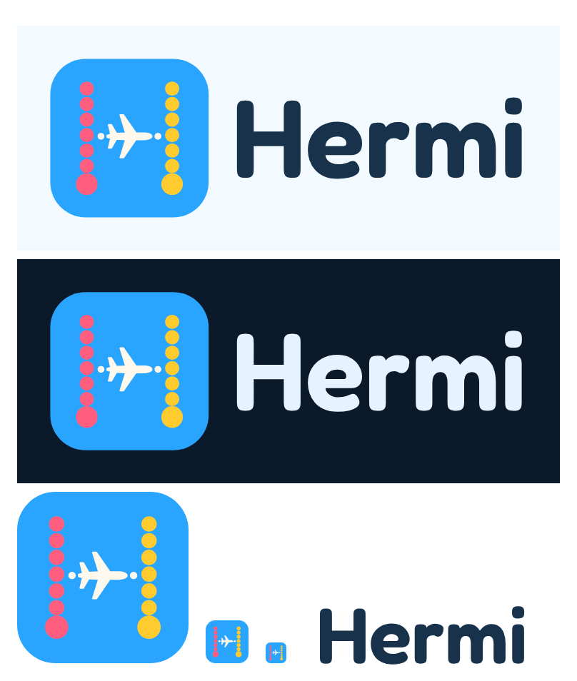

# Hermi brand

Part of the [Hermi build specification](../README.md). Written 2026-10-01. The design tokens here must
match [05-ui-ux-spec.md](../phase-1-launch/05-ui-ux-spec.md) section 2, which is the source of truth for
values; change both together.

## Name

**Hermi**: a friendly short form of Hermes, the Greek god of travelers, roads and messengers. It is
short, easy to say on first sight, and pairs with a logo that reads as travel at a glance. Chosen on
2026-10-01 from design rounds of about 40 names, because the owner and their partner wanted something
warm and clearly about travel, not a look that "seems like an accounting app".

Name checks (2026-09-30 and 2026-10-01):

- **Domain:** hermi.com has been registered since 2003 through MarkMonitor (a registrar large brands
  use) and is renewed to 2028, so treat it as unavailable. hermi.app is taken. **hermi.world** was
  unregistered and is the product domain. heyhermi.com was also unregistered; register it as a redirect,
  because people type .com by habit.
- **App Store:** an unrelated journaling app, "Hermi: Thinking Journal", already uses the name, so the
  listing name is **Hermi: Group Trip Planner** (25 characters, the keyword form the competitive analysis recommends).
- **Risks:** "Hermio - Trip manager" is a trip planner on iOS and Android, one letter away and in the
  same category. Hermès, the luxury house, defends its name actively. The logo stays clear of Hermès
  orange and brown and of any horse or carriage.

Before committing money to it:

1. Run a USPTO search in classes 9, 39 and 42, and get a trademark attorney's opinion on Hermio and
   Hermès.
2. Reserve "Hermi: Group Trip Planner" in App Store Connect.
3. Buy hermi.world (and heyhermi.com as a redirect).

Fallback names if Hermi is blocked: Twoyage, then Zigroam (both had the .com and .app unregistered and
no App Store app on 2026-09-30).

- App Store name: `Hermi: Group Trip Planner`
- App Store subtitle (30 characters max): `Plan together. Know the fare.`
- Tagline: **Plan together. Know the fare.**
- Short description: "Hermi is the trip planner for two or more: flights, stays, and days in one shared plan,
  with AI that shows its sources."

## Logo

Two dotted routes form the posts of an H, and a plane flies the crossbar between them. The pink route
is you and the yellow route is your person; the big dot at the foot of each route is where each of you
starts, and the plane joining them is the trip you take together.

| File | Use |
|---|---|
| `hermi-app-icon.svg`, `hermi-app-icon-1024.png` | iOS app icon master (full bleed, no rounded corners, no alpha: iOS applies the mask) |
| `hermi-mark.svg` | The mark on its own (rounded tile), for favicons, avatars, splash |
| `hermi-logo.svg` | Horizontal lockup on light backgrounds |
| `hermi-logo-dark.svg` | Horizontal lockup on dark backgrounds and dark mode |
| `hermi-wordmark.svg` | Wordmark only, for places where the mark is already shown |
| `hermi-logo-preview.png` | Review sheet: both lockups, the icon and small sizes |
| `generate_logo.py` | Regenerates every SVG; see "Regenerating" below |

The wordmark is Fredoka SemiBold (600) converted to outlines, so it renders the same everywhere without
the font installed.

### Geometry (1024 grid)

- Tile: full-bleed sky `#2AA5FF`. The rounded tile in `hermi-mark.svg` uses `rx` 228. The tile stays sky
  in the dark lockup and in dark mode.
- Left route, pink `#FF5E7E`: six dots of radius 46 at x 236, y 192 to 692 every 100, and a start dot of
  radius 70 at (236, 809).
- Right route, yellow `#FFCB2E`: the same dots at x 788.
- Crossbar: a cream `#FFF8EC` plane centered at (512, 500), pointing right, 300 units nose to tail (the
  100-unit plane path below, scaled 3 times and turned 90 degrees, with a 3-unit cream stroke and round
  joins), plus two cream link dots of radius 22 at (328, 500) and (696, 500).
- Plane path (100-unit box, nose up): `M50 2C54 2 57 10 57 18L57 36L96 63L96 70L57 58L56 78L75 89L75 95L54 90L52 98L48 98L46 90L25 95L25 89L44 78L43 58L4 70L4 63L43 36L43 18C43 10 46 2 50 2Z`

### Rules

- Minimum size: 24 px for the mark in the UI, 96 px wide for the lockup. Favicons at 16 and 32 px use the
  same mark; the dots merge into a pink and a yellow post, which still read as an H.
- Clear space: the diameter of a start dot (about 14% of the mark width) on every side, at least 8 px.
- Pink is always on the left, yellow always on the right, and the plane always points right.
- Do not recolor or swap the routes, add gradients or shadows, rotate the mark, or place it on photos
  without its tile.
- On dark backgrounds use `hermi-logo-dark.svg`: the tile stays sky and only the wordmark turns light.
- The earlier passport mark and the old six-petal teal, violet and rose mark in the current app are
  retired.

### Regenerating

1. `npm pack @fontsource/fredoka` in a temporary folder outside the repo, then unpack the `.tgz` there.
2. From this folder, run `uv run --with fonttools python generate_logo.py` with `FREDOKA_600` set to the
   unpacked `package/files/fredoka-latin-600-normal.woff` (the default is that path relative to the
   current folder). It writes the five SVGs next to the script, and writes the review page to
   `PREVIEW_HTML` (default: your system temp folder) and prints its path.
3. Render the PNGs with headless Edge (or any Chromium): `msedge.exe --headless=new --disable-gpu
   --hide-scrollbars --screenshot=<absolute png path> --window-size=W,H <file:/// address>`. Use
   `hermi-app-icon.svg` at 1024 by 1024 for `hermi-app-icon-1024.png`, then flatten it to RGB so it has no
   alpha channel (`uv run --with pillow`, and check `Image.open(...).mode == 'RGB'`). Use the review page
   at 808 by 954 for `hermi-logo-preview.png`.

## Colors

The brand colors, as they appear in the app tokens (`--tp-*`, see 05 section 2 for every token and the
measured contrast).

| Token | Light | Dark | Use |
|---|---|---|---|
| Paper | `#F2FAFF` | `#0B1A2A` | App background |
| Sheet | `#FFFFFF` | `#12263A` | Cards, sheets |
| Sunken | `#E3F1FC` | `#1A3149` | Inputs, wells |
| Ink | `#17324A` | `#E6F2FF` | Text |
| Ink soft | `#4A6580` | `#9DB5CC` | Secondary text |
| Rule | `#D3E4F2` | `#27405A` | Decorative borders |
| Brand | `#0B6BC0` | `#6CC4FF` | Primary actions, links, focus ring (the text-safe sky) |
| Brand soft | `#DCEFFF` | `#123A5C` | Selected states |
| Sky | `#2AA5FF` | `#0E3F66` | The logo tile, splash, web sidebar, paywall header, brand bands |
| Cream | `#FFF8EC` | `#FFF8EC` | The plane, highlights on sky |
| Route A (pink) | `#FF5E7E` | `#FF7A93` | Traveler 1: their route, avatar, "added by" highlight |
| Route B (yellow) | `#FFCB2E` | `#FFD45C` | Traveler 2 |
| Success, warning, danger | `#1d7a52`, `#a86a12`, `#b42318` | `#4cc38a`, `#e0a44a`, `#f07167` | Status only |

Sky `#2AA5FF` is a fill color, not a text color: white on it is only 2.65 to 1. Text on sky uses ink
(4.98 to 1), and actions and links use Brand. Pink and yellow are decorative fills; when they carry
meaning on their own (for example a traveler's name in their color) use the text-safe variants
`#C4264D` and `#8A5A00`.

## Type

- Display, titles, headings and airport codes: Fredoka Variable (the wordmark is Fredoka 600).
- Body and labels: Atkinson Hyperlegible Next Variable.
- Numbers, codes, fares: Atkinson Hyperlegible Mono Variable.

## Design language: two routes, one trip

- **Dotted routes.** Round dots, never dashes, connect places: on trip cards, the itinerary timeline, the
  map, loading states and empty states.
- **The plane.** The plane marks "you are here", progress and the moment of departure. It always points
  the way the route goes.
- **Traveler colors.** Each person on a trip has a color, in the order they joined: pink, yellow, then the
  rest of the traveler set in 05 section 2.2. Their avatar, their route and their "added by" highlight use
  it, so who did what is visible at a glance.
- **Sky bands.** Brand moments (splash, paywall header, the web sidebar, trip headers) sit on sky with a
  seeded route pattern.
- **Ticket stubs.** Status tags (Booked, Done, Stopped, Failed) are shaped like a boarding-pass stub.
- **Friendly, not loud.** Rounded type and pill buttons; one sky accent per screen; the routes stay
  decorative and never sit under text that needs to be read.

## Voice

Calm, specific, honest. Sentence case, plain verbs, no hype, no em dashes. Say what something
costs before the user taps it. Say where a fact came from. Say "We earn a commission if you book
here" wherever that is true.
