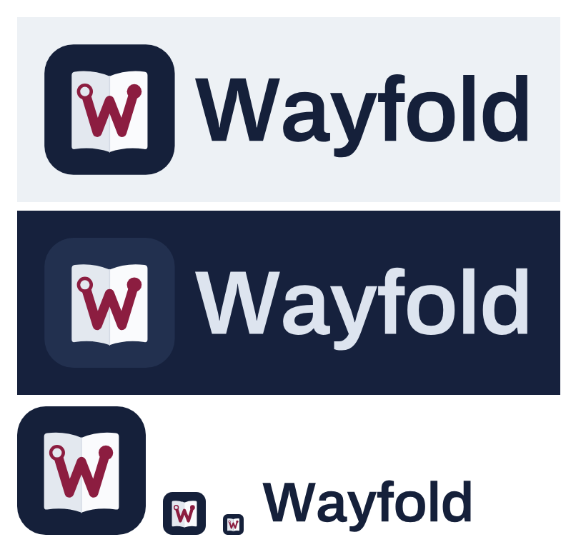

# Wayfold brand

Part of the [Wayfold build specification](../README.md). Written 2026-09-30.

## Name

**Wayfold**: "way" as in route, "fold" as in a passport booklet, a folded map, and two people's
plans folded into one. Chosen from 30 candidates because it was the only one with no travel app,
company or trademark found in web searches on 2026-09-30, and because it fits both the passport
look and the product (planning together).

Before committing money to it:

1. Run a USPTO search in classes 9, 39 and 42 (or ask a trademark attorney).
2. Reserve the name in App Store Connect.
3. Check the domains: wayfold.com was listed for sale; wayfold.app and wayfold.travel are
   alternatives.

Fallback names if Wayfold is blocked: Plotmark, then Routemark.

- App Store subtitle (30 characters max): `Plan together. Know the fare.`
- Tagline: **Plan together. Know the fare.**
- Short description: "Wayfold is the trip planner for two or more: flights, stays, and days in one shared plan,
  with AI that shows its sources."

## Logo

An open passport, with a burgundy route that folds across its spine into a "W". The hollow ring
is where you start, and the solid dot is where you are going.

| File | Use |
|---|---|
| `wayfold-app-icon.svg`, `wayfold-app-icon-1024.png` | iOS app icon master (full bleed, no rounded corners: iOS applies the mask) |
| `wayfold-mark.svg` | The mark on its own (rounded tile), for favicons, avatars, splash |
| `wayfold-logo.svg` | Horizontal lockup on light backgrounds |
| `wayfold-logo-dark.svg` | Horizontal lockup on navy or dark mode |
| `wayfold-wordmark.svg` | Wordmark only, for places where the mark is already shown |
| `generate_logo.py` | Regenerates every file; needs `fonttools` and the Archivo 600 font (`npm pack @fontsource/archivo` and point `fp` at `package/files/archivo-latin-600-normal.woff`) |

The wordmark is Archivo SemiBold (600) converted to outlines, so it renders the same everywhere
without the font installed.

### Geometry (1024 grid)

- Tile: full-bleed navy `#15203a` (dark lockup uses `#22304f` so it separates from the background).
- Pages: two curved pages meeting at a spine at x 512. The left page is `#e3e8ef` and the right page is
  `#fafbfd`. Each spans x 214 to 810 and y about 214 to 846, and its top and bottom edges curve in toward the spine.
- Spine: `#d3dae4`, 8 px, round caps.
- Route: burgundy `#8c1d40` polyline, 74 px stroke, round caps and joins, through (318,370),
  (415,690), (512,440), (609,690), (706,370). The middle peak sits on the spine.
- Origin: ring at (318,370), radius 50, 26 px burgundy stroke, filled with the left page color.
- Destination: solid burgundy dot at (706,370), radius 58.

### Rules

- Minimum size: 29 px for the mark (it still reads as a W on a page), 96 px wide for the lockup.
- Clear space: at least the diameter of the destination dot on every side.
- Do not recolor the route, add gradients, rotate the mark, or place it on photos without the tile.
- On dark backgrounds use `wayfold-logo-dark.svg`; never invert the pages.
- The old six-petal teal, violet and rose mark in the current app is retired.

## Colors

These are the existing passport tokens from `frontend/src/index.css`.

| Token | Light | Dark | Use |
|---|---|---|---|
| Paper | `#edf1f5` | `#0d1527` | App background |
| Sheet | `#fafbfd` | `#141e35` | Cards, pages |
| Sunken | `#e3e8ef` | `#1b2641` | Inputs, wells |
| Ink | `#15203a` | `#e5ebf4` | Text, logo tile |
| Ink soft | `#55607a` | `#9ba7be` | Secondary text |
| Rule | `#d3dae4` | `#26324d` | Borders |
| Brand | `#8c1d40` | `#e8678c` | Primary actions, the route |
| Brand soft | `#f4e4ea` | `#3a1b2b` | Selected states |
| Cover | `#16213d` | `#0a1121` | Passport-cover headers, splash |
| Success, warning, danger | `#1d7a52`, `#a86a12`, `#b42318` | `#4cc38a`, `#e0a44a`, `#f07167` | Status only |

## Type

- Display and headings: Archivo Variable (the wordmark is Archivo 600).
- Body: Atkinson Hyperlegible Next Variable.
- Numbers, codes, fares: Atkinson Hyperlegible Mono Variable.

## Voice

Calm, specific, honest. Sentence case, plain verbs, no hype, no em dashes. Say what something
costs before the user taps it. Say where a fact came from. Say "We earn a commission if you book
here" wherever that is true.
