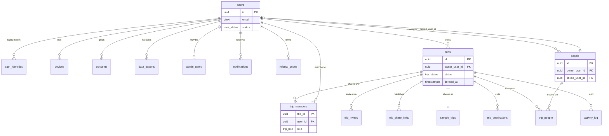
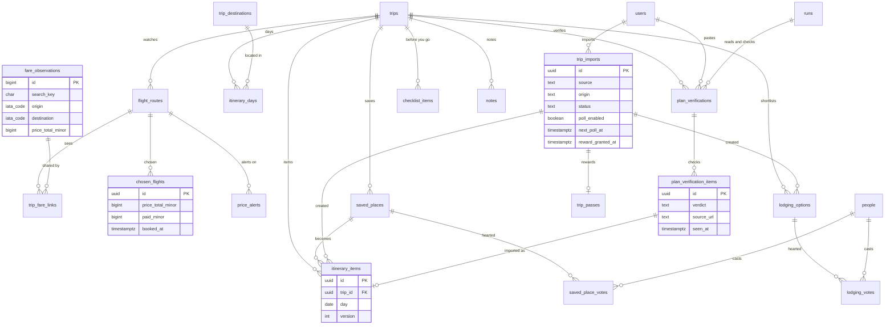
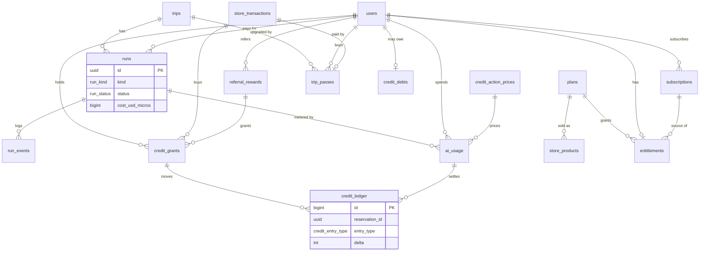
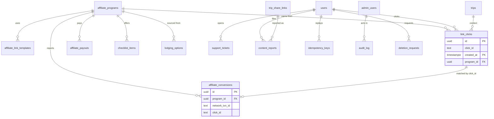

# 03. Database schema (Phase 1: launch)

Part of the [Phase 1 build specification](README.md) of [Wayfold](../README.md). The shared decisions in the [build README](../README.md) override anything here. This file is the complete, self-contained Phase 1 schema: every table, type, function, index, row-level security policy, grant, retention rule and seed row that the Phase 1 features need, and nothing that only a later phase uses. Section 14 lists what Phase 2 and Phase 3 add on top.

Target: PostgreSQL 18 (native `uuidv7()`), SQLAlchemy 2 models, Alembic migrations, Render managed Postgres with point-in-time recovery. Every `sql` block below is written to run as-is on a fresh database, top to bottom, in the order given: a table is always created before the tables that reference it. Blocks that show example queries, or statements with `:parameters`, are fenced as `postgresql` so that a runner that loads the `sql` blocks never executes them. The blocks were loaded in order into a throwaway PostgreSQL 16 cluster (with `uuidv7()` shimmed by `gen_random_uuid()`) and a short isolation smoke test ran as `wayfold_app`; the only PostgreSQL 18 dependency is the native `uuidv7()`. The blocks were loaded the same way again after the last integration pass (35 blocks, zero errors), and a short smoke test checked the functions and constraints that pass added: the import reward conditions, `set_import_polling()`, the referral caps (5 per rolling 30 days, 10 per calendar year), `bootstrap_user()` setting `email_verified_at`, and the plan verification evidence check and grants.

## 1. Scope and how to read this file

- Section 1 states what Phase 1 keeps, drops and adds. Section 2 sets the conventions every table follows. Section 3 is the shared setup (extensions, domains, helper functions).
- Section 4 is the entity-relationship overview in four diagrams. Section 5 is the complete DDL in dependency order.
- Sections 6 to 12 cover row-level security, key queries, retention, partitioning, the Alembic order, seed data and the mapping from the existing Trip Planner tables.
- Section 13 lists every table added beyond the build README list, with the reason. Section 14 is "What later phases add".
- The DDL is the source of truth for names and types. SQLAlchemy models mirror it one to one (same table, column and constraint names; the naming convention in section 2 keeps Alembic stable).
- Plan numbers (limits, prices, credits, ceilings) come from the build README and from `../../02-pricing-tiers.md`. They live in seed rows (section 11), never in code constants, so a price test needs no migration.

### 1.1 What Phase 1 keeps, drops and adds

**Dropped (Phase 2 or 3 only).** These tables from the full schema do not exist in Phase 1: `households`, `household_members`, `polls`, `poll_votes`, `expenses`, `expense_shares`, `settlements`, `payment_collections`, `room_block_requests`, `concierge_requests`, `partner_guides`, `print_orders`, `advisor_orgs`, `advisor_seats`, `advisor_clients`, and also `routines` (scheduled agent routines are Pro, Phase 2; Phase 1 agent runs are manual, and the daily live-route checks are a worker job driven by `flight_routes`, not a routine).

**Dropped columns and values.** `users.stripe_connect_account_id` and `stripe_connect_ready`; `credit_grants.household_id`, `subscriptions.household_id`, `entitlements.household_id`; `trip_passes.upgraded_from_id`; `runs.routine_id` and `runs.priority`; the enum values `household_monthly` (credit grant kind), `upgraded` (pass status), the routine and scheduled run kinds; the `consents.kind` value `concierge_sharing`; the `itinerary_items.source` value `guide`; the direct-program affiliate networks; and the plan limit keys for polls, cost splitting, room blocks, group payments, scheduled routines, priority queue, credit rollover and household size.

**Seed rows decision.** The `plans` rows for `family`, `group_trip_pass`, `pro` and `advisor_seat` are not seeded at all, not even as inactive rows. No Phase 1 logic reads them: `store_products`, `subscriptions`, `entitlements` and `trip_passes` are constrained to Phase 1 plan codes, the entitlement merge (7.1) works on whatever rows exist, and the legacy import comps the owner accounts to Plus. Phase 2 inserts them with its own migration. Likewise the direct affiliate programs (Expedia Group and Vrbo, Booking.com direct, Skyscanner, Airalo, GetYourGuide direct, AirHelp), the Travelpayouts compensation program (used only by the Phase 2 after-trip prompt), and the feature flags and kill switches of later features are not seeded.

**Changed to match the Phase 1 scope.** The Free plan invites 1 collaborator per trip (`collaborators = 1`, `can_invite = true`), as the build README says, where the full schema had 0. `store_transactions.kind` is `subscription`, `pass` or `credit_pack`. Phase 1 has no web purchases (the web paywall says "Upgrade in the iOS app"), so `store_products.store`, `store_transactions.store` and `subscriptions.store` allow only `apple`, `store_products` has no web price column, and `webhook_events.provider` has no web billing value; Phase 2 adds them together with web billing.

**Added for Phase 1.** `trip_imports` (calendar file, calendar feed, pasted booking confirmation, Google Maps export and pasted places imports, the rival entry the user came through, parsed counts, opt-in calendar feed polling columns, and the once-per-user free Trip Pass reward) with `grant_import_reward()` and `set_import_polling()`; `plan_verifications` and `plan_verification_items` ("Verify this plan" results with the evidence for each checked item, 5.20); evidence freshness columns `notes.checked_at`, `itinerary_items.check_url` and `itinerary_items.checked_at`; `users.email_verified_at` (a condition of the import reward); booked-fare columns on `chosen_flights` and the `booked_fare_drops` view for the booked-fare drop alert; `referral_codes` and `referral_rewards` with the referral functions; `saved_place_votes` (hearts on places); `notifications` (push and email outbox with de-duplication); `sample_trips` (public sample trips); `fx_convert_minor()`; `trip_passes.source`; `itinerary_items` and `lodging_options` import columns. Section 13 gives the reason for each.

## 2. Conventions

1. **Identifiers.** Every row that a client can see has `id uuid PRIMARY KEY DEFAULT uuidv7()`. UUIDv7 is time-ordered (good index locality) and not guessable. There are no sequential ids in URLs or API payloads. High-volume internal log tables (`run_events`, `provider_calls`, `ai_usage`, `credit_ledger`, `fare_observations`, `audit_log`, `activity_log`) use `bigint GENERATED ALWAYS AS IDENTITY` and are never exposed by id to clients.
2. **Timestamps.** Every timestamp is `timestamptz` and stored in UTC. Mutable tables have `created_at timestamptz NOT NULL DEFAULT now()` and `updated_at timestamptz NOT NULL DEFAULT now()`, kept current by the `set_updated_at()` trigger. Append-only tables have only `created_at`. Wall-clock values that belong to a place (an itinerary item at 19:30 in Lisbon) are `date` and `time` columns without a zone; the zone comes from the destination.
3. **Money.** Amounts of real money are `bigint` minor units plus an ISO 4217 code: `price_minor bigint`, `currency currency_code`. The exponent comes from `currency_exponent(code)` (2 for USD and EUR, 0 for JPY, 3 for KWD). Never use `numeric` or `float` for money. FX conversion is done at read time with `fx_rates` (`fx_convert_minor()`); a converted amount is never stored, because a fare or price is a display value with a timestamp, not an agreement. The amount a user actually paid is stored in the currency they paid (`chosen_flights.paid_minor`).
4. **Provider spend.** Our own cost is `bigint` micro-dollars (`_micros` suffix, 1,000,000 = $1). One credit is 20,000 micro-dollars. Never mix micro-dollars and minor units in one column.
5. **Enums.** Closed sets that the API exposes and that rarely change are Postgres enums (`CREATE TYPE`). Sets that grow with partners, providers or features use `text` with a named `CHECK` constraint, so adding a value is a cheap constraint swap instead of `ALTER TYPE`. Adding an enum value uses `ALTER TYPE ... ADD VALUE` in its own migration step (it cannot be used in the same transaction that adds it).
6. **Nullability.** Columns are `NOT NULL` unless null carries a meaning (for example `end_time`, `deleted_at`). Booleans are `NOT NULL DEFAULT false` or `true`. Empty text defaults to `''`, never null, where the UI treats empty and missing the same.
7. **Soft delete.** Only two things are soft deleted, because the product promises a recovery window: `users` (`deleted_at`, status `pending_deletion` then `deleted`, 30 day grace) and `trips` (`deleted_at`, 30 days in trash). Everything else is hard deleted. Partial indexes filter `WHERE deleted_at IS NULL` so live queries never see trash. Hard purge jobs are in section 8.
8. **Foreign keys.** Trip children use `ON DELETE CASCADE` on `trip_id`. Attribution columns (`created_by`, `updated_by`, `author_user_id`) use `ON DELETE SET NULL`, which the UI renders as "Former member". Financial records (`store_transactions`, `credit_ledger`, `ai_usage`, `subscriptions`, `affiliate_conversions`) use `SET NULL` on `user_id` so a deleted account keeps an anonymous record for the tax retention period. `trips.owner_user_id` is `RESTRICT`: the deletion job must transfer or delete a user's trips first. A record that must outlive its trip (`trip_imports`, which carries the once-per-user reward flag) uses `SET NULL` on `trip_id`. Partitioned log tables (`run_events`, `provider_calls`, `link_clicks`) carry no foreign keys to users or trips and nothing references them (a partitioned table can only be referenced together with its partition key); `run_events` keeps its cascade foreign key to `runs` and `link_clicks` references `affiliate_programs`. The deletion job scrubs them by `user_id`.
9. **Constraint and index names.** Follow the existing Trip Planner naming convention in `backend/tripplanner/models/base.py`: `pk_<table>`, `uq_<table>_<col>`, `fk_<table>_<col>_<referred>`, `ck_<table>_<name>`, `ix_<table>_<cols>`. The DDL below uses short explicit names that match.
10. **Trip consistency.** A child table that has its own `trip_id` and also points at a row that belongs to a trip (for example `lodging_votes` points at `lodging_options`) uses a composite foreign key `(parent_id, trip_id)` so a child can never point at a parent in another trip. Parents carry `UNIQUE (id, trip_id)` for this. The `trip_id` copy also makes row-level security policies cheap (section 6).
11. **Optimistic concurrency.** Rows that two people edit (`trips`, `itinerary_days`, `itinerary_items`, `flight_routes`, `lodging_options`, `checklist_items`, `notes`) carry `version integer NOT NULL DEFAULT 1`. The API updates with `WHERE id = :id AND version = :v` and returns 409 with the latest row when zero rows change. The `bump_version()` trigger increments it, and the API returns the value as the strong `ETag` and in the `version` field (04 section 1.7).
12. **JSONB.** Used for provider payloads, plan limits, flag rules and other shapes that are read whole and never joined. Anything filtered, sorted or constrained is a real column. Provider payloads (`raw`) are short-lived (section 8) because storing them long term is a terms risk.
13. **Tenancy.** The tenant is the user account; trips are shared by membership in `trip_members`. Global tables have no tenant column and are read-only to the app role.
14. **Text hygiene.** Emails are `citext`. Codes are uppercase `char(3)` or `char(2)` through the domains in section 3. Free text has length checks where the UI has a limit. No table stores passwords, passport numbers, payment card data or advertising identifiers.

## 3. Shared setup

Run first (migration `0001`). The `wayfold_owner` role owns all objects and runs migrations; the other roles are described in section 6.

```sql
CREATE EXTENSION IF NOT EXISTS citext;

-- Domains keep codes consistent across tables.
CREATE DOMAIN currency_code AS char(3) CHECK (VALUE ~ '^[A-Z]{3}$');
CREATE DOMAIN iata_code     AS char(3) CHECK (VALUE ~ '^[A-Z]{3}$');
CREATE DOMAIN country_code2 AS char(2) CHECK (VALUE ~ '^[A-Z]{2}$');
CREATE DOMAIN hex_color     AS char(7) CHECK (VALUE ~ '^#[0-9A-Fa-f]{6}$');

-- Keeps updated_at current. Attach with add_updated_at_trigger('table') in each migration.
CREATE FUNCTION set_updated_at() RETURNS trigger LANGUAGE plpgsql AS $$
BEGIN NEW.updated_at := now(); RETURN NEW; END $$;

CREATE FUNCTION add_updated_at_trigger(p_table regclass) RETURNS void LANGUAGE plpgsql AS $$
BEGIN
  EXECUTE format(
    'CREATE TRIGGER trg_updated_at BEFORE UPDATE ON %s FOR EACH ROW EXECUTE FUNCTION set_updated_at()',
    p_table);
END $$;

-- Optimistic concurrency counter.
CREATE FUNCTION bump_version() RETURNS trigger LANGUAGE plpgsql AS $$
BEGIN NEW.version := OLD.version + 1; RETURN NEW; END $$;

CREATE FUNCTION add_version_trigger(p_table regclass) RETURNS void LANGUAGE plpgsql AS $$
BEGIN
  EXECUTE format(
    'CREATE TRIGGER trg_version BEFORE UPDATE ON %s FOR EACH ROW EXECUTE FUNCTION bump_version()',
    p_table);
END $$;

-- Minor-unit exponent for ISO 4217 (2 unless listed).
CREATE FUNCTION currency_exponent(c text) RETURNS smallint LANGUAGE sql IMMUTABLE AS $$
  SELECT CASE
    WHEN c IN ('BIF','CLP','DJF','GNF','ISK','JPY','KMF','KRW','PYG','RWF','UGX','UYI','VND','VUV','XAF','XOF','XPF') THEN 0
    WHEN c IN ('BHD','IQD','JOD','KWD','LYD','OMR','TND') THEN 3
    ELSE 2 END
$$;

-- Session user for row-level security (section 6). NULL when unset, so policies fail closed.
CREATE FUNCTION app_user_id() RETURNS uuid LANGUAGE sql STABLE AS $$
  SELECT nullif(current_setting('app.user_id', true), '')::uuid
$$;
```

## 4. Entity-relationship overview

Four diagrams, split by domain. Only keys and the columns that explain a relationship are shown; the DDL in section 5 is complete. Crow's foot notation: `||--o{` is one to many.

### 4.1 Identity, trips, collaboration and people



### 4.2 Flights, itinerary, lodging, imports and checklist



### 4.3 AI, credits and billing



### 4.4 Affiliate, admin and privacy



## 5. Tables (DDL)

Grouped by domain and listed in creation order: every table is created before the tables that reference it, so the blocks run top to bottom (the migration revisions in section 10 follow the same order). Each `CREATE TABLE` is followed by its indexes. Triggers for `updated_at` and `version` are attached with the helpers from section 3.

### 5.1 Identity and devices

`users` is our account row. Supabase Auth only proves who someone is; `auth_identities` maps its subject to our `users.id`, so switching vendor is a remap of that one table.

```sql
CREATE TYPE user_status AS ENUM ('active', 'suspended', 'pending_deletion', 'deleted');

CREATE TABLE users (
  id                  uuid PRIMARY KEY DEFAULT uuidv7(),
  email               citext,                                   -- may be an Apple relay address
  email_is_relay      boolean NOT NULL DEFAULT false,
  email_verified_at   timestamptz,                              -- set at sign-in when the provider proved the address (Apple, Google or an email code); null for guests. A condition of the import reward (5.9)
  display_name        text NOT NULL DEFAULT '' CHECK (char_length(display_name) <= 80),
  locale              text NOT NULL DEFAULT 'en-US',
  timezone            text NOT NULL DEFAULT 'UTC',
  home_currency       currency_code NOT NULL DEFAULT 'USD',
  home_airports       iata_code[] NOT NULL DEFAULT '{}',
  country_code        country_code2,                            -- storefront or detected, drives "Ad" labels
  status              user_status NOT NULL DEFAULT 'active',    -- 'suspended' is an owner decision in the admin console (08 6.12); the API answers 403 account_inactive
  is_guest            boolean NOT NULL DEFAULT false,           -- server row created lazily for local-first guests; claimed on sign-up by moving the guest's trips and people to the new account (worker job), then the guest row is deleted
  hide_booking_links  boolean NOT NULL DEFAULT false,           -- Settings: "Hide booking links"
  prefs               jsonb NOT NULL DEFAULT '{}'::jsonb,       -- per-user settings (replaces app_settings per-user keys) and the paywall frequency state (07 6.5); never a place for state another user or a job must read
  last_seen_at        timestamptz,
  suspended_at        timestamptz,                              -- set with status 'suspended'
  sharing_suspended_at timestamptz,                             -- moderation: no new share links or invites (08 6.12); the account still works
  pack_purchases_blocked_until timestamptz,                     -- refund-abuse block (07 5.6); written by the billing service, the app role cannot update it
  created_at          timestamptz NOT NULL DEFAULT now(),
  updated_at          timestamptz NOT NULL DEFAULT now(),
  deleted_at          timestamptz,
  CONSTRAINT ck_users_email_or_guest CHECK (email IS NOT NULL OR is_guest),
  CONSTRAINT ck_users_deleted CHECK (status <> 'deleted' OR deleted_at IS NOT NULL),
  CONSTRAINT ck_users_suspended CHECK (status <> 'suspended' OR suspended_at IS NOT NULL)
);
CREATE UNIQUE INDEX uq_users_email ON users (email) WHERE email IS NOT NULL AND deleted_at IS NULL;
CREATE INDEX ix_users_status ON users (status) WHERE status <> 'active';
SELECT add_updated_at_trigger('users');

CREATE TABLE auth_identities (
  id                          uuid PRIMARY KEY DEFAULT uuidv7(),
  user_id                     uuid NOT NULL REFERENCES users (id) ON DELETE CASCADE,
  provider                    text NOT NULL,
  subject                     text NOT NULL,                     -- Supabase user id (JWT sub) or provider subject
  email                       citext,
  email_is_relay              boolean NOT NULL DEFAULT false,
  provider_refresh_token_enc  bytea,                             -- Apple refresh token, encrypted, for revoke on deletion
  created_at                  timestamptz NOT NULL DEFAULT now(),
  last_login_at               timestamptz,
  CONSTRAINT ck_auth_identities_provider CHECK (provider IN ('apple', 'google', 'email')),
  CONSTRAINT uq_auth_identities_provider_subject UNIQUE (provider, subject)
);
CREATE INDEX ix_auth_identities_user ON auth_identities (user_id);

CREATE TABLE devices (
  id                  uuid PRIMARY KEY DEFAULT uuidv7(),
  user_id             uuid NOT NULL REFERENCES users (id) ON DELETE CASCADE,
  platform            text NOT NULL,
  device_name         text,
  push_token          text,                                      -- APNs token; null until permission is granted
  push_environment    text,
  app_version         text,
  os_version          text,
  refresh_token_hash  bytea,                                     -- session refresh token hash, for "sign out everywhere"
  attestation_key_id  text,                                      -- App Attest key id
  last_seen_at        timestamptz NOT NULL DEFAULT now(),
  revoked_at          timestamptz,
  created_at          timestamptz NOT NULL DEFAULT now(),
  CONSTRAINT ck_devices_platform CHECK (platform IN ('ios', 'android', 'web')),
  CONSTRAINT ck_devices_push_env CHECK (push_environment IS NULL OR push_environment IN ('sandbox', 'production'))
);
CREATE UNIQUE INDEX uq_devices_push_token ON devices (platform, push_token) WHERE push_token IS NOT NULL AND revoked_at IS NULL;
CREATE INDEX ix_devices_user ON devices (user_id) WHERE revoked_at IS NULL;
```

### 5.2 Reference data

Global tables with no tenant column. The app role has `SELECT` only; the worker role writes them. They come early because later tables and views use `fx_convert_minor()`.

```sql
CREATE TABLE airports (                                          -- seeded from OurAirports (public domain)
  iata          iata_code PRIMARY KEY,
  icao          char(4),
  name          text NOT NULL,
  city          text,
  country_code  country_code2 NOT NULL,
  region_code   text,
  lat           double precision NOT NULL,
  lon           double precision NOT NULL,
  timezone      text,
  kind          text NOT NULL,
  CONSTRAINT ck_airports_kind CHECK (kind IN ('large_airport', 'medium_airport', 'small_airport'))
);
CREATE INDEX ix_airports_country ON airports (country_code);
CREATE INDEX ix_airports_city ON airports (lower(city));

CREATE TABLE fx_rates (                                          -- ECB reference rates via Frankfurter, units per 1 EUR
  currency    currency_code PRIMARY KEY,
  per_eur     numeric(20,8) NOT NULL CHECK (per_eur > 0),
  rate_date   date NOT NULL,
  fetched_at  timestamptz NOT NULL DEFAULT now()
);

CREATE TABLE places_cache (                                      -- provider API responses (Geoapify, Wikipedia, link metadata); AI research lives in shared_research_cache
  key         char(64) PRIMARY KEY,                              -- sha256 of provider, endpoint, normalized params
  provider    text NOT NULL,
  kind        text NOT NULL,
  response    jsonb NOT NULL,
  attribution text,                                              -- required attribution (OpenStreetMap, Wikipedia CC BY-SA)
  fetched_at  timestamptz NOT NULL DEFAULT now(),
  expires_at  timestamptz NOT NULL,
  hit_count   integer NOT NULL DEFAULT 0,
  CONSTRAINT ck_places_cache_provider CHECK (provider IN ('geoapify', 'wikimedia', 'viator', 'link_preview')),
  CONSTRAINT ck_places_cache_kind CHECK (kind IN ('autocomplete', 'geocode', 'places_search', 'place_detail', 'wiki_summary', 'product_search', 'link_preview'))
);
CREATE INDEX ix_places_cache_expires ON places_cache (expires_at);
CREATE INDEX ix_places_cache_provider_kind ON places_cache (provider, kind, expires_at);

-- Converts a minor-unit amount between currencies with the stored ECB rates. Returns NULL when either rate is missing,
-- so a caller never shows a made-up number. EUR is the base and has no row. Used at read time only; converted amounts are never stored.
CREATE FUNCTION fx_convert_minor(p_minor bigint, p_from text, p_to text) RETURNS bigint
LANGUAGE plpgsql STABLE AS $$
DECLARE v_from numeric; v_to numeric;
BEGIN
  IF p_from = p_to THEN RETURN p_minor; END IF;
  v_from := CASE WHEN p_from = 'EUR' THEN 1 ELSE (SELECT per_eur FROM fx_rates WHERE currency = p_from) END;
  v_to   := CASE WHEN p_to   = 'EUR' THEN 1 ELSE (SELECT per_eur FROM fx_rates WHERE currency = p_to) END;
  IF v_from IS NULL OR v_to IS NULL THEN RETURN NULL; END IF;
  RETURN round(p_minor::numeric / power(10, currency_exponent(p_from)) / v_from * v_to * power(10, currency_exponent(p_to)))::bigint;
END $$;
```

### 5.3 Plan catalog (seed-driven)

Three small catalog tables hold what the build README calls tiers and credit prices, so a price or limit test is an `UPDATE`, not a deploy. Values are in section 11. The client never decides; the API reads `entitlements` and these tables. `ai_action` is created here because `credit_action_prices` and later tables use it.

```sql
CREATE TYPE ai_action AS ENUM ('explain', 'live_search', 'draft_day', 'draft_trip', 'research', 'agent_run', 'verify_plan');   -- verify_plan is priced per checked item (11.3)

CREATE TABLE plans (
  code                 text PRIMARY KEY,                  -- Phase 1: free, plus, trip_pass, credits_50, credits_150, credits_400
  kind                 text NOT NULL,
  name                 text NOT NULL,
  rank                 smallint NOT NULL DEFAULT 0,        -- orders tiers for "best of" comparisons
  limits               jsonb NOT NULL DEFAULT '{}'::jsonb, -- numbers and booleans only (see section 11)
  monthly_credits      integer NOT NULL DEFAULT 0,         -- allowance granted each month (tiers)
  credits_granted      integer NOT NULL DEFAULT 0,         -- one-time credits (passes and packs)
  credits_valid_days   integer,                            -- expiry of those credits
  duration_days        integer,                            -- passes: 90
  feature_flag_key     text,                               -- plan is sellable only when this flag is on (no foreign key)
  is_active            boolean NOT NULL DEFAULT true,
  sort_order           smallint NOT NULL DEFAULT 0,
  created_at           timestamptz NOT NULL DEFAULT now(),
  updated_at           timestamptz NOT NULL DEFAULT now(),
  CONSTRAINT ck_plans_kind CHECK (kind IN ('tier', 'pass', 'credit_pack')),
  CONSTRAINT ck_plans_pass_duration CHECK (kind <> 'pass' OR duration_days IS NOT NULL)
);
SELECT add_updated_at_trigger('plans');

CREATE TABLE store_products (                               -- one row per purchasable SKU
  product_id        text PRIMARY KEY,                       -- App Store product id
  store             text NOT NULL,
  plan_code         text NOT NULL REFERENCES plans (code) ON DELETE RESTRICT,
  period            text NOT NULL,
  price_minor       bigint NOT NULL CHECK (price_minor >= 0),
  currency          currency_code NOT NULL DEFAULT 'USD',   -- US price; Apple regional tiers are set in App Store Connect
  trial_days        smallint NOT NULL DEFAULT 0,
  is_active         boolean NOT NULL DEFAULT true,
  created_at        timestamptz NOT NULL DEFAULT now(),
  CONSTRAINT ck_store_products_store CHECK (store = 'apple'),                 -- no web purchases in Phase 1; Phase 2 widens this with web billing
  CONSTRAINT ck_store_products_period CHECK (period IN ('month', 'year', 'once'))
);
CREATE INDEX ix_store_products_plan ON store_products (plan_code);

CREATE TABLE credit_action_prices (
  action               ai_action PRIMARY KEY,
  credits              integer NOT NULL CHECK (credits > 0),
  credits_cached       integer CHECK (credits_cached IS NULL OR credits_cached > 0),     -- price when served from shared_research_cache
  hard_stop_micros     bigint NOT NULL CHECK (hard_stop_micros > 0),                      -- enforced spend ceiling for one action
  max_turns            smallint,
  max_searches         smallint,
  max_fetches          smallint,
  model                text,
  updated_at           timestamptz NOT NULL DEFAULT now()
);
```

### 5.4 Trips and collaboration

`trips.id` is the public UUIDv7. Sharing is membership with a per-trip role. Exactly one `owner` member exists per trip and it always equals `trips.owner_user_id` (the trigger below creates it; ownership transfer is one function call in one transaction).

```sql
CREATE TYPE trip_status AS ENUM ('planning', 'booked', 'done', 'archived');
CREATE TYPE trip_role   AS ENUM ('owner', 'editor', 'viewer');

CREATE TABLE trips (
  id                uuid PRIMARY KEY DEFAULT uuidv7(),
  owner_user_id     uuid NOT NULL REFERENCES users (id) ON DELETE RESTRICT,
  name              text NOT NULL CHECK (char_length(name) BETWEEN 1 AND 120),
  start_date        date,                                 -- optional: a trip can be an idea before it has dates
  end_date          date,
  status            trip_status NOT NULL DEFAULT 'planning',
  home_currency     currency_code NOT NULL,
  notes             text NOT NULL DEFAULT '',
  cover_image_url   text,
  ai_enabled        boolean NOT NULL DEFAULT true,        -- owner can turn AI off for the trip
  show_book_slide   boolean NOT NULL DEFAULT true,        -- presentation "Book the plan" slide
  editors_can_invite boolean NOT NULL DEFAULT false,      -- owner setting: editors may invite viewers (04 5.6)
  calendar_token_hash bytea,                              -- sha256 of the calendar feed token (04 5.15); the token is shown once and rotated by POST /trips/{id}/calendar-token
  version           integer NOT NULL DEFAULT 1,
  archived_at       timestamptz,
  deleted_at        timestamptz,                          -- trash; hard purge after 30 days
  created_at        timestamptz NOT NULL DEFAULT now(),
  updated_at        timestamptz NOT NULL DEFAULT now(),
  CONSTRAINT ck_trips_valid_dates CHECK ((start_date IS NULL) = (end_date IS NULL) AND (end_date IS NULL OR end_date >= start_date))
);
CREATE INDEX ix_trips_owner_status ON trips (owner_user_id, status) WHERE deleted_at IS NULL;
CREATE INDEX ix_trips_start_date ON trips (start_date) WHERE deleted_at IS NULL AND start_date IS NOT NULL;
CREATE INDEX ix_trips_trash ON trips (deleted_at) WHERE deleted_at IS NOT NULL;
CREATE UNIQUE INDEX uq_trips_calendar_token ON trips (calendar_token_hash) WHERE calendar_token_hash IS NOT NULL;
SELECT add_version_trigger('trips');
SELECT add_updated_at_trigger('trips');

CREATE TABLE trip_members (
  trip_id     uuid NOT NULL REFERENCES trips (id) ON DELETE CASCADE,
  user_id     uuid NOT NULL REFERENCES users (id) ON DELETE CASCADE,
  role        trip_role NOT NULL,
  invited_by  uuid REFERENCES users (id) ON DELETE SET NULL,
  joined_at   timestamptz NOT NULL DEFAULT now(),
  PRIMARY KEY (trip_id, user_id)
);
CREATE UNIQUE INDEX uq_trip_members_one_owner ON trip_members (trip_id) WHERE role = 'owner';
CREATE INDEX ix_trip_members_user_trip ON trip_members (user_id, trip_id);      -- the "my trips" query and RLS helper

-- The owner is always a member.
CREATE FUNCTION trips_add_owner_member() RETURNS trigger LANGUAGE plpgsql SECURITY DEFINER SET search_path = public AS $$
BEGIN
  INSERT INTO trip_members (trip_id, user_id, role) VALUES (NEW.id, NEW.owner_user_id, 'owner');
  RETURN NEW;
END $$;
CREATE TRIGGER trg_trips_owner_member AFTER INSERT ON trips
  FOR EACH ROW EXECUTE FUNCTION trips_add_owner_member();

CREATE TABLE trip_invites (
  id            uuid PRIMARY KEY DEFAULT uuidv7(),
  trip_id       uuid NOT NULL REFERENCES trips (id) ON DELETE CASCADE,
  invited_by    uuid REFERENCES users (id) ON DELETE SET NULL,
  token_hash    bytea NOT NULL,                              -- sha256 of a random 128-bit token; the token is never stored
  role          trip_role NOT NULL DEFAULT 'editor',
  email         citext,                                      -- null for a shareable link
  max_uses      smallint NOT NULL DEFAULT 1 CHECK (max_uses BETWEEN 1 AND 50),
  use_count     smallint NOT NULL DEFAULT 0,
  expires_at    timestamptz NOT NULL DEFAULT now() + interval '7 days',
  revoked_at    timestamptz,
  accepted_by   uuid REFERENCES users (id) ON DELETE SET NULL,   -- last redeemer
  accepted_at   timestamptz,
  created_at    timestamptz NOT NULL DEFAULT now(),
  CONSTRAINT ck_trip_invites_role CHECK (role <> 'owner'),
  CONSTRAINT ck_trip_invites_uses CHECK (use_count <= max_uses),
  CONSTRAINT uq_trip_invites_token UNIQUE (token_hash)
);
CREATE INDEX ix_trip_invites_trip ON trip_invites (trip_id) WHERE revoked_at IS NULL;
CREATE INDEX ix_trip_invites_expiry ON trip_invites (expires_at);

CREATE TABLE trip_share_links (
  id                uuid PRIMARY KEY DEFAULT uuidv7(),
  trip_id           uuid NOT NULL REFERENCES trips (id) ON DELETE CASCADE,
  created_by        uuid REFERENCES users (id) ON DELETE SET NULL,
  token_hash        bytea NOT NULL,
  redact_address    boolean NOT NULL DEFAULT true,           -- hide exact lodging address
  redact_prices     boolean NOT NULL DEFAULT true,
  redact_notes      boolean NOT NULL DEFAULT true,
  redact_people     boolean NOT NULL DEFAULT true,           -- show travelers as "Traveler 1" instead of names
  expires_at        timestamptz NOT NULL DEFAULT now() + interval '90 days',   -- every share link expires (04: 1 to 365 days)
  revoked_at        timestamptz,
  view_count        integer NOT NULL DEFAULT 0,
  last_viewed_at    timestamptz,
  created_at        timestamptz NOT NULL DEFAULT now(),
  CONSTRAINT uq_trip_share_links_token UNIQUE (token_hash)
);
CREATE INDEX ix_trip_share_links_trip ON trip_share_links (trip_id) WHERE revoked_at IS NULL;

CREATE TABLE trip_destinations (
  id                  uuid PRIMARY KEY DEFAULT uuidv7(),
  trip_id             uuid NOT NULL REFERENCES trips (id) ON DELETE CASCADE,
  position            smallint NOT NULL,
  name                text NOT NULL CHECK (char_length(name) BETWEEN 1 AND 120),
  region              text,
  country             text,
  country_code        country_code2,
  kind                text,                                  -- city, region, country, poi
  lat                 double precision NOT NULL CHECK (lat BETWEEN -90 AND 90),
  lon                 double precision NOT NULL CHECK (lon BETWEEN -180 AND 180),
  timezone            text,
  bbox                double precision[],                    -- [west, south, east, north]
  geoapify_place_id   text,
  wikidata_id         text,
  summary             text,                                  -- Wikipedia extract (CC BY-SA)
  wiki_url            text,
  image_url           text,
  image_attribution   text,
  image_license       text,
  info_status         text NOT NULL DEFAULT 'pending',
  info_updated_at     timestamptz,
  created_at          timestamptz NOT NULL DEFAULT now(),
  CONSTRAINT ck_trip_destinations_info_status CHECK (info_status IN ('pending', 'ready', 'not_found', 'failed', 'skipped')),
  CONSTRAINT uq_trip_destinations_position UNIQUE (trip_id, position) DEFERRABLE INITIALLY DEFERRED
);

CREATE TABLE activity_log (                                  -- per-trip change feed
  id              bigint GENERATED ALWAYS AS IDENTITY PRIMARY KEY,
  trip_id         uuid NOT NULL REFERENCES trips (id) ON DELETE CASCADE,
  actor_user_id   uuid REFERENCES users (id) ON DELETE SET NULL,
  verb            text NOT NULL,                              -- added, updated, removed, voted, joined, ...
  entity_type     text NOT NULL,
  entity_id       uuid,
  summary         text NOT NULL DEFAULT '',
  created_at      timestamptz NOT NULL DEFAULT now()
);
CREATE INDEX ix_activity_log_trip ON activity_log (trip_id, id DESC);
```

### 5.5 People

A person is a traveler on a trip even if they never sign in (a child, a friend). `owner_user_id` is the account that manages the row; `linked_user_id` is set when the traveler is a real account. Every new user gets a "Me" person (`is_self = true`).

```sql
CREATE TABLE people (
  id               uuid PRIMARY KEY DEFAULT uuidv7(),
  owner_user_id    uuid NOT NULL REFERENCES users (id) ON DELETE CASCADE,
  linked_user_id   uuid REFERENCES users (id) ON DELETE SET NULL,
  name             text NOT NULL CHECK (char_length(name) BETWEEN 1 AND 60),
  color            hex_color NOT NULL DEFAULT '#1F2A44',
  home_airports    iata_code[] NOT NULL DEFAULT '{}',
  is_self          boolean NOT NULL DEFAULT false,          -- the auto-created "Me" person
  created_at       timestamptz NOT NULL DEFAULT now(),
  updated_at       timestamptz NOT NULL DEFAULT now()
);
CREATE UNIQUE INDEX uq_people_owner_linked ON people (owner_user_id, linked_user_id) WHERE linked_user_id IS NOT NULL;
CREATE UNIQUE INDEX uq_people_one_self ON people (owner_user_id) WHERE is_self;
CREATE INDEX ix_people_linked_user ON people (linked_user_id) WHERE linked_user_id IS NOT NULL;
SELECT add_updated_at_trigger('people');

CREATE TABLE trip_people (
  trip_id     uuid NOT NULL REFERENCES trips (id) ON DELETE CASCADE,
  person_id   uuid NOT NULL REFERENCES people (id) ON DELETE CASCADE,
  added_by    uuid REFERENCES users (id) ON DELETE SET NULL,
  created_at  timestamptz NOT NULL DEFAULT now(),
  PRIMARY KEY (trip_id, person_id)
);
CREATE INDEX ix_trip_people_person ON trip_people (person_id);
```

Rule enforced by the API: a person is linked to at most one user per trip, and a linked person's name and airports are shown only to co-members of that trip.

### 5.6 AI: runs, events, usage, provider calls and shared research

A `run` is one execution: a manual research question, a draft, a booking import, a plan verification or evidence recheck, or an agent run (fare hunt or deep research). The account that pays is `runs.user_id` (charged credits). `run_events` and `provider_calls` are high-volume logs and are partitioned by month (section 9). `ai_usage` is the billing-grade record; `runs.cost_usd_micros` is the operational copy. Phase 1 has no scheduled runs: there is no `routines` table, every run is started by a person (or by the import job on a person's behalf), and the daily live-route fare checks are worker jobs that write `fare_observations` and `provider_calls` without a run. The `ai_action` enum was created in 5.3.

```sql
CREATE TYPE run_kind     AS ENUM ('fare_hunt', 'deep_research', 'research_question', 'draft_trip', 'draft_day', 'explain',
                                  'packing_list', 'booking_import',    -- priced as 'explain'
                                  'verify_extract',                    -- reads a pasted plan into items (priced as 'explain')
                                  'verify_plan',                       -- checks the selected items, 1 credit each (action 'verify_plan')
                                  'recheck');                          -- one-tap evidence recheck (priced as 'explain'); platform work (digest, cache_warm, classifier, eval) has no run
CREATE TYPE run_trigger  AS ENUM ('manual');                          -- Phase 1 runs are always started by a person
CREATE TYPE run_status   AS ENUM ('queued', 'running', 'succeeded', 'partial', 'failed', 'timed_out', 'cancelled', 'interrupted');
CREATE TYPE usage_state  AS ENUM ('reserved', 'settled', 'released');

CREATE TABLE runs (
  id                uuid PRIMARY KEY DEFAULT uuidv7(),
  trip_id           uuid NOT NULL REFERENCES trips (id) ON DELETE CASCADE,
  user_id           uuid REFERENCES users (id) ON DELETE SET NULL,           -- who is charged
  kind              run_kind NOT NULL,
  action            ai_action,                                               -- credit action this run was priced as
  trigger           run_trigger NOT NULL DEFAULT 'manual',
  status            run_status NOT NULL DEFAULT 'queued',
  params            jsonb NOT NULL DEFAULT '{}'::jsonb,
  prompt            text,                                                    -- nulled after 30 days
  model             text,
  prompt_version    text,
  queued_at         timestamptz NOT NULL DEFAULT now(),
  started_at        timestamptz,
  finished_at       timestamptz,
  worker_id         text,
  heartbeat_at      timestamptz,                                             -- the worker stamps it every 15 seconds while running; the reaper interrupts runs silent for 2 minutes (5 in the ai lane)
  summary           text,
  report            jsonb,                                                   -- kept 12 months
  error             text,                                                    -- operator-facing detail (scrubbed of user text)
  failure_code      text,                                                    -- stable code the API returns as error_code: worker_lost, provider_error, provider_timeout, budget_stop, refused, cancelled, nothing_saved
  accepted_count    integer NOT NULL DEFAULT 0,
  rejected_count    integer NOT NULL DEFAULT 0,
  input_tokens      integer,
  output_tokens     integer,
  turns_used        smallint,
  searches_used     smallint,
  fetches_used      smallint,
  cost_usd_micros   bigint NOT NULL DEFAULT 0,
  served_from_cache boolean NOT NULL DEFAULT false,
  cache_key         char(64),                                                -- shared_research_cache.key when cached or stored
  reservation_id    uuid,                                                    -- credit_ledger.reservation_id
  cancel_requested  boolean NOT NULL DEFAULT false,
  created_at        timestamptz NOT NULL DEFAULT now(),
  CONSTRAINT ck_runs_finished CHECK (status IN ('queued', 'running') OR finished_at IS NOT NULL),
  CONSTRAINT uq_runs_id_trip UNIQUE (id, trip_id)
);
CREATE INDEX ix_runs_queue ON runs (queued_at) WHERE status = 'queued';
CREATE INDEX ix_runs_trip ON runs (trip_id, queued_at DESC);
CREATE INDEX ix_runs_user ON runs (user_id, queued_at DESC);
-- One agent run at a time per account (fare hunts and deep research); a second insert fails and the API answers 409 run_already_active.
CREATE UNIQUE INDEX uq_runs_one_active_agent ON runs (user_id)
  WHERE status IN ('queued', 'running') AND kind IN ('fare_hunt', 'deep_research') AND user_id IS NOT NULL;
CREATE INDEX ix_runs_active_user ON runs (user_id) WHERE status IN ('queued', 'running');   -- admission checks for other concurrent runs (research, drafts)
CREATE INDEX ix_runs_reaper ON runs (heartbeat_at) WHERE status = 'running';

-- Partitioned by month on ts. Primary key must include the partition key.
CREATE TABLE run_events (
  id          bigint GENERATED ALWAYS AS IDENTITY,
  run_id      uuid NOT NULL REFERENCES runs (id) ON DELETE CASCADE,
  trip_id     uuid NOT NULL,                                                 -- copy of runs.trip_id, keeps RLS cheap (no FK)
  seq         integer NOT NULL,
  ts          timestamptz NOT NULL DEFAULT now(),
  type        text NOT NULL,
  tool_name   text,
  summary     text NOT NULL,
  payload     jsonb,
  PRIMARY KEY (id, ts),
  CONSTRAINT ck_run_events_type CHECK (type IN ('info', 'warning', 'error', 'tool_use', 'tool_result', 'text', 'result', 'rejection')),
  CONSTRAINT uq_run_events_run_seq UNIQUE (run_id, seq, ts)
) PARTITION BY RANGE (ts);
CREATE INDEX ix_run_events_run ON run_events (run_id, seq);

CREATE TABLE ai_usage (
  id                  bigint GENERATED ALWAYS AS IDENTITY PRIMARY KEY,
  user_id             uuid REFERENCES users (id) ON DELETE SET NULL,
  trip_id             uuid REFERENCES trips (id) ON DELETE SET NULL,
  run_id              uuid REFERENCES runs (id) ON DELETE SET NULL,
  action              ai_action NOT NULL,
  model               text,
  input_tokens        integer NOT NULL DEFAULT 0,
  output_tokens       integer NOT NULL DEFAULT 0,
  cache_read_tokens   integer NOT NULL DEFAULT 0,
  cache_write_tokens  integer NOT NULL DEFAULT 0,
  web_searches        smallint NOT NULL DEFAULT 0,
  via_batch           boolean NOT NULL DEFAULT false,
  cost_usd_micros     bigint NOT NULL DEFAULT 0,                             -- Claude cost (tokens and web-search fees); other providers' per-call costs are in provider_calls
  credits_reserved    integer NOT NULL DEFAULT 0,
  credits_charged     integer NOT NULL DEFAULT 0,
  state               usage_state NOT NULL DEFAULT 'reserved',
  cache_hit           boolean NOT NULL DEFAULT false,                        -- served from shared_research_cache
  reservation_id      uuid,
  idempotency_key     text NOT NULL,                                         -- user actions: '{user_id}:{Idempotency-Key header}'; platform rows: 'warm:{key}', 'digest:{trip_id}:{week}', 'eval:{suite}:{case}'
  purpose             text,                                                  -- platform work with no user and no credit action (06 section 1); its rows borrow the closest action ('research' for cache_warm, 'explain' otherwise)
  created_at          timestamptz NOT NULL DEFAULT now(),
  settled_at          timestamptz,
  CONSTRAINT uq_ai_usage_idempotency UNIQUE (idempotency_key),
  CONSTRAINT ck_ai_usage_purpose CHECK (purpose IS NULL OR (purpose IN ('digest', 'cache_warm', 'classifier', 'eval') AND user_id IS NULL)),
  CONSTRAINT ck_ai_usage_charged CHECK (credits_charged <= credits_reserved),
  CONSTRAINT ck_ai_usage_settled CHECK (state = 'reserved' OR settled_at IS NOT NULL)
);
CREATE INDEX ix_ai_usage_user_time ON ai_usage (user_id, created_at DESC);      -- daily and monthly ceiling sums
CREATE INDEX ix_ai_usage_stale ON ai_usage (created_at) WHERE state = 'reserved';
CREATE INDEX ix_ai_usage_run ON ai_usage (run_id) WHERE run_id IS NOT NULL;

-- Partitioned by month on created_at. Not referenced by any foreign key.
CREATE TABLE provider_calls (
  id               bigint GENERATED ALWAYS AS IDENTITY,
  provider         text NOT NULL,                                            -- anthropic, serpapi, travelpayouts, geoapify, wikimedia, viator, stay22, frankfurter, resend, apns
  endpoint         text NOT NULL,
  user_id          uuid,                                                     -- no foreign keys: this is a log
  trip_id          uuid,
  run_id           uuid,
  units            numeric(12,3) NOT NULL DEFAULT 1,
  cost_usd_micros  bigint,                                                   -- our cost for the call; null if free, unknown, or provider = 'anthropic' (that cost lives in ai_usage)
  cached           boolean NOT NULL DEFAULT false,
  cache_layer      text,
  ok               boolean NOT NULL,
  status_code      smallint,
  latency_ms       integer,
  request_hash     char(64),                                                 -- the cache key, for dedup analytics
  created_at       timestamptz NOT NULL DEFAULT now(),
  PRIMARY KEY (id, created_at),
  CONSTRAINT ck_provider_calls_cache_layer CHECK (cache_layer IS NULL OR cache_layer IN ('db', 'memory', 'provider'))
) PARTITION BY RANGE (created_at);
CREATE INDEX ix_provider_calls_provider_time ON provider_calls (provider, created_at);
CREATE INDEX ix_provider_calls_user_time ON provider_calls (user_id, provider, created_at) WHERE user_id IS NOT NULL;

-- Monthly rollup kept after the raw provider_calls partitions are dropped (cost analytics and the cache hit rate per provider; section 9).
CREATE TABLE provider_call_rollups (
  month         date NOT NULL,
  provider      text NOT NULL,
  endpoint      text NOT NULL,
  calls         bigint NOT NULL,
  cached_calls  bigint NOT NULL,
  failed_calls  bigint NOT NULL,
  units         numeric(14,3) NOT NULL,
  cost_usd_micros bigint NOT NULL DEFAULT 0,
  PRIMARY KEY (month, provider, endpoint)
);

CREATE TABLE shared_research_cache (                         -- derived research shared across users; public-input facts only
  key             char(64) PRIMARY KEY,                       -- sha256 of kind, normalized destination, month, prompt_version, model
  kind            text NOT NULL,
  provider        text NOT NULL,
  params          jsonb NOT NULL,                             -- normalized input, for debugging and invalidation
  response        jsonb NOT NULL,
  sources         jsonb NOT NULL DEFAULT '[]'::jsonb,         -- source URLs the facts came from
  response_bytes  integer NOT NULL DEFAULT 0,
  model           text,
  prompt_version  text,
  fetched_at      timestamptz NOT NULL DEFAULT now(),
  expires_at      timestamptz NOT NULL,
  stale_until     timestamptz NOT NULL,                       -- stale-while-revalidate window
  hit_count       integer NOT NULL DEFAULT 0,
  last_hit_at     timestamptz,
  run_id          uuid REFERENCES runs (id) ON DELETE SET NULL,  -- the run that created the entry
  cost_usd_micros bigint NOT NULL DEFAULT 0,                  -- what creating it cost (the first requester's run)
  report_count    smallint NOT NULL DEFAULT 0,                -- distinct reporters (content_reports); three set flagged_at
  flagged_at      timestamptz,                                -- never served and never overwritten until an admin clears it; the key then runs uncached at the normal price
  CONSTRAINT ck_shared_research_cache_kind CHECK (kind IN ('ai_research', 'destination_brief', 'visa_summary', 'neighborhoods', 'rentals', 'agent_result', 'place_check')),
  CONSTRAINT ck_shared_research_cache_window CHECK (stale_until >= expires_at)
);
CREATE INDEX ix_shared_research_cache_kind_exp ON shared_research_cache (kind, expires_at);
CREATE INDEX ix_shared_research_cache_purge ON shared_research_cache (stale_until) WHERE flagged_at IS NULL;
```

Rules for `shared_research_cache`: the key is built only from normalized public inputs (destination, month, prompt version, model), never from user text, and entries are never derived from private notes or trip data. A hit costs the user 1 credit instead of 8 (research) or 8 instead of 40 (agent run). The refresh lease that keeps 50 simultaneous requests to one model run is a session-level `pg_try_advisory_lock(hashtextextended(key, 0))`, so it needs no column and dies with the worker. A "Report a problem" sets `expires_at` and `stale_until` to now (the entry is no longer served and is purged); the third report from a different user also sets `flagged_at`, which pauses that key (no serve, no rewrite, no purge) until an admin reviews it. `kind` is the storage class (`destination_brief` for briefs, `ai_research` for the other research topics, `agent_result` for fare hunts and deep research, `place_check` for the public facts found about one place when a plan is verified: hours, ticket price and source, kept 14 days); the topic (`destination_brief`, `events_and_closures`, `reservations_needed`, `getting_around`, `seasonal_notes`, `fare_hunt`) is `params ->> 'topic'`.

### 5.7 Billing: subscriptions, entitlements, passes, transactions, webhooks

Apple is the source of truth for purchases; RevenueCat webhooks (over StoreKit 2) feed these tables, which are a read model. The backend reads `entitlements` and `trip_passes` only and never calls Apple on a request. Phase 1 sells Plus (monthly and annual), the Trip Pass and three credit packs; the `store` and `kind` checks below list only what Phase 1 uses (Phase 2 adds `google`, web billing and the Family and Group Trip Pass values; Phase 3 adds the Stripe-only kinds).

```sql
CREATE TYPE subscription_status AS ENUM ('active', 'in_trial', 'in_grace', 'billing_retry', 'paused', 'expired', 'refunded', 'revoked');
CREATE TYPE pass_status         AS ENUM ('active', 'expired', 'refunded');
CREATE TYPE store_environment   AS ENUM ('sandbox', 'production');

CREATE TABLE store_transactions (                            -- every money event from a store; kept for tax retention
  id                        uuid PRIMARY KEY DEFAULT uuidv7(),
  user_id                   uuid REFERENCES users (id) ON DELETE SET NULL,
  store                     text NOT NULL,
  store_transaction_id      text NOT NULL,
  original_transaction_id   text,
  product_id                text REFERENCES store_products (product_id) ON DELETE RESTRICT,
  plan_code                 text REFERENCES plans (code) ON DELETE RESTRICT,
  kind                      text NOT NULL,
  status                    text NOT NULL DEFAULT 'purchased',
  trip_id                   uuid,                                                  -- pass purchases; no FK so a deleted trip keeps the record
  amount_minor              bigint,
  currency                  currency_code,
  net_minor                 bigint,                                                -- after store fee, when known
  purchased_at              timestamptz NOT NULL,
  expires_at                timestamptz,
  refunded_at               timestamptz,
  environment               store_environment NOT NULL DEFAULT 'production',
  raw                       jsonb,                                                 -- kept 12 months, then nulled
  created_at                timestamptz NOT NULL DEFAULT now(),
  CONSTRAINT ck_store_transactions_store CHECK (store = 'apple'),
  CONSTRAINT ck_store_transactions_kind CHECK (kind IN ('subscription', 'pass', 'credit_pack')),
  CONSTRAINT ck_store_transactions_status CHECK (status IN ('purchased', 'renewed', 'refunded', 'revoked', 'failed')),
  CONSTRAINT uq_store_transactions_txn UNIQUE (store, store_transaction_id)
);
CREATE INDEX ix_store_transactions_user ON store_transactions (user_id, purchased_at DESC);
CREATE INDEX ix_store_transactions_original ON store_transactions (store, original_transaction_id);

CREATE TABLE subscriptions (
  id                        uuid PRIMARY KEY DEFAULT uuidv7(),
  user_id                   uuid REFERENCES users (id) ON DELETE SET NULL,
  store                     text NOT NULL,
  original_transaction_id   text NOT NULL,
  product_id                text REFERENCES store_products (product_id) ON DELETE RESTRICT,
  plan_code                 text NOT NULL REFERENCES plans (code) ON DELETE RESTRICT,
  status                    subscription_status NOT NULL,
  period_start              timestamptz,
  period_end                timestamptz,
  auto_renew                boolean NOT NULL DEFAULT true,
  is_trial                  boolean NOT NULL DEFAULT false,
  environment               store_environment NOT NULL DEFAULT 'production',
  revenuecat_app_user_id    text,
  last_event_at             timestamptz,
  raw_last_event            jsonb,
  created_at                timestamptz NOT NULL DEFAULT now(),
  updated_at                timestamptz NOT NULL DEFAULT now(),
  CONSTRAINT ck_subscriptions_store CHECK (store = 'apple'),
  CONSTRAINT uq_subscriptions_original UNIQUE (store, original_transaction_id)
);
CREATE INDEX ix_subscriptions_user ON subscriptions (user_id) WHERE status IN ('active', 'in_trial', 'in_grace', 'billing_retry');
CREATE INDEX ix_subscriptions_period_end ON subscriptions (period_end) WHERE status IN ('active', 'in_trial', 'in_grace', 'billing_retry');
SELECT add_updated_at_trigger('subscriptions');

CREATE TABLE entitlements (                                   -- materialized per user; rebuilt by the billing service on every event
  user_id                  uuid PRIMARY KEY REFERENCES users (id) ON DELETE CASCADE,
  tier_code                text NOT NULL DEFAULT 'free' REFERENCES plans (code) ON DELETE RESTRICT,
  source                   text NOT NULL DEFAULT 'none',                           -- none (Free), subscription (Plus from the store), comp (granted in the admin console)
  subscription_id          uuid REFERENCES subscriptions (id) ON DELETE SET NULL,
  in_grace                 boolean NOT NULL DEFAULT false,
  valid_until              timestamptz,                                            -- null for free
  limits                   jsonb NOT NULL DEFAULT '{}'::jsonb,                     -- snapshot of plans.limits at compute time
  computed_at              timestamptz NOT NULL DEFAULT now(),
  updated_at               timestamptz NOT NULL DEFAULT now(),
  CONSTRAINT ck_entitlements_source CHECK (source IN ('none', 'subscription', 'comp'))
);
CREATE INDEX ix_entitlements_valid_until ON entitlements (valid_until) WHERE valid_until IS NOT NULL;   -- nightly reconcile
SELECT add_updated_at_trigger('entitlements');

-- The billing service fills the *_max columns and credits_granted from plans.limits of the purchased plan (the defaults below are the Trip Pass values).
-- A pass is also created without a purchase: the first-import reward (source = 'import_reward', grant_import_reward() in 5.9) and admin comps (source = 'admin').
CREATE TABLE trip_passes (                                    -- non-renewing, bound to one trip on the server
  id                        uuid PRIMARY KEY DEFAULT uuidv7(),
  trip_id                   uuid NOT NULL REFERENCES trips (id) ON DELETE CASCADE,
  purchaser_user_id         uuid REFERENCES users (id) ON DELETE SET NULL,
  plan_code                 text NOT NULL REFERENCES plans (code) ON DELETE RESTRICT,   -- trip_pass in Phase 1
  source                    text NOT NULL DEFAULT 'purchase',                            -- purchase (RevenueCat), import_reward (first import, once per user), admin
  store_transaction_id      uuid REFERENCES store_transactions (id) ON DELETE SET NULL,
  original_transaction_id   text,
  starts_at                 timestamptz NOT NULL DEFAULT now(),
  expires_at                timestamptz NOT NULL,                                        -- starts_at plus 90 days
  live_routes_max           smallint NOT NULL DEFAULT 2,
  live_checks_max           smallint NOT NULL DEFAULT 60,
  live_checks_used          smallint NOT NULL DEFAULT 0,
  collaborators_max         smallint NOT NULL DEFAULT 6,
  travelers_max             smallint NOT NULL DEFAULT 8,
  credits_granted           integer NOT NULL DEFAULT 40,
  status                    pass_status NOT NULL DEFAULT 'active',
  move_count                smallint NOT NULL DEFAULT 0,                                 -- a pass can move to another trip at most once
  created_at                timestamptz NOT NULL DEFAULT now(),
  updated_at                timestamptz NOT NULL DEFAULT now(),
  CONSTRAINT ck_trip_passes_window CHECK (expires_at > starts_at),
  CONSTRAINT ck_trip_passes_checks CHECK (live_checks_used BETWEEN 0 AND live_checks_max),
  CONSTRAINT ck_trip_passes_moves CHECK (move_count BETWEEN 0 AND 1),
  CONSTRAINT ck_trip_passes_plan CHECK (plan_code = 'trip_pass'),
  CONSTRAINT ck_trip_passes_source CHECK (source IN ('purchase', 'import_reward', 'admin')),
  CONSTRAINT uq_trip_passes_original UNIQUE (original_transaction_id)
);
CREATE UNIQUE INDEX uq_trip_passes_one_active ON trip_passes (trip_id) WHERE status = 'active';
CREATE INDEX ix_trip_passes_purchaser ON trip_passes (purchaser_user_id);
CREATE INDEX ix_trip_passes_expiry ON trip_passes (expires_at) WHERE status = 'active';
SELECT add_updated_at_trigger('trip_passes');

CREATE TABLE webhook_events (                                 -- idempotency: insert first, skip on conflict
  provider       text NOT NULL,
  event_id       text NOT NULL,
  event_type     text NOT NULL,
  status         text NOT NULL DEFAULT 'received',
  attempts       smallint NOT NULL DEFAULT 0,
  error          text,
  payload        jsonb NOT NULL,
  received_at    timestamptz NOT NULL DEFAULT now(),
  processed_at   timestamptz,
  PRIMARY KEY (provider, event_id),
  CONSTRAINT ck_webhook_events_provider CHECK (provider IN ('revenuecat', 'apple', 'travelpayouts', 'viator', 'stay22')),
  CONSTRAINT ck_webhook_events_status CHECK (status IN ('received', 'processed', 'failed', 'ignored'))
);
CREATE INDEX ix_webhook_events_pending ON webhook_events (received_at) WHERE status IN ('received', 'failed');
CREATE INDEX ix_webhook_events_received ON webhook_events (received_at);
```

### 5.8 Credits

One credit is a budget of up to $0.02 of provider spend (20,000 micro-dollars). `credit_grants` holds spendable balances (and is the only mutable part); `credit_ledger` is an append-only record of every movement, with reserve, settle and refund entries. Spend order: monthly allowance first, then promo (taster and referral credits), then Trip Pass credits for that trip, then purchased packs (oldest expiry first inside a class). Monthly allowances never roll over. Purchased credits last 12 months.

```sql
CREATE TYPE credit_grant_kind AS ENUM ('monthly', 'promo', 'trip_pass', 'purchase', 'adjustment');
CREATE TYPE credit_entry_type AS ENUM ('grant', 'reserve', 'settle', 'refund', 'expire', 'clawback', 'adjust');

CREATE TABLE credit_grants (
  id                    uuid PRIMARY KEY DEFAULT uuidv7(),
  user_id               uuid REFERENCES users (id) ON DELETE SET NULL,
  kind                  credit_grant_kind NOT NULL,
  credits               integer NOT NULL CHECK (credits > 0),                  -- amount granted
  remaining             integer NOT NULL CHECK (remaining >= 0),               -- spendable now (reserved credits are already subtracted)
  trip_id               uuid REFERENCES trips (id) ON DELETE CASCADE,          -- trip_pass grants spend only on this trip
  restricted_action     ai_action,                                             -- e.g. the free taster is agent_run only
  period_key            text,                                                  -- '2026-10' for monthly grants; makes the monthly job idempotent
  expires_at            timestamptz,
  store_transaction_id  uuid REFERENCES store_transactions (id) ON DELETE SET NULL,
  created_at            timestamptz NOT NULL DEFAULT now(),
  CONSTRAINT ck_credit_grants_remaining CHECK (remaining <= credits),
  CONSTRAINT ck_credit_grants_trip_pass CHECK (kind <> 'trip_pass' OR trip_id IS NOT NULL)
);
CREATE UNIQUE INDEX uq_credit_grants_user_period ON credit_grants (user_id, kind, period_key) WHERE user_id IS NOT NULL AND period_key IS NOT NULL;
CREATE UNIQUE INDEX uq_credit_grants_txn ON credit_grants (store_transaction_id) WHERE store_transaction_id IS NOT NULL;
CREATE INDEX ix_credit_grants_user_spend ON credit_grants (user_id, expires_at) WHERE remaining > 0;
CREATE INDEX ix_credit_grants_expiry ON credit_grants (expires_at) WHERE remaining > 0 AND expires_at IS NOT NULL;

CREATE TABLE credit_ledger (
  id                bigint GENERATED ALWAYS AS IDENTITY PRIMARY KEY,
  user_id           uuid REFERENCES users (id) ON DELETE SET NULL,            -- the acting account
  grant_id          uuid REFERENCES credit_grants (id) ON DELETE SET NULL,
  entry_type        credit_entry_type NOT NULL,
  delta             integer NOT NULL,                                          -- grant +, reserve -, refund +, expire -, clawback -, settle 0
  charged           integer,                                                   -- settle entries: final credits charged
  reservation_id    uuid,                                                      -- groups one action's reserve, refund and settle entries
  action            ai_action,
  run_id            uuid,
  trip_id           uuid,
  usage_id          bigint REFERENCES ai_usage (id) ON DELETE SET NULL,
  idempotency_key   text,
  note              text,
  created_at        timestamptz NOT NULL DEFAULT now(),
  CONSTRAINT ck_credit_ledger_sign CHECK (
    (entry_type IN ('grant', 'refund') AND delta > 0) OR
    (entry_type IN ('reserve', 'expire', 'clawback') AND delta < 0) OR
    (entry_type = 'settle' AND delta = 0 AND charged IS NOT NULL) OR
    (entry_type = 'adjust')),
  CONSTRAINT ck_credit_ledger_reservation CHECK (entry_type NOT IN ('reserve', 'settle') OR reservation_id IS NOT NULL)
);
-- One reserve row per grant per idempotency key: a replayed request cannot reserve twice.
CREATE UNIQUE INDEX uq_credit_ledger_idem ON credit_ledger (idempotency_key, entry_type, grant_id) WHERE idempotency_key IS NOT NULL;
-- Rows with no grant (a refund shortfall, see credit_debts) are not covered by the index above, because NULLs never collide.
CREATE UNIQUE INDEX uq_credit_ledger_idem_nogrant ON credit_ledger (idempotency_key, entry_type) WHERE idempotency_key IS NOT NULL AND grant_id IS NULL;
CREATE INDEX ix_credit_ledger_user ON credit_ledger (user_id, created_at DESC);
CREATE INDEX ix_credit_ledger_reservation ON credit_ledger (reservation_id) WHERE reservation_id IS NOT NULL;
CREATE INDEX ix_credit_ledger_open ON credit_ledger (created_at) WHERE entry_type = 'reserve';

-- Credits already spent when a pack refund arrived (07 5.6). credit_grants.remaining never goes below 0, so the shortfall lives here:
-- reserve_credits refuses while amount > 0, and settle_credit_debt() pays it down from the next grants. Written by the billing service and the functions below only.
CREATE TABLE credit_debts (
  user_id     uuid PRIMARY KEY REFERENCES users (id) ON DELETE CASCADE,
  amount      integer NOT NULL CHECK (amount >= 0),
  updated_at  timestamptz NOT NULL DEFAULT now()
);

-- Spendable balance per user and, for pass credits, per trip. RLS applies to the caller.
CREATE VIEW credit_balances WITH (security_invoker = true) AS
SELECT user_id,
       trip_id,
       sum(remaining)::integer AS remaining,
       (sum(remaining) FILTER (WHERE kind = 'monthly'))::integer AS allowance_remaining,
       (sum(remaining) FILTER (WHERE kind = 'purchase'))::integer AS purchased_remaining,
       min(expires_at) FILTER (WHERE remaining > 0) AS next_expiry
  FROM credit_grants
 WHERE remaining > 0 AND (expires_at IS NULL OR expires_at > now())
 GROUP BY user_id, trip_id;

-- Reserve the full price of an action atomically. Raises WF402 (insufficient credits) and changes nothing.
-- Safe to replay with the same p_idem: returns the original reservation id.
CREATE FUNCTION reserve_credits(
  p_user uuid, p_trip uuid, p_amount integer, p_action ai_action, p_run uuid, p_idem text
) RETURNS uuid LANGUAGE plpgsql AS $$
DECLARE
  v_res uuid; v_need integer := p_amount; v_take integer; g record;
BEGIN
  IF p_amount <= 0 THEN RAISE EXCEPTION 'amount must be positive'; END IF;
  SELECT reservation_id INTO v_res FROM credit_ledger
   WHERE idempotency_key = p_idem AND entry_type = 'reserve' LIMIT 1;
  IF FOUND THEN RETURN v_res; END IF;
  IF EXISTS (SELECT 1 FROM credit_debts WHERE user_id = p_user AND amount > 0) THEN
    RAISE EXCEPTION 'credit_debt' USING ERRCODE = 'WF402';           -- same SQLSTATE as a short balance; the message tells the API to show the refund notice (CreditBalance.blocked)
  END IF;

  v_res := uuidv7();

  FOR g IN
    SELECT id, remaining FROM credit_grants
     WHERE remaining > 0
       AND (expires_at IS NULL OR expires_at > now())
       AND user_id = p_user
       AND (trip_id IS NULL OR trip_id = p_trip)
       AND (restricted_action IS NULL OR restricted_action = p_action)
     ORDER BY CASE kind WHEN 'monthly' THEN 10 WHEN 'promo' THEN 20
                        WHEN 'trip_pass' THEN 30 WHEN 'adjustment' THEN 35 ELSE 40 END,
              expires_at NULLS LAST, id
       FOR UPDATE
  LOOP
    EXIT WHEN v_need = 0;
    v_take := LEAST(g.remaining, v_need);
    UPDATE credit_grants SET remaining = remaining - v_take WHERE id = g.id;
    INSERT INTO credit_ledger (user_id, grant_id, entry_type, delta, reservation_id, action, run_id, trip_id, idempotency_key)
    VALUES (p_user, g.id, 'reserve', -v_take, v_res, p_action, p_run, p_trip, p_idem);
    v_need := v_need - v_take;
  END LOOP;

  IF v_need > 0 THEN
    RAISE EXCEPTION 'insufficient_credits' USING ERRCODE = 'WF402';   -- rolls back the partial reserve
  END IF;
  RETURN v_res;
END $$;

-- Settle a reservation: charge p_charged credits and return the rest to the grants it came from
-- (purchased credits first, so allowance credits are not refunded ahead of them). p_charged = 0 releases it.
CREATE FUNCTION settle_credits(p_reservation uuid, p_charged integer, p_usage_id bigint DEFAULT NULL)
RETURNS integer LANGUAGE plpgsql AS $$
DECLARE
  v_user uuid; v_action ai_action; v_run uuid; v_trip uuid;
  v_reserved integer; v_charge integer; v_refund integer; v_back integer; r record;
BEGIN
  PERFORM pg_advisory_xact_lock(hashtextextended(p_reservation::text, 0));
  IF EXISTS (SELECT 1 FROM credit_ledger WHERE reservation_id = p_reservation AND entry_type = 'settle') THEN
    RETURN 0;                                                        -- already settled
  END IF;
  SELECT (array_agg(user_id))[1], (array_agg(action))[1], (array_agg(run_id))[1], (array_agg(trip_id))[1], sum(-delta)::integer
    INTO v_user, v_action, v_run, v_trip, v_reserved
    FROM credit_ledger WHERE reservation_id = p_reservation AND entry_type = 'reserve';
  IF v_reserved IS NULL THEN RAISE EXCEPTION 'unknown_reservation'; END IF;

  v_charge := LEAST(GREATEST(p_charged, 0), v_reserved);
  v_refund := v_reserved - v_charge;
  FOR r IN SELECT grant_id, -delta AS taken FROM credit_ledger
            WHERE reservation_id = p_reservation AND entry_type = 'reserve' ORDER BY id DESC
  LOOP
    EXIT WHEN v_refund = 0;
    v_back := LEAST(r.taken, v_refund);
    IF r.grant_id IS NOT NULL THEN
      UPDATE credit_grants SET remaining = remaining + v_back WHERE id = r.grant_id;
    END IF;
    INSERT INTO credit_ledger (user_id, grant_id, entry_type, delta, reservation_id, action, run_id, trip_id, usage_id)
    VALUES (v_user, r.grant_id, 'refund', v_back, p_reservation, v_action, v_run, v_trip, p_usage_id);
    v_refund := v_refund - v_back;
  END LOOP;

  INSERT INTO credit_ledger (user_id, entry_type, delta, charged, reservation_id, action, run_id, trip_id, usage_id)
  VALUES (v_user, 'settle', 0, v_charge, p_reservation, v_action, v_run, v_trip, p_usage_id);

  IF p_usage_id IS NOT NULL THEN
    UPDATE ai_usage
       SET state = CASE WHEN v_charge = 0 THEN 'released'::usage_state ELSE 'settled'::usage_state END,
           credits_charged = v_charge, settled_at = now()
     WHERE id = p_usage_id;
  END IF;
  RETURN v_reserved - v_charge;
END $$;

-- Sweeper (run every minute): release reservations older than the run cap (agent runs stop at 20 turns and $0.80).
CREATE FUNCTION release_stale_reservations(p_older interval DEFAULT interval '30 minutes') RETURNS integer LANGUAGE plpgsql AS $$
DECLARE r record; n integer := 0;
BEGIN
  FOR r IN SELECT DISTINCT l.reservation_id FROM credit_ledger l
            WHERE l.entry_type = 'reserve' AND l.created_at < now() - p_older
              AND NOT EXISTS (SELECT 1 FROM credit_ledger s WHERE s.reservation_id = l.reservation_id AND s.entry_type = 'settle')
  LOOP
    PERFORM settle_credits(r.reservation_id, 0);
    n := n + 1;
  END LOOP;
  RETURN n;
END $$;

-- Expire grants past expires_at (run hourly). Reserved credits are already out of remaining, so they are untouched.
CREATE FUNCTION expire_credit_grants() RETURNS integer LANGUAGE sql AS $$
  WITH due AS (
    SELECT id, user_id, remaining FROM credit_grants
     WHERE remaining > 0 AND expires_at IS NOT NULL AND expires_at <= now() FOR UPDATE),
  z AS (UPDATE credit_grants g SET remaining = 0 FROM due WHERE g.id = due.id RETURNING g.id),
  l AS (INSERT INTO credit_ledger (user_id, grant_id, entry_type, delta, note)
        SELECT due.user_id, due.id, 'expire', -due.remaining, 'expired' FROM due JOIN z ON z.id = due.id RETURNING 1)
  SELECT count(*)::integer FROM l
$$;

-- A pack refund found fewer unspent credits than the pack held: claw back what remains (done by the billing service on the grant),
-- then record the rest as debt. p_idem is 'refund:{store_transaction_id}', so a replayed webhook records it once.
CREATE FUNCTION record_credit_debt(p_user uuid, p_credits integer, p_idem text) RETURNS void LANGUAGE plpgsql AS $$
DECLARE v_id bigint;
BEGIN
  IF p_credits <= 0 THEN RETURN; END IF;
  INSERT INTO credit_ledger (user_id, entry_type, delta, idempotency_key, note)
  VALUES (p_user, 'clawback', -p_credits, p_idem, 'refund shortfall')
  ON CONFLICT (idempotency_key, entry_type) WHERE idempotency_key IS NOT NULL AND grant_id IS NULL DO NOTHING
  RETURNING id INTO v_id;
  IF v_id IS NULL THEN RETURN; END IF;                                  -- replay
  INSERT INTO credit_debts (user_id, amount) VALUES (p_user, p_credits)
  ON CONFLICT (user_id) DO UPDATE SET amount = credit_debts.amount + EXCLUDED.amount, updated_at = now();
END $$;

-- Pay the debt down from the user's own spendable grants, oldest expiry first. The billing service calls it after every grant or pack purchase.
-- Returns the credits repaid.
CREATE FUNCTION settle_credit_debt(p_user uuid) RETURNS integer LANGUAGE plpgsql AS $$
DECLARE v_debt integer; v_take integer; v_paid integer := 0; g record;
BEGIN
  SELECT amount INTO v_debt FROM credit_debts WHERE user_id = p_user FOR UPDATE;
  IF NOT FOUND OR v_debt = 0 THEN RETURN 0; END IF;
  FOR g IN SELECT id, remaining FROM credit_grants
            WHERE user_id = p_user AND remaining > 0 AND (expires_at IS NULL OR expires_at > now())
            ORDER BY expires_at NULLS LAST, id FOR UPDATE
  LOOP
    EXIT WHEN v_debt = 0;
    v_take := LEAST(g.remaining, v_debt);
    UPDATE credit_grants SET remaining = remaining - v_take WHERE id = g.id;
    INSERT INTO credit_ledger (user_id, grant_id, entry_type, delta, note)
    VALUES (p_user, g.id, 'clawback', -v_take, 'debt repayment');
    v_debt := v_debt - v_take;
    v_paid := v_paid + v_take;
  END LOOP;
  UPDATE credit_debts SET amount = v_debt, updated_at = now() WHERE user_id = p_user;
  RETURN v_paid;
END $$;

-- Free allowance, written lazily on the first credit use in a calendar month so idle accounts cost no writes (06 6.3, 07 5.1).
-- The API calls it before every admission; accounts on a paid entitlement get theirs from the billing service instead.
CREATE FUNCTION ensure_free_monthly_grant(p_user uuid) RETURNS void LANGUAGE sql AS $$
  INSERT INTO credit_grants (user_id, kind, credits, remaining, period_key, expires_at)
  SELECT p_user, 'monthly', p.monthly_credits, p.monthly_credits,
         to_char(now() AT TIME ZONE 'UTC', 'YYYY-MM'),
         (date_trunc('month', now() AT TIME ZONE 'UTC') + interval '1 month') AT TIME ZONE 'UTC'
    FROM plans p
   WHERE p.code = 'free' AND p.monthly_credits > 0
     AND NOT EXISTS (SELECT 1 FROM entitlements e
                      WHERE e.user_id = p_user AND e.tier_code <> 'free' AND (e.valid_until IS NULL OR e.valid_until > now()))
  ON CONFLICT (user_id, kind, period_key) WHERE user_id IS NOT NULL AND period_key IS NOT NULL DO NOTHING
$$;

-- The free taster (06 5.9): one promo grant per account for life, restricted to agent runs, no expiry, worth one agent run.
-- Written at the first offer (or at sign-up); the unique index on (user_id, kind, period_key) makes a second call do nothing,
-- and a spent grant stays in the table so it is never granted again.
CREATE FUNCTION ensure_taster_grant(p_user uuid) RETURNS void LANGUAGE sql AS $$
  INSERT INTO credit_grants (user_id, kind, credits, remaining, restricted_action, period_key)
  SELECT p_user, 'promo', cap.credits, cap.credits, 'agent_run', 'taster'
    FROM credit_action_prices cap, plans p
   WHERE cap.action = 'agent_run' AND p.code = 'free' AND COALESCE((p.limits ->> 'taster_agent_runs')::integer, 0) > 0
  ON CONFLICT (user_id, kind, period_key) WHERE user_id IS NOT NULL AND period_key IS NOT NULL DO NOTHING
$$;
```

### 5.9 Trip imports and referrals

**Imports.** A `trip_imports` row records one import a user ran. `source` is the input method: a calendar file (`ics_file`, for example a TripIt, Tripsy or Google Calendar export), a calendar feed URL (`ics_feed`), pasted booking confirmations (`pasted_text`, extracted by Claude Haiku in a `booking_import` run), a Google Maps saved-list export file (`maps_file`: Takeout CSV, GeoJSON or KML, read locally) or pasted place names (`places_text`, for example a list copied out of Wanderlog or a Google Maps list). `origin` is the entry the person used on the import screen (`tripit`, `tripsy`, `wanderlog`, `google_calendar`, `google_maps` or `other`); it only changes the instructions the screen shows and feeds the "switch imports per week" metric, never the parsing. The file or text is parsed into a preview (`preview`, kept 7 days), the user confirms, and the job writes `itinerary_items` (flights, reservations and place ideas, with `source = 'import'`) and `lodging_options` (stays, `added_via = 'import'`) that point back to the import through `import_id`, so one tap can undo an import. The raw upload lives in R2 (`raw_key`, deleted after 7 days); pasted text is never stored. Stays in a confirmation are read from the text the user pasted, never fetched from the booking site. Nothing in a Google Maps file or pasted list is ever fetched: a place is matched by name through place search, and any Google Maps URL in the file stays as text in the item's notes. A pasted Google Maps list link is never opened (Google's terms); the screen explains how to export the list and keeps the link only as a note on the trip.

**Keep checking this calendar.** A feed import can be switched to polling, by the person and only after the first preview is confirmed (`set_import_polling()`). Polling needs the feed URL, which often carries a secret token, so for a polled feed (and only then) the URL is kept encrypted in `feed_url_enc` (application-level AES-GCM, key in the `FIELD_ENCRYPTION_KEY` environment variable (02 section 7), never logged). For an import that is not polled the URL is held only until the preview is confirmed or discarded and is then set to NULL by the worker. A worker job reads every row whose `next_poll_at` is due (every 6 hours), fetches the feed through the same SSRF guard as the first read, and compares a hash of the feed body with `last_content_hash`. No change: only `last_polled_at` and `next_poll_at` move. A change: the worker builds a diff against the items this import created (matched by `import_uid`) and stores it in `pending_changes` with a `calendar_changes` notification. The diff is a preview and nothing is applied until the person confirms it; it is never applied automatically. A fetch failure adds one to `consecutive_failures` (reset on success); the third failure in a row switches polling off, deletes the URL and sends a `calendar_poll_stopped` notification. Polling also stops 7 days after the trip's end date. A person can have at most 3 polled feeds.

**The free Trip Pass reward.** The first qualifying import a user applies earns a Trip Pass (90 days, 40 credits) on the imported trip. An import qualifies when it adds at least 3 items including a flight or a stay (`items_applied >= 3` and `flights_applied + stays_applied >= 1`), the importer has a verified email (`users.email_verified_at`), the trip has no active pass and the importer has no active Plus. Place-only imports (Google Maps and pasted places) and calendar poll updates never qualify. "Once per user" is enforced by the partial unique index `uq_trip_imports_one_reward` and by `grant_import_reward()`: the reward flag lives on the import row, which survives deletion of the trip (`trip_id` is `SET NULL`), so deleting the trip and importing again never grants a second pass. Users cannot delete import rows (6.1). An import that does not qualify returns `NULL` and does not consume the reward, so it stays available for the next import. The pass is an ordinary `trip_passes` row with `source = 'import_reward'`, and its credits are a `trip_pass` grant for that trip.

**Referrals.** Every user can have one referral code (`referral_codes`, created on first use by `my_referral_code()`). A new user who enters a code within 14 days of sign-up creates one `referral_rewards` row through `redeem_referral()`; a user can be referred once (`uq_referral_rewards_referee`). The worker marks the row `qualified` when the referee creates their first trip with dates (`trips.start_date` set; read from `feature_flags` key `setting_referral_credits`), then `grant_referral_reward()` gives 20 credits to each person as `promo` grants that expire after 12 months, with `period_key = 'referral:' || id`, which makes the grant idempotent. The referee always gets their 20. The referrer gets theirs until they reach 5 rewards in a rolling 30 days or 10 in a calendar year (UTC); a capped row is still marked `granted` for the referee and records `referrer_capped`. Credit amounts, the qualifying rule, the expiry and both caps come from that setting, not from code. Referral credits are promo credits: they never raise the provider-spend ceiling (06 6.5), and they are credits only: never cash, never a tier.

```sql
CREATE TABLE trip_imports (
  id                     uuid PRIMARY KEY DEFAULT uuidv7(),
  user_id                uuid NOT NULL REFERENCES users (id) ON DELETE CASCADE,
  trip_id                uuid REFERENCES trips (id) ON DELETE SET NULL,      -- the trip the items were written to; set when applied; null if the trip was deleted later
  source                 text NOT NULL,                                      -- the input method
  origin                 text NOT NULL DEFAULT 'other',                      -- the entry used on the import screen; instructions and metrics only
  status                 text NOT NULL DEFAULT 'received',
  source_name            text CHECK (source_name IS NULL OR char_length(source_name) <= 200),   -- file name, or the feed's host for ics_feed; never a full feed URL
  content_hash           char(64),                                           -- sha256 of the file or pasted text, to warn about importing the same thing twice
  raw_key                text,                                               -- object key of an uploaded file in R2; deleted after 7 days
  run_id                 uuid REFERENCES runs (id) ON DELETE SET NULL,       -- the Haiku extraction run for pasted_text (kind booking_import)
  flights_found          smallint NOT NULL DEFAULT 0,
  stays_found            smallint NOT NULL DEFAULT 0,
  reservations_found     smallint NOT NULL DEFAULT 0,
  other_found            smallint NOT NULL DEFAULT 0,
  places_found           smallint NOT NULL DEFAULT 0,                        -- Google Maps and pasted places: ideas with no day
  items_found            integer GENERATED ALWAYS AS (flights_found + stays_found + reservations_found + other_found + places_found) STORED,
  items_applied          integer NOT NULL DEFAULT 0,                         -- written to the trip after the user confirmed the preview
  flights_applied        smallint NOT NULL DEFAULT 0,                        -- of those, flights and stays: the reward needs at least one of them
  stays_applied          smallint NOT NULL DEFAULT 0,
  items_skipped          integer NOT NULL DEFAULT 0,                         -- unchecked in the preview
  items_duplicate        integer NOT NULL DEFAULT 0,                         -- matched an existing item by import_uid or by title, day and time
  preview                jsonb,                                              -- parsed items awaiting confirmation; nulled 7 days after the import
  error_code             text,                                               -- unreadable_file, no_events, feed_unreachable, nothing_found, provider_error, blocked_source
  error                  text,
  reward_granted_at      timestamptz,                                        -- set by grant_import_reward(); once per user
  reward_pass_id         uuid REFERENCES trip_passes (id) ON DELETE SET NULL,
  -- Opt-in "Keep checking this calendar" (ics_feed only): polled every 6 hours, changes shown as a preview the person confirms.
  poll_enabled           boolean NOT NULL DEFAULT false,
  next_poll_at           timestamptz,                                        -- set when polling is switched on; the worker moves it 6 hours on after each poll
  last_polled_at         timestamptz,
  last_content_hash      char(64),                                           -- sha256 of the feed body at the last successful poll; an equal hash means nothing changed
  consecutive_failures   smallint NOT NULL DEFAULT 0,                        -- reset on success; the third in a row switches polling off
  feed_url_enc           bytea,                                              -- the feed URL, encrypted; kept only while polling is on, see the paragraph above
  pending_changes        jsonb,                                              -- the diff awaiting confirmation: {added, changed, removed}; never applied automatically
  pending_changes_at     timestamptz,
  created_at             timestamptz NOT NULL DEFAULT now(),
  updated_at             timestamptz NOT NULL DEFAULT now(),
  completed_at           timestamptz,
  CONSTRAINT ck_trip_imports_source CHECK (source IN ('ics_file', 'ics_feed', 'pasted_text', 'maps_file', 'places_text')),
  CONSTRAINT ck_trip_imports_origin CHECK (origin IN ('tripit', 'tripsy', 'wanderlog', 'google_calendar', 'google_maps', 'other')),
  CONSTRAINT ck_trip_imports_status CHECK (status IN ('received', 'parsing', 'review', 'applied', 'failed', 'discarded')),
  CONSTRAINT ck_trip_imports_counts CHECK (items_applied + items_skipped + items_duplicate <= items_found),
  CONSTRAINT ck_trip_imports_applied CHECK (status <> 'applied' OR completed_at IS NOT NULL),
  CONSTRAINT ck_trip_imports_reward CHECK (reward_granted_at IS NULL OR status = 'applied'),
  CONSTRAINT ck_trip_imports_raw CHECK (raw_key IS NULL OR source IN ('ics_file', 'maps_file')),
  CONSTRAINT ck_trip_imports_applied_split CHECK (flights_applied + stays_applied <= items_applied),
  CONSTRAINT ck_trip_imports_feed_url CHECK (feed_url_enc IS NULL OR source = 'ics_feed'),
  CONSTRAINT ck_trip_imports_poll CHECK (NOT poll_enabled OR (source = 'ics_feed' AND status = 'applied' AND feed_url_enc IS NOT NULL AND next_poll_at IS NOT NULL))
);
-- The first applied import earns the free Trip Pass, once per user for life.
CREATE UNIQUE INDEX uq_trip_imports_one_reward ON trip_imports (user_id) WHERE reward_granted_at IS NOT NULL;
CREATE INDEX ix_trip_imports_user ON trip_imports (user_id, created_at DESC);
CREATE INDEX ix_trip_imports_trip ON trip_imports (trip_id) WHERE trip_id IS NOT NULL;
CREATE INDEX ix_trip_imports_hash ON trip_imports (user_id, content_hash) WHERE content_hash IS NOT NULL;
CREATE INDEX ix_trip_imports_cleanup ON trip_imports (created_at) WHERE raw_key IS NOT NULL OR preview IS NOT NULL OR (feed_url_enc IS NOT NULL AND NOT poll_enabled);
CREATE INDEX ix_trip_imports_poll_due ON trip_imports (next_poll_at) WHERE poll_enabled;     -- the 6-hourly calendar poll job
SELECT add_updated_at_trigger('trip_imports');

-- Grants the once-per-user import reward: a 90 day Trip Pass on the imported trip plus its 40 pass credits.
-- Returns the new trip_passes.id, or NULL when the import does not qualify (nothing is consumed in that case).
-- Called by the worker after the import is applied. The reward switch and minimum item count are the feature_flags setting 'setting_import_reward'.
-- Conditions: at least 3 items applied including a flight or a stay, a verified email, no active pass on the trip, no active Plus, once per user.
CREATE FUNCTION grant_import_reward(p_import uuid) RETURNS uuid
LANGUAGE plpgsql SECURITY DEFINER SET search_path = public AS $$
DECLARE
  v_imp trip_imports%ROWTYPE; v_plan plans%ROWTYPE; v_min integer; v_enabled boolean; v_pass uuid;
BEGIN
  SELECT * INTO v_imp FROM trip_imports WHERE id = p_import FOR UPDATE;
  IF NOT FOUND OR v_imp.status <> 'applied' OR v_imp.trip_id IS NULL OR v_imp.reward_granted_at IS NOT NULL THEN
    RETURN NULL;
  END IF;
  SELECT enabled, COALESCE((rules ->> 'min_items_applied')::integer, 3) INTO v_enabled, v_min
    FROM feature_flags WHERE key = 'setting_import_reward';
  IF NOT COALESCE(v_enabled, false) OR v_imp.items_applied < GREATEST(COALESCE(v_min, 3), 3) THEN RETURN NULL; END IF;
  -- At least one flight or stay among the applied items (place ideas and other events alone do not qualify).
  IF v_imp.flights_applied + v_imp.stays_applied < 1 THEN RETURN NULL; END IF;
  -- A verified email, and no active Plus (a Plus owner already has the capabilities a pass would add).
  IF NOT EXISTS (SELECT 1 FROM users WHERE id = v_imp.user_id AND email_verified_at IS NOT NULL AND NOT is_guest AND deleted_at IS NULL) THEN RETURN NULL; END IF;
  IF EXISTS (SELECT 1 FROM entitlements WHERE user_id = v_imp.user_id AND tier_code = 'plus' AND (valid_until IS NULL OR valid_until > now())) THEN RETURN NULL; END IF;
  -- The importer must own a live trip: a pass is bound to a trip its purchaser owns.
  IF NOT EXISTS (SELECT 1 FROM trips WHERE id = v_imp.trip_id AND owner_user_id = v_imp.user_id AND deleted_at IS NULL) THEN RETURN NULL; END IF;
  -- Once per user for life.
  IF EXISTS (SELECT 1 FROM trip_imports WHERE user_id = v_imp.user_id AND reward_granted_at IS NOT NULL) THEN RETURN NULL; END IF;
  -- A trip that already has an active pass has the capabilities; keep the reward for the next import.
  IF EXISTS (SELECT 1 FROM trip_passes WHERE trip_id = v_imp.trip_id AND status = 'active') THEN RETURN NULL; END IF;

  SELECT * INTO v_plan FROM plans WHERE code = 'trip_pass' AND is_active;
  IF NOT FOUND THEN RETURN NULL; END IF;
  INSERT INTO trip_passes (trip_id, purchaser_user_id, plan_code, source, expires_at, credits_granted)
  VALUES (v_imp.trip_id, v_imp.user_id, 'trip_pass', 'import_reward', now() + make_interval(days => v_plan.duration_days), v_plan.credits_granted)
  RETURNING id INTO v_pass;
  INSERT INTO credit_grants (user_id, kind, credits, remaining, trip_id, period_key, expires_at)
  VALUES (v_imp.user_id, 'trip_pass', v_plan.credits_granted, v_plan.credits_granted, v_imp.trip_id,
          'import_reward:' || v_imp.id, now() + make_interval(days => COALESCE(v_plan.credits_valid_days, v_plan.duration_days)));
  UPDATE trip_imports SET reward_granted_at = now(), reward_pass_id = v_pass WHERE id = v_imp.id;
  RETURN v_pass;
EXCEPTION WHEN unique_violation THEN
  RETURN NULL;                                   -- a concurrent call already granted the reward
END $$;

-- Switches "Keep checking this calendar" on or off for the caller's own applied feed import (the API runs as the caller). Returns true when the state changed.
-- Turning it on needs a stored feed URL and fewer than 3 polled feeds; turning it off deletes the stored URL and any pending changes.
CREATE FUNCTION set_import_polling(p_import uuid, p_enabled boolean) RETURNS boolean
LANGUAGE plpgsql SECURITY DEFINER SET search_path = public AS $$
DECLARE
  v_me uuid := app_user_id(); v_imp trip_imports%ROWTYPE;
BEGIN
  IF v_me IS NULL THEN RETURN false; END IF;
  SELECT * INTO v_imp FROM trip_imports WHERE id = p_import AND user_id = v_me FOR UPDATE;
  IF NOT FOUND OR v_imp.source <> 'ics_feed' THEN RETURN false; END IF;
  IF p_enabled THEN
    IF v_imp.poll_enabled OR v_imp.status <> 'applied' OR v_imp.feed_url_enc IS NULL OR v_imp.trip_id IS NULL THEN RETURN false; END IF;
    IF (SELECT count(*) FROM trip_imports WHERE user_id = v_me AND poll_enabled) >= 3 THEN RETURN false; END IF;
    UPDATE trip_imports SET poll_enabled = true, next_poll_at = now() + interval '6 hours', consecutive_failures = 0 WHERE id = p_import;
  ELSE
    IF NOT v_imp.poll_enabled THEN RETURN false; END IF;
    UPDATE trip_imports SET poll_enabled = false, next_poll_at = NULL, feed_url_enc = NULL, pending_changes = NULL, pending_changes_at = NULL WHERE id = p_import;
  END IF;
  RETURN true;
END $$;

CREATE TABLE referral_codes (
  user_id      uuid PRIMARY KEY REFERENCES users (id) ON DELETE CASCADE,
  code         text NOT NULL,                                   -- 8 characters from an alphabet without 0, O, 1, I; public, not a secret
  disabled_at  timestamptz,                                     -- set by an admin to stop abuse
  created_at   timestamptz NOT NULL DEFAULT now(),
  CONSTRAINT uq_referral_codes_code UNIQUE (code),
  CONSTRAINT ck_referral_codes_code CHECK (code ~ '^[A-Z0-9]{6,12}$')
);

CREATE TABLE referral_rewards (
  id                   uuid PRIMARY KEY DEFAULT uuidv7(),
  code                 text NOT NULL,                           -- the code that was entered (kept even if the code is later disabled)
  referrer_user_id     uuid NOT NULL REFERENCES users (id) ON DELETE CASCADE,
  referee_user_id      uuid NOT NULL REFERENCES users (id) ON DELETE CASCADE,
  status               text NOT NULL DEFAULT 'pending',         -- pending: code entered; qualified: referee did the qualifying thing; granted: credits given; rejected: abuse or ineligible
  referrer_credits     integer NOT NULL DEFAULT 0 CHECK (referrer_credits >= 0),   -- amounts snapshotted from setting_referral_credits when the code was redeemed
  referee_credits      integer NOT NULL DEFAULT 0 CHECK (referee_credits >= 0),
  referrer_grant_id    uuid REFERENCES credit_grants (id) ON DELETE SET NULL,
  referee_grant_id     uuid REFERENCES credit_grants (id) ON DELETE SET NULL,
  reject_reason        text,
  referrer_capped      boolean NOT NULL DEFAULT false,          -- the referrer hit the 30-day or calendar-year cap, so only the referee was paid
  created_at           timestamptz NOT NULL DEFAULT now(),
  qualified_at         timestamptz,
  granted_at           timestamptz,
  CONSTRAINT uq_referral_rewards_referee UNIQUE (referee_user_id),          -- a person can be referred once
  CONSTRAINT ck_referral_rewards_distinct CHECK (referrer_user_id <> referee_user_id),
  CONSTRAINT ck_referral_rewards_status CHECK (status IN ('pending', 'qualified', 'granted', 'rejected')),
  CONSTRAINT ck_referral_rewards_granted CHECK (status <> 'granted' OR granted_at IS NOT NULL)
);
CREATE INDEX ix_referral_rewards_referrer ON referral_rewards (referrer_user_id, status, granted_at DESC);
CREATE INDEX ix_referral_rewards_queue ON referral_rewards (created_at) WHERE status IN ('pending', 'qualified');

-- Creates the user's referral code on first use (worker and internal callers).
CREATE FUNCTION ensure_referral_code(p_user uuid) RETURNS text
LANGUAGE plpgsql SECURITY DEFINER SET search_path = public AS $$
DECLARE
  v_code text; v_alpha constant text := 'ABCDEFGHJKLMNPQRSTUVWXYZ23456789'; i integer;
BEGIN
  SELECT code INTO v_code FROM referral_codes WHERE user_id = p_user;
  IF FOUND THEN RETURN v_code; END IF;
  LOOP
    v_code := '';
    FOR i IN 1..8 LOOP
      v_code := v_code || substr(v_alpha, 1 + floor(random() * 32)::integer, 1);
    END LOOP;
    BEGIN
      INSERT INTO referral_codes (user_id, code) VALUES (p_user, v_code);
      RETURN v_code;
    EXCEPTION WHEN unique_violation THEN
      SELECT code INTO v_code FROM referral_codes WHERE user_id = p_user;
      IF FOUND THEN RETURN v_code; END IF;      -- another call created this user's code
    END;                                        -- otherwise the random code collided: try another
  END LOOP;
END $$;

-- The API's entry points run as the caller (app.user_id) so a user can only act for themselves.
CREATE FUNCTION my_referral_code() RETURNS text
LANGUAGE sql SECURITY DEFINER SET search_path = public AS $$
  SELECT ensure_referral_code(app_user_id()) WHERE app_user_id() IS NOT NULL
$$;

-- The caller enters a friend's code. Returns the new referral_rewards.id, or NULL when the code is unknown, disabled,
-- their own, too late (the account is older than 14 days), or they were already referred. The API answers all of those the same way.
CREATE FUNCTION redeem_referral(p_code text) RETURNS uuid
LANGUAGE plpgsql SECURITY DEFINER SET search_path = public AS $$
DECLARE
  v_me uuid := app_user_id(); v_code text := upper(btrim(p_code)); v_referrer uuid; v_cfg jsonb; v_id uuid;
BEGIN
  IF v_me IS NULL THEN RETURN NULL; END IF;
  SELECT user_id INTO v_referrer FROM referral_codes WHERE code = v_code AND disabled_at IS NULL;
  IF v_referrer IS NULL OR v_referrer = v_me THEN RETURN NULL; END IF;
  IF NOT EXISTS (SELECT 1 FROM users WHERE id = v_me AND NOT is_guest AND created_at > now() - interval '14 days') THEN RETURN NULL; END IF;
  SELECT rules INTO v_cfg FROM feature_flags WHERE key = 'setting_referral_credits' AND enabled;
  IF v_cfg IS NULL THEN RETURN NULL; END IF;
  INSERT INTO referral_rewards (code, referrer_user_id, referee_user_id, referrer_credits, referee_credits)
  VALUES (v_code, v_referrer, v_me, COALESCE((v_cfg ->> 'referrer')::integer, 0), COALESCE((v_cfg ->> 'referee')::integer, 0))
  ON CONFLICT (referee_user_id) DO NOTHING
  RETURNING id INTO v_id;
  RETURN v_id;
END $$;

-- Gives both people their credits once the row is 'qualified' (worker only): 20 credits each, expiring after 12 months. The referee always gets
-- theirs; the referrer gets theirs until they reach 5 paid rewards in a rolling 30 days or 10 in the calendar year (UTC). The numbers are the
-- setting_referral_credits rules referrer_monthly_cap, referrer_yearly_cap and expiry_months; none of them is a ceiling raise (06 6.5).
-- Returns true when the row was granted. Replays do nothing: each grant is keyed by period_key 'referral:<id>'.
CREATE FUNCTION grant_referral_reward(p_reward uuid) RETURNS boolean
LANGUAGE plpgsql SECURITY DEFINER SET search_path = public AS $$
DECLARE
  r referral_rewards%ROWTYPE; v_cap30 integer; v_capyear integer; v_months integer; v_recent integer; v_year integer;
  v_g_referrer uuid; v_g_referee uuid; v_ok boolean;
BEGIN
  SELECT * INTO r FROM referral_rewards WHERE id = p_reward FOR UPDATE;
  IF NOT FOUND OR r.status <> 'qualified' THEN RETURN false; END IF;
  SELECT COALESCE((rules ->> 'referrer_monthly_cap')::integer, 5), COALESCE((rules ->> 'referrer_yearly_cap')::integer, 10),
         COALESCE((rules ->> 'expiry_months')::integer, 12)
    INTO v_cap30, v_capyear, v_months FROM feature_flags WHERE key = 'setting_referral_credits';
  -- Only rewards where the referrer was actually paid count toward their caps.
  SELECT count(*) FILTER (WHERE granted_at > now() - interval '30 days'),
         count(*) FILTER (WHERE granted_at >= date_trunc('year', now() AT TIME ZONE 'UTC') AT TIME ZONE 'UTC')
    INTO v_recent, v_year
    FROM referral_rewards
   WHERE referrer_user_id = r.referrer_user_id AND status = 'granted' AND NOT referrer_capped;
  v_ok := v_recent < COALESCE(v_cap30, 5) AND v_year < COALESCE(v_capyear, 10);

  IF r.referee_credits > 0 THEN
    INSERT INTO credit_grants (user_id, kind, credits, remaining, period_key, expires_at)
    VALUES (r.referee_user_id, 'promo', r.referee_credits, r.referee_credits, 'referral:' || r.id, now() + make_interval(months => COALESCE(v_months, 12)))
    ON CONFLICT (user_id, kind, period_key) WHERE user_id IS NOT NULL AND period_key IS NOT NULL DO NOTHING
    RETURNING id INTO v_g_referee;
    IF v_g_referee IS NOT NULL THEN
      INSERT INTO credit_ledger (user_id, grant_id, entry_type, delta, note) VALUES (r.referee_user_id, v_g_referee, 'grant', r.referee_credits, 'referral reward');
    END IF;
  END IF;
  IF r.referrer_credits > 0 AND v_ok THEN
    INSERT INTO credit_grants (user_id, kind, credits, remaining, period_key, expires_at)
    VALUES (r.referrer_user_id, 'promo', r.referrer_credits, r.referrer_credits, 'referral:' || r.id, now() + make_interval(months => COALESCE(v_months, 12)))
    ON CONFLICT (user_id, kind, period_key) WHERE user_id IS NOT NULL AND period_key IS NOT NULL DO NOTHING
    RETURNING id INTO v_g_referrer;
    IF v_g_referrer IS NOT NULL THEN
      INSERT INTO credit_ledger (user_id, grant_id, entry_type, delta, note) VALUES (r.referrer_user_id, v_g_referrer, 'grant', r.referrer_credits, 'referral reward');
    END IF;
  END IF;
  UPDATE referral_rewards SET status = 'granted', granted_at = now(), referrer_grant_id = v_g_referrer, referee_grant_id = v_g_referee,
         referrer_capped = (r.referrer_credits > 0 AND NOT v_ok) WHERE id = r.id;
  RETURN true;
END $$;
```

### 5.10 Affiliate: programs, link templates, clicks, conversions

All outbound partner links go through `/go/{click_id}`. The redirect target is built only from a stored template plus a validated destination on the program's own hosts: there is no `url=` parameter and no open redirect. The per-click sub-id is random and carries no user id, trip id, email or device id; the join from conversion to click to user and trip happens only here. Airbnb has no program and can never be added (check constraint). Pasted listing links are never rewritten. Phase 1 networks are Travelpayouts, Stay22 and Viator; the direct programs (Impact, Booking.com and others) arrive in Phase 2, which widens the `network` check.

```sql
CREATE TYPE program_status AS ENUM ('planned', 'applied', 'active', 'paused', 'closed');

CREATE TABLE affiliate_programs (
  id                        uuid PRIMARY KEY DEFAULT uuidv7(),
  code                      text NOT NULL,                     -- stable slug, e.g. travelpayouts_aviasales
  network                   text NOT NULL,
  name                      text NOT NULL,
  category                  text NOT NULL,
  status                    program_status NOT NULL DEFAULT 'planned',
  marker_or_id              text,                              -- our public publisher id or marker (not a secret)
  hosts                     text[] NOT NULL DEFAULT '{}',      -- destination hosts templates may point at
  commission_model          text,                              -- e.g. 'percent_of_booking', 'per_action', 'per_click'
  commission_note           text,                              -- reported rate, marked "verify" until read on the network page
  cookie_days               smallint,
  subid_param               text,                              -- query parameter that carries our sub-id
  subid_max_len             smallint,
  campaign_param            text,                              -- second static field for the surface label
  terms_url                 text,
  api_credentials_ref       text,                              -- NAME of the environment variable, never the secret
  disclosure_text           text NOT NULL DEFAULT 'We earn a commission if you book here.',
  extra_disclosure_text     text,                              -- partner-mandated line (for example Booking.com)
  countries_allowed         country_code2[],                   -- null = everywhere
  countries_blocked         country_code2[] NOT NULL DEFAULT '{}',
  feature_flag_key          text,                              -- per-partner kill via feature_flags / kill_switches (no foreign key)
  created_at                timestamptz NOT NULL DEFAULT now(),
  updated_at                timestamptz NOT NULL DEFAULT now(),
  CONSTRAINT uq_affiliate_programs_code UNIQUE (code),
  CONSTRAINT ck_affiliate_programs_network CHECK (network IN ('travelpayouts', 'stay22', 'viator')),
  CONSTRAINT ck_affiliate_programs_category CHECK (category IN (
    'flights', 'lodging', 'tours', 'cars', 'transfers', 'trains', 'esim', 'insurance',
    'compensation', 'luggage', 'restaurants', 'visas', 'money', 'other')),
  CONSTRAINT ck_affiliate_programs_no_airbnb CHECK (array_to_string(hosts, ',') !~* 'airbnb')
);
CREATE INDEX ix_affiliate_programs_active ON affiliate_programs (category) WHERE status = 'active';
SELECT add_updated_at_trigger('affiliate_programs');

CREATE TABLE affiliate_link_templates (
  id                     uuid PRIMARY KEY DEFAULT uuidv7(),
  program_id             uuid NOT NULL REFERENCES affiliate_programs (id) ON DELETE CASCADE,
  kind                   text NOT NULL,
  surface                text,                                  -- null = any surface
  variant                text NOT NULL DEFAULT 'default',       -- A/B cell name
  weight                 smallint NOT NULL DEFAULT 100 CHECK (weight BETWEEN 0 AND 1000),
  template               text NOT NULL,                         -- placeholders: {marker} {sub_id} {short_id} {campaign} {dest} {dest_enc} {origin} {destination} {depart} {return} {adults} {checkin} {checkout} {guests} {lat} {lon}
  required_placeholders  text[] NOT NULL DEFAULT '{}',
  active                 boolean NOT NULL DEFAULT true,
  created_at             timestamptz NOT NULL DEFAULT now(),
  updated_at             timestamptz NOT NULL DEFAULT now(),
  CONSTRAINT ck_affiliate_link_templates_kind CHECK (kind IN ('search', 'deeplink', 'widget', 'map')),
  CONSTRAINT ck_affiliate_link_templates_https CHECK (template ~ '^https://[a-z0-9.-]+/'),
  CONSTRAINT ck_affiliate_link_templates_no_url_param CHECK (template !~* '[?&](url|redirect|next|u)=\{dest')   -- destinations are validated hosts only
);
CREATE UNIQUE INDEX uq_affiliate_link_templates_cell ON affiliate_link_templates (program_id, kind, COALESCE(surface, ''), variant);
SELECT add_updated_at_trigger('affiliate_link_templates');

-- Partitioned by month on created_at (section 9). No foreign keys to or from users, trips or conversions.
CREATE TABLE link_clicks (
  id                   uuid NOT NULL DEFAULT uuidv7(),
  click_id             text NOT NULL,                              -- random 128-bit, base62, about 22 chars; also the sub-id we send
  short_id             text,                                       -- 8 to 12 chars for networks with short sub-id limits
  user_id              uuid,
  trip_id              uuid,
  program_id           uuid NOT NULL REFERENCES affiliate_programs (id) ON DELETE RESTRICT,
  template_id          uuid REFERENCES affiliate_link_templates (id) ON DELETE SET NULL,
  entity_type          text,                                       -- fare, lodging_option, itinerary_item, saved_place, checklist_item
  entity_id            uuid,
  checklist_item_kind  text,
  surface              text NOT NULL,                              -- lodging_shortlist, chosen_flight, itinerary_day, checklist, presentation, ...
  variant              text,
  destination_url      text NOT NULL,
  opened_in            text,
  created_at           timestamptz NOT NULL DEFAULT now(),         -- when /api/outbound minted it
  clicked_at           timestamptz,                                -- when /go was hit; null if never opened
  redirect_status      smallint,
  country              country_code2,
  platform             text,
  app_version          text,
  tier_code            text,                                       -- the clicker's effective tier or pass when the click was minted (free, plus, trip_pass), so free versus paid earnings are reportable (07 8.7)
  ip_hash              text,                                       -- salted hash, salt rotated monthly; no advertising id, no device id
  PRIMARY KEY (id, created_at),
  CONSTRAINT ck_link_clicks_opened_in CHECK (opened_in IS NULL OR opened_in IN ('sfsvc', 'safari', 'web', 'android_tab'))
) PARTITION BY RANGE (created_at);
-- Lookups always add a created_at bound (a click is valid for about 10 minutes), so partition pruning applies.
CREATE UNIQUE INDEX uq_link_clicks_click_id ON link_clicks (click_id, created_at);
CREATE UNIQUE INDEX uq_link_clicks_short_id ON link_clicks (short_id, created_at) WHERE short_id IS NOT NULL;
CREATE INDEX ix_link_clicks_program_time ON link_clicks (program_id, created_at);
CREATE INDEX ix_link_clicks_user_time ON link_clicks (user_id, created_at) WHERE user_id IS NOT NULL;
CREATE INDEX ix_link_clicks_surface_time ON link_clicks (surface, created_at);

CREATE TABLE affiliate_conversions (
  id                     uuid PRIMARY KEY DEFAULT uuidv7(),
  program_id             uuid NOT NULL REFERENCES affiliate_programs (id) ON DELETE RESTRICT,
  network                text NOT NULL,
  network_txn_id         text NOT NULL,                           -- Travelpayouts action id, Impact action id, Stay22 booking id, Viator booking ref
  network_click_ref      text,
  sub_id_returned        text,                                    -- what the network echoed back
  click_id               text,                                    -- set when matched; no FK (link_clicks is partitioned)
  match_status           text NOT NULL DEFAULT 'unmatched',
  user_id                uuid REFERENCES users (id) ON DELETE SET NULL,          -- copied from the click at match time
  trip_id                uuid,
  surface                text,
  status                 text NOT NULL DEFAULT 'pending',
  network_status_raw     text,                                    -- processing, paid, cancelled (Travelpayouts); pending, locked, reversed (Impact)
  product_type           text,                                    -- flight, stay, tour, car, transfer, esim, insurance, compensation
  product_ref            text,
  booking_value_minor    bigint,
  booking_currency       currency_code,
  commission_minor       bigint,
  commission_currency    currency_code,
  booked_at              timestamptz,
  travel_date            date,
  checkout_date          date,                                    -- stays pay after check-out
  approved_at            timestamptz,
  paid_at                timestamptz,
  reversal_at            timestamptz,
  click_lag_hours        numeric(10,2),
  status_history         jsonb NOT NULL DEFAULT '[]'::jsonb,
  raw                    jsonb,
  created_at             timestamptz NOT NULL DEFAULT now(),
  updated_at             timestamptz NOT NULL DEFAULT now(),
  CONSTRAINT ck_affiliate_conversions_match CHECK (match_status IN ('matched', 'unmatched')),
  CONSTRAINT ck_affiliate_conversions_status CHECK (status IN ('pending', 'approved', 'rejected', 'paid')),
  CONSTRAINT uq_affiliate_conversions_txn UNIQUE (program_id, network_txn_id)        -- nightly pulls upsert on this
);
CREATE INDEX ix_affiliate_conversions_click ON affiliate_conversions (click_id) WHERE click_id IS NOT NULL;
CREATE INDEX ix_affiliate_conversions_status ON affiliate_conversions (program_id, status);
CREATE INDEX ix_affiliate_conversions_booked ON affiliate_conversions (booked_at);
CREATE INDEX ix_affiliate_conversions_unmatched ON affiliate_conversions (created_at) WHERE match_status = 'unmatched';
SELECT add_updated_at_trigger('affiliate_conversions');

CREATE TABLE affiliate_payouts (
  id            uuid PRIMARY KEY DEFAULT uuidv7(),
  program_id    uuid NOT NULL REFERENCES affiliate_programs (id) ON DELETE RESTRICT,
  period_start  date NOT NULL,
  period_end    date NOT NULL,
  amount_minor  bigint NOT NULL CHECK (amount_minor >= 0),
  currency      currency_code NOT NULL,
  received_at   timestamptz,
  reference     text,
  created_at    timestamptz NOT NULL DEFAULT now(),
  CONSTRAINT ck_affiliate_payouts_period CHECK (period_end >= period_start)
);
CREATE INDEX ix_affiliate_payouts_program ON affiliate_payouts (program_id, period_end DESC);

-- Internal reporting (admin console only). Refresh nightly after the conversion pull.
CREATE MATERIALIZED VIEW revenue_by_month AS
SELECT date_trunc('month', booked_at) AS month, commission_currency AS currency, status,
       count(*) AS bookings, sum(commission_minor) AS commission_minor
  FROM affiliate_conversions WHERE booked_at IS NOT NULL
 GROUP BY 1, 2, 3;
CREATE UNIQUE INDEX uq_revenue_by_month ON revenue_by_month (month, currency, status);

CREATE MATERIALIZED VIEW revenue_by_surface AS
SELECT date_trunc('month', booked_at) AS month, COALESCE(surface, 'unknown') AS surface, commission_currency AS currency,
       count(*) AS bookings, sum(commission_minor) AS commission_minor
  FROM affiliate_conversions WHERE booked_at IS NOT NULL AND status IN ('approved', 'paid')
 GROUP BY 1, 2, 3;
CREATE UNIQUE INDEX uq_revenue_by_surface ON revenue_by_surface (month, surface, currency);

CREATE MATERIALIZED VIEW revenue_by_partner AS
SELECT date_trunc('month', c.booked_at) AS month, p.code AS program, c.commission_currency AS currency,
       count(*) AS bookings, sum(c.commission_minor) AS commission_minor
  FROM affiliate_conversions c JOIN affiliate_programs p ON p.id = c.program_id
 WHERE c.booked_at IS NOT NULL AND c.status IN ('approved', 'paid')
 GROUP BY 1, 2, 3;
CREATE UNIQUE INDEX uq_revenue_by_partner ON revenue_by_partner (month, program, currency);
-- Revenue per monthly active user divides revenue_by_month by the MAU count from PostHog in the admin API.
```

### 5.11 Flights and fares

`fare_observations` is shared across all users: one row per observed fare, keyed by route, dates and search. A user's route links to observations through `trip_fare_links`, so 1,000 users watching the same route cost one live call per cache window. Observations are display hints with a source and a timestamp ("price seen at 14:05 from Travelpayouts"), never a bookable guarantee.

`chosen_flights` is the flight picked for a route. Phase 1 adds the booked-fare fields to it: when the user marks the flight booked they can enter what they paid (`paid_minor`, `paid_currency`, `booked_at`, `booked_by`). The booked-fare drop alert compares that amount with the latest matching observation for the same route, dates and cabin (view `booked_fare_drops`, below) and tells `booked_by`: "you paid $X, it is now $Y; check the airline's change and credit rules". Wayfold never claims a refund is owed and never books anything.

```sql
CREATE TYPE cabin_class     AS ENUM ('economy', 'premium_economy', 'business', 'first');
CREATE TYPE trip_type       AS ENUM ('round_trip', 'one_way');
CREATE TYPE fare_confidence AS ENUM ('live', 'cached', 'indicative');   -- live: real-time search; cached: other travelers' recent search; indicative: agent saw it on a page

CREATE TABLE flight_routes (
  id                 uuid PRIMARY KEY DEFAULT uuidv7(),
  trip_id            uuid NOT NULL REFERENCES trips (id) ON DELETE CASCADE,
  label              text,
  origin_codes       iata_code[] NOT NULL CHECK (cardinality(origin_codes) BETWEEN 1 AND 4),
  destination_codes  iata_code[] NOT NULL CHECK (cardinality(destination_codes) BETWEEN 1 AND 4),
  trip_type          trip_type NOT NULL DEFAULT 'round_trip',
  depart_from        date NOT NULL,
  depart_to          date NOT NULL,
  return_from        date,
  return_to          date,
  min_nights         smallint,
  max_nights         smallint,
  adults             smallint NOT NULL DEFAULT 1,
  children           smallint NOT NULL DEFAULT 0,
  cabin              cabin_class NOT NULL DEFAULT 'economy',
  max_stops          smallint,                              -- null = any number of stops
  sources            text[] NOT NULL DEFAULT '{travelpayouts}',
  alert_price_minor  bigint CHECK (alert_price_minor IS NULL OR alert_price_minor > 0),
  alert_currency     currency_code,
  is_live            boolean NOT NULL DEFAULT false,        -- live (paid-source) tracking; capped by entitlement live_routes
  live_enabled_at    timestamptz,
  last_checked_at    timestamptz,
  active             boolean NOT NULL DEFAULT true,
  created_by         uuid REFERENCES users (id) ON DELETE SET NULL,
  version            integer NOT NULL DEFAULT 1,
  created_at         timestamptz NOT NULL DEFAULT now(),
  updated_at         timestamptz NOT NULL DEFAULT now(),
  CONSTRAINT ck_flight_routes_depart_window CHECK (depart_to >= depart_from),
  CONSTRAINT ck_flight_routes_passengers CHECK (adults BETWEEN 1 AND 9 AND children BETWEEN 0 AND 8),
  CONSTRAINT ck_flight_routes_return_pair CHECK ((return_from IS NULL) = (return_to IS NULL)),
  CONSTRAINT ck_flight_routes_nights_pair CHECK ((min_nights IS NULL) = (max_nights IS NULL)),
  CONSTRAINT ck_flight_routes_return_rule CHECK (
    (trip_type = 'one_way' AND return_from IS NULL AND min_nights IS NULL) OR
    (trip_type = 'round_trip' AND ((return_from IS NULL) <> (min_nights IS NULL)))),
  CONSTRAINT ck_flight_routes_alert_currency CHECK ((alert_price_minor IS NULL) = (alert_currency IS NULL)),
  CONSTRAINT ck_flight_routes_sources CHECK (sources <@ ARRAY['travelpayouts', 'serpapi', 'licensed', 'agent', 'manual']),
  CONSTRAINT uq_flight_routes_id_trip UNIQUE (id, trip_id)
);
CREATE INDEX ix_flight_routes_trip ON flight_routes (trip_id);
CREATE INDEX ix_flight_routes_live_due ON flight_routes (last_checked_at NULLS FIRST) WHERE is_live AND active;
SELECT add_version_trigger('flight_routes');
SELECT add_updated_at_trigger('flight_routes');

CREATE TABLE fare_observations (
  id                   bigint GENERATED ALWAYS AS IDENTITY PRIMARY KEY,
  search_key           char(64) NOT NULL,                   -- sha256 of the normalized query
  origin               iata_code NOT NULL,                  -- single airports; multi-airport routes expand
  destination          iata_code NOT NULL,
  depart_date          date NOT NULL,
  return_date          date,
  cabin                cabin_class NOT NULL DEFAULT 'economy',
  adults               smallint NOT NULL DEFAULT 1,
  children             smallint NOT NULL DEFAULT 0,
  stops_max            smallint,
  source               text NOT NULL,
  confidence           fare_confidence NOT NULL,
  currency             currency_code NOT NULL,
  price_total_minor    bigint NOT NULL CHECK (price_total_minor > 0),   -- for the whole party
  airlines             text[] NOT NULL DEFAULT '{}',
  stops_out            smallint,
  stops_back           smallint,
  duration_out_min     integer,
  duration_back_min    integer,
  depart_at_local      text,                                -- as shown by the source, e.g. "2026-11-05 11:30"
  flight_numbers       jsonb,
  deep_link_template   text,                                -- provider link, wrapped through /go at click time
  source_url           text,                                -- page where the fare was seen (required for agent rows)
  source_domain        text,
  run_id               uuid REFERENCES runs (id) ON DELETE SET NULL,   -- internal only, never exposed by the API
  observed_at          timestamptz NOT NULL,
  expires_at           timestamptz NOT NULL,                -- end of the cache window for this observation
  raw                  jsonb,                               -- nulled after 14 days (terms risk)
  created_at           timestamptz NOT NULL DEFAULT now(),
  CONSTRAINT ck_fare_observations_source CHECK (source IN ('serpapi', 'travelpayouts', 'licensed', 'agent', 'manual')),
  CONSTRAINT ck_fare_observations_agent_evidence CHECK (source <> 'agent' OR source_url IS NOT NULL),
  CONSTRAINT uq_fare_observations_search UNIQUE (search_key, source, observed_at)
);
CREATE INDEX ix_fare_observations_lookup
  ON fare_observations (origin, destination, depart_date, return_date, cabin, observed_at DESC);
CREATE INDEX ix_fare_observations_key_fresh ON fare_observations (search_key, expires_at DESC);
CREATE INDEX ix_fare_observations_observed ON fare_observations (observed_at);   -- retention sweeps

CREATE TABLE trip_fare_links (                               -- a trip route's view of a shared observation
  id              uuid PRIMARY KEY DEFAULT uuidv7(),
  trip_id         uuid NOT NULL REFERENCES trips (id) ON DELETE CASCADE,
  route_id        uuid NOT NULL,
  observation_id  bigint NOT NULL REFERENCES fare_observations (id) ON DELETE CASCADE,
  hidden          boolean NOT NULL DEFAULT false,
  suspect         boolean NOT NULL DEFAULT false,
  linked_at       timestamptz NOT NULL DEFAULT now(),
  FOREIGN KEY (route_id, trip_id) REFERENCES flight_routes (id, trip_id) ON DELETE CASCADE,
  CONSTRAINT uq_trip_fare_links_route_obs UNIQUE (route_id, observation_id)
);
CREATE INDEX ix_trip_fare_links_route ON trip_fare_links (route_id, linked_at DESC);
CREATE INDEX ix_trip_fare_links_trip ON trip_fare_links (trip_id);

CREATE TABLE chosen_flights (                                -- the flight picked for a route; its dates become the trip's dates
  id                 uuid PRIMARY KEY DEFAULT uuidv7(),
  trip_id            uuid NOT NULL REFERENCES trips (id) ON DELETE CASCADE,
  route_id           uuid NOT NULL,
  observation_id     bigint REFERENCES fare_observations (id) ON DELETE SET NULL,
  -- Snapshot, so the choice survives pruning of the observation.
  origin             iata_code NOT NULL,
  destination        iata_code NOT NULL,
  depart_date        date NOT NULL,
  return_date        date,
  price_total_minor  bigint NOT NULL CHECK (price_total_minor > 0),
  currency           currency_code NOT NULL,
  airlines           text[] NOT NULL DEFAULT '{}',
  source             text NOT NULL,
  observed_at        timestamptz NOT NULL,
  deep_link_template text,
  chosen_by          uuid REFERENCES users (id) ON DELETE SET NULL,
  chosen_at          timestamptz NOT NULL DEFAULT now(),
  cabin              cabin_class NOT NULL DEFAULT 'economy',  -- of the chosen fare, so the booked-fare drop alert compares like with like
  booked_at          timestamptz,                             -- set when the user marks it booked (checklist item flights_booked)
  booked_by          uuid REFERENCES users (id) ON DELETE SET NULL,   -- who booked it; the booked-fare drop alert is sent to them
  paid_minor         bigint CHECK (paid_minor IS NULL OR paid_minor > 0),   -- what the user paid for the whole party, typed by them or read from an imported confirmation
  paid_currency      currency_code,                           -- the currency they paid in; current prices are converted to it at read time
  paid_source        text,                                    -- manual or import
  drop_alert_enabled boolean NOT NULL DEFAULT true,           -- the user can turn the booked-fare drop alert off for this flight
  last_drop_notified_at     timestamptz,
  last_drop_notified_minor  bigint,                           -- lowest current price (in paid_currency) already announced; the next alert needs a lower one
  FOREIGN KEY (route_id, trip_id) REFERENCES flight_routes (id, trip_id) ON DELETE CASCADE,
  CONSTRAINT ck_chosen_flights_paid CHECK ((paid_minor IS NULL) = (paid_currency IS NULL)),
  CONSTRAINT ck_chosen_flights_paid_booked CHECK (paid_minor IS NULL OR booked_at IS NOT NULL),
  CONSTRAINT ck_chosen_flights_paid_source CHECK (paid_source IS NULL OR (paid_minor IS NOT NULL AND paid_source IN ('manual', 'import'))),
  CONSTRAINT uq_chosen_flights_route UNIQUE (route_id)
);
CREATE INDEX ix_chosen_flights_trip ON chosen_flights (trip_id);
CREATE INDEX ix_chosen_flights_drop_watch ON chosen_flights (depart_date) WHERE paid_minor IS NOT NULL AND drop_alert_enabled;   -- the nightly booked-fare drop scan

CREATE TABLE route_price_insights (                          -- Google price level and typical range, shared by market
  id                  bigint GENERATED ALWAYS AS IDENTITY PRIMARY KEY,
  origin              iata_code NOT NULL,
  destination         iata_code NOT NULL,
  depart_date         date NOT NULL,
  return_date         date,
  currency            currency_code NOT NULL,
  lowest_price_minor  bigint,
  price_level         text CHECK (price_level IN ('low', 'typical', 'high')),
  typical_low_minor   bigint,
  typical_high_minor  bigint,
  history             jsonb NOT NULL DEFAULT '[]'::jsonb,      -- [[unix_seconds, price_minor], ...]
  observed_at         timestamptz NOT NULL,
  expires_at          timestamptz NOT NULL
);
CREATE UNIQUE INDEX uq_route_price_insights_key
  ON route_price_insights (origin, destination, depart_date, COALESCE(return_date, DATE '0001-01-01'), currency);
```

The booked-fare drop alert reads this view nightly (worker role). It returns one row per booked flight that has a matching observation from the last 48 hours priced below what the user paid, already converted to the currency they paid in. The worker then applies the thresholds in `feature_flags` key `setting_booked_fare_drop` (`min_drop_pct`, `min_drop_usd`), skips rows whose `current_minor` is not lower than `last_drop_notified_minor` and flights already alerted in the last 7 days (`min_days_between`), and writes a `notifications` row with `dedupe_key = 'booked_drop:<chosen_flight_id>:<current_minor>'`. A missing FX rate makes `fx_convert_minor()` return `NULL` and the row is skipped: no made-up number is ever shown. Cached fares are display hints: the message always says where and when the price was seen.

```sql
CREATE VIEW booked_fare_drops WITH (security_invoker = true) AS
SELECT c.id                AS chosen_flight_id,
       c.trip_id,
       c.route_id,
       c.booked_by         AS user_id,
       c.paid_minor,
       c.paid_currency,
       cur.observation_id,
       cur.source,
       cur.confidence,
       cur.observed_at,
       cur.current_minor,
       c.paid_minor - cur.current_minor                                         AS drop_minor,
       round(100.0 * (c.paid_minor - cur.current_minor) / c.paid_minor, 1)    AS drop_pct,
       c.last_drop_notified_minor,
       c.last_drop_notified_at
  FROM chosen_flights c
  JOIN trips t ON t.id = c.trip_id AND t.deleted_at IS NULL
  CROSS JOIN LATERAL (
        SELECT o.id AS observation_id, o.source, o.confidence, o.observed_at,
               fx_convert_minor(o.price_total_minor, o.currency, c.paid_currency) AS current_minor
          FROM trip_fare_links l
          JOIN fare_observations o ON o.id = l.observation_id
         WHERE l.route_id = c.route_id AND NOT l.hidden AND NOT l.suspect
           AND o.origin = c.origin AND o.destination = c.destination
           AND o.depart_date = c.depart_date AND o.return_date IS NOT DISTINCT FROM c.return_date
           AND o.cabin = c.cabin
           AND o.observed_at > now() - interval '48 hours'
         ORDER BY o.observed_at DESC
         LIMIT 1) cur
 WHERE c.paid_minor IS NOT NULL AND c.drop_alert_enabled AND c.booked_by IS NOT NULL
   AND c.depart_date >= CURRENT_DATE
   AND cur.current_minor IS NOT NULL AND cur.current_minor < c.paid_minor;
```

### 5.12 Alerts

Free gets one alert on cached fares; paid tiers get live-fare alerts and more routes (limits come from `entitlements.limits`, enforced by the API). Push is sent to the user's non-revoked `devices`. The booked-fare drop alert is separate: it lives on `chosen_flights` (5.11), does not count against `price_alerts`, and uses cached fares for Free and live fares where the tier allows them.

```sql
CREATE TABLE price_alerts (
  id                          uuid PRIMARY KEY DEFAULT uuidv7(),
  trip_id                     uuid NOT NULL REFERENCES trips (id) ON DELETE CASCADE,
  route_id                    uuid NOT NULL,
  user_id                     uuid NOT NULL REFERENCES users (id) ON DELETE CASCADE,   -- who is notified
  threshold_minor             bigint NOT NULL CHECK (threshold_minor > 0),
  currency                    currency_code NOT NULL,
  basis                       text NOT NULL DEFAULT 'cached' CHECK (basis IN ('cached', 'live')),
  channel_push                boolean NOT NULL DEFAULT true,
  channel_email               boolean NOT NULL DEFAULT false,
  active                      boolean NOT NULL DEFAULT true,
  last_evaluated_at           timestamptz,
  last_notified_at            timestamptz,
  last_notified_price_minor   bigint,
  created_at                  timestamptz NOT NULL DEFAULT now(),
  updated_at                  timestamptz NOT NULL DEFAULT now(),
  FOREIGN KEY (route_id, trip_id) REFERENCES flight_routes (id, trip_id) ON DELETE CASCADE,
  CONSTRAINT uq_price_alerts_route_user UNIQUE (route_id, user_id)
);
CREATE INDEX ix_price_alerts_active ON price_alerts (route_id) WHERE active;
CREATE INDEX ix_price_alerts_user ON price_alerts (user_id);
SELECT add_updated_at_trigger('price_alerts');
```

### 5.13 Itinerary and places

Day rows exist only once something is set (the days themselves come from the trip dates). `saved_places` is the trip's shortlist of places; dragging one onto a day creates an `itinerary_items` row that keeps a copy of the place fields so the item survives cache expiry. Items written by a trip import carry `import_id` (undo) and `import_uid` (the calendar event UID or a hash of the parsed booking, so importing the same file twice does not duplicate anything).

```sql
CREATE TYPE item_status   AS ENUM ('idea', 'planned', 'booked');
CREATE TYPE item_category AS ENUM ('sights', 'museum', 'food', 'nature', 'nightlife', 'shopping', 'travel', 'other');

CREATE TABLE itinerary_days (
  trip_id         uuid NOT NULL REFERENCES trips (id) ON DELETE CASCADE,
  day             date NOT NULL,
  title           text NOT NULL DEFAULT '' CHECK (char_length(title) <= 120),
  notes           text NOT NULL DEFAULT '',
  destination_id  uuid REFERENCES trip_destinations (id) ON DELETE SET NULL,
  updated_by      uuid REFERENCES users (id) ON DELETE SET NULL,
  version         integer NOT NULL DEFAULT 1,
  updated_at      timestamptz NOT NULL DEFAULT now(),
  PRIMARY KEY (trip_id, day)
);
SELECT add_version_trigger('itinerary_days');
SELECT add_updated_at_trigger('itinerary_days');

CREATE TABLE saved_places (
  id              uuid PRIMARY KEY DEFAULT uuidv7(),
  trip_id         uuid NOT NULL REFERENCES trips (id) ON DELETE CASCADE,
  place_provider  text NOT NULL,                              -- geoapify, viator, manual
  place_id        text NOT NULL,
  name            text NOT NULL CHECK (char_length(name) BETWEEN 1 AND 200),
  category        item_category NOT NULL DEFAULT 'other',
  address         text,
  lat             double precision,
  lon             double precision,
  website         text,
  note            text NOT NULL DEFAULT '',
  place_data      jsonb,                                      -- fields the UI shows (hours, phone); not a full provider payload
  saved_by        uuid REFERENCES users (id) ON DELETE SET NULL,
  created_at      timestamptz NOT NULL DEFAULT now(),
  CONSTRAINT ck_saved_places_lat_lon CHECK ((lat IS NULL) = (lon IS NULL)),
  CONSTRAINT uq_saved_places_trip_place UNIQUE (trip_id, place_provider, place_id),
  CONSTRAINT uq_saved_places_id_trip UNIQUE (id, trip_id)
);
CREATE INDEX ix_saved_places_trip ON saved_places (trip_id, created_at DESC);

CREATE TABLE itinerary_items (
  id                     uuid PRIMARY KEY DEFAULT uuidv7(),
  trip_id                uuid NOT NULL REFERENCES trips (id) ON DELETE CASCADE,
  day                    date,                                -- null = idea with no day yet
  start_time             time,                                -- wall-clock at the destination
  end_time               time,                                -- at or before start_time means it runs past midnight
  sort_order             double precision NOT NULL DEFAULT 0, -- order within a day for untimed items
  title                  text NOT NULL CHECK (char_length(title) BETWEEN 1 AND 200),
  category               item_category NOT NULL DEFAULT 'other',
  status                 item_status NOT NULL DEFAULT 'idea',
  location_name          text,
  address                text,
  lat                    double precision,
  lon                    double precision,
  url                    text,
  notes                  text NOT NULL DEFAULT '',
  estimated_cost_minor   bigint CHECK (estimated_cost_minor IS NULL OR estimated_cost_minor >= 0),
  cost_currency          currency_code,
  saved_place_id         uuid,
  place_provider         text,
  place_id               text,
  place_data             jsonb,
  source                 text NOT NULL DEFAULT 'manual',      -- where the item came from; AI drafts stay flagged after the user accepts them
  check_url              text,                                -- evidence: the page the item's hours or price were checked on (plan verification); null for items with no AI evidence
  checked_at             timestamptz,                         -- the day that page was seen; older than 14 days shows "May be out of date" and offers a recheck
  import_id              uuid REFERENCES trip_imports (id) ON DELETE SET NULL,   -- the import that created this item
  import_uid             text,                                -- calendar event UID or hash of the parsed booking; de-duplicates re-imports
  created_by             uuid REFERENCES users (id) ON DELETE SET NULL,
  updated_by             uuid REFERENCES users (id) ON DELETE SET NULL,
  version                integer NOT NULL DEFAULT 1,
  created_at             timestamptz NOT NULL DEFAULT now(),
  updated_at             timestamptz NOT NULL DEFAULT now(),
  FOREIGN KEY (saved_place_id, trip_id) REFERENCES saved_places (id, trip_id) ON DELETE SET NULL (saved_place_id),
  CONSTRAINT ck_itinerary_items_source CHECK (source IN ('manual', 'place_search', 'ai_draft', 'agent', 'import', 'verify_plan')),
  CONSTRAINT ck_itinerary_items_check CHECK ((check_url IS NULL) = (checked_at IS NULL)),
  CONSTRAINT uq_itinerary_items_id_trip UNIQUE (id, trip_id),
  CONSTRAINT ck_itinerary_items_times_need_day CHECK (day IS NOT NULL OR start_time IS NULL),
  CONSTRAINT ck_itinerary_items_end_needs_start CHECK (start_time IS NOT NULL OR end_time IS NULL),
  CONSTRAINT ck_itinerary_items_lat_lon CHECK ((lat IS NULL) = (lon IS NULL)),
  CONSTRAINT ck_itinerary_items_cost CHECK ((estimated_cost_minor IS NULL) = (cost_currency IS NULL)),
  CONSTRAINT ck_itinerary_items_import CHECK (import_uid IS NULL OR source = 'import')
);
CREATE INDEX ix_itinerary_items_trip_day ON itinerary_items (trip_id, day, start_time NULLS LAST, sort_order);
CREATE INDEX ix_itinerary_items_updated ON itinerary_items (trip_id, updated_at DESC);      -- updated_since polling
CREATE UNIQUE INDEX uq_itinerary_items_import_uid ON itinerary_items (trip_id, import_uid) WHERE import_uid IS NOT NULL;
CREATE INDEX ix_itinerary_items_import ON itinerary_items (import_id) WHERE import_id IS NOT NULL;
SELECT add_version_trigger('itinerary_items');
SELECT add_updated_at_trigger('itinerary_items');
```

### 5.14 Lodging and hearts

The server never fetches Airbnb, Vrbo or Booking.com pages. Rows for those hosts hold only what the user typed or pasted (`added_via` is `paste` or `bookmarklet`), or what a booking confirmation the user pasted or imported says (`import`), and pasted URLs are stored exactly as pasted. Photos are hotlinked or held as thumbnails with a source link. A heart is one row per traveler: `lodging_votes` for stays and `saved_place_votes` for places. `user_id` attributes it to an account.

```sql
CREATE TYPE lodging_status AS ENUM ('candidate', 'shortlisted', 'booked', 'rejected');

CREATE TABLE lodging_options (
  id                    uuid PRIMARY KEY DEFAULT uuidv7(),
  trip_id               uuid NOT NULL REFERENCES trips (id) ON DELETE CASCADE,
  title                 text NOT NULL CHECK (char_length(title) BETWEEN 1 AND 300),
  url                   text,                                   -- exactly as the user pasted it
  url_normalized        text,                                   -- query string stripped, for duplicate detection
  site                  text,
  check_in              date,
  check_out             date,
  guests                smallint,
  price_total_minor     bigint CHECK (price_total_minor IS NULL OR price_total_minor >= 0),
  price_per_night_minor bigint CHECK (price_per_night_minor IS NULL OR price_per_night_minor >= 0),
  currency              currency_code,
  photos                jsonb NOT NULL DEFAULT '[]'::jsonb,
  location_name         text,
  lat                   double precision,
  lon                   double precision,
  bedrooms              smallint,
  beds                  smallint,
  baths                 numeric(4,1),
  rating                numeric(3,2),
  review_count          integer,
  notes                 text NOT NULL DEFAULT '',
  pros                  text NOT NULL DEFAULT '',
  cons                  text NOT NULL DEFAULT '',
  status                lodging_status NOT NULL DEFAULT 'candidate',
  favorite              boolean NOT NULL DEFAULT false,
  added_via             text NOT NULL,
  program_id            uuid REFERENCES affiliate_programs (id) ON DELETE SET NULL,   -- partner the stay came from (search results)
  run_id                uuid REFERENCES runs (id) ON DELETE SET NULL,
  import_id             uuid REFERENCES trip_imports (id) ON DELETE SET NULL,   -- the import that created this stay
  created_by            uuid REFERENCES users (id) ON DELETE SET NULL,
  updated_by            uuid REFERENCES users (id) ON DELETE SET NULL,
  version               integer NOT NULL DEFAULT 1,
  raw                   jsonb,                                  -- nulled after 30 days
  created_at            timestamptz NOT NULL DEFAULT now(),
  updated_at            timestamptz NOT NULL DEFAULT now(),
  CONSTRAINT ck_lodging_options_added_via CHECK (added_via IN ('bookmarklet', 'paste', 'partner_search', 'agent', 'manual', 'import')),
  CONSTRAINT ck_lodging_options_dates CHECK (check_out IS NULL OR check_in IS NULL OR check_out > check_in),
  CONSTRAINT ck_lodging_options_lat_lon CHECK ((lat IS NULL) = (lon IS NULL)),
  CONSTRAINT ck_lodging_options_price_currency CHECK ((price_total_minor IS NULL AND price_per_night_minor IS NULL) OR currency IS NOT NULL),
  CONSTRAINT uq_lodging_options_id_trip UNIQUE (id, trip_id)
);
CREATE UNIQUE INDEX uq_lodging_options_trip_url ON lodging_options (trip_id, url_normalized) WHERE url_normalized IS NOT NULL;
CREATE INDEX ix_lodging_options_trip ON lodging_options (trip_id, status, created_at DESC);
CREATE INDEX ix_lodging_options_import ON lodging_options (import_id) WHERE import_id IS NOT NULL;
SELECT add_version_trigger('lodging_options');
SELECT add_updated_at_trigger('lodging_options');

CREATE TABLE lodging_votes (                                  -- a heart on a stay, by a traveler; user_id attributes it to an account
  lodging_id   uuid NOT NULL,
  trip_id      uuid NOT NULL,
  person_id    uuid NOT NULL,
  user_id      uuid REFERENCES users (id) ON DELETE SET NULL,
  created_at   timestamptz NOT NULL DEFAULT now(),
  PRIMARY KEY (lodging_id, person_id),
  FOREIGN KEY (lodging_id, trip_id) REFERENCES lodging_options (id, trip_id) ON DELETE CASCADE,
  FOREIGN KEY (trip_id, person_id) REFERENCES trip_people (trip_id, person_id) ON DELETE CASCADE
);
CREATE INDEX ix_lodging_votes_trip ON lodging_votes (trip_id);

CREATE TABLE saved_place_votes (                              -- a heart on a saved place, by a traveler
  saved_place_id  uuid NOT NULL,
  trip_id         uuid NOT NULL,
  person_id       uuid NOT NULL,
  user_id         uuid REFERENCES users (id) ON DELETE SET NULL,
  created_at      timestamptz NOT NULL DEFAULT now(),
  PRIMARY KEY (saved_place_id, person_id),
  FOREIGN KEY (saved_place_id, trip_id) REFERENCES saved_places (id, trip_id) ON DELETE CASCADE,
  FOREIGN KEY (trip_id, person_id) REFERENCES trip_people (trip_id, person_id) ON DELETE CASCADE
);
CREATE INDEX ix_saved_place_votes_trip ON saved_place_votes (trip_id);
```

### 5.15 Checklist and notes

`checklist_items` stores the "Before you go" state per trip: one row per kind from the checklist rules (`source = 'rules'`), any number of custom items (`kind = 'custom'`, `source = 'user'`) and the lines of an accepted AI packing list (`kind = 'packing'`, `source = 'ai'`, one row per line). Official visa and entry links come first; at least half of the kinds are unmonetized; only kinds linked to a partner create `link_clicks`. `notes` holds both user notes and agent findings, and can be attached to a day or an itinerary item; an agent note must carry at least one source URL. `notes.checked_at` is the date on the evidence label: it is the day the agent saw the fact on its source page, and a one-tap recheck (06 5.12) moves it forward.

```sql
CREATE TABLE checklist_items (
  id             uuid PRIMARY KEY DEFAULT uuidv7(),
  trip_id        uuid NOT NULL REFERENCES trips (id) ON DELETE CASCADE,
  kind           text NOT NULL,
  title          text,                                          -- custom items and AI packing lines; null for rules rows
  status         text NOT NULL DEFAULT 'todo',
  due_on         date,
  done_at        timestamptz,
  done_by        uuid REFERENCES users (id) ON DELETE SET NULL,
  dismissed_at   timestamptz,
  assignee_user_id uuid REFERENCES users (id) ON DELETE SET NULL,
  program_id     uuid REFERENCES affiliate_programs (id) ON DELETE SET NULL,   -- partner offered on this item, if any
  source         text NOT NULL DEFAULT 'rules',                 -- rules: one row per kind from the checklist rules; user: a custom item; ai: one line of an accepted packing list (06 5.2)
  meta           jsonb NOT NULL DEFAULT '{}'::jsonb,            -- ai packing lines keep {"group": "clothing", "qty": 2} here
  version        integer NOT NULL DEFAULT 1,
  created_at     timestamptz NOT NULL DEFAULT now(),
  updated_at     timestamptz NOT NULL DEFAULT now(),
  CONSTRAINT ck_checklist_items_kind CHECK (kind IN (
    'flights_booked', 'stay_booked', 'tickets', 'transfer_or_car', 'esim', 'insurance',
    'documents', 'luggage_storage', 'money', 'home', 'packing', 'custom')),
  CONSTRAINT ck_checklist_items_status CHECK (status IN ('todo', 'done', 'skipped', 'not_needed')),
  CONSTRAINT ck_checklist_items_source CHECK (source IN ('rules', 'user', 'ai')),
  CONSTRAINT ck_checklist_items_source_kind CHECK ((source = 'user') = (kind = 'custom') AND (source <> 'ai' OR kind = 'packing')),
  CONSTRAINT ck_checklist_items_title CHECK (source = 'rules' OR title IS NOT NULL)
);
-- One row per kind from the rules; custom items and AI packing lines are many per trip.
CREATE UNIQUE INDEX uq_checklist_items_trip_kind ON checklist_items (trip_id, kind) WHERE source = 'rules';
CREATE INDEX ix_checklist_items_trip ON checklist_items (trip_id, status);
SELECT add_version_trigger('checklist_items');
SELECT add_updated_at_trigger('checklist_items');

CREATE TYPE note_kind AS ENUM ('user', 'agent');

CREATE TABLE notes (
  id              uuid PRIMARY KEY DEFAULT uuidv7(),
  trip_id         uuid NOT NULL REFERENCES trips (id) ON DELETE CASCADE,
  kind            note_kind NOT NULL DEFAULT 'user',
  author_user_id  uuid REFERENCES users (id) ON DELETE SET NULL,
  title           text NOT NULL DEFAULT '' CHECK (char_length(title) <= 160),
  topic           text NOT NULL DEFAULT '' CHECK (char_length(topic) <= 80),   -- agent notes: the add_note topic (06 2.5)
  body            text NOT NULL DEFAULT '',
  urls            text[] NOT NULL DEFAULT '{}',                  -- sources; required for agent notes
  day             date,                                          -- the note is attached to this day (04 NoteIn.day)
  itinerary_item_id uuid,                                        -- or to this item (04 NoteIn.item_id)
  is_private      boolean NOT NULL DEFAULT false,                -- visible only to the author; never sent to AI
  pinned          boolean NOT NULL DEFAULT false,
  run_id          uuid REFERENCES runs (id) ON DELETE SET NULL,
  checked_at      timestamptz NOT NULL DEFAULT now(),            -- when the sources were last seen on their pages (evidence label date); a recheck moves it. Older than 14 days shows "May be out of date"
  version         integer NOT NULL DEFAULT 1,
  created_at      timestamptz NOT NULL DEFAULT now(),
  updated_at      timestamptz NOT NULL DEFAULT now(),
  FOREIGN KEY (itinerary_item_id, trip_id) REFERENCES itinerary_items (id, trip_id) ON DELETE SET NULL (itinerary_item_id),
  CONSTRAINT ck_notes_agent_sources CHECK (kind <> 'agent' OR cardinality(urls) >= 1),
  CONSTRAINT ck_notes_agent_not_private CHECK (kind <> 'agent' OR NOT is_private)
);
CREATE INDEX ix_notes_trip ON notes (trip_id, pinned DESC, created_at DESC);
CREATE INDEX ix_notes_run ON notes (run_id) WHERE run_id IS NOT NULL;
CREATE INDEX ix_notes_item ON notes (itinerary_item_id) WHERE itinerary_item_id IS NOT NULL;
CREATE INDEX ix_notes_day ON notes (trip_id, day) WHERE day IS NOT NULL;
SELECT add_version_trigger('notes');
SELECT add_updated_at_trigger('notes');
```

### 5.16 Admin

The admin console (`08-admin-control-center.md`) runs as the `wayfold_admin` database role. `admin_users` and `audit_log` are not readable by the app role (the API may only insert audit rows), `feature_flags` and `kill_switches` are read-only to it, and `support_tickets` and `content_reports` are limited to the caller's own rows by the policies in 6.4. Every admin write also writes `audit_log`.

```sql
CREATE TYPE admin_role AS ENUM ('owner', 'support', 'finance', 'engineer', 'content');

CREATE TABLE admin_users (
  user_id       uuid PRIMARY KEY REFERENCES users (id) ON DELETE CASCADE,
  role          admin_role NOT NULL,
  mfa_enrolled  boolean NOT NULL DEFAULT false,
  created_by    uuid REFERENCES users (id) ON DELETE SET NULL,
  disabled_at   timestamptz,                                      -- an admin is enabled while disabled_at is null; setting it ends every session within 60 seconds (08 2.2)
  created_at    timestamptz NOT NULL DEFAULT now()
);

CREATE TABLE feature_flags (
  key            text PRIMARY KEY,                               -- lowercase snake_case, e.g. serpapi_live_fares
  kind           text NOT NULL DEFAULT 'flag',                   -- flag, experiment (key starts with exp_) or setting (key starts with setting_; the value is in rules)
  description    text NOT NULL DEFAULT '',
  enabled        boolean NOT NULL DEFAULT false,                 -- master switch
  rollout_pct    smallint NOT NULL DEFAULT 100 CHECK (rollout_pct BETWEEN 0 AND 100),
  rules          jsonb NOT NULL DEFAULT '{}'::jsonb,             -- {"tiers": [...], "countries": [...], "user_ids": [...], "platforms": [...], "min_app_version": "1.2.0", "max_app_version": "1.9.9"}; settings keep their value here
  variants       jsonb NOT NULL DEFAULT '{}'::jsonb,             -- A/B cells and weights; assignment = hash(key, user_id), so no assignment table
  updated_by     uuid REFERENCES users (id) ON DELETE SET NULL,
  created_at     timestamptz NOT NULL DEFAULT now(),
  updated_at     timestamptz NOT NULL DEFAULT now(),
  CONSTRAINT ck_feature_flags_key CHECK (key ~ '^[a-z][a-z0-9_]{1,62}$'),
  CONSTRAINT ck_feature_flags_kind CHECK (kind IN ('flag', 'experiment', 'setting')),
  CONSTRAINT ck_feature_flags_kind_prefix CHECK (kind = CASE WHEN key LIKE 'exp\_%' THEN 'experiment' WHEN key LIKE 'setting\_%' THEN 'setting' ELSE 'flag' END)
);
SELECT add_updated_at_trigger('feature_flags');

CREATE TABLE kill_switches (                                    -- engaged = the feature is OFF for everyone, immediately
  key            text PRIMARY KEY,                               -- ai.all, ai.free_tier, provider.serpapi, affiliate.all, affiliate.<program code>, signups, ...
                                                                 -- 'user:<users.id>' is a per-account hold: AI and live actions stop for that user only (08 6.2); these rows are created on demand, never seeded
  description    text NOT NULL DEFAULT '',
  engaged        boolean NOT NULL DEFAULT false,
  reason         text,
  engaged_by     uuid REFERENCES users (id) ON DELETE SET NULL,  -- the admin; null when an automatic breaker (auto_rule) engaged it
  engaged_at     timestamptz,
  expires_at     timestamptz,                                    -- mandatory for an admin-set switch (08 6.5): a scheduler job disengages it then and writes audit_log as 'system'
  expiry_notified_at timestamptz,                                -- the 15-minute warning to the owner went out
  auto_rule      jsonb,                                          -- e.g. {"metric": "anthropic_daily_spend_micros", "gte": 40000000}
  updated_at     timestamptz NOT NULL DEFAULT now(),
  CONSTRAINT ck_kill_switches_key CHECK (key ~ '^([a-z][a-z0-9_]*(\.[a-z0-9_]+)+|[a-z][a-z0-9_]*|user:[0-9a-f-]{36})$'),
  CONSTRAINT ck_kill_switches_engaged CHECK (NOT engaged OR engaged_at IS NOT NULL),
  -- An admin-set switch needs an expiry. "Until cleared" (null) is allowed only for a provider switch during an incident, and the API lets only the owner pick it.
  CONSTRAINT ck_kill_switches_expiry CHECK (NOT engaged OR engaged_by IS NULL OR expires_at IS NOT NULL OR key LIKE 'provider.%'),
  CONSTRAINT ck_kill_switches_expiry_after CHECK (expires_at IS NULL OR engaged_at IS NULL OR expires_at > engaged_at)
);
CREATE INDEX ix_kill_switches_expiry ON kill_switches (expires_at) WHERE engaged AND expires_at IS NOT NULL;

CREATE TABLE audit_log (                                        -- append-only
  id              bigint GENERATED ALWAYS AS IDENTITY PRIMARY KEY,
  actor_user_id   uuid REFERENCES users (id) ON DELETE SET NULL,
  actor_type      text NOT NULL,
  action          text NOT NULL,                                 -- user.suspend, credits.adjust, flag.update, kill_switch.engage, refund.issue, ...
  entity_type     text,
  entity_id       text,
  before          jsonb,
  after           jsonb,
  reason          text,
  actor_role      admin_role,                                    -- the admin's role at the time of the action
  impersonation_id uuid,                                         -- set on every row written during an impersonation session (08 6.2)
  result          text NOT NULL DEFAULT 'ok',                    -- denied attempts are logged too
  error_code      text,
  user_agent      text,
  ip_hash         text,
  request_id      text,
  retention_class text NOT NULL DEFAULT 'standard',              -- extended for money, security and control actions (credits.*, refund.*, comp.*, admin_user.*, killswitch.*, impersonation.*, deletion.*, settings.*); prefixes listed in 08 4.2
  created_at      timestamptz NOT NULL DEFAULT now(),
  CONSTRAINT ck_audit_log_actor_type CHECK (actor_type IN ('user', 'admin', 'system', 'worker')),
  CONSTRAINT ck_audit_log_result CHECK (result IN ('ok', 'denied', 'error')),
  CONSTRAINT ck_audit_log_retention CHECK (retention_class IN ('standard', 'extended'))
);
CREATE INDEX ix_audit_log_entity ON audit_log (entity_type, entity_id, created_at DESC);
CREATE INDEX ix_audit_log_actor ON audit_log (actor_user_id, created_at DESC) WHERE actor_user_id IS NOT NULL;
CREATE INDEX ix_audit_log_time ON audit_log (retention_class, created_at);   -- retention sweeps
CREATE INDEX ix_audit_log_impersonation ON audit_log (impersonation_id) WHERE impersonation_id IS NOT NULL;

CREATE FUNCTION audit_log_immutable() RETURNS trigger LANGUAGE plpgsql AS $$
BEGIN
  IF TG_OP = 'DELETE' AND current_setting('wayfold.audit_purge', true) = 'on' THEN RETURN OLD; END IF;   -- retention job only
  RAISE EXCEPTION 'audit_log is append-only';
END $$;
CREATE TRIGGER trg_audit_log_immutable BEFORE UPDATE OR DELETE ON audit_log
  FOR EACH ROW EXECUTE FUNCTION audit_log_immutable();

CREATE TABLE support_tickets (
  id                  uuid PRIMARY KEY DEFAULT uuidv7(),
  user_id             uuid REFERENCES users (id) ON DELETE SET NULL,
  trip_id             uuid REFERENCES trips (id) ON DELETE SET NULL,
  email               citext,
  subject             text NOT NULL CHECK (char_length(subject) BETWEEN 1 AND 200),
  category            text NOT NULL DEFAULT 'other',
  status              text NOT NULL DEFAULT 'open',
  priority            text NOT NULL DEFAULT 'normal',
  source              text NOT NULL DEFAULT 'in_app',
  assigned_admin_id   uuid REFERENCES users (id) ON DELETE SET NULL,
  messages            jsonb NOT NULL DEFAULT '[]'::jsonb,           -- [{at, from: user|admin, body}], one thread per ticket; a console reply is an entry with from: admin
  internal_notes      jsonb NOT NULL DEFAULT '[]'::jsonb,           -- [{at, admin_id, body}], never shown to the user (08 6.11)
  tags                text[] NOT NULL DEFAULT '{}',
  app_version         text,
  platform            text,
  created_at          timestamptz NOT NULL DEFAULT now(),
  updated_at          timestamptz NOT NULL DEFAULT now(),
  resolved_at         timestamptz,
  CONSTRAINT ck_support_tickets_category CHECK (category IN ('billing', 'credits', 'account', 'bug', 'affiliate', 'privacy', 'other')),
  CONSTRAINT ck_support_tickets_status CHECK (status IN ('open', 'pending', 'resolved', 'closed')),
  CONSTRAINT ck_support_tickets_priority CHECK (priority IN ('low', 'normal', 'high', 'urgent')),
  CONSTRAINT ck_support_tickets_source CHECK (source IN ('in_app', 'email', 'admin')),
  CONSTRAINT ck_support_tickets_contact CHECK (user_id IS NOT NULL OR email IS NOT NULL)
);
CREATE INDEX ix_support_tickets_queue ON support_tickets (status, priority, created_at) WHERE status IN ('open', 'pending');
CREATE INDEX ix_support_tickets_user ON support_tickets (user_id, created_at DESC) WHERE user_id IS NOT NULL;
CREATE INDEX ix_support_tickets_tags ON support_tickets USING gin (tags);
SELECT add_updated_at_trigger('support_tickets');

-- Reports on shared trips and AI content (08 6.12, 06 8.5). The reporter is never shown to the reported user.
-- A report on a research answer carries the run or note it came from and, when the run used the shared cache, its cache_key (no foreign key: the entry may be purged).
-- The report handler counts distinct reporters per cache_key, stores the count in shared_research_cache.report_count and sets flagged_at at three.
CREATE TABLE content_reports (
  id                uuid PRIMARY KEY DEFAULT uuidv7(),
  reporter_user_id  uuid REFERENCES users (id) ON DELETE SET NULL,     -- null for a report from a public share page
  target_type       text NOT NULL,
  share_link_id     uuid REFERENCES trip_share_links (id) ON DELETE SET NULL,
  note_id           uuid REFERENCES notes (id) ON DELETE SET NULL,
  run_id            uuid REFERENCES runs (id) ON DELETE SET NULL,
  cache_key         char(64),
  reason            text NOT NULL,
  detail            text NOT NULL DEFAULT '' CHECK (char_length(detail) <= 1000),
  status            text NOT NULL DEFAULT 'open',
  action            text,                                               -- what the moderator did
  handled_by        uuid REFERENCES users (id) ON DELETE SET NULL,
  handled_at        timestamptz,
  created_at        timestamptz NOT NULL DEFAULT now(),
  CONSTRAINT ck_content_reports_target CHECK (target_type IN ('shared_trip', 'agent_note', 'ai_answer', 'research_cache')),
  CONSTRAINT ck_content_reports_target_ref CHECK (
    (target_type = 'shared_trip' AND share_link_id IS NOT NULL) OR
    (target_type = 'agent_note' AND note_id IS NOT NULL) OR
    (target_type = 'ai_answer' AND run_id IS NOT NULL) OR
    (target_type = 'research_cache' AND cache_key IS NOT NULL)),
  CONSTRAINT ck_content_reports_reason CHECK (reason IN ('spam', 'harmful', 'wrong_info', 'copyright', 'privacy')),
  CONSTRAINT ck_content_reports_status CHECK (status IN ('open', 'dismissed', 'actioned', 'escalated')),
  CONSTRAINT ck_content_reports_action CHECK (action IS NULL OR action IN ('dismiss', 'hide', 'disable_link', 'flag_cache', 'ask_edit', 'warn', 'suspend_sharing', 'escalate')),
  CONSTRAINT ck_content_reports_handled CHECK (status IN ('open', 'escalated') OR handled_at IS NOT NULL)
);
CREATE INDEX ix_content_reports_queue ON content_reports (status, created_at) WHERE status IN ('open', 'escalated');
CREATE INDEX ix_content_reports_cache ON content_reports (cache_key) WHERE cache_key IS NOT NULL;
CREATE INDEX ix_content_reports_reporter ON content_reports (reporter_user_id, created_at DESC) WHERE reporter_user_id IS NOT NULL;
```

### 5.17 Privacy and request plumbing

`consents` is an append-only event log: the current state is the latest row per user and kind. `deletion_requests` keeps no foreign key to `users`, because the job outlives the user row and must survive its hard purge. `rate_limit_counters` and `idempotency_keys` are request plumbing that also lives here.

```sql
CREATE TABLE consents (
  id          uuid PRIMARY KEY DEFAULT uuidv7(),
  user_id     uuid NOT NULL REFERENCES users (id) ON DELETE CASCADE,
  kind        text NOT NULL,
  version     text NOT NULL,                                     -- version of the policy or consent text shown
  granted     boolean NOT NULL,                                  -- false = revoked
  source      text NOT NULL DEFAULT 'app',
  ip_hash     text,
  created_at  timestamptz NOT NULL DEFAULT now(),
  CONSTRAINT ck_consents_kind CHECK (kind IN ('terms', 'privacy', 'ai_processing', 'marketing_email', 'push_notifications', 'analytics')),
  CONSTRAINT ck_consents_source CHECK (source IN ('app', 'web', 'email', 'admin'))
);
CREATE INDEX ix_consents_current ON consents (user_id, kind, created_at DESC);

CREATE TABLE data_exports (
  id              uuid PRIMARY KEY DEFAULT uuidv7(),
  user_id         uuid NOT NULL REFERENCES users (id) ON DELETE CASCADE,
  status          text NOT NULL DEFAULT 'requested',
  format          text NOT NULL DEFAULT 'zip_json_pdf',
  asset_key       text,                                          -- object key in R2; link expires in 7 days
  size_bytes      bigint,
  download_count  integer NOT NULL DEFAULT 0,
  error           text,
  requested_at    timestamptz NOT NULL DEFAULT now(),
  ready_at        timestamptz,
  expires_at      timestamptz,
  CONSTRAINT ck_data_exports_status CHECK (status IN ('requested', 'processing', 'ready', 'expired', 'failed'))
);
CREATE INDEX ix_data_exports_user ON data_exports (user_id, requested_at DESC);
CREATE INDEX ix_data_exports_expiry ON data_exports (expires_at) WHERE status = 'ready';

CREATE TABLE deletion_requests (
  id                        uuid PRIMARY KEY DEFAULT uuidv7(),
  user_id                   uuid NOT NULL,                        -- no foreign key: survives the user's hard purge
  email_hash                text,                                 -- salted hash, to recognize a returning address without keeping it
  status                    text NOT NULL DEFAULT 'pending',
  reason                    text,
  checklist                 jsonb NOT NULL DEFAULT '{}'::jsonb,   -- per-step state: sessions, apple_revoke, push, invites, trips, purge, backups
  apple_token_revoked_at    timestamptz,
  requested_at              timestamptz NOT NULL DEFAULT now(),
  scheduled_purge_at        timestamptz NOT NULL DEFAULT now() + interval '30 days',
  cancelled_at              timestamptz,
  completed_at              timestamptz,
  CONSTRAINT ck_deletion_requests_status CHECK (status IN ('pending', 'grace', 'purging', 'completed', 'cancelled'))
);
CREATE UNIQUE INDEX uq_deletion_requests_open ON deletion_requests (user_id) WHERE status IN ('pending', 'grace', 'purging');
CREATE INDEX ix_deletion_requests_due ON deletion_requests (scheduled_purge_at) WHERE status IN ('pending', 'grace');

-- Postgres-backed rate limits (no Redis until about 10k MAU). Unlogged: losing counters on a crash is acceptable.
CREATE UNLOGGED TABLE rate_limit_counters (
  bucket        text NOT NULL,                                   -- e.g. 'login_code:ip:203.0.113.9'
  window_start  timestamptz NOT NULL,
  count         integer NOT NULL DEFAULT 1,
  PRIMARY KEY (bucket, window_start)
);
CREATE INDEX ix_rate_limit_counters_window ON rate_limit_counters (window_start);

-- Replay store for the Idempotency-Key header (04 section 1.6): one row per user and key, kept 24 hours.
-- Credit spends also carry the key in ai_usage.idempotency_key and credit_ledger.idempotency_key, so a retry can never charge twice even if this row is lost.
CREATE TABLE idempotency_keys (
  user_id        uuid NOT NULL REFERENCES users (id) ON DELETE CASCADE,
  key            text NOT NULL CHECK (char_length(key) BETWEEN 8 AND 128),
  method         text NOT NULL,
  path           text NOT NULL,                                    -- the resolved request path without the query string
  request_hash   char(64) NOT NULL,                                -- sha256 of the canonical body; the same key with another body is 422 idempotency_key_reused
  state          text NOT NULL DEFAULT 'in_progress',              -- in_progress answers 409 idempotency_in_progress with Retry-After: 1
  status_code    smallint,
  response       jsonb,                                            -- the original response body, replayed with Idempotent-Replay: true
  created_at     timestamptz NOT NULL DEFAULT now(),
  expires_at     timestamptz NOT NULL DEFAULT now() + interval '24 hours',
  PRIMARY KEY (user_id, key),
  CONSTRAINT ck_idempotency_keys_state CHECK (state IN ('in_progress', 'completed')),
  CONSTRAINT ck_idempotency_keys_done CHECK (state = 'in_progress' OR status_code IS NOT NULL)
);
CREATE INDEX ix_idempotency_keys_expiry ON idempotency_keys (expires_at);
```

### 5.18 Notifications

Push (APNs) and email for price drops, booked-fare drops, invites, run results, import results, calendar changes found by polling, finished plan checks, pre-trip reminders and referral rewards. A row is created by the job that has the news and carries a `dedupe_key`, so a retried job or a repeated scan never sends the same message twice. The sender honors the user's consents (`push_notifications`, `marketing_email` does not apply to transactional mail), the `push.all` and `email.all` kill switches and each device's `revoked_at`. The row is also the in-app inbox entry (`read_at`).

```sql
CREATE TABLE notifications (
  id             uuid PRIMARY KEY DEFAULT uuidv7(),
  user_id        uuid NOT NULL REFERENCES users (id) ON DELETE CASCADE,
  trip_id        uuid REFERENCES trips (id) ON DELETE CASCADE,
  kind           text NOT NULL,
  dedupe_key     text NOT NULL,                                      -- e.g. 'booked_drop:<chosen_flight_id>:<current_minor>', 'reminder:<trip_id>:7d'
  title          text NOT NULL CHECK (char_length(title) BETWEEN 1 AND 120),
  body           text NOT NULL DEFAULT '' CHECK (char_length(body) <= 400),
  payload        jsonb NOT NULL DEFAULT '{}'::jsonb,                 -- deep link target and the numbers the message shows
  want_push      boolean NOT NULL DEFAULT true,
  want_email     boolean NOT NULL DEFAULT false,
  push_sent_at   timestamptz,
  email_sent_at  timestamptz,
  read_at        timestamptz,
  created_at     timestamptz NOT NULL DEFAULT now(),
  CONSTRAINT ck_notifications_kind CHECK (kind IN (
    'price_drop', 'booked_fare_drop', 'trip_invite', 'invite_accepted', 'run_finished',
    'import_finished', 'pre_trip_reminder', 'referral_reward', 'import_reward',
    'calendar_changes', 'calendar_poll_stopped', 'verify_finished')),
  CONSTRAINT uq_notifications_dedupe UNIQUE (user_id, dedupe_key)
);
CREATE INDEX ix_notifications_user ON notifications (user_id, created_at DESC);
CREATE INDEX ix_notifications_unread ON notifications (user_id) WHERE read_at IS NULL;
CREATE INDEX ix_notifications_outbox ON notifications (created_at)
  WHERE (want_push AND push_sent_at IS NULL) OR (want_email AND email_sent_at IS NULL);
```

### 5.19 Public sample trips

Public sample trips and shared-trip pages are search entry points. A sample is an ordinary trip owned by a Wayfold staff account, published through this table with a slug and search copy. The public page is served by a server route that reads through the worker role and applies the same redaction rules as `trip_share_links` (no addresses, prices or traveler names); it is not a share link, never expires and carries no view counter. The app role reads published rows only (policy in 6.4) and cannot write the table. Comparison pages (`/vs/...`) are static web content and need no tables.

```sql
CREATE TABLE sample_trips (
  id                 uuid PRIMARY KEY DEFAULT uuidv7(),
  slug               text NOT NULL CHECK (slug ~ '^[a-z0-9]+(-[a-z0-9]+)*$'),
  trip_id            uuid NOT NULL REFERENCES trips (id) ON DELETE CASCADE,
  title              text NOT NULL CHECK (char_length(title) BETWEEN 1 AND 120),
  summary            text NOT NULL DEFAULT '',
  country_code       country_code2,
  cover_image_url    text,
  cover_attribution  text,
  status             text NOT NULL DEFAULT 'draft',
  sort_order         smallint NOT NULL DEFAULT 0,
  published_at       timestamptz,
  created_by         uuid REFERENCES users (id) ON DELETE SET NULL,
  created_at         timestamptz NOT NULL DEFAULT now(),
  updated_at         timestamptz NOT NULL DEFAULT now(),
  CONSTRAINT uq_sample_trips_slug UNIQUE (slug),
  CONSTRAINT uq_sample_trips_trip UNIQUE (trip_id),
  CONSTRAINT ck_sample_trips_status CHECK (status IN ('draft', 'published', 'archived')),
  CONSTRAINT ck_sample_trips_published CHECK (status <> 'published' OR published_at IS NOT NULL)
);
CREATE INDEX ix_sample_trips_published ON sample_trips (sort_order, published_at DESC) WHERE status = 'published';
SELECT add_updated_at_trigger('sample_trips');
```

### 5.20 Plan verification ("Verify this plan")

A person pastes an itinerary written by ChatGPT, Gemini, Layla, Mindtrip or anything else, and Wayfold checks each place, its opening hours and its price against place data and cited pages (06 5.11). Two runs are involved: `verify_extract` reads the text into a list of items (Haiku, 1 credit) and `verify_plan` checks the items the person selected (1 credit per checked item, capped per run). The pasted text is never stored: only the extracted items, the claims in them and the evidence found are kept, for 30 days, so the result can be reopened and imported. One `plan_verifications` row belongs to one trip (the trip the person ran it from; the trip counts toward active trips like any other). Items that are not checked stay `unchecked` with a reason. Every `green` or `amber` item carries the source page and the day it was seen, which is the evidence label; `red` means nothing could be found. Airbnb, Vrbo and Booking.com pages are never opened: a stay on those sites can only be `unchecked` with reason `blocked_source` unless place data recognizes it. Importing the result writes `itinerary_items` with `source = 'verify_plan'`, `check_url` and `checked_at` (so the freshness flag and recheck apply), and stamps `imported_item_id` on the item.

```sql
CREATE TABLE plan_verifications (
  id                 uuid PRIMARY KEY DEFAULT uuidv7(),
  trip_id            uuid NOT NULL REFERENCES trips (id) ON DELETE CASCADE,
  user_id            uuid NOT NULL REFERENCES users (id) ON DELETE CASCADE,         -- who pasted it and pays the credits
  source_label       text NOT NULL DEFAULT 'other',                                 -- what the person says wrote it; shown, never trusted
  status             text NOT NULL DEFAULT 'extracting',
  content_hash       char(64),                                                      -- sha256 of the redacted text, to warn about checking the same plan twice
  extract_run_id     uuid REFERENCES runs (id) ON DELETE SET NULL,                  -- the verify_extract run
  check_run_id       uuid REFERENCES runs (id) ON DELETE SET NULL,                  -- the latest verify_plan run
  items_found        smallint NOT NULL DEFAULT 0,
  items_selected     smallint NOT NULL DEFAULT 0,
  green_count        smallint NOT NULL DEFAULT 0,
  amber_count        smallint NOT NULL DEFAULT 0,
  red_count          smallint NOT NULL DEFAULT 0,
  unchecked_count    smallint NOT NULL DEFAULT 0,
  error_code         text,                                                          -- nothing_found, too_long, provider_error, refused
  created_at         timestamptz NOT NULL DEFAULT now(),
  updated_at         timestamptz NOT NULL DEFAULT now(),
  completed_at       timestamptz,
  expires_at         timestamptz NOT NULL DEFAULT now() + interval '30 days',
  CONSTRAINT ck_plan_verifications_label CHECK (source_label IN ('chatgpt', 'gemini', 'layla', 'mindtrip', 'other')),
  CONSTRAINT ck_plan_verifications_status CHECK (status IN ('extracting', 'review', 'checking', 'done', 'failed', 'discarded')),
  CONSTRAINT ck_plan_verifications_counts CHECK (green_count + amber_count + red_count <= items_selected AND items_selected <= items_found),
  CONSTRAINT uq_plan_verifications_id_trip UNIQUE (id, trip_id)
);
CREATE INDEX ix_plan_verifications_trip ON plan_verifications (trip_id, created_at DESC);
CREATE INDEX ix_plan_verifications_user ON plan_verifications (user_id, created_at DESC);
CREATE INDEX ix_plan_verifications_expiry ON plan_verifications (expires_at);
SELECT add_updated_at_trigger('plan_verifications');

CREATE TABLE plan_verification_items (
  id                  uuid PRIMARY KEY DEFAULT uuidv7(),
  verification_id     uuid NOT NULL,
  trip_id             uuid NOT NULL,                                                -- copy of the verification's trip, keeps RLS cheap
  position            smallint NOT NULL,                                            -- order in the pasted plan
  day_label           text CHECK (day_label IS NULL OR char_length(day_label) <= 60),   -- as written, for example "Day 2"
  planned_day         date,                                                         -- set when the plan names a date or the trip has dates
  planned_start       time,
  name                text NOT NULL CHECK (char_length(name) BETWEEN 1 AND 200),
  category            item_category NOT NULL DEFAULT 'other',
  claimed_hours       text CHECK (claimed_hours IS NULL OR char_length(claimed_hours) <= 120),   -- hours the plan states, as text
  claimed_price_minor bigint CHECK (claimed_price_minor IS NULL OR claimed_price_minor >= 0),
  claimed_currency    currency_code,
  selected            boolean NOT NULL DEFAULT false,                               -- chosen for checking (within the per-run cap)
  verdict             text NOT NULL DEFAULT 'unchecked',                            -- green: confirmed; amber: differs or partly confirmed; red: could not be found
  reason_code         text,                                                         -- not_found, hours_differ, price_differ, closed_at_planned_time, partly_confirmed, blocked_source, over_cap, budget_stop, provider_error
  reason              text CHECK (reason IS NULL OR char_length(reason) <= 300),    -- one plain sentence for the screen
  exists_result       text,                                                         -- confirmed, differs, unconfirmed
  hours_result        text,                                                         -- confirmed, differs, unconfirmed, not_claimed
  price_result        text,                                                         -- confirmed, differs, unconfirmed, not_claimed
  place_provider      text,
  place_id            text,
  place_name          text,                                                         -- the name the source uses, which may differ from the plan
  lat                 double precision,
  lon                 double precision,
  found_hours         text,
  found_price_minor   bigint CHECK (found_price_minor IS NULL OR found_price_minor >= 0),
  found_currency      currency_code,
  source_url          text,                                                         -- the page the finding was seen on (the evidence label)
  source_domain       text,
  seen_at             timestamptz,                                                  -- the day that page was seen
  from_cache          boolean NOT NULL DEFAULT false,                               -- served from shared_research_cache (kind place_check)
  include_in_import   boolean NOT NULL DEFAULT false,                               -- green on by default; amber on after the person looks; red off
  imported_item_id    uuid,
  FOREIGN KEY (verification_id, trip_id) REFERENCES plan_verifications (id, trip_id) ON DELETE CASCADE,
  FOREIGN KEY (imported_item_id, trip_id) REFERENCES itinerary_items (id, trip_id) ON DELETE SET NULL (imported_item_id),
  CONSTRAINT uq_plan_verification_items_pos UNIQUE (verification_id, position),
  CONSTRAINT ck_plan_verification_items_verdict CHECK (verdict IN ('green', 'amber', 'red', 'unchecked')),
  CONSTRAINT ck_plan_verification_items_evidence CHECK (verdict NOT IN ('green', 'amber') OR (source_url IS NOT NULL AND seen_at IS NOT NULL)),
  CONSTRAINT ck_plan_verification_items_checked CHECK (verdict = 'unchecked' OR selected),
  CONSTRAINT ck_plan_verification_items_claim_price CHECK ((claimed_price_minor IS NULL) = (claimed_currency IS NULL)),
  CONSTRAINT ck_plan_verification_items_found_price CHECK ((found_price_minor IS NULL) = (found_currency IS NULL)),
  CONSTRAINT ck_plan_verification_items_lat_lon CHECK ((lat IS NULL) = (lon IS NULL))
);
CREATE INDEX ix_plan_verification_items_verification ON plan_verification_items (verification_id, position);
CREATE INDEX ix_plan_verification_items_trip ON plan_verification_items (trip_id);
```

The API writes a verification row when a person starts one and may change only `status` (to `discarded`) on it; every other column, and every item column except `selected` and `include_in_import`, is written by the worker, so a member cannot edit a verdict or an evidence date (6.1).

## 6. Row-level security

Row-level security (RLS) is the second layer. The first layer is the API dependency `require_trip(trip_id, min_role)`, which returns 404 (never 403) for non-members. RLS turns a forgotten `WHERE` clause into an empty result instead of a cross-tenant leak.

### 6.1 Roles and privileges

All objects are owned by `wayfold_owner`, which runs the migrations. On the managed database it already exists as the migration login; the first statement below only makes a fresh scratch database (CI, a laptop) work the same way.

```sql
DO $$ BEGIN
  IF NOT EXISTS (SELECT 1 FROM pg_roles WHERE rolname = 'wayfold_owner') THEN CREATE ROLE wayfold_owner NOLOGIN; END IF;
END $$;

-- wayfold_owner owns every object and runs migrations. It is never used by the API or worker.
CREATE ROLE wayfold_app    NOLOGIN NOBYPASSRLS;   -- the API: subject to every policy
CREATE ROLE wayfold_worker NOLOGIN BYPASSRLS;     -- Procrastinate workers, scheduler, webhooks, import jobs
CREATE ROLE wayfold_admin  NOLOGIN BYPASSRLS;     -- the admin console only (the "admin bypass" role)
-- Login roles carry the secrets from environment variables (never in the repo), for example:
--   CREATE ROLE wayfold_api_login    LOGIN PASSWORD :'api_pw'    IN ROLE wayfold_app;
--   CREATE ROLE wayfold_worker_login LOGIN PASSWORD :'worker_pw' IN ROLE wayfold_worker;
--   CREATE ROLE wayfold_admin_login  LOGIN PASSWORD :'admin_pw'  IN ROLE wayfold_admin;

GRANT USAGE ON SCHEMA public TO wayfold_app, wayfold_worker, wayfold_admin;
GRANT SELECT, INSERT, UPDATE, DELETE ON ALL TABLES IN SCHEMA public TO wayfold_worker, wayfold_admin;
GRANT USAGE, SELECT ON ALL SEQUENCES IN SCHEMA public TO wayfold_app, wayfold_worker, wayfold_admin;

-- The API gets read and write on tenant tables, then loses what it must never touch.
GRANT SELECT, INSERT, UPDATE, DELETE ON ALL TABLES IN SCHEMA public TO wayfold_app;

-- Global reference and catalog data: read only for the API (workers and the admin console write them).
REVOKE INSERT, UPDATE, DELETE ON airports, fx_rates, places_cache, plans, store_products, credit_action_prices,
  shared_research_cache, fare_observations, route_price_insights, affiliate_programs, affiliate_link_templates,
  feature_flags, kill_switches, sample_trips FROM wayfold_app;
-- Money and entitlement state is written only by the billing service (worker role) and the credit functions.
REVOKE INSERT, UPDATE, DELETE ON subscriptions, entitlements, trip_passes, store_transactions,
  credit_grants, credit_ledger, credit_debts FROM wayfold_app;
-- Referral state is written only through the referral functions in 5.9 and by the worker.
REVOKE INSERT, UPDATE, DELETE ON referral_codes, referral_rewards FROM wayfold_app;
-- Never visible to the API.
REVOKE ALL ON admin_users, webhook_events, affiliate_conversions, affiliate_payouts, deletion_requests,
  rate_limit_counters, provider_calls, provider_call_rollups,
  revenue_by_month, revenue_by_surface, revenue_by_partner, booked_fare_drops FROM wayfold_app;
GRANT INSERT ON provider_calls TO wayfold_app;                       -- the API logs its own provider calls
GRANT SELECT, INSERT, UPDATE, DELETE ON rate_limit_counters TO wayfold_app;   -- Postgres-backed rate limits
GRANT INSERT ON audit_log TO wayfold_app;  REVOKE UPDATE, DELETE, SELECT ON audit_log FROM wayfold_app;
REVOKE UPDATE, DELETE ON link_clicks FROM wayfold_app;               -- clicks are minted by the API and stamped by /go, never edited by users
GRANT UPDATE (clicked_at, redirect_status, opened_in) ON link_clicks TO wayfold_app;

-- A user may edit only their own profile columns. Status, suspension and the refund-abuse block are written by the worker and admin roles.
REVOKE UPDATE ON users FROM wayfold_app;
GRANT UPDATE (display_name, locale, timezone, home_currency, home_airports, country_code, hide_booking_links, prefs, last_seen_at) ON users TO wayfold_app;

-- Imports: the API creates an import and may discard it (polling is switched through set_import_polling()); the worker does everything else. Nobody but the worker deletes the row,
-- because the reward flag on it is what makes the free Trip Pass a once-per-user grant.
REVOKE UPDATE, DELETE ON trip_imports FROM wayfold_app;
GRANT UPDATE (status) ON trip_imports TO wayfold_app;

-- Plan verification: the API starts a verification and lets the person discard it or tick which items to check and import; verdicts, evidence and
-- counts are written by the worker only, so a member cannot edit what the evidence says.
REVOKE UPDATE, DELETE ON plan_verifications FROM wayfold_app;
GRANT UPDATE (status) ON plan_verifications TO wayfold_app;
REVOKE INSERT, UPDATE, DELETE ON plan_verification_items FROM wayfold_app;
GRANT UPDATE (selected, include_in_import) ON plan_verification_items TO wayfold_app;

-- Notifications: the API reads them and marks them read; jobs create them.
REVOKE INSERT, UPDATE, DELETE ON notifications FROM wayfold_app;
GRANT UPDATE (read_at) ON notifications TO wayfold_app;

-- Reports: users file them and read their own; moderators work them as wayfold_admin.
REVOKE UPDATE, DELETE ON content_reports FROM wayfold_app;

-- The admin console narrows its own grants (08 section 9): audit_log is insert and select only, and money tables cannot be deleted from.
REVOKE UPDATE, DELETE, TRUNCATE ON audit_log FROM wayfold_admin;
REVOKE DELETE, TRUNCATE ON credit_ledger, credit_grants, credit_debts, store_transactions, subscriptions, trip_passes,
  affiliate_conversions, affiliate_payouts, webhook_events, trip_imports, referral_rewards FROM wayfold_admin;

-- Credit functions run with the owner's rights so the API cannot write credit_grants directly.
ALTER FUNCTION reserve_credits(uuid, uuid, integer, ai_action, uuid, text) SECURITY DEFINER SET search_path = public;
ALTER FUNCTION settle_credits(uuid, integer, bigint) SECURITY DEFINER SET search_path = public;
REVOKE EXECUTE ON FUNCTION reserve_credits(uuid, uuid, integer, ai_action, uuid, text) FROM PUBLIC;
REVOKE EXECUTE ON FUNCTION settle_credits(uuid, integer, bigint) FROM PUBLIC;
GRANT  EXECUTE ON FUNCTION reserve_credits(uuid, uuid, integer, ai_action, uuid, text) TO wayfold_app, wayfold_worker;
GRANT  EXECUTE ON FUNCTION settle_credits(uuid, integer, bigint) TO wayfold_app, wayfold_worker;
-- The API asks for the lazy Free allowance and the taster grant through these two; debt functions are for the billing service (worker role) only.
ALTER FUNCTION ensure_free_monthly_grant(uuid) SECURITY DEFINER SET search_path = public;
ALTER FUNCTION ensure_taster_grant(uuid) SECURITY DEFINER SET search_path = public;
REVOKE EXECUTE ON FUNCTION ensure_free_monthly_grant(uuid), ensure_taster_grant(uuid), record_credit_debt(uuid, integer, text), settle_credit_debt(uuid) FROM PUBLIC;
GRANT  EXECUTE ON FUNCTION ensure_free_monthly_grant(uuid), ensure_taster_grant(uuid) TO wayfold_app, wayfold_worker;
GRANT  EXECUTE ON FUNCTION record_credit_debt(uuid, integer, text), settle_credit_debt(uuid) TO wayfold_worker;
-- Phase 1 reward functions (5.9). The API may ask for its own referral code and redeem a code; granting is worker only.
REVOKE EXECUTE ON FUNCTION grant_import_reward(uuid), ensure_referral_code(uuid), grant_referral_reward(uuid),
  my_referral_code(), redeem_referral(text), set_import_polling(uuid, boolean) FROM PUBLIC;
GRANT  EXECUTE ON FUNCTION grant_import_reward(uuid), ensure_referral_code(uuid), grant_referral_reward(uuid) TO wayfold_worker;
GRANT  EXECUTE ON FUNCTION my_referral_code(), redeem_referral(text), set_import_polling(uuid, boolean) TO wayfold_app, wayfold_worker;
```

`FORCE ROW LEVEL SECURITY` is deliberately not used: `wayfold_owner` owns the tables and the `SECURITY DEFINER` helpers below read across tenants on its behalf, while `wayfold_app` never owns a table, so it can never bypass a policy. The test suite must therefore connect as `wayfold_app` (section 6.5).

### 6.2 The session setting and helper functions

Every API transaction starts with `SELECT set_config('app.user_id', '<uuid>', true)` (the same as `SET LOCAL app.user_id = '<uuid>'`, but it accepts a bound parameter; transaction scoped, so it is safe with PgBouncer transaction pooling). When the setting is missing, `app_user_id()` returns null and every policy evaluates to false, so the request sees nothing.

```sql
CREATE FUNCTION visible_trip_ids() RETURNS SETOF uuid
LANGUAGE sql STABLE SECURITY DEFINER SET search_path = public AS $$
  SELECT trip_id FROM trip_members WHERE user_id = app_user_id()
$$;

CREATE FUNCTION can_edit_trip(p_trip uuid) RETURNS boolean
LANGUAGE sql STABLE SECURITY DEFINER SET search_path = public AS $$
  SELECT EXISTS (SELECT 1 FROM trip_members
                  WHERE trip_id = p_trip AND user_id = app_user_id() AND role IN ('owner', 'editor'))
$$;

CREATE FUNCTION is_trip_owner(p_trip uuid) RETURNS boolean
LANGUAGE sql STABLE SECURITY DEFINER SET search_path = public AS $$
  SELECT EXISTS (SELECT 1 FROM trip_members WHERE trip_id = p_trip AND user_id = app_user_id() AND role = 'owner')
$$;

-- Co-members see each other's display name only, never email. This view runs with the owner's rights.
CREATE VIEW trip_member_profiles AS
SELECT tm.trip_id, tm.user_id, tm.role, u.display_name
  FROM trip_members tm JOIN users u ON u.id = tm.user_id
 WHERE tm.trip_id IN (SELECT visible_trip_ids());
GRANT SELECT ON trip_member_profiles TO wayfold_app;

-- Editors cannot hand a trip to someone else; ownership moves only through transfer_trip_owner() (not shown: one transaction
-- that swaps trip_members roles and trips.owner_user_id, running as wayfold_owner).
CREATE FUNCTION trips_guard_owner() RETURNS trigger LANGUAGE plpgsql AS $$
BEGIN
  IF NEW.owner_user_id <> OLD.owner_user_id AND pg_has_role(current_user, 'wayfold_app', 'member') THEN
    RAISE EXCEPTION 'owner_change_forbidden' USING ERRCODE = '42501';
  END IF;
  RETURN NEW;
END $$;
CREATE TRIGGER trg_trips_guard_owner BEFORE UPDATE OF owner_user_id ON trips
  FOR EACH ROW EXECUTE FUNCTION trips_guard_owner();
```

Performance: policies call `visible_trip_ids()` as an uncorrelated subquery, which Postgres evaluates once per statement as an initial plan and answers from the `(user_id, trip_id)` index on `trip_members`. A member has tens of trips, so the set is small. Policies that compare a column to `app_user_id()` are written as `(SELECT app_user_id())` in hot paths to force the same caching.

### 6.3 Example policies: trips, trip_members and a child table

```sql
-- trips: members read; owner deletes; anyone may create a trip they own; editors update (owner change is blocked by trg_trips_guard_owner).
ALTER TABLE trips ENABLE ROW LEVEL SECURITY;
CREATE POLICY trips_select ON trips FOR SELECT
  USING ((id IN (SELECT visible_trip_ids()) AND deleted_at IS NULL) OR owner_user_id = (SELECT app_user_id()));   -- trash stays visible to its owner
CREATE POLICY trips_insert ON trips FOR INSERT WITH CHECK (owner_user_id = (SELECT app_user_id()));
CREATE POLICY trips_update ON trips FOR UPDATE USING (can_edit_trip(id)) WITH CHECK (can_edit_trip(id));
CREATE POLICY trips_delete ON trips FOR DELETE USING (is_trip_owner(id));

-- trip_members: co-members read the roster; only the owner adds or changes roles; anyone can remove themselves (leave).
-- Invite redemption inserts the row through a SECURITY DEFINER function (redeem_trip_invite), not through this policy.
ALTER TABLE trip_members ENABLE ROW LEVEL SECURITY;
CREATE POLICY trip_members_select ON trip_members FOR SELECT USING (trip_id IN (SELECT visible_trip_ids()));
CREATE POLICY trip_members_insert ON trip_members FOR INSERT WITH CHECK (is_trip_owner(trip_id));
CREATE POLICY trip_members_update ON trip_members FOR UPDATE USING (is_trip_owner(trip_id)) WITH CHECK (is_trip_owner(trip_id));
CREATE POLICY trip_members_delete ON trip_members FOR DELETE
  USING (is_trip_owner(trip_id) OR (user_id = (SELECT app_user_id()) AND role <> 'owner'));

-- A trip child table (itinerary_items): every member reads, owner and editors write. Viewers cannot edit.
ALTER TABLE itinerary_items ENABLE ROW LEVEL SECURITY;
CREATE POLICY itinerary_items_select ON itinerary_items FOR SELECT USING (trip_id IN (SELECT visible_trip_ids()));
CREATE POLICY itinerary_items_insert ON itinerary_items FOR INSERT WITH CHECK (can_edit_trip(trip_id));
CREATE POLICY itinerary_items_update ON itinerary_items FOR UPDATE USING (can_edit_trip(trip_id)) WITH CHECK (can_edit_trip(trip_id));
CREATE POLICY itinerary_items_delete ON itinerary_items FOR DELETE USING (can_edit_trip(trip_id));
```

### 6.4 Policies for every other tenant table

Most trip children have the same four policies. A loop generates them so a new table cannot be forgotten (the test in 6.5 fails if a table with a `trip_id` column has RLS disabled).

```sql
DO $$
DECLARE t text;
BEGIN
  FOREACH t IN ARRAY ARRAY[
    'trip_invites', 'trip_share_links', 'trip_destinations', 'trip_people', 'flight_routes', 'trip_fare_links',
    'chosen_flights', 'itinerary_days', 'saved_places', 'lodging_options', 'checklist_items', 'runs',
    'plan_verifications', 'plan_verification_items'
  ] LOOP
    EXECUTE format('ALTER TABLE %I ENABLE ROW LEVEL SECURITY', t);
    EXECUTE format('CREATE POLICY %I ON %I FOR SELECT USING (trip_id IN (SELECT visible_trip_ids()))', t || '_select', t);
    EXECUTE format('CREATE POLICY %I ON %I FOR INSERT WITH CHECK (can_edit_trip(trip_id))', t || '_insert', t);
    EXECUTE format('CREATE POLICY %I ON %I FOR UPDATE USING (can_edit_trip(trip_id)) WITH CHECK (can_edit_trip(trip_id))', t || '_update', t);
    EXECUTE format('CREATE POLICY %I ON %I FOR DELETE USING (can_edit_trip(trip_id))', t || '_delete', t);
  END LOOP;
END $$;
```

Tables with a different shape:

```sql
-- Hearts: viewers may heart stays and places. A vote row must be the caller's own.
ALTER TABLE lodging_votes ENABLE ROW LEVEL SECURITY;
CREATE POLICY lodging_votes_select ON lodging_votes FOR SELECT USING (trip_id IN (SELECT visible_trip_ids()));
CREATE POLICY lodging_votes_insert ON lodging_votes FOR INSERT
  WITH CHECK (user_id = (SELECT app_user_id()) AND trip_id IN (SELECT visible_trip_ids()));
CREATE POLICY lodging_votes_delete ON lodging_votes FOR DELETE
  USING (user_id = (SELECT app_user_id()) OR can_edit_trip(trip_id));        -- editors can clear a traveler's heart

ALTER TABLE saved_place_votes ENABLE ROW LEVEL SECURITY;
CREATE POLICY saved_place_votes_select ON saved_place_votes FOR SELECT USING (trip_id IN (SELECT visible_trip_ids()));
CREATE POLICY saved_place_votes_insert ON saved_place_votes FOR INSERT
  WITH CHECK (user_id = (SELECT app_user_id()) AND trip_id IN (SELECT visible_trip_ids()));
CREATE POLICY saved_place_votes_delete ON saved_place_votes FOR DELETE
  USING (user_id = (SELECT app_user_id()) OR can_edit_trip(trip_id));

-- Notes: private notes are visible only to their author and are never sent to AI.
ALTER TABLE notes ENABLE ROW LEVEL SECURITY;
CREATE POLICY notes_select ON notes FOR SELECT
  USING (trip_id IN (SELECT visible_trip_ids()) AND (NOT is_private OR author_user_id = (SELECT app_user_id())));
CREATE POLICY notes_insert ON notes FOR INSERT WITH CHECK (can_edit_trip(trip_id) AND author_user_id = (SELECT app_user_id()));
CREATE POLICY notes_update ON notes FOR UPDATE USING (can_edit_trip(trip_id) AND (NOT is_private OR author_user_id = (SELECT app_user_id())));
CREATE POLICY notes_delete ON notes FOR DELETE USING (can_edit_trip(trip_id) AND (NOT is_private OR author_user_id = (SELECT app_user_id())));

-- The feed and run logs: members read; the API appends feed rows as the acting member; run events are written by workers only.
ALTER TABLE activity_log ENABLE ROW LEVEL SECURITY;
CREATE POLICY activity_log_select ON activity_log FOR SELECT USING (trip_id IN (SELECT visible_trip_ids()));
CREATE POLICY activity_log_insert ON activity_log FOR INSERT
  WITH CHECK (trip_id IN (SELECT visible_trip_ids()) AND actor_user_id = (SELECT app_user_id()));
ALTER TABLE run_events ENABLE ROW LEVEL SECURITY;
CREATE POLICY run_events_select ON run_events FOR SELECT USING (trip_id IN (SELECT visible_trip_ids()));

-- Alerts are personal: the row belongs to the person who is notified, and they must still be on the trip.
ALTER TABLE price_alerts ENABLE ROW LEVEL SECURITY;
CREATE POLICY price_alerts_all ON price_alerts FOR ALL
  USING (user_id = (SELECT app_user_id()) AND trip_id IN (SELECT visible_trip_ids()))
  WITH CHECK (user_id = (SELECT app_user_id()) AND trip_id IN (SELECT visible_trip_ids()));

-- Passes belong to a trip, so every member sees that the trip is upgraded; only the purchaser sees the purchase row.
ALTER TABLE trip_passes ENABLE ROW LEVEL SECURITY;
CREATE POLICY trip_passes_select ON trip_passes FOR SELECT
  USING (trip_id IN (SELECT visible_trip_ids()) OR purchaser_user_id = (SELECT app_user_id()));

-- Imports are personal to the importer. They may outlive the trip (trip_id is SET NULL), so the rule is user_id, not trip membership.
ALTER TABLE trip_imports ENABLE ROW LEVEL SECURITY;
CREATE POLICY trip_imports_select ON trip_imports FOR SELECT USING (user_id = (SELECT app_user_id()));
CREATE POLICY trip_imports_insert ON trip_imports FOR INSERT
  WITH CHECK (user_id = (SELECT app_user_id()) AND status = 'received' AND reward_granted_at IS NULL AND reward_pass_id IS NULL
              AND (trip_id IS NULL OR can_edit_trip(trip_id)));
CREATE POLICY trip_imports_update ON trip_imports FOR UPDATE
  USING (user_id = (SELECT app_user_id())) WITH CHECK (user_id = (SELECT app_user_id()) AND status = 'discarded');

-- Referrals: a person sees the rewards they gave or received. Rows are created and changed by the functions in 5.9.
ALTER TABLE referral_codes ENABLE ROW LEVEL SECURITY;
CREATE POLICY referral_codes_select ON referral_codes FOR SELECT USING (user_id = (SELECT app_user_id()));
ALTER TABLE referral_rewards ENABLE ROW LEVEL SECURITY;
CREATE POLICY referral_rewards_select ON referral_rewards FOR SELECT
  USING (referrer_user_id = (SELECT app_user_id()) OR referee_user_id = (SELECT app_user_id()));

-- Public sample trips: the app sees published rows only.
ALTER TABLE sample_trips ENABLE ROW LEVEL SECURITY;
CREATE POLICY sample_trips_published ON sample_trips FOR SELECT USING (status = 'published');
```

Account-scoped tables (a row belongs to one user):

```sql
ALTER TABLE users ENABLE ROW LEVEL SECURITY;
CREATE POLICY users_self ON users FOR SELECT USING (id = (SELECT app_user_id()));
CREATE POLICY users_update ON users FOR UPDATE USING (id = (SELECT app_user_id())) WITH CHECK (id = (SELECT app_user_id()));

-- First sign-in (POST /me/bootstrap in 04) runs before any users row exists, so app.user_id is unset
-- and no RLS policy can admit the insert. The app role has no INSERT on users or auth_identities;
-- instead it calls this owner-defined function, which creates exactly one account for one verified
-- (provider, subject) pair and is idempotent. The API passes values only from the verified JWT.
CREATE FUNCTION bootstrap_user(p_provider text, p_subject text, p_email citext, p_email_is_relay boolean,
                               p_display_name text)
RETURNS TABLE (user_id uuid, created boolean)
LANGUAGE plpgsql SECURITY DEFINER SET search_path = public AS $$
DECLARE
  v_user uuid;
BEGIN
  SELECT ai.user_id INTO v_user FROM auth_identities ai
   WHERE ai.provider = p_provider AND ai.subject = p_subject;
  IF v_user IS NOT NULL THEN
    UPDATE auth_identities SET last_login_at = now()
     WHERE provider = p_provider AND subject = p_subject;
    RETURN QUERY SELECT v_user, false;
    RETURN;
  END IF;
  INSERT INTO users (email, email_is_relay, email_verified_at, display_name)
  VALUES (p_email, coalesce(p_email_is_relay, false), CASE WHEN p_email IS NOT NULL THEN now() END,   -- the API calls this only with an address the provider verified
          left(coalesce(p_display_name, ''), 80))
  RETURNING id INTO v_user;
  INSERT INTO auth_identities (user_id, provider, subject, email, email_is_relay, last_login_at)
  VALUES (v_user, p_provider, p_subject, p_email, coalesce(p_email_is_relay, false), now());
  INSERT INTO people (owner_user_id, linked_user_id, name, is_self)
  VALUES (v_user, v_user, coalesce(nullif(left(p_display_name, 60), ''), 'Me'), true);
  INSERT INTO entitlements (user_id) VALUES (v_user);
  RETURN QUERY SELECT v_user, true;
EXCEPTION WHEN unique_violation THEN
  -- A concurrent bootstrap for the same identity won; return its row.
  SELECT ai.user_id INTO v_user FROM auth_identities ai
   WHERE ai.provider = p_provider AND ai.subject = p_subject;
  IF v_user IS NULL THEN
    -- Not a race: the email already belongs to another account (uq_users_email). The API answers
    -- 409 email_in_use and offers to sign in with the original method, then link identities.
    RAISE;
  END IF;
  RETURN QUERY SELECT v_user, false;
END;
$$;
ALTER FUNCTION bootstrap_user(text, text, citext, boolean, text) OWNER TO wayfold_owner;
REVOKE ALL ON FUNCTION bootstrap_user(text, text, citext, boolean, text) FROM PUBLIC;
GRANT EXECUTE ON FUNCTION bootstrap_user(text, text, citext, boolean, text) TO wayfold_app;
-- Inserts and status changes (deletion flow) run in the worker role.

ALTER TABLE people ENABLE ROW LEVEL SECURITY;
CREATE POLICY people_select ON people FOR SELECT
  USING (owner_user_id = (SELECT app_user_id()) OR linked_user_id = (SELECT app_user_id())
         OR id IN (SELECT person_id FROM trip_people WHERE trip_id IN (SELECT visible_trip_ids())));
CREATE POLICY people_insert ON people FOR INSERT WITH CHECK (owner_user_id = (SELECT app_user_id()));
CREATE POLICY people_update ON people FOR UPDATE USING (owner_user_id = (SELECT app_user_id())) WITH CHECK (owner_user_id = (SELECT app_user_id()));
CREATE POLICY people_delete ON people FOR DELETE USING (owner_user_id = (SELECT app_user_id()));

-- Tables where user_id = caller is the whole rule. The second array lists which commands the API may run.
DO $$
DECLARE r record;
BEGIN
  FOR r IN SELECT * FROM (VALUES
    ('auth_identities',  'select'),
    ('devices',          'select,insert,update,delete'),
    ('entitlements',     'select'),
    ('ai_usage',         'select'),
    ('credit_ledger',    'select'),
    ('store_transactions','select'),
    ('consents',         'select,insert'),
    ('notifications',    'select,update'),
    ('data_exports',     'select,insert'),
    ('support_tickets',  'select,insert,update'),
    ('idempotency_keys', 'select,insert,update,delete'),
    ('credit_debts',     'select')
  ) AS v(tbl, cmds)
  LOOP
    EXECUTE format('ALTER TABLE %I ENABLE ROW LEVEL SECURITY', r.tbl);
    IF r.cmds LIKE '%select%' THEN
      EXECUTE format('CREATE POLICY %I ON %I FOR SELECT USING (user_id = (SELECT app_user_id()))', r.tbl || '_select', r.tbl); END IF;
    IF r.cmds LIKE '%insert%' THEN
      EXECUTE format('CREATE POLICY %I ON %I FOR INSERT WITH CHECK (user_id = (SELECT app_user_id()))', r.tbl || '_insert', r.tbl); END IF;
    IF r.cmds LIKE '%update%' THEN
      EXECUTE format('CREATE POLICY %I ON %I FOR UPDATE USING (user_id = (SELECT app_user_id())) WITH CHECK (user_id = (SELECT app_user_id()))', r.tbl || '_update', r.tbl); END IF;
    IF r.cmds LIKE '%delete%' THEN
      EXECUTE format('CREATE POLICY %I ON %I FOR DELETE USING (user_id = (SELECT app_user_id()))', r.tbl || '_delete', r.tbl); END IF;
  END LOOP;
END $$;

-- Balances: readable by their owner only.
ALTER TABLE credit_grants ENABLE ROW LEVEL SECURITY;
CREATE POLICY credit_grants_select ON credit_grants FOR SELECT USING (user_id = (SELECT app_user_id()));
ALTER TABLE subscriptions ENABLE ROW LEVEL SECURITY;
CREATE POLICY subscriptions_select ON subscriptions FOR SELECT USING (user_id = (SELECT app_user_id()));

-- Reports: anyone signed in may file one and read their own. Moderators use wayfold_admin, which bypasses the policies.
ALTER TABLE content_reports ENABLE ROW LEVEL SECURITY;
CREATE POLICY content_reports_insert ON content_reports FOR INSERT WITH CHECK (reporter_user_id = (SELECT app_user_id()));
CREATE POLICY content_reports_select ON content_reports FOR SELECT USING (reporter_user_id = (SELECT app_user_id()));
```

Affiliate, catalog and admin tables have no policies: they are covered by the grants in 6.1.

### 6.5 The admin bypass role and tests

- `wayfold_admin` and `wayfold_worker` have `BYPASSRLS`. The admin console connects as `wayfold_admin`, sets `app.admin_user_id` for the session, and writes one `audit_log` row per action (actor, action, before, after, reason). The worker must set `app.user_id` explicitly (or use trip and user ids it was given) when it writes on behalf of a user, so its logs stay attributable.
- Global tables are readable by the app role and never writable (6.1).
- **Tests run as the restricted role.** `pytest` connects as `wayfold_api_login` (today's test suite runs as the owner, which silently bypasses RLS). A generated test walks `information_schema` and fails if any table in `public` has a `trip_id` or `user_id` column and `relrowsecurity` is false and the table is not on a short allowlist (`run_events` partitions inherit from the parent; `admin_users`, `deletion_requests` and `affiliate_conversions` are closed to the app role by grants; `provider_calls` is insert-only; `link_clicks` is stamped by the `/go` redirect before any user context exists). A second generated test creates tenants A and B and asserts, for every tenant table, that B sees zero of A's rows and cannot insert, update or delete them. Extra tests cover the Phase 1 functions: `grant_import_reward()` grants once per user and again never (including after the trip is deleted), `redeem_referral()` refuses your own code and a second redemption, and `grant_referral_reward()` is idempotent.

## 7. Key queries

These are reference queries the API and jobs depend on. They use `:named` parameters, so they are fenced as `postgresql` and are not part of the top-to-bottom run.

### 7.1 Effective entitlement for a trip

A trip's capabilities are the best of its owner's tier and any active pass on that trip, evaluated per limit (a number takes the larger value, a flag is true if any source grants it). Invitees are evaluated against the trip, never their own tier, for trip features. The result is cached in the API for the request. Flags are written so that `true` is always the better value (for example `hide_presentation_footer`), which is what lets one generic merge work for every key.

```postgresql
WITH owner_tier AS (
  SELECT t.id AS trip_id, pl.code, pl.limits
    FROM trips t
    LEFT JOIN entitlements e ON e.user_id = t.owner_user_id AND (e.valid_until IS NULL OR e.valid_until > now())
    JOIN plans pl ON pl.code = COALESCE(e.tier_code, 'free')
   WHERE t.id = :trip_id AND t.deleted_at IS NULL
), pass AS (
  SELECT tp.trip_id, pl.code,
         pl.limits || jsonb_build_object(
           'live_routes', tp.live_routes_max,
           'live_checks_max', tp.live_checks_max,
           'collaborators', tp.collaborators_max,
           'travelers_per_trip', tp.travelers_max) AS limits
    FROM trip_passes tp JOIN plans pl ON pl.code = tp.plan_code
   WHERE tp.trip_id = :trip_id AND tp.status = 'active' AND now() >= tp.starts_at AND now() < tp.expires_at
), candidates AS (
  SELECT 'tier' AS source, code, limits FROM owner_tier
  UNION ALL
  SELECT 'pass', code, limits FROM pass
)
SELECT
  (SELECT array_agg(source || ':' || code ORDER BY source) FROM candidates) AS sources,
  jsonb_object_agg(m.key, m.merged) AS limits
FROM (
  SELECT l.key,
         CASE WHEN bool_and(jsonb_typeof(l.value) = 'number')
              THEN to_jsonb(max(CASE WHEN jsonb_typeof(l.value) = 'number' THEN (l.value #>> '{}')::numeric END))
              ELSE to_jsonb(bool_or(CASE WHEN jsonb_typeof(l.value) = 'boolean' THEN (l.value #>> '{}')::boolean END)) END AS merged
    FROM candidates c, jsonb_each(c.limits) AS l
   GROUP BY l.key
) m;
```

The owner-tier limit `credits_*` and the ceilings are not used for trip features; credits and ceilings belong to the acting user (7.2 and 7.4). When the owner's tier lapses or the pass expires, the query simply returns the Free limits: data is never deleted, and members beyond the collaborator limit are treated as viewers by the API.

### 7.2 Credit balance

```postgresql
-- Spendable credits for the acting user on a trip: own grants and pass credits for this trip.
SELECT COALESCE(sum(g.remaining), 0)::integer AS available
  FROM credit_grants g
 WHERE g.remaining > 0
   AND (g.expires_at IS NULL OR g.expires_at > now())
   AND g.user_id = :user_id
   AND (g.trip_id IS NULL OR g.trip_id = :trip_id)
   AND (g.restricted_action IS NULL OR g.restricted_action = :action);

-- Settings screen: the breakdown (RLS limits the view to the caller).
SELECT * FROM credit_balances;
```

### 7.3 Reserve credits atomically

The API reserves before it starts any paid work, settles when the work finishes, and releases on failure. One statement does the whole reserve; concurrent actions serialize on the grant rows, and two parallel requests can never overspend.

```postgresql
BEGIN;
SELECT set_config('app.user_id', :user_id, true);
-- 1. Insert the usage row (unique idempotency key: a retry cannot double charge).
INSERT INTO ai_usage (user_id, trip_id, run_id, action, credits_reserved, idempotency_key)
VALUES (:user_id, :trip_id, :run_id, :action, :price, :idem)
ON CONFLICT (idempotency_key) DO NOTHING
RETURNING id;                                              -- no row back = replay: load the existing usage row instead
-- 2. Reserve. Raises WF402 (insufficient credits) and rolls back the statement.
SELECT reserve_credits(:user_id, :trip_id, :price, :action, :run_id, :idem) AS reservation_id;
UPDATE ai_usage SET reservation_id = :reservation_id WHERE id = :usage_id;
COMMIT;

-- When the work finishes (a separate transaction; the charged amount may be lower than the reserve):
SELECT settle_credits(:reservation_id, :credits_charged, :usage_id);
UPDATE ai_usage SET cost_usd_micros = :cost, input_tokens = :in_tok, output_tokens = :out_tok,
                    cache_hit = :cache_hit, model = :model WHERE id = :usage_id;
-- On failure, timeout or an empty result: settle_credits(:reservation_id, 0, :usage_id) returns everything.
-- release_stale_reservations() does the same for crashed workers.
```

The price comes from `credit_action_prices` (`credits_cached` when the shared cache answers). A user stopping an agent run is charged pro rata by turns used with a minimum of 8 credits: the worker computes `:credits_charged` and calls `settle_credits`.

### 7.4 Provider-spend ceilings (monthly and daily)

Checked before the credit reserve because it is the harder limit. Cached data keeps working when a ceiling is hit, and a credit balance never overrides a ceiling. The ceilings come from the merged limits (`monthly_ceiling_micros`, `daily_ceiling_micros`). An agent run is admitted when the month has at least the action's `hard_stop_micros` (800,000) of headroom, even if that exceeds the daily budget.

```postgresql
WITH bounds AS (
  SELECT (date_trunc('month', now() AT TIME ZONE 'UTC') AT TIME ZONE 'UTC') AS month_start,
         (date_trunc('day',   now() AT TIME ZONE 'UTC') AT TIME ZONE 'UTC') AS day_start
), spend AS (
  SELECT created_at, cost_usd_micros FROM ai_usage, bounds
   WHERE user_id = :user_id AND state <> 'released' AND created_at >= bounds.month_start
  UNION ALL
  SELECT created_at, cost_usd_micros FROM provider_calls, bounds
   WHERE user_id = :user_id AND provider <> 'anthropic' AND cost_usd_micros IS NOT NULL
     AND created_at >= bounds.month_start
)
SELECT COALESCE(sum(cost_usd_micros), 0)                                                     AS month_micros,
       COALESCE(sum(cost_usd_micros) FILTER (WHERE created_at >= (SELECT day_start FROM bounds)), 0) AS day_micros
  FROM spend;
```

Reading `provider_calls` from the API role needs a `SECURITY DEFINER` wrapper (`my_provider_spend_micros(since timestamptz)`) because the app role cannot select that table (6.1). Pass-funded work is measured against the pass ceiling for that trip using `ai_usage.trip_id`. Purchased packs raise the monthly ceiling by the cost value of credits spent from them (`credits * 20000`), since that spend is separately paid.

### 7.5 Other queries the API and jobs depend on

```postgresql
-- Active trips against plans.limits.active_trips (Free 2): owned, not archived, not in trash. A trip with an active pass does not count,
-- which is the pass rule "raises the owner's limit by 1" (limit key active_trips_bonus = 1 on the Trip Pass, 07 2.2).
SELECT count(*) FROM trips t
 WHERE t.owner_user_id = :user_id AND t.deleted_at IS NULL AND t.status IN ('planning', 'booked')
   AND NOT EXISTS (SELECT 1 FROM trip_passes p
                    WHERE p.trip_id = t.id AND p.status = 'active' AND now() >= p.starts_at AND now() < p.expires_at);

-- "My trips": owned and joined, newest activity first (uses ix_trip_members_user_trip).
SELECT t.* FROM trip_members m JOIN trips t ON t.id = m.trip_id
 WHERE m.user_id = :user_id AND t.deleted_at IS NULL ORDER BY t.updated_at DESC;

-- Who is on this trip and which travelers have accounts.
SELECT p.id, p.name, p.linked_user_id, m.role
  FROM trip_people tp JOIN people p ON p.id = tp.person_id
  LEFT JOIN trip_members m ON m.trip_id = tp.trip_id AND m.user_id = p.linked_user_id
 WHERE tp.trip_id = :trip_id;

-- Fare lookup order step 1: a fresh shared observation for this search.
SELECT * FROM fare_observations
 WHERE search_key = :search_key AND expires_at > now() ORDER BY observed_at DESC LIMIT 1;

-- Price history for a route chart.
SELECT o.observed_at, o.price_total_minor, o.currency, o.source, o.confidence
  FROM trip_fare_links l JOIN fare_observations o ON o.id = l.observation_id
 WHERE l.route_id = :route_id AND NOT l.hidden ORDER BY o.observed_at;

-- /go/{click_id}: bounded by created_at so only one or two partitions are scanned.
SELECT * FROM link_clicks
 WHERE click_id = :click_id AND created_at > now() - interval '10 minutes' AND clicked_at IS NULL;

-- Nightly: match conversions to clicks by the sub-id the network echoed back (then repeat with short_id).
UPDATE affiliate_conversions c
   SET click_id = k.click_id, user_id = k.user_id, trip_id = k.trip_id, surface = k.surface,
       match_status = 'matched',
       click_lag_hours = round((extract(epoch FROM (c.booked_at - k.clicked_at)) / 3600)::numeric, 2)
  FROM link_clicks k
 WHERE c.match_status = 'unmatched' AND c.sub_id_returned = k.click_id
   AND k.created_at BETWEEN c.booked_at - interval '60 days' AND c.booked_at;

-- Monthly allowance grant for entitlements that have no store billing cycle: comped accounts (daily job; idempotent through the partial unique index on period_key).
INSERT INTO credit_grants (user_id, kind, credits, remaining, period_key, expires_at)
SELECT e.user_id, 'monthly', p.monthly_credits, p.monthly_credits,
       to_char(now() AT TIME ZONE 'UTC', 'YYYY-MM'),
       (date_trunc('month', now() AT TIME ZONE 'UTC') + interval '1 month') AT TIME ZONE 'UTC'
  FROM entitlements e JOIN plans p ON p.code = e.tier_code
 WHERE p.monthly_credits > 0 AND p.code <> 'free' AND e.source = 'comp'
   AND (e.valid_until IS NULL OR e.valid_until > now())
ON CONFLICT (user_id, kind, period_key) WHERE user_id IS NOT NULL AND period_key IS NOT NULL DO NOTHING;
-- Free: not in this job. ensure_free_monthly_grant(user) writes the 12 credits on the first credit use of the month (section 5.13).
-- Store-billed plans (source 'subscription') grant on the subscription's own monthly anniversary instead of the calendar month:
-- the billing service inserts the grant with period_key = the anniversary date (07 5.3). Allowances never roll over (expires_at is the next grant).

-- Collaborator cap for an invite: members beyond the limit (Free owner 1, Plus and Trip Pass 6) are refused, viewers included in the count.
SELECT count(*) FILTER (WHERE role <> 'owner') AS collaborators FROM trip_members WHERE trip_id = :trip_id;

-- Nightly booked-fare drop scan (worker). The thresholds come from feature_flags 'setting_booked_fare_drop': the drop must be at least
-- rules.min_drop_pct (5) percent AND at least rules.min_drop_usd (10) US dollars after conversion, and a flight is alerted at most once every
-- rules.min_days_between (7) days. The alert never carries a partner link.
SELECT d.* FROM booked_fare_drops d
 WHERE (d.last_drop_notified_minor IS NULL OR d.current_minor < d.last_drop_notified_minor)
   AND (d.last_drop_notified_at IS NULL OR d.last_drop_notified_at <= now() - make_interval(days => :min_days_between))
   AND d.drop_pct >= :min_drop_pct
   AND COALESCE(fx_convert_minor(d.drop_minor, d.paid_currency, 'USD'), 0) >= :min_drop_usd_minor;
-- After the notifications row is inserted (dedupe_key 'booked_drop:<chosen_flight_id>:<current_minor>'):
UPDATE chosen_flights SET last_drop_notified_at = now(), last_drop_notified_minor = :current_minor WHERE id = :chosen_flight_id;

-- After an import is applied (worker): try the once-per-user Trip Pass reward. NULL means it did not qualify and nothing was consumed.
SELECT grant_import_reward(:import_id);
-- Onboarding and the import screen: is the reward still available to this user? (Plus owners are not offered it.)
SELECT NOT EXISTS (SELECT 1 FROM trip_imports WHERE user_id = :user_id AND reward_granted_at IS NOT NULL)
   AND NOT EXISTS (SELECT 1 FROM entitlements WHERE user_id = :user_id AND tier_code = 'plus' AND (valid_until IS NULL OR valid_until > now())) AS reward_available;

-- Nightly referral pass (worker): a referee who has created their first trip with dates qualifies, then both sides are paid
-- (20 credits each, expiring after 12 months; the referrer caps are applied inside grant_referral_reward).
UPDATE referral_rewards r SET status = 'qualified', qualified_at = now()
 WHERE r.status = 'pending'
   AND EXISTS (SELECT 1 FROM trips t
                WHERE t.owner_user_id = r.referee_user_id AND t.deleted_at IS NULL AND t.start_date IS NOT NULL);
SELECT grant_referral_reward(id) FROM referral_rewards WHERE status = 'qualified';

-- Every 6 hours (worker): calendar feeds that are due. Each row is fetched through the SSRF guard; an unchanged body only moves next_poll_at.
SELECT id, user_id, trip_id, feed_url_enc, last_content_hash FROM trip_imports
 WHERE poll_enabled AND next_poll_at <= now() ORDER BY next_poll_at LIMIT 200 FOR UPDATE SKIP LOCKED;
```

## 8. Retention rules

The product promises account deletion in the app, data export on every tier, and no data held hostage on downgrade. Retention jobs run nightly in the worker role. Backups (point-in-time recovery plus a daily logical dump to R2) age out within 35 days, which the privacy policy states.

| Table | Retention | Mechanism |
|---|---|---|
| `users`, `auth_identities`, `devices`, `consents` | While the account exists. Hard purge 30 days after a deletion request | Deletion job (section 8.1). Revoked `devices` rows purged 90 days after `revoked_at` |
| `trips` and all trip children (`trip_*`, `flight_routes`, `chosen_flights`, `price_alerts`, `itinerary_*`, `saved_places`, `saved_place_votes`, `lodging_*`, `checklist_items`, `notes`, `plan_verifications`, `sample_trips`) | While the trip exists. Trash for 30 days, then hard delete (cascades) | `DELETE FROM trips WHERE deleted_at < now() - interval '30 days'` |
| `trip_invites` | Expire at 7 days, rows purged at 30 days | `DELETE ... WHERE expires_at < now() - interval '30 days'` |
| `trip_share_links` | Until revoked or expired (default 90 days); purged 30 days after | Nightly delete |
| `activity_log` | 90 days | Nightly delete by `created_at` |
| `trip_imports` | The uploaded file (`raw_key`) is deleted from R2 and `preview` is nulled 7 days after creation. The feed URL (`feed_url_enc`) is deleted when polling is switched off, when the import is discarded, after 7 days if it was never applied, and when the trip is deleted. `pending_changes` is nulled 30 days after it was created if nobody confirmed it. The row (counts, status, reward flag) stays with the account, because the reward flag must outlive the trip; it is deleted with the account | Nightly job; cascade on user delete |
| `plan_verifications`, `plan_verification_items` | 30 days after creation (`expires_at`), or with the trip. The pasted text itself is never stored | Nightly `DELETE FROM plan_verifications WHERE expires_at < now()` (items cascade) |
| `fare_observations` | `raw` nulled after 14 days; rows kept 24 months for price history | Nightly `UPDATE ... SET raw = NULL`, then batched `DELETE` (5,000 rows per batch) past 24 months |
| `trip_fare_links` | With the trip; links to pruned observations cascade away | Foreign key cascade |
| `chosen_flights.paid_minor` | With the trip. The user can clear it; it is never sent to AI or shared links | Foreign key cascade |
| `route_price_insights` | 7 days after `expires_at` | Nightly delete |
| `lodging_options.raw` | 30 days, then nulled | Nightly update |
| `runs` | `prompt` nulled after 30 days; `report` kept 12 months; row kept 25 months | Nightly update, then delete |
| `run_events` | 30 days in the product; partitions older than the previous month are dropped, so at most about 62 days exist | Partition drop plus a nightly delete inside the oldest kept partition (section 9) |
| `ai_usage` | 25 months | Batched delete by `created_at` |
| `provider_calls` | 13 months, then monthly rollups | Partition drop after rollup (section 9) |
| `shared_research_cache` | Purged at `stale_until` (rows with `flagged_at` set stay until an admin clears them); size capped per kind | Nightly delete |
| `places_cache` | Purged one day after `expires_at` (provider cache terms) | Nightly delete |
| `credit_grants`, `credit_ledger` | 7 years (financial records tied to purchases; confirm with counsel), anonymized when the account is deleted | Deletion job sets `user_id = NULL`; delete after 7 years |
| `credit_debts` | With the account; a zero row is deleted after 12 months | Cascade on user delete; nightly delete of `amount = 0` older than 12 months |
| `subscriptions`, `trip_passes`, `store_transactions` | 7 years, anonymized on account deletion. `store_transactions.raw` nulled after 12 months. Import-reward passes follow the same rule | As above |
| `entitlements` | With the account | Cascade |
| `referral_codes` | With the account | Cascade |
| `referral_rewards` | With either account (a deleted account's rows are removed; credits already granted stay in `credit_grants`) | Cascade on user delete |
| `notifications` | 90 days after `created_at` (unread ones too) | Nightly delete |
| `webhook_events` | 12 months | Nightly delete by `received_at` |
| `link_clicks` | 25 months | Partition drop (section 9). `ip_hash` is unlinkable after the monthly salt rotation |
| `affiliate_conversions`, `affiliate_payouts` | 7 years (financial aggregates). `user_id` nulled on account deletion | Deletion job; delete after 7 years |
| `support_tickets` | 24 months after `resolved_at` | Nightly delete |
| `content_reports` | Open reports kept; handled reports 24 months after `handled_at` | Nightly delete |
| `audit_log` | `retention_class = 'standard'`: 13 months. `'extended'` (money, security and control actions, prefixes in 08 4.2): 7 years. The nightly hash-chain digests in R2 are kept 7 years | Nightly delete by class with `SET LOCAL wayfold.audit_purge = 'on'` |
| `data_exports` | The file is deleted at `expires_at` (7 days); the row at 30 days | Nightly job removes the R2 object, then the row |
| `deletion_requests` | 12 months after completion (so a restored backup can be re-purged) | Nightly delete |
| `rate_limit_counters` | 1 day | Nightly `DELETE WHERE window_start < now() - interval '1 day'` |
| `idempotency_keys` | 24 hours (`expires_at`) | Hourly `DELETE WHERE expires_at < now()` |
| `airports`, `fx_rates`, `plans`, `store_products`, `credit_action_prices`, `feature_flags`, `kill_switches`, `affiliate_programs`, `affiliate_link_templates` | Reference data, kept | None |
| Application logs | 30 days | Log platform setting |

### 8.1 Account deletion job

An idempotent worker task with the per-step checklist in `deletion_requests.checklist`, so partial failures are visible and safe to re-run:

1. On request: set `users.status = 'pending_deletion'`, revoke `devices` and sessions, revoke the Apple token (`auth_identities.provider_refresh_token_enc`), cancel pending `trip_invites`, insert the `deletion_requests` row.
2. Owned trips with other members: prompt to transfer or delete; if nobody is chosen, transfer is offered for 30 days and the trip is then deleted. Owned trips with no other members: deleted. Trips owned by others: the user is removed from `trip_members`; their edits stay and show "Former member" (`created_by` is set to null by the foreign keys).
3. After `scheduled_purge_at`: anonymize financial rows (`credit_ledger`, `credit_grants`, `ai_usage`, `subscriptions`, `store_transactions`, `affiliate_conversions`: `user_id = NULL`); scrub log rows by user (`provider_calls`, `link_clicks`, `run_events` do not hold personal data beyond `user_id`, which is nulled in batches per partition); delete personal `people`, then `users` (cascades identities, devices, consents, exports, entitlements, imports, notifications and referral rows).
4. Mark `status = 'completed'`. Deleting an account does not cancel an Apple subscription; the flow links to Settings, Subscriptions without blocking deletion.

## 9. Partitioning

`provider_calls`, `run_events` and `link_clicks` are partitioned by month (`PARTITION BY RANGE`) on their timestamp column, because they grow fastest and are retired by dropping whole partitions instead of running large deletes. All other tables stay unpartitioned at launch; `fare_observations` and `ai_usage` get a review at about 50 million rows (partitioning them later needs a new table and a backfill because their keys are referenced).

Rules for partitioned tables: the primary key includes the partition key (`(id, ts)`, `(id, created_at)`); unique indexes include it too, so lookups by `click_id` or `run_id` always carry a time bound; no table has a foreign key to a partitioned table; log tables hold `user_id` and `trip_id` as plain columns.

```sql
-- Creates the current month, the previous month and p_months_ahead future months, plus a default partition.
CREATE FUNCTION ensure_month_partitions(p_table regclass, p_months_ahead integer DEFAULT 3) RETURNS integer
LANGUAGE plpgsql AS $$
DECLARE v_name text; v_month date; v_child text; n integer := 0;
BEGIN
  SELECT relname INTO v_name FROM pg_class WHERE oid = p_table;
  EXECUTE format('CREATE TABLE IF NOT EXISTS %I PARTITION OF %s DEFAULT', v_name || '_default', p_table);
  FOR i IN -1 .. p_months_ahead LOOP
    v_month := (date_trunc('month', now() AT TIME ZONE 'UTC') + make_interval(months => i))::date;
    v_child := v_name || '_' || to_char(v_month, 'YYYY_MM');
    IF to_regclass(v_child) IS NULL THEN
      EXECUTE format('CREATE TABLE %I PARTITION OF %s FOR VALUES FROM (%L) TO (%L)',
        v_child, p_table,
        v_month::text || ' 00:00:00+00',
        (v_month + interval '1 month')::date::text || ' 00:00:00+00');
      n := n + 1;
    END IF;
  END LOOP;
  RETURN n;
END $$;

-- Drops partitions whose month is older than p_keep_months (by name suffix YYYY_MM, which sorts as text).
CREATE FUNCTION drop_old_partitions(p_table regclass, p_keep_months integer) RETURNS integer
LANGUAGE plpgsql AS $$
DECLARE r record; v_cut text; n integer := 0;
BEGIN
  v_cut := to_char((date_trunc('month', now() AT TIME ZONE 'UTC') - make_interval(months => p_keep_months))::date, 'YYYY_MM');
  FOR r IN SELECT c.relname FROM pg_inherits i JOIN pg_class c ON c.oid = i.inhrelid WHERE i.inhparent = p_table LOOP
    IF right(r.relname, 7) ~ '^\d{4}_\d{2}$' AND right(r.relname, 7) < v_cut THEN
      EXECUTE format('DROP TABLE %I', r.relname);
      n := n + 1;
    END IF;
  END LOOP;
  RETURN n;
END $$;

SELECT ensure_month_partitions('provider_calls', 3);
SELECT ensure_month_partitions('run_events', 3);
SELECT ensure_month_partitions('link_clicks', 3);
```

| Table | Partition key | Keep | Job |
|---|---|---|---|
| `provider_calls` | `created_at` | 13 months (roll up first) | Daily: `ensure_month_partitions(..., 3)`. Monthly: roll up the month that is about to expire, then `drop_old_partitions('provider_calls', 13)` |
| `run_events` | `ts` | Current plus previous month (30 day product window) | Daily: ensure, then `drop_old_partitions('run_events', 1)` and `DELETE FROM run_events WHERE ts < now() - interval '30 days'` inside the oldest kept partition |
| `link_clicks` | `created_at` | 25 months | Daily: ensure. Monthly: `drop_old_partitions('link_clicks', 25)` |

A missed job is safe: the `_default` partition catches rows, and the next run of a maintenance migration can split it. Alert when a default partition is not empty.

The monthly rollup table `provider_call_rollups` is created with the AI tables (5.6). The job that fills it is:

```postgresql
INSERT INTO provider_call_rollups
SELECT date_trunc('month', created_at)::date, provider, endpoint, count(*),
       count(*) FILTER (WHERE cached), count(*) FILTER (WHERE NOT ok), sum(units), COALESCE(sum(cost_usd_micros), 0)
  FROM provider_calls
 WHERE created_at >= :month_start AND created_at < :month_start + interval '1 month'
 GROUP BY 1, 2, 3
ON CONFLICT (month, provider, endpoint) DO UPDATE
  SET calls = EXCLUDED.calls, cached_calls = EXCLUDED.cached_calls, failed_calls = EXCLUDED.failed_calls,
      units = EXCLUDED.units, cost_usd_micros = EXCLUDED.cost_usd_micros;
```
Sizing guide: one month of `provider_calls` is fine without further tuning up to about 1 million rows; summing `cost_usd_micros` over a month partition for one user uses `ix_provider_calls_user_time`. After about 10,000 monthly active users, hot ceiling counters can move to Redis and be reconciled from this table.

## 10. Alembic migration order

The hosted Wayfold database starts empty, so there is no expand-and-contract for the first release: the schema is created in the order below and the owner's data is imported afterwards (section 12). From the first production release on, every migration follows the zero-downtime rules in `../../06-database-and-data-integrations.md` section 3.2 (expand, migrate, contract; `CREATE INDEX CONCURRENTLY` inside `autocommit_block()`; foreign keys and checks added `NOT VALID` then validated; `lock_timeout = '3s'`; migrations run as a single pre-deploy job guarded by `pg_advisory_lock`, never at server start).

Practical rules for the revisions: functions, triggers, partitions, policies and views are written as raw SQL in `op.execute()` (Alembic does not autogenerate them); enums use `postgresql.ENUM(..., create_type=False)` after an explicit `CREATE TYPE`; the `NAMING_CONVENTION` from `backend/tripplanner/models/base.py` stays unchanged so autogenerated diffs for plain tables stay quiet; each revision calls `add_updated_at_trigger` and `add_version_trigger` for its own tables. The revisions follow the order of the sections in 5, so every foreign key target exists first and no `ALTER TABLE ... ADD CONSTRAINT` is needed to close a cycle.

| Revision | Creates | Depends on |
|---|---|---|
| `0001_setup` | Extensions, domains, `set_updated_at`, `bump_version`, helper-trigger functions, `currency_exponent`, `app_user_id`, and the three roles from section 6.1 (if the managed plan does not allow `CREATE ROLE`, create them in the Render dashboard and skip them here; verify) | none |
| `0002_identity` | `users`, `auth_identities`, `devices` | 0001 |
| `0003_reference_catalog` | `airports`, `fx_rates`, `places_cache`, `fx_convert_minor`, `CREATE TYPE ai_action`, `plans`, `store_products`, `credit_action_prices` | 0001 |
| `0004_trips_people` | `trips` (with owner-member trigger), `trip_members`, `trip_invites`, `trip_share_links`, `trip_destinations`, `activity_log`, `people`, `trip_people` | 0002 |
| `0005_ai` | `runs`, `run_events` (partitioned), `ai_usage`, `provider_calls` (partitioned), `provider_call_rollups`, `shared_research_cache`, partition functions and the first partitions (section 9). The same migration installs Procrastinate's own schema (the `procrastinate_*` tables and functions, taken from the library's SQL and not listed in this file) and the `job_heartbeats` view over its worker table | 0003, 0004 |
| `0006_billing_credits` | `store_transactions`, `subscriptions`, `entitlements`, `trip_passes`, `webhook_events`, `credit_grants`, `credit_ledger`, `credit_debts`, `credit_balances`, `reserve_credits`, `settle_credits`, `release_stale_reservations`, `expire_credit_grants`, `record_credit_debt`, `settle_credit_debt`, `ensure_free_monthly_grant`, `ensure_taster_grant` | 0003, 0004 |
| `0007_imports_referrals` | `trip_imports` (with the polling columns), `grant_import_reward`, `set_import_polling`, `referral_codes`, `referral_rewards`, `ensure_referral_code`, `my_referral_code`, `redeem_referral`, `grant_referral_reward` | 0005, 0006 |
| `0008_affiliate` | `affiliate_programs`, `affiliate_link_templates`, `link_clicks` (partitioned), `affiliate_conversions`, `affiliate_payouts`, materialized views | 0003 |
| `0009_flights` | `flight_routes`, `fare_observations`, `trip_fare_links`, `chosen_flights`, `route_price_insights`, `booked_fare_drops`, `price_alerts` | 0003, 0005 |
| `0010_itinerary_lodging` | `itinerary_days`, `saved_places`, `itinerary_items` (foreign key to `trip_imports`), `lodging_options` (foreign keys to `affiliate_programs` and `trip_imports`), `lodging_votes`, `saved_place_votes` | 0004, 0007, 0008 |
| `0011_checklist_notes` | `checklist_items` (foreign key to `affiliate_programs`), `notes` (foreign key to `itinerary_items`) | 0008, 0010 |
| `0012_admin_privacy` | `admin_users`, `feature_flags`, `kill_switches`, `audit_log`, `support_tickets`, `content_reports` (references `trip_share_links`, `notes` and `runs`), `consents`, `data_exports`, `deletion_requests`, `rate_limit_counters`, `idempotency_keys` | 0004, 0005, 0011 |
| `0013_notifications_samples` | `notifications`, `sample_trips`, `plan_verifications`, `plan_verification_items` | 0004, 0005, 0010 |
| `0014_rls` | Helper functions, `trip_member_profiles`, policies for every table, grants and `SECURITY DEFINER` changes (section 6). Any table added after this revision must include its own `GRANT`, `ENABLE ROW LEVEL SECURITY` and policies in the same migration; the test in 6.5 fails otherwise | all tables exist |
| `0015_seed` | Seed data (section 11), idempotent `INSERT ... ON CONFLICT DO NOTHING` | 0014 |

Airports and FX are loaded by jobs, not by a migration: `wayfold seed-airports` reads the OurAirports CSV and `wayfold refresh-fx` pulls Frankfurter. CI runs the full chain on an empty database, runs the tenant-isolation tests as `wayfold_api_login`, then runs `alembic downgrade base` and `upgrade head` once to prove the chain is reversible in a scratch database (production never downgrades).

## 11. Seed data

Seeds live in migration `0015_seed` and are safe to re-run. Numbers come from the build README and from `../../02-pricing-tiers.md`. Changing a price, limit or credit cost later is an `UPDATE` in the admin console (audited), not a migration. The seed blocks use `INSERT ... ON CONFLICT DO NOTHING`, so the top-to-bottom run also works against a database that already has rows.

### 11.1 Plans (tiers, passes, credit packs)

Phase 1 seeds six rows: `free`, `plus`, `trip_pass` and the three credit packs. `family`, `pro`, `group_trip_pass` and `advisor_seat` are not seeded, not even inactive (see 1.1); Phase 2 and 3 insert them. Limit keys (all numbers or booleans; `live_routes` is account-wide for tiers and per trip for passes):

| Key | Meaning |
|---|---|
| `active_trips` | Active trips an owner may have (fair-use ceiling where the tier is "unlimited") |
| `active_trips_bonus` | Passes only: each trip with an active pass does not count toward the owner's `active_trips` (the "raises the limit by 1" rule; query in 7.5) |
| `routes_per_trip`, `live_routes`, `live_window_days`, `live_checks_max` | Flight routes per trip, live-tracked routes, days before departure that live checks run, live checks a pass allows in total |
| `price_alerts`, `live_alerts` | Alert routes, and whether alerts may use live fares |
| `collaborators`, `travelers_per_trip`, `can_invite` | Collaborators who can be invited to a trip (Free 1, Plus and Trip Pass 6), traveler profiles per trip, whether the owner may invite |
| `saved_lodging_per_trip`, `lodging_compare`, `places_searches_per_day` | Shortlist and search caps |
| `hide_presentation_footer` | True removes the "Made with Wayfold" footer and PDF watermark (Free false, everything paid true) |
| `monthly_ceiling_micros`, `daily_ceiling_micros` | Per-account provider-spend ceilings in micro-dollars |
| `taster_agent_runs` | One-time free deep agent runs |
| `verify_items_per_run` | Most items one "Verify this plan" check may include (Free 5, Plus and Trip Pass 12); more items need another run |

```sql
INSERT INTO plans (code, kind, name, rank, monthly_credits, credits_granted, credits_valid_days, duration_days, feature_flag_key, is_active, sort_order, limits) VALUES
('free', 'tier', 'Free', 0, 12, 0, NULL, NULL, NULL, true, 0,
 '{"active_trips":2,"active_trips_bonus":0,"routes_per_trip":1,"live_routes":0,"live_window_days":0,"price_alerts":1,"live_alerts":false,
   "collaborators":1,"travelers_per_trip":2,"can_invite":true,"saved_lodging_per_trip":8,"lodging_compare":2,
   "places_searches_per_day":30,"hide_presentation_footer":false,"taster_agent_runs":1,"verify_items_per_run":5,
   "monthly_ceiling_micros":250000,"daily_ceiling_micros":50000}'),
('plus', 'tier', 'Plus', 20, 60, 0, NULL, NULL, NULL, true, 10,
 '{"active_trips":25,"active_trips_bonus":0,"routes_per_trip":5,"live_routes":3,"live_window_days":120,"price_alerts":3,"live_alerts":true,
   "collaborators":6,"travelers_per_trip":8,"can_invite":true,"saved_lodging_per_trip":100,"lodging_compare":4,
   "places_searches_per_day":100,"hide_presentation_footer":true,"taster_agent_runs":0,"verify_items_per_run":12,
   "monthly_ceiling_micros":2250000,"daily_ceiling_micros":400000}'),
('trip_pass', 'pass', 'Trip Pass', 25, 0, 40, 90, 90, NULL, true, 40,
 '{"active_trips_bonus":1,"routes_per_trip":3,"live_routes":2,"live_window_days":120,"live_checks_max":60,"price_alerts":2,"live_alerts":true,
   "collaborators":6,"travelers_per_trip":8,"can_invite":true,"saved_lodging_per_trip":30,"lodging_compare":4,
   "places_searches_per_day":100,"hide_presentation_footer":true,"verify_items_per_run":12,
   "monthly_ceiling_micros":1800000,"daily_ceiling_micros":400000}'),
('credits_50',  'credit_pack', '50 credits',  0, 0,  50, 365, NULL, NULL, true, 60, '{}'),
('credits_150', 'credit_pack', '150 credits', 0, 0, 150, 365, NULL, NULL, true, 61, '{}'),
('credits_400', 'credit_pack', '400 credits', 0, 0, 400, 365, NULL, NULL, true, 62, '{}')
ON CONFLICT (code) DO NOTHING;
```

The Free row invites 1 collaborator per trip (`collaborators = 1`, `can_invite = true`) so a couple can plan on the free tier, as the build README and the Phase 1 scope say; the full schema's Free row had 0 and is superseded. Plus and the Trip Pass allow up to 6. Collaborators are counted as every `trip_members` row except the owner, and members beyond the limit after a lapse are treated as viewers by the API (7.1). The traveler and saved-lodging counts follow `../../02-pricing-tiers.md`; align them with the entitlement matrix in `01-product-spec.md` if that file differs (the matrix wins, and this seed is updated in the same change).

Keys that only some rows have (`live_checks_max` on the pass, and the tier-only keys `active_trips` and `taster_agent_runs` that the pass leaves out) are absent on purpose: a missing key means "not granted", and the merge in 7.1 takes the best value among the rows that have it. The referral and import-reward credit amounts are not plan limits; they live in `feature_flags` settings (11.5).

### 11.2 Store products

```sql
INSERT INTO store_products (product_id, store, plan_code, period, price_minor, currency, trial_days, is_active) VALUES
('wayfold_plus_monthly',   'apple',  'plus',            'month',  599, 'USD', 0, true),
('wayfold_plus_annual',    'apple',  'plus',            'year',  3999, 'USD', 7, true),     -- 7-day trial on annual only
('wayfold_trip_pass',      'apple',  'trip_pass',       'once',   999, 'USD', 0, true),     -- non-renewing subscription, 90 days
('wayfold_credits_50',     'apple',  'credits_50',      'once',   299, 'USD', 0, true),     -- consumable
('wayfold_credits_150',    'apple',  'credits_150',     'once',   699, 'USD', 0, true),
('wayfold_credits_400',    'apple',  'credits_400',     'once',  1499, 'USD', 0, true)
ON CONFLICT (product_id) DO NOTHING;
```

Apple product ids are the ids created in App Store Connect; the subscription group is `wayfold_membership` (Plus now; Family and Pro join it in Phase 2). Apple Family Sharing is off. The import-reward Trip Pass has no store product: it is created by `grant_import_reward()`.

### 11.3 Credit prices

1 credit is a budget of up to $0.02, so `hard_stop_micros` equals `credits * 20000` at the uncached price (for `verify_plan`, per checked item).

```sql
INSERT INTO credit_action_prices (action, credits, credits_cached, hard_stop_micros, max_turns, max_searches, max_fetches, model) VALUES
('explain',     1, NULL,   10000, 1,    0,  0,  'claude-haiku-4-5'),
('live_search', 1, NULL,   20000, NULL, NULL, NULL, NULL),
('draft_day',   1, NULL,   30000, 1,    0,  0,  'claude-sonnet-5-5'),
('draft_trip',  4, NULL,  100000, 1,    0,  0,  'claude-sonnet-5-5'),
('research',    8, 1,     160000, NULL, 5,  8,  'claude-sonnet-5-5'),
('agent_run',  40, 8,     800000, 20,   10, 10, 'claude-sonnet-5-5'),
-- verify_plan is priced per checked item: the credits and the caps below are for ONE item (1 credit, one search, one page). A run reserves
-- credits x items (at most verify_items_per_run, 11.1) and its hard stop is hard_stop_micros x items. Reading the pasted plan is a separate
-- 'explain' action (run kind verify_extract); a one-tap evidence recheck is also 'explain' (run kind recheck).
('verify_plan', 1, NULL,    20000, 1,    1,  1,  'claude-haiku-4-5')
ON CONFLICT (action) DO NOTHING;
```

### 11.4 Affiliate programs

Rates, cookie windows and eligibility are "reported, verify" until read on each network's terms page after sign-up (`../../08-affiliate-revenue.md`). `api_credentials_ref` holds an environment variable name, never a secret. Airbnb is intentionally absent and the check constraint blocks it. Insurance stays `planned` until legal review clears it. The Phase 1 checklist item `esim` links to a partner only once a Travelpayouts eSIM program has been confirmed and added as a row here; until then it is shown unmonetized. The direct programs (Expedia Group and Vrbo, Booking.com direct, Skyscanner, Airalo, GetYourGuide direct, AirHelp) and the Travelpayouts compensation program are Phase 2 rows.

```sql
INSERT INTO affiliate_programs (code, network, name, category, status, hosts, cookie_days, subid_param, campaign_param, api_credentials_ref, extra_disclosure_text) VALUES
-- Launch: Travelpayouts (one signup, one statistics API)
('travelpayouts_aviasales',   'travelpayouts', 'Aviasales',              'flights',      'active',  '{aviasales.com,tp.media}',     30, 'sub_id', NULL, 'TRAVELPAYOUTS_TOKEN', NULL),
('travelpayouts_kiwi',        'travelpayouts', 'Kiwi.com',               'flights',      'active',  '{kiwi.com,tp.media}',          30, 'sub_id', NULL, 'TRAVELPAYOUTS_TOKEN', NULL),
('travelpayouts_booking',     'travelpayouts', 'Booking.com',            'lodging',      'active',  '{booking.com,tp.media}',        1, 'sub_id', NULL, 'TRAVELPAYOUTS_TOKEN', 'As a Booking.com Affiliate, we earn from qualifying transactions.'),
('travelpayouts_agoda',       'travelpayouts', 'Agoda',                  'lodging',      'active',  '{agoda.com,tp.media}',          1, 'sub_id', NULL, 'TRAVELPAYOUTS_TOKEN', NULL),
('travelpayouts_trip',        'travelpayouts', 'Trip.com',               'lodging',      'active',  '{trip.com,tp.media}',          30, 'sub_id', NULL, 'TRAVELPAYOUTS_TOKEN', NULL),
('travelpayouts_tripcom_flights','travelpayouts','Trip.com flights',      'flights',      'active',  '{trip.com,tp.media}',          30, 'sub_id', NULL, 'TRAVELPAYOUTS_TOKEN', NULL),
('travelpayouts_omio',        'travelpayouts', 'Omio',                   'trains',       'active',  '{omio.com,tp.media}',          30, 'sub_id', NULL, 'TRAVELPAYOUTS_TOKEN', NULL),
('travelpayouts_hostelworld', 'travelpayouts', 'Hostelworld',            'lodging',      'active',  '{hostelworld.com,tp.media}',   30, 'sub_id', NULL, 'TRAVELPAYOUTS_TOKEN', NULL),
('travelpayouts_discovercars','travelpayouts', 'DiscoverCars',           'cars',         'active',  '{discovercars.com,tp.media}', 365, 'sub_id', NULL, 'TRAVELPAYOUTS_TOKEN', NULL),
('travelpayouts_localrent',   'travelpayouts', 'Localrent',              'cars',         'active',  '{localrent.com,tp.media}',     30, 'sub_id', NULL, 'TRAVELPAYOUTS_TOKEN', NULL),
('travelpayouts_welcome',     'travelpayouts', 'Welcome Pickups',        'transfers',    'active',  '{welcomepickups.com,tp.media}',45, 'sub_id', NULL, 'TRAVELPAYOUTS_TOKEN', NULL),
('travelpayouts_kiwitaxi',    'travelpayouts', 'KiwiTaxi',               'transfers',    'active',  '{kiwitaxi.com,tp.media}',      30, 'sub_id', NULL, 'TRAVELPAYOUTS_TOKEN', NULL),
('travelpayouts_gyg',         'travelpayouts', 'GetYourGuide',           'tours',        'active',  '{getyourguide.com,tp.media}',  30, 'sub_id', NULL, 'TRAVELPAYOUTS_TOKEN', NULL),
('travelpayouts_tiqets',      'travelpayouts', 'Tiqets',                 'tours',        'active',  '{tiqets.com,tp.media}',        30, 'sub_id', NULL, 'TRAVELPAYOUTS_TOKEN', NULL),
('travelpayouts_gocity',      'travelpayouts', 'Go City',                'tours',        'active',  '{gocity.com,tp.media}',        90, 'sub_id', NULL, 'TRAVELPAYOUTS_TOKEN', NULL),
('travelpayouts_radical',     'travelpayouts', 'Radical Storage',        'luggage',      'active',  '{radicalstorage.com,tp.media}',30, 'sub_id', NULL, 'TRAVELPAYOUTS_TOKEN', NULL),
('travelpayouts_ekta',        'travelpayouts', 'EKTA',                   'insurance',    'planned', '{ektatraveling.com,tp.media}', 30, 'sub_id', NULL, 'TRAVELPAYOUTS_TOKEN', NULL),
('travelpayouts_visitorscov', 'travelpayouts', 'VisitorsCoverage',       'insurance',    'planned', '{visitorscoverage.com,tp.media}',45,'sub_id', NULL, 'TRAVELPAYOUTS_TOKEN', NULL),
-- Launch: Viator partner API and Stay22
('viator',                    'viator',        'Viator',                 'tours',        'active',  '{viator.com}',                 30, NULL,     NULL, 'VIATOR_API_KEY',      NULL),
('stay22',                    'stay22',        'Stay22',                 'lodging',      'active',  '{stay22.com}',                 30, NULL,  'campaign', 'STAY22_PARTNER_ID', NULL)
ON CONFLICT (code) DO NOTHING;

-- Per-partner kill switches are named affiliate.<code> in kill_switches (seeded from this table in 11.5); feature_flag_key stays null unless a partner needs a staged rollout.
```

Link templates are created after each network's link format is confirmed (Phase 1 checklist in `../../08-affiliate-revenue.md`). One illustrative row, showing the placeholder shape (inactive; verify the parameters in the network's link tool before enabling):

```sql
INSERT INTO affiliate_link_templates (program_id, kind, surface, variant, template, required_placeholders, active)
SELECT id, 'search', 'chosen_flight', 'default',
       'https://www.aviasales.com/search/{origin}{depart}{destination}{return}{adults}?marker={marker}&sub_id={sub_id}',
       '{origin,destination,depart,marker,sub_id}', false
  FROM affiliate_programs WHERE code = 'travelpayouts_aviasales'
ON CONFLICT DO NOTHING;
```

### 11.5 Feature flags and kill switches

Only Phase 1 flags are seeded. The four new settings at the end of the flags block drive the Phase 1 additions: `setting_import_reward` (the free Trip Pass for a first qualifying import), `setting_referral_credits` (credits for referrer and referee, the expiry, the qualifying rule and the referrer's caps), `setting_booked_fare_drop` (when a booked-fare drop is worth an alert) and `setting_calendar_polling` (feed polling interval and limits). Their numbers are starting values the owner can change in the admin console with a reason and history; they are not from the pricing model.

```sql
INSERT INTO feature_flags (key, description, enabled, rollout_pct, rules, variants) VALUES
('serpapi_live_fares',       'Live fares from SerpApi (legal risk flagged; turns off by config)', true,  100, '{"tiers":["plus","trip_pass"]}', '{}'),
('guest_mode',               'Local-first guest mode before sign-in',                           true,  100, '{}', '{}'),
('min_app_version',          'Forces an update below the version in rules.min_version',         true,  100, '{"min_version":"1.0.0"}', '{}'),
('insurance_cards',          'Insurance referral cards (legal review first)',                   false, 100, '{}', '{}'),
('visa_assist',              'Third-party visa service links (official link always first)',     false, 100, '{}', '{}'),
('affiliate_lodging_test',   'A/B: Travelpayouts Booking.com versus Stay22 on lodging',         true,  100, '{}', '{"travelpayouts":50,"stay22":50}'),
('link_preview',             'User-initiated link preview (hosts on the denylist are never fetched)', true, 100, '{"denylist":["airbnb.*","vrbo.*","booking.*","expedia.*","hotels.com"]}', '{}'),
('shared_research_cache',    'Serve AI research from the shared cache',                         true,  100, '{}', '{}'),
('trip_import',              'Import a trip from a calendar file, a calendar feed or pasted confirmations', true, 100, '{}', '{}'),
('referrals',                'Referral codes and referral credits',                             true,  100, '{}', '{}'),
('booked_fare_alerts',       'Booked-fare drop alerts (you paid X, it is now Y)',               true,  100, '{}', '{}'),
('verify_plan',              'Verify this plan: check a pasted itinerary place by place',       true,  100, '{}', '{}'),
('evidence_recheck',         'One-tap recheck of evidence older than 14 days',                  true,  100, '{}', '{}'),
('calendar_feed_polling',    'Opt-in "Keep checking this calendar" for feed imports',           true,  100, '{}', '{}')
ON CONFLICT (key) DO NOTHING;

-- Settings are flags with kind 'setting': the value is in rules, and the admin console edits them with a reason and history (08 6.16).
-- Others (admin limits, finance cost entries such as setting_finance_cost_2026_11) are created by the console when first needed.
INSERT INTO feature_flags (key, kind, description, enabled, rollout_pct, rules, variants) VALUES
('setting_ai_warm_daily_usd',      'setting', 'Daily budget for nightly shared-cache warming, in dollars (06 8.6)',  true, 100, '{"usd":5}',  '{}'),
('setting_ai_global_daily_usd',    'setting', 'Global daily Anthropic budget in dollars; 80 and 95 percent of it trip the AI breakers (08 6.5)', true, 100, '{"usd":50}', '{}'),
('setting_serpapi_monthly_quota',  'setting', 'SerpApi searches per month; 90 percent trips provider.serpapi (08 6.5)', true, 100, '{"searches":5000}', '{}'),
('setting_import_reward',          'setting', 'Free Trip Pass for the first qualifying import, once per user; at least min_items_applied items including a flight or a stay, a verified email, no active pass on the trip, no active Plus', true, 100,
   '{"min_items_applied":3,"require_flight_or_stay":true,"require_verified_email":true,"block_if_plus":true}', '{}'),
('setting_referral_credits',       'setting', 'Referral credits for each side (20), expiry in months (12), the referrer caps (5 per rolling 30 days, 10 per calendar year) and the qualifying rule', true, 100,
   '{"referrer":20,"referee":20,"expiry_months":12,"referrer_monthly_cap":5,"referrer_yearly_cap":10,"qualify_event":"first_trip_with_dates"}', '{}'),
('setting_booked_fare_drop',       'setting', 'Booked-fare drop alert thresholds: at least min_drop_pct percent and at least min_drop_usd US dollars (converted) below what was paid, at most once per flight every min_days_between days; never a partner link', true, 100,
   '{"min_drop_pct":5,"min_drop_usd":10,"min_days_between":7,"max_age_hours":48}', '{}'),
('setting_calendar_polling',       'setting', 'Calendar feed polling: hours between polls (6), failures in a row before polling stops (3), polled feeds per person (3)', true, 100,
   '{"interval_hours":6,"max_failures":3,"max_feeds_per_user":3}', '{}')
ON CONFLICT (key) DO NOTHING;

INSERT INTO kill_switches (key, description, auto_rule) VALUES
('ai.all',                 'Stop every AI action and agent run', NULL),
('ai.free_tier',           'Stop AI for Free accounts',          '{"metric":"anthropic_daily_spend_pct_of_limit","gte":80}'),
('ai.all_but_paid',        'Stop AI except for paid tiers',      '{"metric":"anthropic_daily_spend_pct_of_limit","gte":95}'),
('ai.agent_runs',          'Stop agent runs only',               NULL),
('ai.explain',             'Stop explain answers',               NULL),
('ai.draft',               'Stop day and trip drafts',           NULL),
('ai.research',            'Stop research questions',            NULL),
('ai.taster',              'Stop the free taster run',           NULL),
('ai.import',              'Stop booking import (pasted confirmations)', NULL),
('ai.verify',              'Stop Verify this plan (reading and checking pasted plans)', NULL),
('ai.recheck',             'Stop one-tap evidence rechecks', NULL),
('ai.packing',             'Stop packing lists',                 NULL),
('ai.web_search',          'Run AI without server web search; features that need it say unavailable', NULL),
('ai.web_fetch',           'Run AI without server web fetch; features that need it say unavailable', NULL),
('ai.model.sonnet',        'Route Sonnet features to Haiku where the feature allows it, else off', NULL),
('ai.model.haiku',         'Route Haiku features to Sonnet where the feature allows it, else off', NULL),
('ai.force_haiku',         'Use the fast model for every feature that allows it', NULL),
('ai.batch',               'Pause digests and cache warming in the batch lane', NULL),
('ai.shared_cache_write',  'Stop writing to the shared research cache (poisoning incident)', NULL),
('provider.serpapi',       'Stop live SerpApi calls; cached fares keep working', '{"metric":"serpapi_month_pct_of_quota","gte":90}'),
('provider.travelpayouts', 'Stop Travelpayouts data calls',      NULL),
('provider.geoapify',      'Stop Geoapify calls; cache only',    NULL),
('provider.anthropic',     'Stop every Anthropic call',          NULL),
('provider.viator',        'Stop Viator calls; cached results only', NULL),
('provider.stay22',        'Stop Stay22 calls',                  NULL),
('provider.frankfurter',   'Stop FX refresh; the last stored rates stay in use', NULL),
('push.all',               'Stop sending push notifications',    NULL),
('email.all',              'Stop sending email',                 NULL),
('import.all',             'Stop every trip import (files, feeds, pasted text, Google Maps lists) and the import reward', NULL),
('import.polling',         'Stop the 6-hourly calendar feed polling; first-time feed imports keep working', NULL),
('referrals.grant',        'Pause referral credit grants (abuse incident); codes can still be entered', NULL),
('webhooks.process',       'Keep receiving webhooks but pause processing, for a safe replay', NULL),
('maintenance',            'Read-only mode: writes return 503',  NULL),
('affiliate.all',          'Turn every partner link off (plain links only)', NULL),
('affiliate.insurance',    'Turn insurance referral cards off',  NULL),
('signups',                'Pause new account creation',         NULL),
('purchases',              'Hide paywalls and purchase buttons', NULL)
ON CONFLICT (key) DO NOTHING;

-- One switch per affiliate program, named affiliate.<code> (an off switch hides that partner's buttons and makes /go return the plain destination).
INSERT INTO kill_switches (key, description)
SELECT 'affiliate.' || code, 'Turn ' || name || ' links off (plain links only)' FROM affiliate_programs
ON CONFLICT (key) DO NOTHING;
```

Per-account holds (`user:<users.id>`) are created on demand by the admin console and expire like any admin-set switch. Every seeded switch starts off (`engaged = false`).

### 11.6 Seed jobs outside migrations

- `airports`: loaded from the OurAirports CSV (scheduled service only), about 4,000 rows.
- `fx_rates`: first pull from Frankfurter at deploy, then twice a day.
- The first `admin_users` row is created with a one-off CLI command (`wayfold admin-grant --email ...`), never through a migration, so no email address lives in the repo.
- Credit grants that are not migrations: the Free allowance and the taster are written on demand by `ensure_free_monthly_grant` and `ensure_taster_grant` (5.8). Only the limit `taster_agent_runs = 1` on `free` and the `agent_run` price are seeded. Import-reward and referral credits are written by `grant_import_reward()` and `grant_referral_reward()` (5.9).
- `sample_trips`: staff create the sample trips and publish them in the admin console; nothing is seeded.
- `places_cache`, `shared_research_cache` and `fare_observations` start empty.

## 12. Mapping the existing Trip Planner data

The owner's current data (the two-person household in the existing app) moves into the new database once, before public launch. The existing model is in `backend/tripplanner/models/` (7 Alembic revisions). Wayfold is a new database, so the import is a script (`wayfold import-legacy`), not an Alembic revision, and it is idempotent: every inserted row is recorded in a mapping table and skipped on a re-run. The example statements in this section use the `legacy` schema and `:parameters`, so they are fenced as `postgresql`.

### 12.1 Table mapping

| Existing table | New table or treatment |
|---|---|
| `people` | `people`. Each of the two people becomes a person owned by and linked to their own new user (`is_self = true`). Any extra guest persons are owned by the primary user with no link |
| `trips` | `trips`. Integer id to UUIDv7 (same creation timestamp). `owner_user_id` = the primary user; the partner becomes an `editor` in `trip_members`. `notes` and `home_currency` copy across |
| `trip_travelers` | `trip_people` |
| `trip_destinations` | `trip_destinations`. `image_file` (a local path) is dropped; `image_url` is kept and hero images are re-fetched into R2 by a follow-up job. `wikidata_id` starts null |
| `flight_routes` | `flight_routes`. Airport arrays cast to `iata_code[]`; `alert_price` (numeric) becomes `alert_price_minor` plus `alert_currency` = the trip's home currency; `is_live = true` when `sources` includes `serpapi`; `chosen_quote_id` becomes a `chosen_flights` row (`paid_minor`, `paid_currency` and `booked_by` stay null: the old app never recorded what was paid, so the booked-fare drop alert starts when the user enters it) |
| `flight_quotes` | Split in two: a shared `fare_observations` row (deduplicated on `search_key`, `source`, `observed_at`, where `search_key` is the SHA-256 of the old `dedupe_key`) and a `trip_fare_links` row carrying `hidden` and `suspect`. `price_home`, `home_currency`, `passengers` and `raw` are dropped (converted at read time; raw payloads are a terms risk). `booking_url` becomes `deep_link_template`. Agent quotes without a `source_url` are skipped and listed in the import report |
| `route_price_insights` | Not migrated (per-route rows; the new table is keyed by market and refills from the next live check) |
| `fx_rates`, `airports` | Not migrated; re-seeded (11.6). `fx_rates` keeps its shape |
| `itinerary_days` | `itinerary_days` (same composite key with a UUID trip id); `destination_id` through the destination map |
| `activities` | `itinerary_items`. Same columns; `version` copies across; `sort_order` starts at 0; money is not present in the old table |
| `places_cache` | Not migrated (regenerable, seven-day TTLs). New rows go to `places_cache`; rental search results to `shared_research_cache` with `kind = 'rentals'` |
| `lodging_options` | `lodging_options`. Prices to minor units; `added_via`: `serpapi` becomes `partner_search`, others unchanged; `raw` dropped; `program_id` null |
| `lodging_votes` | `lodging_votes`, with `user_id` from the person's linked user |
| `routines` | Not imported in Phase 1: scheduled routines arrive with Pro in Phase 2 and the Phase 1 schema has no `routines` table. The legacy rows stay in the `legacy` schema until then. The owner accounts get a comped Plus entitlement (12.2) |
| `runs` | `runs`, only agent and research runs (legacy kinds that map to `fare_hunt`, `deep_research` and `research_question`; scheduled price checks and scans are dropped), with `trigger = 'manual'`. `user_id` = the primary user; `cost_usd_est` times 1,000,000 becomes `cost_usd_micros`; `pid`, `exit_code`, `argv_redacted`, `log_path` are dropped (they belong to the Claude Code CLI runner, which does not carry over); `prompt` is not imported; `report` is kept |
| `run_events` | `run_events`, last 30 days only (partitions for those months are created first). Older events are dropped |
| `agent_notes` | `notes` with `kind = 'agent'` when the note has at least one URL. Notes without a URL become `kind = 'user'` with the title prefixed "From an agent (no source): ", because an agent note must carry a source |
| `ingest_rejections` | `run_events` with `type = 'rejection'` (last 30 days only) |
| `api_calls` | `provider_calls`, last 13 months. `units` int to numeric, `user_id` = the primary user, `cost_usd_micros` null (not recorded before) |
| `app_settings` | Per-user keys (home currency, default airports) into `users.prefs`, `users.home_currency` and `users.home_airports`. Server-wide keys (the SerpApi cap, account sync) become environment configuration or `feature_flags` and are not copied |
| `worker_heartbeat` | Dropped (an ops metric, not user data) |
| Local files (backups, hero images) | Dropped or re-fetched; nothing on disk is migrated |

### 12.2 Import procedure

```bash
# 1. Restore the old dump into a scratch database, then move it into a schema of the target database.
pg_restore --no-owner -d tripplanner_legacy_scratch tripplanner.dump
psql tripplanner_legacy_scratch -c 'ALTER SCHEMA public RENAME TO legacy'
pg_dump --schema=legacy tripplanner_legacy_scratch | psql "$WAYFOLD_DATABASE_URL"

# 2. Run the import as the worker role (it bypasses RLS and writes across tenants).
uv run wayfold import-legacy --primary-email "$PRIMARY_EMAIL" --partner-email "$PARTNER_EMAIL" --dry-run
uv run wayfold import-legacy --primary-email "$PRIMARY_EMAIL" --partner-email "$PARTNER_EMAIL"
```

The two users are created as `users` rows with `status = 'active'` and the given emails; no `auth_identities` row exists yet. On first sign-in (email code, Apple or Google) the verified email matches the pre-created row and the identity is attached (the claim step described in `../../04-users-and-accounts.md`). Nothing about the legacy passcode carries over.

Core statements (the script wraps them in one transaction per entity and records progress in `legacy_id_map`):

```postgresql
-- Temporary mapping table, dropped after the soak period.
CREATE TABLE legacy.legacy_id_map (
  entity     text NOT NULL,
  legacy_id  bigint NOT NULL,
  new_id     uuid NOT NULL,
  PRIMARY KEY (entity, legacy_id)
);

-- New ids keep the original creation time (PostgreSQL 18: uuidv7(shift) offsets the embedded timestamp).
INSERT INTO legacy.legacy_id_map (entity, legacy_id, new_id)
SELECT 'trip', t.id, uuidv7(t.created_at - now()) FROM legacy.trips t
ON CONFLICT DO NOTHING;
INSERT INTO legacy.legacy_id_map (entity, legacy_id, new_id)
SELECT 'person', p.id, uuidv7(p.created_at - now()) FROM legacy.people p
ON CONFLICT DO NOTHING;
INSERT INTO legacy.legacy_id_map (entity, legacy_id, new_id)
SELECT 'route', r.id, uuidv7(r.created_at - now()) FROM legacy.flight_routes r
ON CONFLICT DO NOTHING;
-- The same pattern maps destinations, activities and lodging options. Runs already have UUID ids and keep them.

-- Trips (the AFTER INSERT trigger adds the owner to trip_members); the partner joins as editor.
INSERT INTO trips (id, owner_user_id, name, start_date, end_date, status, home_currency, notes, archived_at, created_at, updated_at)
SELECT m.new_id, :primary_user_id, t.name, t.start_date, t.end_date, t.status::trip_status, t.home_currency, t.notes,
       CASE WHEN t.status = 'archived' THEN t.updated_at END, t.created_at, t.updated_at
  FROM legacy.trips t JOIN legacy.legacy_id_map m ON m.entity = 'trip' AND m.legacy_id = t.id
ON CONFLICT (id) DO NOTHING;

INSERT INTO trip_members (trip_id, user_id, role, invited_by)
SELECT id, :partner_user_id, 'editor', :primary_user_id FROM trips WHERE owner_user_id = :primary_user_id
ON CONFLICT DO NOTHING;

-- Flight quotes become shared observations plus a per-trip link. Money converts with the currency exponent.
INSERT INTO fare_observations (search_key, origin, destination, depart_date, return_date, cabin, adults, children, stops_max,
    source, confidence, currency, price_total_minor, airlines, stops_out, stops_back, duration_out_min, duration_back_min,
    depart_at_local, flight_numbers, deep_link_template, source_url, source_domain, observed_at, expires_at)
SELECT encode(sha256(convert_to(q.dedupe_key, 'UTF8')), 'hex'), q.origin, q.destination, q.depart_date, q.return_date,
       r.cabin::cabin_class, r.adults, r.children, r.max_stops,
       q.source, q.confidence::fare_confidence, q.currency,
       round(q.price_total * power(10, currency_exponent(q.currency)))::bigint,
       q.airlines, q.stops_out, q.stops_back, q.duration_out_min, q.duration_back_min,
       q.depart_at_local, q.flight_numbers, q.booking_url, q.source_url, q.source_domain, q.observed_at, q.observed_at
  FROM legacy.flight_quotes q JOIN legacy.flight_routes r ON r.id = q.route_id
 WHERE q.source <> 'agent' OR q.source_url IS NOT NULL
ON CONFLICT (search_key, source, observed_at) DO NOTHING;

INSERT INTO trip_fare_links (trip_id, route_id, observation_id, hidden, suspect, linked_at)
SELECT tm.new_id, rm.new_id, o.id, q.hidden, q.suspect, q.observed_at
  FROM legacy.flight_quotes q
  JOIN legacy.legacy_id_map tm ON tm.entity = 'trip' AND tm.legacy_id = q.trip_id
  JOIN legacy.legacy_id_map rm ON rm.entity = 'route' AND rm.legacy_id = q.route_id
  JOIN fare_observations o ON o.search_key = encode(sha256(convert_to(q.dedupe_key, 'UTF8')), 'hex')
                          AND o.source = q.source AND o.observed_at = q.observed_at
ON CONFLICT (route_id, observation_id) DO NOTHING;

-- Entitlements for the two owner accounts (comped Plus, so they keep the paid limits without a store purchase).
INSERT INTO entitlements (user_id, tier_code, source, valid_until, limits)
SELECT u.id, 'plus', 'comp', NULL, (SELECT limits FROM plans WHERE code = 'plus')
  FROM users u WHERE u.id IN (:primary_user_id, :partner_user_id)
ON CONFLICT (user_id) DO UPDATE SET tier_code = 'plus', source = 'comp', limits = EXCLUDED.limits;
```

The remaining entities follow the same pattern (map ids, cast enums, convert `numeric` money with `round(x * power(10, currency_exponent(cur)))::bigint`, set `created_by` to the primary user).

### 12.3 Verification

The script prints a report and exits non-zero if any check fails: row counts per entity (old against new, minus documented skips), no `trip_people` row without a matching `people` row, every trip has exactly one owner member, money totals per currency equal before and after conversion (sum of `lodging_options.price_total` against `price_total_minor`), and an RLS smoke test as `wayfold_api_login` (the primary user sees all trips, a third test user sees none). The legacy schema and `legacy_id_map` are dropped after a 30 day soak.

## 13. Tables added beyond the build README list

The build README list is complete for the product; these tables are added because a rule in the plan cannot be met without them. The first group is carried over from the full schema, the second group is new in Phase 1.

| Table | Why it is needed |
|---|---|
| `plans` | Holds tier, pass and credit-pack limits, credits and ceilings, so the "seed data (tiers)" exists and the entitlement query has something to read |
| `store_products` | Maps each App Store product id to a plan with price, period and trial; one plan (Plus) has several products |
| `credit_action_prices` | Holds the credit price, cached price, hard spend stop and caps for each AI action (build README credit table) |
| `affiliate_payouts` | Named in `../../06-database-and-data-integrations.md` section 6: payouts received per program, for the cash view |
| `route_price_insights` | Existing Trip Planner table (Google price level and typical range) that the fare UI uses; shared by market |
| `activity_log` | The per-trip change feed required by `../../04-users-and-accounts.md` (attribution and "what changed"; the Phase 1 collaboration scope) |
| `rate_limit_counters` | The Postgres-backed rate limits that replace the in-process login limiter (no Redis until about 10k MAU) |
| `provider_call_rollups` | The monthly rollup that `../../06-database-and-data-integrations.md` section 7 keeps after raw `provider_calls` partitions are dropped |
| `idempotency_keys` | The 24 hour replay store for the `Idempotency-Key` header on every money or credit route (04 section 1.6) |
| `credit_debts` | Credits already spent when a pack refund arrives; `credit_grants.remaining` cannot go negative and the API must block paid AI until the debt is repaid (07 5.6) |
| `content_reports` | Reports on shared trips and AI content, required by App Review Guideline 1.2 and by the "three reports pause a cached topic" rule (08 6.12, 06 8.5); the Phase 1 "basic content reports" |
| `trip_imports` | New. The scope table's "Switching" row: import a trip from a calendar file, a calendar feed, pasted confirmations, a Google Maps export or pasted places, with the rival entry used, status, parsed item counts, undo (`import_id` on the items it created), the opt-in feed polling state and the once-per-user free Trip Pass reward, whose flag must survive deleting the trip |
| `plan_verifications`, `plan_verification_items` | New. The "Verify this plan" feature added from the competitive analysis: the items read from a pasted plan, the verdict for each (green, amber, red, unchecked) and the source page and date behind it. Kept 30 days; the pasted text is never stored |
| `referral_codes`, `referral_rewards` | New. "Referral credits" in the Growth basics row: one code per user, one reward row per referred user, idempotent credit grants and an abuse cap |
| `saved_place_votes` | New. "Hearts on stays and places" in the Collaboration row: `lodging_votes` covered stays only |
| `notifications` | New. The Notifications row: push and email for price drops, invites, run results and pre-trip reminders need a de-duplicated outbox, which also serves as the in-app inbox |
| `sample_trips` | New. "Public sample trips" in the Growth basics row: a trip published with a slug and search copy |

New objects that are not tables: the `booked_fare_drops` view and the `chosen_flights` booked-fare columns (the Flights row), the evidence freshness columns (`notes.checked_at`, `itinerary_items.check_url`, `itinerary_items.checked_at`), `users.email_verified_at`, `grant_import_reward()`, `set_import_polling()`, `ensure_referral_code()`, `my_referral_code()`, `redeem_referral()`, `grant_referral_reward()` and `fx_convert_minor()`.

`analytics_events` (optional in the build README) is not created: product analytics stay in PostHog and the metrics the schema must answer (cache hit rate, cost per active user, credit margin, conversion) come from `provider_calls`, `ai_usage`, `credit_ledger` and `affiliate_conversions`. A `legacy_id_map` table exists only inside the `legacy` schema during the import and is not part of the product schema.

## 14. What later phases add

Names only. Each feature pack defines the exact DDL, policies, grants and seed rows for its own additions and ships them as new Alembic revisions after `0015_seed`, using the usual expand-and-contract rules. Adding an enum value uses `ALTER TYPE ... ADD VALUE` in its own step; widening a check constraint is a swap of the named constraint. Table names below match the core entity list in the build README; column names are working names that the pack may refine.

### Phase 2: growth (months 7 to 12), see [../phase-2-growth/](../phase-2-growth/README.md)

| Feature pack | New tables | New columns, values and objects on Phase 1 tables |
|---|---|---|
| Family plan and households | `households`, `household_members` | `credit_grants.household_id`, `subscriptions.household_id`, `entitlements.household_id`; `credit_grant_kind` value `household_monthly`; `entitlements.source` value `household`; `credit_balances.household_id`; `enforce_household_size()`, `in_my_household()`; household pool in `reserve_credits()`; `plans` row `family`; `store_products` rows `wayfold_family_monthly`, `wayfold_family_annual`; limit key `household_members_max` |
| Group Trip Pass, polls and cost splitting, room-block request | `polls`, `poll_votes`, `expenses`, `expense_shares`, `settlements`, `room_block_requests` | `trip_passes.upgraded_from_id`; `pass_status` value `upgraded`; `trip_passes.plan_code` check widened to `group_trip_pass`; `plans` row `group_trip_pass`; `store_products` row `wayfold_group_trip_pass`; limit keys `polls`, `cost_splitting`, `room_block_request` on every plan row; types `poll_status`, `split_method`; `poll_votes_validate()`, `check_expense_shares_sum()`; flags `group_tools`, `room_block_requests` |
| Comments on items | `comments` | flag `poll_comments`; `notifications.kind` values for mentions and replies |
| Email-forward import (`plans@wayfold.app`) | `forwarding_addresses`, `inbound_emails` | `trip_imports.source` value `email_forward`; `trip_imports.inbound_email_id` |
| Paste your group chat, repair a day | none | `run_kind` values `group_chat_draft`, `repair_day`; `ai_action` values if they get their own price; flags `group_chat_draft`, `repair_day` |
| Flight status, delay and gate alerts | `flight_status_subscriptions`, `flight_status_events` | `chosen_flights.flight_numbers`; `itinerary_items.flight_number`; `notifications.kind` values `flight_delay`, `gate_change`; kill switch `provider.flight_status` |
| Pro tier and scheduled agent routines | `routines` | `runs.routine_id`, `runs.priority`; type `routine_kind`; `run_kind` values `price_check`, `batch_scan`; `run_trigger` values `schedule`, `catch_up`; `plans` row `pro`; `store_products` rows `wayfold_pro_monthly`, `wayfold_pro_annual`; limit keys `scheduled_routines`, `priority_queue`, `credit_rollover_cap`, `group_payments`; flags `tier_pro`, `scheduled_agent_routines` |
| Concierge lane | `concierge_requests` | type `concierge_status`; `room_block_requests.concierge_request_id`; `consents.kind` value `concierge_sharing`; `support_tickets.category` value `concierge`; flag `concierge_requests` |
| Direct affiliate programs | none | `affiliate_programs.network` values `impact`, `direct`; `webhook_events.provider` value `impact`; seed programs `expedia_group`, `booking_direct`, `skyscanner`, `airalo`, `getyourguide_direct`; their link templates for them; one `affiliate.<code>` kill switch each |
| Native Android and web billing | none | `store_products.store`, `store_transactions.store`, `subscriptions.store` values `google` and the web billing value (Phase 1 allows `apple` only); a web price column on `store_products`; `webhook_events.provider` web billing value; `devices.push_provider` (FCM token path) |
| After-trip compensation prompt, memories and "Year in travel" card | `trip_memories`, `share_cards` | seed programs `travelpayouts_compensair`, `airhelp`; `notifications.kind` value `compensation_prompt`; `trips.completed_at` |

### Phase 3: scale (year 2 and later), see [../phase-3-scale/](../phase-3-scale/README.md)

| Feature pack | New tables | New columns, values and objects on Phase 1 and Phase 2 tables |
|---|---|---|
| Stripe group payments | `payment_collections` | `settlements.collection_id`, `settlements.stripe_payment_intent_id`; `users.stripe_connect_account_id`, `users.stripe_connect_ready`; `store_transactions.kind` value `group_payment`; `webhook_events.provider` value `stripe` added; kill switch `provider.stripe`; flag `group_payments` |
| Wayfold for Advisors | `advisor_orgs`, `advisor_seats`, `advisor_clients` | `plans.kind` value `advisor_seat`; `plans` row `advisor_seat`; `store_products` rows `advisor_seat_monthly`, `advisor_seat_annual`; `entitlements.source` value `advisor`; `store_transactions.kind` value `advisor_seat`; `concierge_requests.advisor_org_id`; `my_advisor_orgs()`; the advisor branch of the entitlement query (7.1); flag `advisor_workspaces` |
| Partner guides | `partner_guides` | `itinerary_items.source` value `guide`; `link_clicks.entity_type` value `guide`; flag `partner_guides` |
| Printed trip books | `print_orders` | `store_transactions.kind` value `print_order`; flag `print_orders` |
| In-app hotel booking (LiteAPI) | `hotel_bookings` | `lodging_options.added_via` value `liteapi`; flag `inapp_hotel_booking` |
| White-label and API | `api_clients`, `api_keys` | kill switch `provider.api`; `rate_limit_counters` buckets per key |
| Card and loyalty offers | `card_offers`, `loyalty_accounts` | `affiliate_programs.category` value `cards`; `consents.kind` value `offers` |
